# gage-eval 架构蓝图与扩展指南 (1124版)

> 本版整合 `arch-1123.md` 的设计意图与当前代码实现（包含多任务调度、可观测性增强、吞吐指标、VLM 修复等）。面向近期 H100 实机测试场景，突出“数据→执行→观测”三条链路，并给出新增指标、后端的注册步骤。

---

## 1. 核心目标与改动综述

| 目标 | 1123 思路 | 1124 实现 | 关键文件 |
| --- | --- | --- | --- |
| 消除假并行 | SampleLoop Fire-and-Forget | 引入 `prefetch/max_inflight`、信号量流控，单/多任务均可并发 | `src/gage_eval/evaluation/sample_loop.py` |
| 统一注册 | Registry 全量 auto-discover | Metrics/Backends/Prompts/Datasets 全部 `@registry.asset` 自动注册，生成 manifest | `src/gage_eval/registry`，`scripts/build_registry_manifest.py` |
| 多任务编排 | 仅单任务 Runtime | TaskOrchestratorRuntime 支持多 TaskSpec 并发执行 | `src/gage_eval/evaluation/runtime_builder.py` |
| 多模态鲁棒 | 仅文本路径 | VLM backend 自动补 `<image>` 占位、消息抽图、空提示兜底 | `src/gage_eval/role/model/backends/vlm_transformers_backend.py` |
| 观测与报告 | 简单 events | Report 写入 wall-clock、吞吐/延迟指标；Log Sink 统一注入 trace | `run.py`、`src/gage_eval/pipeline/steps/report.py`、`src/gage_eval/observability` |

---

## 2. 全局架构视图

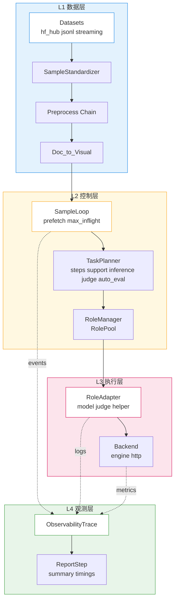

### 2.1 运行模式
| 模式 | 触发条件 | 入口类 | 描述 |
| --- | --- | --- | --- |
| 单任务 | `config.tasks` 为空 | `PipelineRuntime` | 单个 dataset + steps，适合本地实验 |
| 多任务 | `config.tasks` 非空 | `TaskOrchestratorRuntime` | 多 TaskSpec 串并混合，统一 Report |

---

## 3. 标准 Sample 契约与字段落点（1204/1208 对齐）

### 3.1 标准 Sample 必备字段
| 字段 | 作用 | 默认类型/兜底 | 典型来源 |
| --- | --- | --- | --- |
| `id` | 样本唯一标识 | str，缺省时用哈希补全 | 原始记录或 normalization |
| `messages` | 聊天消息列表（文本/多模态混排） | list | 预处理器或原始数据 |
| `choices` | 结构化选项（多选/评测标签） | list | 预处理器（如多选/PIQA/MMMU） |
| `inputs` | 推理输入容器（含 prompt/multi_modal_data） | dict | 预处理 merge 结果 |
| `metadata` | 任务/预处理元信息 | dict | 预处理器写入（answers/option_map 等） |
| `_dataset_id` / `_dataset_metadata` | 数据集标识与路径等 | str / dict | loader 注入 |
| `chat_template_mode` / `rendered_by` / `template_source` / `cache_suffix` | 渲染标记，决定后端是否再次模板化 | str | 预处理或后端 |
| `_tokenizer_path` | 渲染所用 tokenizer | str | loader/preprocess/backends |

> 多模态字段：图片/音频统一落在 `messages[*].content[*].<type>_url.url` 与 `inputs.multi_modal_data.image|audio|video|file`，并在 `_media_meta.images` 记录去重后的索引。

### 3.2 Envelope 示例（压缩版）
```json
{
  "id": "docvqa_001",
  "messages": [
    {"role": "user", "content": [
      {"type": "text", "text": "请回答文档中的问题"},
      {"type": "image_url", "image_url": {"url": "/abs/docvqa/page1.png"}}
    ]}
  ],
  "choices": [{"index": 0, "message": {"content": [{"type": "text", "text": "A"}], "role": "assistant"}}],
  "inputs": {
    "prompt": "请回答文档中的问题",
    "multi_modal_data": {"image": ["/abs/docvqa/page1.png"]}
  },
  "metadata": {
    "answers": ["xxx"],
    "content_root": "/abs/docvqa"
  },
  "_dataset_id": "docvqa_val",
  "_dataset_metadata": {"path": "/abs/docvqa/hle_test_prompted.jsonl"},
  "chat_template_mode": "preprocess",
  "rendered_by": "preprocess",
  "template_source": "manual",
  "cache_suffix": "-converted"
}
```

### 3.3 规范与校验
- Schema 校验入口：`src/gage_eval/assets/datasets/validation.py::validate_sample_schema`，只做类型/必填检查（高性能）。
- 数据归一化：`utils.normalization.normalize_sample` 负责 id/messages/choices 容器化，保持 DataManager 纯透传。
- 多模态同步：`utils.multimodal.merge_multimodal_inputs` 收集 messages/doc_to_* 的媒体，写入 `inputs.multi_modal_data` 并同步 `_media_meta.images`。

---

## 4. datasets 层级与执行分层（1208 版）

### 4.1 分层总览
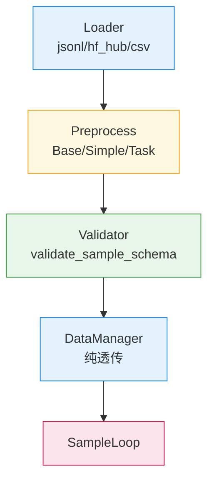

| 层级 | 关键文件 | 责任边界（现实现） |
| --- | --- | --- |
| Loader | `assets/datasets/loaders/*.py` | 解析数据源、limit/streaming、绑定 preprocess/doc_to_*，注入 `_dataset_metadata.path` 绝对路径 |
| Preprocess | `assets/datasets/preprocessors/` | Base 模板统一：roles 清洗 → to_sample → inputs 归一 → doc_to_* → merge 多模态 → 渲染标记 → normalize |
| Validator | `assets/datasets/validation.py` | 轻量 schema 校验，fail-fast 容器类型错误 |
| DataManager | `assets/datasets/manager.py` | 注册/迭代，不再改写样本内容 |

### 4.2 Loader 与 doc_to_* 解析
- JSONL/HF loader 通过 `loader_utils.resolve_doc_to_callable` 解析 doc_to_*，**自动从 preprocess_kwargs 继承同名参数**，减少重复配置。
- JSONL 路径统一 `expanduser().resolve()`，`_dataset_metadata.path` 保留绝对路径，预处理可据此推断 `content_root`。

### 4.3 Preprocess 流程（模板方法）
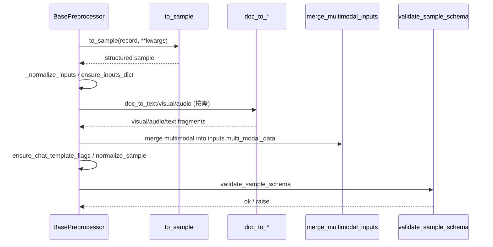

关键实现（节选，中文注释）：
```python
# src/gage_eval/assets/datasets/preprocessors/base.py
class BasePreprocessor(DatasetPreprocessor):
    def transform(self, sample: Dict[str, Any], **kwargs: Any) -> Any:
        doc_to_hooks = {k: kwargs.get(k) for k in ("doc_to_text", "doc_to_visual", "doc_to_audio")}
        raw_inputs = sample.get("inputs")
        if self.roles_to_remove:
            _strip_roles(sample, roles_to_remove=self.roles_to_remove)
        structured = self.to_sample(sample, **{k: v for k, v in kwargs.items() if k not in doc_to_hooks})
        if structured is not None and structured is not sample:
            sample.clear()
            sample.update(structured)
        self._normalize_inputs(sample, raw_inputs=raw_inputs)
        validate_sample_schema(sample)  # 容器兜底
        self._apply_doc_to(sample, **doc_to_hooks)  # 无 multi_modal_data 时才注入 doc_to_visual/audio
        merge_multimodal_inputs(sample)  # 收集 messages/doc_to_* 到 inputs.multi_modal_data
        ensure_chat_template_flags(sample)
        normalize_sample(sample, dataset_id=sample.get("_dataset_id") or "unknown",
                        dataset_metadata=sample.get("_dataset_metadata") or {})
        return sample.get("inputs")
```

### 4.4 DataManager 纯透传
- `iter_samples` 仅做 validator 调用与 `_dataset_metadata` 兜底，不再合并 doc_to_*；测试用例已对应调整。
- 设计后果：预处理阶段必须完成 doc_to_* 与多模态合并，后续 SampleLoop 不修改样本。

---

## 5. Preprocessor 设计与任务适配（最新）

### 5.1 类层级
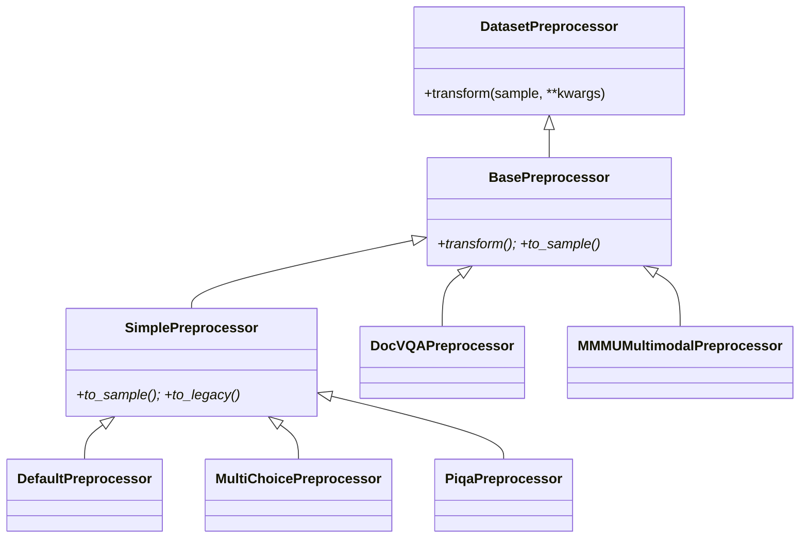

### 5.2 Simple / Default（文本兜底）
- **SimplePreprocessor**：`to_sample` 固化为 `to_legacy` → `convert_llmeval_record`，兼容老格式，自动写 `_dataset_id/_dataset_metadata`、`cache_suffix=-converted`。
- **DefaultPreprocessor**：继承 Simple，支持动态脚本加载或直接透传 legacy 记录；若无多模态则尝试 tokenizer `apply_chat_template` 渲染，失败回退简拼，写入 `_tokenizer_path` 与标记。

### 5.3 DocVQA 任务（最新调整）
- 去掉 `image_root`/`image_field` 兼容分支，统一使用 `content_root`/`content_field` 推导根目录并绝对化。
- 默认从 JSONL 路径推断 `content_root`，metadata 仅保留 `content_root` 与 `answers`/`content_field` 等。

### 5.4 MMMU 任务
- 继承 Base，不做渲染，保持 messages+multi_modal_data；通过 `_merge_multimodal_inputs` 将消息中的图片汇总到 `inputs.multi_modal_data`。

### 5.5 doc_to_* 配置合并
- Loader 端 `resolve_doc_to_callable` 优先从 `preprocess_kwargs` 复制同名参数，再叠加显式的 `doc_to_*_kwargs`。
- 典型 DocVQA 配置简化：`config/custom/docvqa_qwen_vl.yaml` 去掉手填 `content_root/doc_to_visual_kwargs`，依赖 JSONL 同目录自动推导。

### 5.6 多模态处理要点
| 阶段 | 函数 | 规则 |
| --- | --- | --- |
| doc_to_visual | 任意可调用 | 仅在样本缺少 `inputs.multi_modal_data` 时运行，避免重复 |
| embed_local_message_images | utils.multimodal | 将 messages 内本地图片转 data URL，更新 `metadata.content_root` |
| merge_multimodal_inputs | utils.multimodal | 收集 messages + doc_to_* → inputs.multi_modal_data，写 `_media_meta.images` |
| _sync_multimodal_with_messages | utils.multimodal | 仅保留消息实际引用的媒体，防泄露 |
| _maybe_embed_local_media | utils.multimodal | 受 `GAGE_EVAL_EMBED_LOCAL_MEDIA` 或 `_dataset_metadata.embed_local_media` 控制 |

### 5.7 预处理流水线与标记写入
```mermaid
flowchart LR
  R[raw record] --> TS[to_sample]
  TS --> NORM[_normalize_inputs + validate_sample_schema]
  NORM --> DOC[doc_to_text/visual/audio]
  DOC --> MM[merge_multimodal_inputs]
  MM --> FLAGS[ensure_chat_template_flags]
  FLAGS --> OUT[标准 Sample]

  style R fill:#ffffff,stroke:#1e88e5
  style TS fill:#fff8e1,stroke:#f9a825
  style NORM fill:#fff8e1,stroke:#f9a825
  style DOC fill:#fff8e1,stroke:#f9a825
  style MM fill:#fff8e1,stroke:#f9a825
  style FLAGS fill:#e8f5e9,stroke:#43a047
  style OUT fill:#fce4ec,stroke:#d81b60
```

---

## 6. 执行链：从 Sample 到 Backend

### 6.1 RoleManager 与池化
| 角色 | 适配器 | 后端 | 池化策略 |
| --- | --- | --- | --- |
| DUT/Judge/Helper | `ModelRoleAdapter` | 任意注册 Backend | 依据 `resource_requirement.pool_size` 或自动推导 GPU/CPU 并发 |

从职责上看，执行链中的关键组件可以拆解为：

| 组件 | 职责定位 | 关键输入 | 关键输出 |
| --- | --- | --- | --- |
| `SampleLoop` | 样本调度与背压控制 | 标准化样本流、任务并发配置 | 单个样本的执行请求，带 task_id / sample_id |
| `TaskPlanner` | 步骤规划与上下文维护 | Pipeline 配置中的 steps 定义 | 每个样本的执行计划（support / inference / judge / auto_eval 顺序） |
| `RoleManager` | 角色分发与实例池管理 | 角色配置、资源画像（GPU/CPU） | 针对每个角色的 RoleInstance 池 |
| `RoleAdapter` | Prompt 渲染与 Backend 协议转换 | 样本 Envelope、采样参数 | Backend 所需的请求结构（prompt/messages/inputs） |
| `Backend` | 实际推理执行 | 已归一化的请求 payload | `model_output` 字段（answer、latency_ms 等），并回填模板元数据/`_tokenizer_path` |

其中 **RoleManager** 的核心责任是「把抽象的角色 (DUT/Judge/Helper) 映射到具体的后端实例」：

- 在 runtime 构建过程中，Registry 会先把 YAML 中的 `role_adapters` 解析为 `RoleAdapter` 实例，并注册到 RoleManager。
- RoleManager 结合 `ResourceProfile` 和 `role_adapters[].backend.resource_requirement` 推导出每个角色的池大小（pool_size）：
  - 对本地 vLLM 后端，会参考 GPU 数推导最大并发；
  - 对 HTTP 后端，则兼顾 `async_max_concurrency`、实际 Rate Limit 等因素。
- 在执行时，RoleManager 为每个样本/步骤挑选合适的 RoleInstance，并负责在执行完成后回收和复用实例。

简化理解：

- **SampleLoop** 决定“什么时候把样本交给谁”；  
- **RoleManager** 决定“由哪个角色池中的哪个实例来处理”；  
- **RoleAdapter + Backend** 决定“如何把 Envelope 翻译成具体调用并拿到结果”。  

### 6.2 SampleLoop 工作流
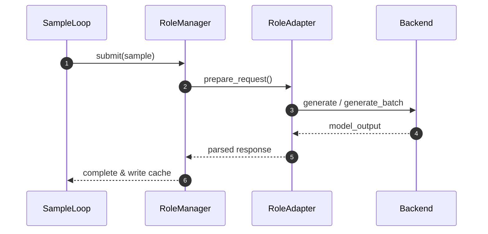
- `generate_batch` 优先被调用，采样参数不一致自动退化串行。
- VLM 路径：`vlm_transformers_backend` 自动从 messages 提取图片、补 `<image>` 占位，避免 `tokens=0/features>0`。
- 文本路径：若样本标记为 `template_source=fallback`（预处理阶段未命中模板），后端会使用自身 tokenizer 重新渲染并将模板元数据写入 `model_output`。

结合代码实现，执行链中几个关键挂钩的职责可以概括为：

| 顺序 | 挂钩/方法 | 所属组件 | 主要职责 |
| --- | --- | --- | --- |
| 1 | `SampleLoop.run` | SampleLoop | 控制并发、预取样本，按任务计划为每个样本触发执行 |
| 2 | `TaskPlanner.execute_inference` 等 | TaskPlanner | 根据 steps 决定当前样本需要执行的角色与顺序 |
| 3 | `RoleManager.execute_inference` | RoleManager | 从角色池中选择对应 RoleAdapter，封装为 RoleInstance 调用 |
| 4 | `RoleAdapter.prepare_request` | RoleAdapter | 结合样本 / Prompt 资产 / 采样参数生成 Backend 请求 payload |
| 5 | `RoleAdapter.execute_batch` / `ainvoke` | RoleAdapter | 优先走 `backend.generate_batch`，不支持时自动退化为逐条调用 |
| 6 | `Backend.generate` / `ainvoke` | Backend | 真正执行文本或多模态推理，返回 answer/token_ids/latency 等 |
| 7 | `RoleAdapter.parse_response` / `handle_backend_response` | RoleAdapter | 将 Backend 原始响应转换为标准的 `model_output` 结构 |
| 8 | `AutoEvalStep.execute` | AutoEvalStep | 在所有推理完成后，根据配置的 metrics 计算样本级与聚合指标 |

这条链路保证了：

- SampleLoop 始终只和 **角色 ID**、**样本 Envelope** 打交道，不关心具体 Backend 类型；
- RoleAdapter 负责把高层 Envelope 映射到 Backend 所需的请求格式，并统一处理响应；
- Backend 层只需关注“如何从 prompt/inputs 得到 answer”，最大程度保持复用。

### 6.3 任务编排
- 单任务：`PipelineRuntime.run()` 在单一 dataset/task 上运行 SampleLoop + AutoEval，记录 `inference_s`、`evaluation_s`、`wall_runtime_s` 等时长，并通过 ReportStep 写入 summary。
- 多任务：`TaskOrchestratorRuntime.run()` 先构造一组 `_TaskRuntimeEntry`（每个包含独立的 SampleLoop/TaskPlanner），再按 TaskSpec 依次执行，最后把所有任务的 metrics 与 timings 聚合为一次性报告。

可以把两者的职责对比理解为：

| Runtime 类型 | 使用场景 | 核心职责 | 特点 |
| --- | --- | --- | --- |
| `PipelineRuntime` | 单一评测任务（如单个 PIQA 或单个 MMMU） | 按 PipelineConfig 的 steps 运行一个 SampleLoop 和一组角色 | 结构简单、便于本地调试 |
| `TaskOrchestratorRuntime` | 多任务编排（如多数据集、多配置联跑） | 基于 TaskSpec 构建多个 `_TaskRuntimeEntry`，统一调度与汇总 | 可以为不同任务设置不同并发/steps/metrics |

无论是哪种 Runtime，最终都通过同一个 `ReportStep` 将：

- 每个任务的指标列表（含 `raw_values` 与格式化后的 `values`）；  
- 运行维度的 `timings`（第 8 章中的观测指标）；  
- 样本总数与 `tasks[]` 元数据  

写入 `summary.json`，保持 CLI 与 Portal 端对不同模式的读取逻辑一致。

### 6.4 裁判员流程与 JudgeStep 详解

基于 `runs/4aba7356fdbe` 的成功运行经验，gage-eval 现已支持完整的“推理 → 裁判 → 指标”闭环流程。本节详细说明其架构实现与数据流转。

#### 6.4.1 裁判流的核心组件

裁判流程在架构上由三个关键部分协作完成：

1. **JudgeStep (Pipeline Step)**  
   位于 `pipeline/steps/judge.py`，负责在样本级调用裁判角色。它从 `TaskPlan` 中获取 `judge_role` (adapter_id)，并将当前样本 (`sample`) 和被测模型的输出 (`model_output`) 打包为 `payload` 传递给 RoleManager。

2. **JudgeModelAdapter (Role Adapter)**  
   位于 `role/adapters/judge_model.py`，是 `ModelRoleAdapter` 的子类。它的核心职责是**Prompt 渲染**：将 `sample`（题目/选项）与 `model_output`（被测模型回答）按照配置的 Jinja2 模板（`judge_multi_choice_prompt` 等）组合成发给裁判 LLM 的最终 Prompt。

3. **Judge Backend (Backend)**  
   通常复用 `openai_http` 或 `vllm` 等标准后端，执行裁判模型的推理。

#### 6.4.2 裁判数据流转图

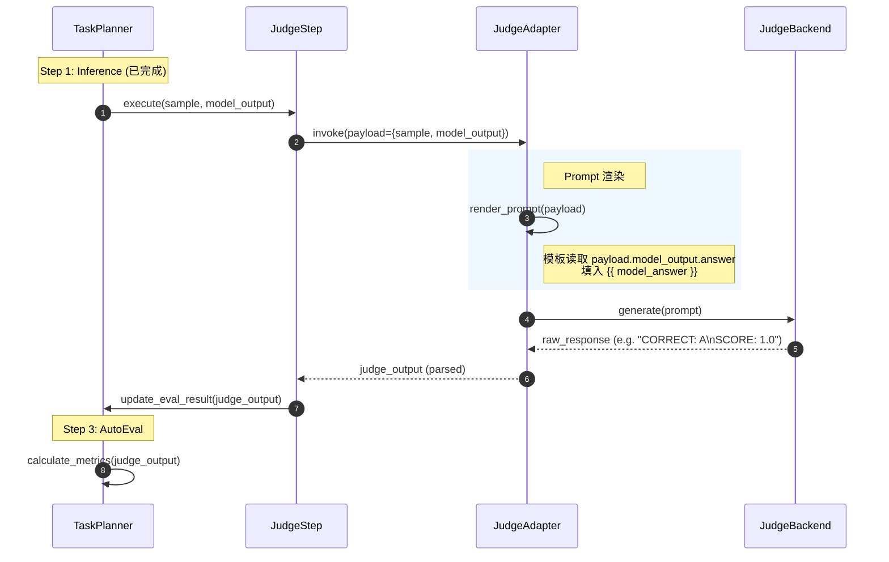

#### 6.4.3 指标计算：judge_multi_choice_acc

裁判完成后，结果会存储在 `sample.judge_output` 中。此时，AutoEvalStep 使用 `judge_multi_choice_acc` 指标进行最终打分：

```yaml
metrics:
  - metric_id: judge_acc
    implementation: multi_choice_accuracy
    params:
      # 预测字段指向裁判的输出
      prediction_field: judge_output.answer
      # 标签字段指向样本标准答案
      label_field: sample.metadata.correct_choice
```

通过这种配置，`multi_choice_accuracy` 指标的通用逻辑（比对 `prediction` 与 `label`）被复用于计算裁判员的准确率，实现了代码的高度复用。

---

## 7. 指标子系统（1209 对齐）

### 7.1 数据流总览
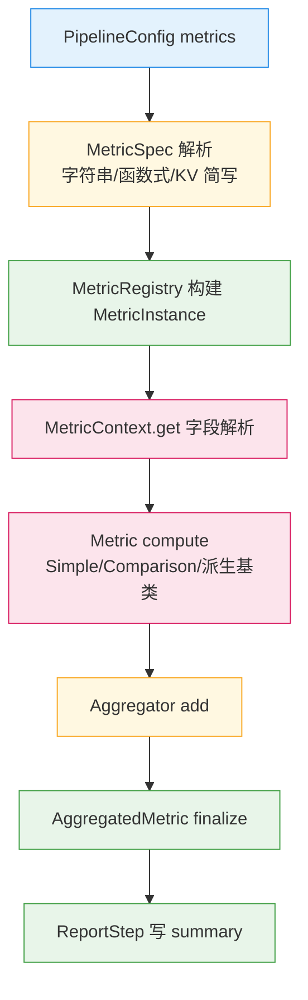

### 7.2 核心工具与上下文
| 能力 | 位置 | 说明 |
| --- | --- | --- |
| 字段解析 | `metrics/utils.py::extract_field` | 支持 dict/list 混合路径（如 `choices.0.message.content`），`on_missing_field` 支持 ignore/warn/error；`MetricContext.get` 统一调用 |
| 路径行走 | `metrics/utils.py::walk_path` | 点分路径解析，列表数字索引 |
| 文本归一化 | `metrics/utils.py::normalize_text_advanced` | 大小写、strip、空白折叠可选 |
| 思维链剥离 | `metrics/utils.py::strip_thought_tags` | 去除 `<think>...</think>`，供推理模型输出清洗 |
| 数值展平 | `metrics/utils.py::flatten_numeric_list` | 展平嵌套 logprobs 等数值容器 |
| Levenshtein | `metrics/utils.py::levenshtein_distance` | 供序列距离类指标复用 |

示例代码（公共思维链剥离）：
```python
from gage_eval.metrics.utils import strip_thought_tags

clean = strip_thought_tags("<think>reasoning</think>Final")
# clean == "Final"
```

### 7.3 基类层次与职责
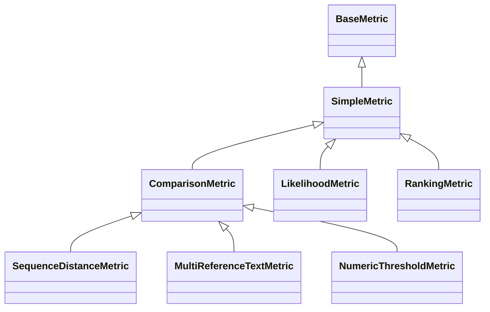

| 基类 | 关键点 | 默认字段 | 元数据 |
| --- | --- | --- | --- |
| SimpleMetric | `compute_value` 返回值或 (值, metadata) | `score` | 支持 metadata 钩子 |
| ComparisonMetric | 预测-参考对比骨架 | `model_output.answer` / `sample.label` | 自动注入 prediction/reference |
| SequenceDistanceMetric | 距离函数可插拔，归一策略 anls/wer/raw | 同上 | distance/normalized/strategy |
| MultiReferenceTextMetric | 多参考遍历，支持字符串分隔符 | `sample.references` | best_score/best_reference |
| NumericThresholdMetric | 容差/阈值/范围校验 | `model_output.answer` vs `label` | prediction/reference/invalid_format |
| LikelihoodMetric | loss 或 token_logprobs → NLL/PPL | `model_output.loss` 或 logprobs | source/token_count/metric_type |
| RankingMetric | MRR 或 Hit@K，支持对象候选字段 | `model_output.candidates` / `sample.targets` | mrr/hit_at_k/hit_rank/k |

关键实现片段（SequenceDistanceMetric）：
```python
class SequenceDistanceMetric(ComparisonMetric):
    distance_fn = staticmethod(levenshtein_distance)

    def compare(self, prediction, reference):
        pred = normalize_text_advanced(prediction, collapse_whitespace=True) or ""
        ref = normalize_text_advanced(reference, collapse_whitespace=True) or ""
        if not pred and not ref:
            return 1.0, {"distance": 0, "normalized": 1.0, "strategy": "anls"}
        dist = self.distance_fn(pred, ref)
        strategy = str(self.args.get("normalize", "anls")).lower()
        if strategy == "wer":
            denom = len(ref) or 1
            score = max(1.0 - dist / denom, 0.0)
        elif strategy == "raw":
            score = float(dist)
        else:
            denom = max(len(pred), len(ref)) or 1
            score = max(1.0 - dist / denom, 0.0)
        return score, {"distance": dist, "normalized": score, "strategy": strategy}
```

### 7.4 内置指标现状（部分）
| metric_id | 基类 | 主要逻辑 | 默认聚合 |
| --- | --- | --- | --- |
| `exact_match` | ComparisonMetric | 文本归一化后严格匹配 | mean |
| `contains` | ComparisonMetric | 预测包含参考 | mean |
| `numeric_match` | NumericThresholdMetric | 容差/范围校验，invalid_format 标记 | mean |
| `judge_threshold` | NumericThresholdMetric | 裁判分数阈值转 0/1，metadata 透出 judge | mean |
| `docvqa_anls` | MultiReferenceTextMetric | 思维链剥离，多参考 ANLS，阈值过滤 | mean |
| `likelihood` | SimpleMetric | loss 或 token_logprobs → NLL 或 PPL | mean |
| `ranking` | SimpleMetric | MRR/Hit@K，可从对象候选提字段 | mean |

### 7.5 配置与语法糖
| 写法 | 解析结果 | 适用场景 |
| --- | --- | --- |
| `"exact_match"` | metric_id=exact_match, implementation=exact_match | 最简默认 |
| `"regex_match(pattern='\\d+')" ` | 解析参数填入 params | 函数式字符串 |
| `{numeric_match: {tolerance: 0.1}}` | key 为 metric_id，值为 params | KV 简写 |

解析流程与注册链路遵循 7.1 所示数据流，`MetricRegistry` 先尝试 asset 再动态 import，聚合器默认 mean/weighted_mean/identity。

### 7.6 严格模式与缺失字段策略
| 策略 | 行为 | 适用 |
| --- | --- | --- |
| ignore | 返回默认值（通常 0），不告警 | 大规模评测 |
| warn | 记录 warning 继续计算 | 调试阶段 |
| error | 抛异常中断 | 接入新数据集 |

统一由 `extract_field` / `MetricContext.get` 执行，指标无需重复写兜底逻辑。

### 7.7 测试与覆盖
| 维度 | 测试文件 | 覆盖点 |
| --- | --- | --- |
| 基类与工具 | `tests/metrics/test_sequence_distance_metric.py`、`test_multi_reference_metric.py`、`test_numeric_threshold_metric.py`、`test_text_utils.py` | 距离策略、多参考分隔符、容差/invalid_format、思维链剥离、数值展平 |
| 新指标 | `tests/metrics/test_likelihood_metric.py`、`test_ranking_metric.py` | loss/logprobs NLL/PPL、对象候选字段提取、MRR/Hit@K |
| 集成 | `tests/integration/test_metrics_e2e.py`、`tests/integration/test_metrics_likelihood_ranking.py` | 配置语法糖、端到端 auto_eval、PPL/Hit@K 聚合 |

---

## 8. 内置指标清单

| metric_id | value_key | 默认聚合 | 适用场景 / 核心逻辑 | 默认字段/参数 |
| --- | --- | --- | --- | --- |
| exact_match | score | mean | 文本严格匹配（大小写可选） | label:`label`，prediction:`model_output.answer`，`case_sensitive=false` |
| contains | score | mean | 预测是否包含参考答案 | 同上，包含判定 |
| numeric_match | score | mean | 数值匹配，支持容差 | label/pred 与容差 `tolerance=0.0` |
| regex_match | score | mean | 正则匹配任意字段 | `pattern` 必填，`target_field=model_output.answer` |
| judge_threshold | score | mean | 裁判分数阈值转通过率 | `judge_output.score`，`threshold=0.5` |
| text_length | length | mean | 统计预测文本长度（字符/词） | `target_field=model_output.answer`，`unit=char|word` |
| latency | latency_ms | mean | 读取模型或裁判的延迟值 | `target_field=model_output.latency_ms` |
| multi_choice_accuracy | acc | mean | 多选题选项/文本匹配，对齐 llm-eval | label:`sample.metadata.correct_choice`，选项映射 `option_map_field` 支持 `choices.0...` |
| mmmu_accuracy | acc | mean | MMMU 精确匹配（字母/子串均可） | label:`sample.choices.0.message.content.0.text`，pred:`model_output.answer` |
| docvqa_anls | anls | mean | DocVQA 平均归一化编辑距离（ANLS） | answers:`sample.metadata.answers`，pred:`model_output.answer`，`threshold=0.5` |

> 说明：所有内置指标均通过 `@registry.asset("metrics", ...)` 注册，可在 YAML `metrics[].implementation` 直接引用 `metric_id`，未显式声明的 `default_aggregation` 默认使用 mean。

---

## 9. 观测、缓存与报告

| 组件 | 输出 | 位置 |
| --- | --- | --- |
| ObservabilityTrace | `events.jsonl`（event_id、payload、sample_id） | `runs/<run_id>/events.jsonl` |
| EvalCache | 样本缓存、summary、timings | `runs/<run_id>/samples/`、`summary.json` |
| ReportStep | 聚合指标、timings | `summary.json` |

### 8.1 新增时延与吞吐指标
ReportStep 现写入：
- `wall_runtime_s`：run.py 启动到任务结束的墙钟时长。
- `throughput_total_samples_per_s`、`throughput_inference_samples_per_s`、`throughput_auto_eval_samples_per_s`
- `latency_total_ms_per_sample`、`latency_inference_ms_per_sample`

### 8.2 Log Sink 与强制采样
- `observability.log_sink` 把 loguru sink 注入 Trace，错误时 `force_log()` 确保样本必留痕。
- `@observable_stage` 自动记录阶段耗时并汇总到 `timings`.

### 8.3 观测指标清单
| 字段 | 含义 | 产出位置 | 备注 |
| --- | --- | --- | --- |
| dataset_materialization_s | 数据集装配耗时 | `summary.json.run.timings` | build_runtime 阶段 |
| inference_s | 推理阶段总耗时 | `summary.json.run.timings` | 单/多任务分别累加 |
| evaluation_s | AutoEval/聚合耗时 | `summary.json.run.timings` | 无判分则为 0 |
| execution_runtime_s | 运行期耗时（不含数据集） | `summary.json.run.timings` | 推理+评测 |
| total_runtime_s | 数据集 + 运行期总耗时 | `summary.json.run.timings` | 逻辑总时长 |
| wall_runtime_s | run.py 启动到结束的墙钟时长 | `summary.json.run.timings` | 真实壁钟 |
| throughput_total_samples_per_s | 样本总吞吐 | `summary.json.run.timings` | 基于 wall_runtime_s |
| throughput_inference_samples_per_s | 推理吞吐 | `summary.json.run.timings` | 基于 inference_s |
| throughput_auto_eval_samples_per_s | 判分吞吐 | `summary.json.run.timings` | evaluation_s>0 时有效 |
| latency_total_ms_per_sample | 单样本总时延 | `summary.json.run.timings` | wall_runtime_s/样本 |
| latency_inference_ms_per_sample | 单样本推理时延 | `summary.json.run.timings` | inference_s/样本 |
| timings.*_total_s | 自定义阶段耗时 | `summary.json.run.timings` | 来自 `@observable_stage` |
| events.jsonl | 细粒度阶段事件 | `runs/<run_id>/events.jsonl` | 含 task/sample 级事件 |

---

## 10. 多模态与 VLM 路径

### 10.1 VLMTransformersBackend 关键逻辑
```python
from gage_eval.role.model.backends.vlm_transformers_backend import VLMTransformersBackend

class VLMTransformersBackend(EngineBackend):
    def _resolve_prompt(...):
        # 1) 优先 apply_chat_template 渲染 messages
        # 2) 再回落 question/text
        # 3) 无提示但有图时补默认提示
        # 4) 归一化 <image> 占位符并按图片数补齐
        return prompt

    def _prepare_multimodal_inputs(...):
        # 消息中含 image_url 时自动加载图片
        # processor 统一 resize/encode，确保特征与文本 token 对齐
```

### 7.2 vLLM Native/Async
- `vllm_backend` 与 `vllm_native_backend` 支持多模态 `multi_modal_data`，request_id 去重避免 AsyncLLMEngine 冲突。
- OOM 重试：遇到缓存不足自动按 0.9→0.7→0.5 阶梯降低 `gpu_memory_utilization`。

---

## 11. 配置与运行入口

### 10.1 CLI 入口
`python gage-eval-main/run.py --config ... --concurrency N --max-samples K --output-dir runs/foo`

启动流程：
1. 解析 CLI → 设置 `GAGE_EVAL_THREADS` / `VLLM_NATIVE_MODEL_PATH`。
2. `build_runtime` 物化 datasets/models/backends。
3. 运行 SampleLoop，完成后写 `summary.json` 与吞吐指标。

### 10.2 典型 YAML 片段
```yaml
datasets:
  - dataset_id: mmmu_val_local
    loader: jsonl
    params:
      path: /data/mmmu_val_500.jsonl
      doc_to_visual: gage_eval.assets.datasets.converters.image_utils:embed_local_message_images

role_adapters:
  - adapter_id: mmmu_qwen25_vl
    role_type: dut_model
    backend:
      type: vlm_transformers
      config:
        model_name_or_path: /mnt/model/qwen2_5_vl_3b
        dtype: bfloat16
    capabilities: [vision_chat]
```

### 10.3 环境变量清单

| 名称 | 分类 | 默认值/示例 | 说明 |
| --- | --- | --- | --- |
| `GAGE_EVAL_THREADS` | 调度/并发 | 自动探测 GPU 数或 `min(cpu,4)` | 控制 SampleLoop 并发度，可被 CLI `--concurrency` 覆盖 |
| `GAGE_EVAL_MAX_SAMPLES` | 调度/数据 | 空 | 限制单次运行的最大样本数，优先级低于 TaskSpec `max_samples` |
| `GAGE_EVAL_SHUFFLE` | 调度/数据 | `false` | 是否在加载后对样本顺序打乱 |
| `GAGE_EVAL_SHUFFLE_SEED` | 调度/数据 | `123` | 样本打乱使用的随机种子 |
| `GAGE_EVAL_PREFETCH_FACTOR` | 调度/背压 | `2` | 预取倍数，控制 Prefetcher 前向读取速度 |
| `GAGE_EVAL_MAX_INFLIGHT` | 调度/背压 | `=concurrency` | 最大在途样本数量（已提交未完成） |
| `GAGE_EVAL_SEQUENTIAL` | 调度模式 | `false` | 置为真时强制串行执行 SampleLoop |
| `GAGE_EVAL_FF_MODE` | 调度模式 | `false` | Fire-and-Forget 模式，使用非阻塞提交与结果回调 |
| `GAGE_EVAL_SAVE_DIR` | 落盘 | `./runs` | 所有 run 目录与 `events.jsonl`、`summary.json` 的根路径 |
| `GAGE_EVAL_DISABLE_BUFFERED_WRITER` | 落盘 | `false` | 禁用缓冲写，逐样本写 JSON 文件 |
| `GAGE_EVAL_ENABLE_BUFFERED_WRITER` | 落盘 | `false` | 强制启用缓冲写（样本聚合到批量 JSONL） |
| `GAGE_EVAL_BUFFER_THRESHOLD` | 落盘 | `1000` | 自动启用缓冲写的样本数阈值 |
| `GAGE_EVAL_BUFFER_BATCH_SIZE` | 落盘 | `64` | 缓冲写一次 flush 的最大批大小 |
| `GAGE_EVAL_BUFFER_FLUSH_S` | 落盘 | `2.0` | 缓冲定时 flush 的间隔秒数 |
| `GAGE_EVAL_DATA_CACHE` | 数据缓存 | `.cache/gage-eval/datasets` | HF Hub / 模型增量权重等下载缓存位置 |
| `GAGE_EVAL_EMBED_LOCAL_MEDIA` | 数据/多模态 | `0` | 为本地图片/音频自动生成 data URL（doc_to_visual/doc_to_audio） |
| `GAGE_EVAL_EMBED_MEDIA_THREADS` | 数据/多模态 | `0`（自动） | 媒体嵌入线程池大小，0 表示按需推断 |
| `GAGE_EVAL_IMAGE_MIN_PIXELS` | 多模态/图像 | 内置常量 | 控制 `load_multimodal_data` 最小像素面积 |
| `GAGE_EVAL_IMAGE_MAX_PIXELS` | 多模态/图像 | 内置常量 | 控制图像缩放后的最大像素面积 |
| `GAGE_EVAL_IMAGE_FACTOR` | 多模态/图像 | `28` | 图像高宽对齐的因子（对齐 Qwen2.5-VL 要求） |
| `GAGE_VISUAL_CACHE_DIR` | 多模态/缓存 | `.gage_cache/visual` | data URL Base64 缓存根目录 |
| `GAGE_VISUAL_PROCESSPOOL` | 多模态/性能 | 空 | 为大图 Base64 编码启用进程池时置为真 |
| `GAGE_VISUAL_PROCESSPOOL_THRESHOLD` | 多模态/性能 | `5MB` | 触发进程池编码的最小文件大小 |
| `GAGE_EVAL_OBSERVABILITY` | 观测/采样 | `false` | 打开细粒度观测（按阶段配置采样率） |
| `GAGE_EVAL_REPORT_HTTP_URL` | 观测/上报 | 空 | 设置后启用 HTTPRecorder，将 trace 批量推送到远端 |
| `GAGE_EVAL_REPORT_HTTP_BATCH` | 观测/上报 | `50` | HTTP 上报批大小 |
| `GAGE_EVAL_REPORT_HTTP_FAIL_PCT` | 观测/上报 | `5` | 错误比例超过该值时降级为本地文件记录 |
| `GAGE_EVAL_REPORT_HTTP_TIMEOUT` | 观测/上报 | `10` | HTTP 上报超时时间（秒） |
| `GAGE_EVAL_INMEMORY_TRACE` | 观测/调试 | 空 | 非空时使用内存 recorder，适合单元测试 |
| `GAGE_EVAL_ENABLE_LOG_SINK` | 日志/观测 | 空（默认启用） | 关闭或启用 loguru→ObservabilityTrace 的日志接入 |
| `GAGE_EVAL_LOG_SINK_LEVEL` | 日志/观测 | `INFO` | 日志接入的最低级别 |
| `GAGE_EVAL_AUTOEVAL_WORKERS` | AutoEval 并发 | 空（自动） | 控制 AutoEvalStep 使用的线程池 worker 数量 |
| `GAGE_EVAL_ENABLE_ASYNC_HTTP` | HTTP 后端 | 空（默认关闭） | 为兼容 HTTP backend 显式开启异步路径 |
| `GAGE_EVAL_VLLM_ISOLATED` | vLLM Native | 空（默认关闭） | 置为真时将 vLLM 运行在隔离进程中 |
| `GAGE_EVAL_VLLM_STRICT_MM` | vLLM 多模态 | 空 | 严格开启 vLLM 多模态路径校验 |
| `GAGE_EVAL_VLLM_PROMPT_ONLY` | vLLM 行为 | 空 | 强制走 prompt-only 路径，忽略 multi_modal_data |
| `VLLM_NATIVE_MODEL_PATH` | vLLM 模型 | 空 | 运行时覆盖 vLLM Native backend 的 `model_path`（可由 `--model-path` 注入） |
| `LOCAL_DATASETS_ROOT` | 数据路径 | `./local-datasets` | YAML 中用于拼接本地 JSONL 路径（如 PIQA/MMMU） |
| `DOCVQA_JSONL_PATH` | 数据路径 | 空 | DocVQA JSONL 文件路径（示例配置中使用） |
| `DOCVQA_IMAGE_ROOT` | 数据路径 | 空 | DocVQA 图片根目录（示例配置中使用） |

> 建议：在实机环境中，将并发/背压相关环境变量（如 `GAGE_EVAL_THREADS`、`GAGE_EVAL_PREFETCH_FACTOR`、`GAGE_EVAL_MAX_INFLIGHT`）与后端配置（如 vLLM `max_batch_size`）一并调优；落盘与观测类变量 (`GAGE_EVAL_SAVE_DIR`、`GAGE_EVAL_REPORT_HTTP_URL` 等) 则按集群/监控系统统一配置。

### 10.4 PipelineConfig 顶层结构概览

1124 版开始，配置层以 `PipelineConfig` 为中心，统一描述“数据源、角色、后端、步骤、任务与指标”的关系。顶层结构（简化）如下：

| 字段 | 类型 | 说明 |
| --- | --- | --- |
| `api_version` / `kind` | str | 固定为 `gage/v1alpha1` / `PipelineConfig` |
| `metadata` | `MetadataSpec` | name、description 等信息 |
| `datasets` | `Sequence[DatasetSpec]` | 数据源定义，与 registry 中的 loader/preprocess 对应 |
| `backends` | `Sequence[BackendSpec]` | 顶层 Backend 列表（1124 新增） |
| `role_adapters` | `Sequence[RoleAdapterSpec]` | 角色定义，引用后端并声明能力 |
| `prompts` | `Sequence[PromptTemplateSpec]` | Prompt 资产，供 Judge/DUT Adapter 复用 |
| `metrics` | `Sequence[MetricSpec]` | 默认指标集合，所有任务可共用 |
| `builtin` / `custom` | `PipelineTemplateSpec` | 描述默认步骤流（如 `inference`+`auto_eval`） |
| `tasks` | `Sequence[TaskSpec]` | 多任务编排入口，可覆盖步骤与指标 |

整体装配路径可以概括为：

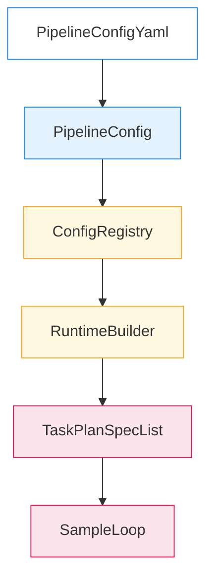

其中：

- 若 `tasks` 为空，则走单任务 `PipelineRuntime`，仅使用 `builtin/custom` 中的步骤定义；
- 若 `tasks` 非空，则进入 `TaskOrchestratorRuntime`，为每个 TaskSpec 构建独立的 `TaskPlanSpec` 与 SampleLoop。

Schema 校验在 `config/schema.py:normalize_pipeline_payload` 中完成，1124 版已放宽为：

- 只要存在 `tasks`，即可不显式提供 `builtin/custom`；
- 否则要求提供 `builtin` 或 `custom` 二选一。

### 10.5 顶层 Backends 与 backend_id 引用

为消除大量重复的 inline backend 配置，1124 版引入顶层 `backends` 列表与 `role_adapters[].backend_id` 引用机制：

```yaml
backends:
  - backend_id: qwen3_openai_http
    type: openai_http
    config:
      base_url: http://127.0.0.1:1234/v1
      model: qwen/qwen3-vl-30b
      timeout: 300
      default_params:
        max_new_tokens: 128
        temperature: 0.1

role_adapters:
  - adapter_id: dut_text
    role_type: dut_model
    backend_id: qwen3_openai_http
    capabilities: [chat_completion]
  - adapter_id: judge_text
    role_type: judge_model
    backend_id: qwen3_openai_http
    capabilities: [chat_completion]
```

设计要点：

- `BackendSpec`：在 `pipeline_config.py` 中定义，字段为 `backend_id/type/config`，`backend_id` 在同一配置内必须唯一；
- `RoleAdapterSpec`：
  - 可通过 `backend_id` 引用顶层 backend；
  - 也可继续使用 legacy 的 inline `backend` 写法，两者允许共存；
  - 若同时声明 `backend` 与 `backend_id`，解析器优先使用 inline backend，并通过 loguru 打印 warning。

解析链路在 `config/registry.py:resolve_role_adapter` 中实现：

```python
def resolve_role_adapter(self, spec: RoleAdapterSpec) -> RoleAdapter:
    # 1. 解析 backend（优先 inline，其次 backend_id 引用）
    backend_cfg = None
    if spec.backend is not None:
        backend_cfg = spec.backend
    elif spec.backend_id is not None:
        backend_cfg = self._lookup_backend_config(spec.backend_id)
    else:
        raise SchemaValidationError(f"role_adapter '{spec.adapter_id}' missing backend")

    backend = self.materialize_backend(backend_cfg)
    return self._build_role_adapter(spec, backend=backend)
```

整体关系示意：

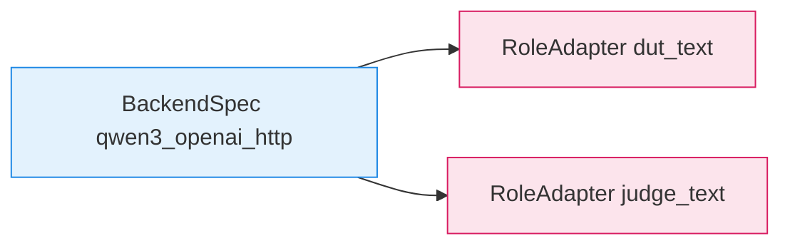

迁移策略：

  - 新配置优先使用顶层 `backends`，配合 `backend_id` 引用，便于同一后端在多个角色间复用；

### 10.6 Step 继承与智能绑定

为了减少重复的 `steps` 配置，1124 版在 Task 规划层引入了“默认步骤 + 继承 + 绑定推断”的模式。

1. **自定义步骤模板**

在顶层 `custom`（或 `builtin`）中定义一次默认步骤流：

```yaml
custom:
  steps:
    - step: inference
    - step: auto_eval
```

若某个 `TaskSpec` 未显式声明 `steps`，则自动继承该默认流程。

2. **按角色类型智能推断 adapter 绑定**

- 当整个 Pipeline 中某一 `role_type`（如 `dut_model`）只出现一个 adapter 时：
  - 在 `steps[].adapter_id` 省略的情况下，`TaskPlanner._infer_step_bindings` 会根据 `step` 类型与 `role_type` 自动补全；
- 当同一 `role_type` 存在多个 adapter（例如 `dut_text` 与 `dut_docvqa`）时：
  - 若未显式指定 `adapter_id`，则会抛出错误，提示配置中存在歧义；
  - 架构上不做“猜测”，避免任务在多 adapter 环境下行为不确定。

简化后的步骤绑定示意：

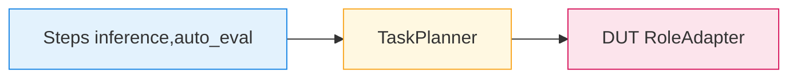

在多任务场景中，`TaskPlanSpec` 会为每个 task 固化一份 `steps` 列表，`RuntimeBuilder` 再据此构建对应的 SampleLoop 与 AutoEvalStep。

### 10.7 Prompt 体系统一设计

1124 版在不破坏现有行为的前提下，引入了“结构化预处理 + PromptAsset + RoleAdapter 渲染”的统一 Prompt 体系。

#### 10.7.1 两条 Prompt 链路：Inference 与 Judge

1. **Inference Prompt（目前多为 Preprocessor 驱动）**

- 典型场景：PIQA/MMLU 多选，配置在 `datasets[].params.preprocess/preprocess_kwargs` 中内联 Prompt 文本；
- 预处理函数在加载阶段直接拼接自然语言 Prompt，写入 `sample.messages`。


对应代码示例（节选自 `preprocess_piqa.py`）：

```python
def convert_sample_to_inputs(
    sample: Dict[str, Any],
    *,
    system_prompt: str = "...",
    instruction: str = "...",
) -> List[Dict[str, Any]]:
    # 结构化原始字段
    sol1 = sample.get("sol1")
    sol2 = sample.get("sol2")
    if sol1 is None or sol2 is None:
        raise ValueError("PIQA sample must contain 'sol1' and 'sol2'")
    sample["choices"] = [str(sol1).strip(), str(sol2).strip()]

    # 调用通用多选预处理器，生成 messages
    return _convert_multi_choice(
        sample,
        question_field="goal",
        choices_field="choices",
        answer_field="label",
        answer_index_base=0,
        system_prompt=system_prompt,
        instruction=instruction,
    )
```

2. **Judge Prompt（已统一由 ModelRoleAdapter 渲染）**

- 裁判模型统一使用 `prompts[]` 声明模板，在 `role_adapters[judge_model].prompt_id/prompt_params` 中绑定；
- `ModelRoleAdapter.render_prompt` 通过 PromptRenderer 将 `sample/payload/history` 与模板合成最终 Prompt。


核心渲染逻辑（简化自 `model_role_adapter.py`）：

```python
def render_prompt(self, payload: Dict[str, Any]) -> PromptRenderResult:
    if not self.prompt_renderer:
        return PromptRenderResult()
    context = PromptContext(
        sample=payload.get("sample", {}),
        payload=payload,
        history=payload.get("history") or [],
        extras={"adapter_id": self.adapter_id, "role_type": self.role_type},
    )
    return self.prompt_renderer.render(context)
```

#### 10.7.2 新模型：struct_only 预处理器 + PromptAsset

为减少“在预处理器里硬拼 Prompt”带来的结构耦合，新架构引入了 `*_struct_only` 预处理器与 DUTAdapter 渲染 Prompt 的组合：

- 数据集使用结构化预处理器（如 `multi_choice_struct_only`）：
  - 只负责将原始字段映射到 canonical 位置（`choices/metadata.option_map/metadata.correct_choice` 等）；
  - 不再生成 `sample.messages` 中的自然语言 Prompt。
- Prompt 文本统一由 `prompts[]` 声明，并通过 `role_adapters[].prompt_id/prompt_params` 绑定到 DUT Adapter。
- DUT Adapter 在推理时调用 `render_prompt`，将结构化字段注入到 Prompt 模板中。

配置示例（多选场景）：

```yaml
datasets:
  - dataset_id: piqa_val
    params:
      preprocess: multi_choice_struct_only
      preprocess_kwargs:
        question_field: goal
        choices_field: choices
        answer_field: label

prompts:
  - prompt_id: piqa_multi_choice_zh
    template: |
      题目: {{ sample.metadata.question_text }}
      选项:
      {{ sample.metadata.option_map }}
      请只回答一个大写字母。

role_adapters:
  - adapter_id: dut_qwen3
    role_type: dut_model
    backend_id: qwen3_openai_http
    prompt_id: piqa_multi_choice_zh
    prompt_params:
      subject: piqa
      dataset_name: piqa_val
```

#### 10.7.3 兼容性与演进阶段

为平滑过渡，Prompt 体系的演进分为几个阶段：

- 阶段 0：现状梳理与标注
  - 标记哪些预处理器是“struct_only”，哪些会拼 Prompt；
  - 明确哪些配置（如两份实机配置）依赖数据内置 Prompt，不做改动。
- 阶段 1：兼容型改造
  - 不改变现有配置行为，只在文档与代码注释中固化结构化字段与 Prompt 字段的角色；
  - 所有新配置优先使用 `*_struct_only` + PromptAsset 模式。
- 阶段 2：可选外置能力
  - 为 PIQA/MMLU 等本机测试配置提供“统一 Prompt 版本”的并行 YAML，使用 struct_only + Adapter 模式；
  - 验证指标一致后将其作为推荐模板。
- 阶段 3：长期收敛
  - 高价值任务逐步迁移到统一 Prompt 模型，原有 hard-coded Prompt 预处理器仅作为 legacy 参考保留。

### 10.8 字段映射与 Canonical Sample Schema

字段映射主要存在于两处：

- `datasets[].params.preprocess_kwargs`：控制预处理器如何从原始样本取字段；
- `metrics[].params`：控制指标如何从标准化样本与 `model_output` 中取字段。

1124 版在 `config-1124.md` 与 `sample-design.md` 的基础上，对字段映射做了以下统一约定。

#### 10.8.1 preprocess_kwargs：结构映射优先

- 推荐在 `preprocess_kwargs` 中只放“结构映射”参数：
  - `question_field`：题干字段；
  - `choices_field`（兼容 `options_field`）：选项字段；
  - `answer_field`：标签字段；
  - `answer_index_base`：索引基数（0/1）。
- Prompt 文本类参数（`system_prompt/instruction`）优先迁移到：
  - PromptAsset 的 `prompts[].params`；
  - 或 `role_adapters[].prompt_params`。
- 多选结构化预处理器统一写出：
  - `sample.metadata.option_map`：`{letter -> text}`；
  - `sample.metadata.correct_choice`：规范化后的选项字母；
  - 以及 `metadata.question_field/choices_field/answer_field` 记录源字段路径。

#### 10.8.2 metrics.params：字段路径 DSL 与命名规范

- 字段名：
  - 读取标签/预测值的指标统一使用 `label_field/prediction_field`；
  - 读取选项映射使用 `option_map_field`；
  - Judge 类指标推荐使用 `score_field/verdict_field` 等，更语义化但仍以 `_field` 结尾。
- 路径 DSL：
  - 支持根域前缀：`sample./model_output./judge_output.`；
  - `.` 访问 dict key，数字片段访问列表索引（如 `choices.0.message.content.0.text`）；
  - 不支持更复杂表达式（切片、过滤等），避免后续 DSL 难以扩展。

这些规则已经在 10.4 节的参数表与示例中体现，这里作为配置层设计原则进一步固化。

#### 10.8.3 按任务族的 Canonical 字段表

在 `sample-design.md` 的统一 Sample 结构基础上，1124 版为不同任务族定义了 canonical 字段表，作为预处理器、Prompt 模板与指标实现的共同参考。

1. **多选任务（Multi-choice：PIQA/MMLU 等）**

样本级字段：

| 语义 | 字段路径 | 说明 |
| --- | --- | --- |
| 唯一 ID | `sample.id` | 与原始样本 id 对齐 |
| 模型输入消息 | `sample.messages` | 标准 OpenAI chat 结构 |
| 标准选项结构 | `sample.choices` | `index/message/...`，可扩展多模态 |
| 参考答案字母 | `sample.metadata.correct_choice` | 例如 `"A"` |
| 选项映射 | `sample.metadata.option_map` | `"A": "选项文本"` 等 |
| 源字段记录 | `sample.metadata.question_field` | 原始题干字段路径 |
| 源字段记录 | `sample.metadata.choices_field` | 原始选项字段路径 |
| 源字段记录 | `sample.metadata.answer_field` | 原始答案字段路径 |

模型输出与评测字段：

| 语义 | 字段路径 | 说明 |
| --- | --- | --- |
| 模型主观答案 | `model_output.answer` | 解析后的最终答案文本 |
| 推理轨迹 | `sample.predict_result` | 对齐 `sample-design` 的 predict_result |

标准指标默认行为：

- `multi_choice_accuracy` 默认读取：
  - `label_field = "sample.metadata.correct_choice"`；
  - `prediction_field = "model_output.answer"`；
  - `option_map_field = "sample.metadata.option_map"`。

2. **生成式文本任务（Text Generation/QA）**

样本级字段：

| 语义 | 字段路径 | 说明 |
| --- | --- | --- |
| 唯一 ID | `sample.id` |  |
| 模型输入消息 | `sample.messages` | user/system 对话 |
| 参考答案文本 | `sample.label` 或 `sample.metadata.references` | 单参考或多参考 |

模型输出与评测字段：

| 语义 | 字段路径 | 说明 |
| --- | --- | --- |
| 模型主观答案 | `model_output.answer` | 主文本输出 |
| 样本级评测结果 | `sample.eval_result` | 可存放多维度文本评测结果 |

标准指标默认行为（`builtin/text.py`）：

- `exact_match/contains/numeric_match`：
  - `label_field = "label"`（推荐预处理器将参考答案同步到该字段）；
  - `prediction_field = "model_output.answer"`。

3. **DocVQA/文档问答（Text + Image）**

样本级字段：

| 语义 | 字段路径 | 说明 |
| --- | --- | --- |
| 唯一 ID | `sample.id` |  |
| 模型输入消息 | `sample.messages` | user.content 中包含问题文本和 image_url |
| 参考答案集合 | `sample.metadata.answers` | `List[str]`，由 `preprocess_docvqa` 提供 |
| 图像路径 | `sample.metadata.image_url` | 归一化后的 URL 或本地路径 |
| 图像根路径 | `sample.metadata.image_root` | 用于相对路径补全 |
| 多模态 inputs | `sample.inputs.multi_modal_data.image` | Backend 使用的最终图片路径列表 |

模型输出与评测字段：

| 语义 | 字段路径 | 说明 |
| --- | --- | --- |
| 模型答案 | `model_output.answer` | DocVQA 文本回答 |
| 样本评测结果 | `sample.eval_result` | 可存放 ANLS 等样本级结构 |

标准指标默认行为：

- `docvqa_anls`：
  - `answers_field = "sample.metadata.answers"`；
  - `prediction_field = "model_output.answer"`；
  - `threshold` 默认 `0.5`。

4. **MMMU/通用多模态选择题**

样本级字段：

| 语义 | 字段路径 | 说明 |
| --- | --- | --- |
| 唯一 ID | `sample.id` |  |
| 原始对话消息 | `sample.messages` | 可能包含图片/音频 |
| 参考答案文本 | `sample.choices.0.message.content.0.text` | 当前 MMMU JSONL 的主参考位置 |
| 多模态 inputs | `sample.inputs.multi_modal_data.*` | 由多模态预处理器填充 |

模型输出字段：

| 语义 | 字段路径 | 说明 |
| --- | --- | --- |
| 模型答案 | `model_output.answer` | 可以是字母或文本描述 |

标准指标默认行为：

- `mmmu_accuracy`：
  - `label_field = "sample.choices.0.message.content.0.text"`；
  - `prediction_field = "model_output.answer"`。

5. **Agent/工具调用类任务（初稿）**

样本级字段：

| 语义 | 字段路径 | 说明 |
| --- | --- | --- |
| 问题消息 | `sample.messages` | user 提问及上下文 |
| 标准答案 | `sample.choices[0].message...` | 标准答案文本及路径信息 |
| 模型推理轨迹 | `sample.predict_result` | 包含工具调用与中间输出 |
| 最终得分 | `sample.score` 或 `sample.eval_result.score` | Agent 评测输出的标量分数 |

后续如新增任务族，应优先在本表中补充 canonical 字段，再落地预处理器与指标实现。

#### 10.8.4 标准化指标的“零参数”约定

在满足以下条件时：

1. 预处理器将原始字段映射到 canonical 位置（如多选任务统一写入 `metadata.option_map/metadata.correct_choice`）；
2. Runtime 将模型输出规整到统一位置（如文本/多选任务统一使用 `model_output.answer`）；
3. 指标实现默认以这些 canonical 字段为读取路径；

则配置层使用内置指标时，可完全省略 `metrics[].params`，例如：

```yaml
metrics:
  - metric_id: multi_choice_acc
    implementation: multi_choice_accuracy
```

此时：

- 字段映射由预处理器与 canonical schema 承担；
- `metrics.params` 仅在以下场景保留：
  - 有意偏离 canonical 字段；
  - 同一样本内存在多份候选字段，需要显式指定；
  - 指标本身有与字段无关的超参数（阈值、权重等）。

这条规则是 1124 版配置简化的关键手段之一：**标准任务 + 标准指标 → metrics.params 可选**。

### 10.9 多任务多指标下的指标引用链路

针对“看不出 metrics 在哪里被用”的困惑，1124 版在配置和 runtime 之间建立了一条清晰的指标引用链路。

#### 10.9.1 配置层：全局 metrics 与 task 级 metric_overrides

- 顶层 `metrics[]`：定义默认指标集合，适用于所有任务；
- `tasks[].metric_overrides[]`：
  - 非空时，该 task 只使用覆盖列表中的指标；
  - 为空时，该 task 继承顶层 `metrics`。

#### 10.9.2 TaskPlanSpec：固化“task → 指标集合”

在 `task_plan._build_task_plan` 中，每个 `TaskSpec` 会被转换为一个 `TaskPlanSpec`：

```python
metrics = task.metric_overrides or default_metrics

plan = TaskPlanSpec(
    task_id=task.task_id,
    dataset_id=task.dataset_id,
    metrics=metrics,
    ...
)
```

即：

- `TaskPlanSpec.metrics` 已经是该 task 的**最终指标集合**；
- 后续 runtime 不再重新解析配置，只依赖这份列表。

#### 10.9.3 RuntimeBuilder 与 AutoEvalStep：按 task 构建指标实例

在 `runtime_builder._prepare_task_entries` 中，每个 `TaskPlanSpec` 都会获得一套独立的 `MetricRegistry + AutoEvalStep`：

```python
for plan in task_plans:
    metric_specs = plan.metrics or config.metrics
    metric_registry = MetricRegistry()
    task_planner = TaskPlanner()
    task_planner.configure_metrics(metric_specs, metric_registry, cache_store=cache_store)
    sample_loop.configure_custom_steps(plan.steps)
    task_planner.attach_task_plan_spec(plan)
```

`AutoEvalStep` 在样本级与聚合级两个层面使用这些 `MetricSpec`：

- 初始化：

  ```python
  self._instances = [self._registry.build_metric(spec) for spec in metric_specs]
  ```

- 每条样本执行：

  ```python
  context = MetricContext(
      sample_id=sample_id,
      sample=sample,
      model_output=model_output,
      judge_output=judge_output,
      args=instance.spec.params,
      trace=trace,
  )
  result = instance.evaluate(context)
  per_metric_results[instance.spec.metric_id] = result.to_dict()
  ```

聚合后，`ReportStep` 会将结果写入：

- `summary.metrics[]`：全局视角；
- `summary.tasks[*].metrics[]`：按 task 分组视角。

链路示意：

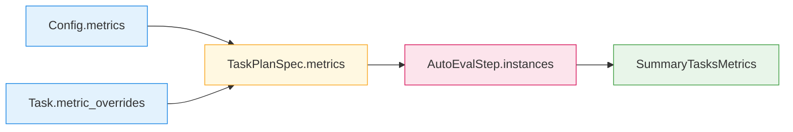

整个过程中，**“哪个 task 跑哪些指标”完全由配置显式决定**；智能行为只体现在字段默认路径与 canonical schema 上，不改变 task 与 metric 的绑定关系。

### 10.10 BackendConfig 的 typed + passthrough 模型

1124 版为每种 Backend 定义了 `BackendConfigBase` 派生的 Pydantic 模型，用于描述“推荐字段 + 默认值”，同时通过 `extra="allow"` 允许透传未知字段。

#### 10.10.1 BackendConfig 的定位

- 每个 backend `type` 对应一个配置模型，位于 `gage_eval/role/model/config/*.py` 中，例如：
  - `OpenAIHTTPBackendConfig` 对应 `type: openai_http`；
  - `VLLMBackendConfig` 对应 `type: vllm`；
  - `VLMTransformersBackendConfig` 对应 `type: vlm_transformers`。
- 模型职责：
  - 约束常用字段类型（如 `model_path/base_url/timeout` 等）；
  - 提供默认值（如 `base_url="https://api.openai.com/v1"`）；
  - 作为配置作者的“字段速查表”。

#### 10.10.2 typed + passthrough 实现

基础类（简化）：

```python
class BackendConfigBase(BaseModel):
    model_config = ConfigDict(extra="allow", protected_namespaces=())
```

在 `build_backend` 中，ConfigRegistry 会根据 `backends[].type` 选择对应的 BackendConfig 模型：

```python
cfg_model_cls = _BACKEND_CONFIG_SCHEMAS.get(backend_type)
if cfg_model_cls:
    cfg_model = cfg_model_cls(**config_dict)
    typed_config = cfg_model.model_dump()
else:
    typed_config = config_dict

backend = backend_cls(config=typed_config)
```

这样：

- 已声明字段经过类型校验与默认值填充；
- 新增字段（例如未来才支持的高级参数）作为 extra 字段保留，并原样传入 Backend 实现。

#### 10.10.3 使用示例

```yaml
backends:
  - backend_id: docvqa_qwen_vl_backend
    type: openai_http
    config:
      base_url: http://127.0.0.1:1234/v1
      model: qwen/qwen3-vl-30b
      timeout: 300
      default_params:
        max_new_tokens: 128
        temperature: 0.1
      async_max_concurrency: 2   # BackendConfig 未声明，但允许透传
```

推荐实践：

- 优先参考 `role/model/config/*.py` 中的字段名与默认值；
- 高级参数可以直接写在 `config` 里，由 Backend 实现按需消费；
- 避免在 RoleAdapter 上重复声明与 Backend 已有能力重叠的字段。

### 10.11 class_path 注入与可扩展点

最后一类与配置设计高度相关的是 `class_path`/模块路径扩展点，它们允许在不修改核心框架代码的情况下注入自定义实现。

#### 10.11.1 RoleAdapterSpec.class_path

- 配置入口：`role_adapters[].class_path: str`；
- 行为：
  - 若提供 `class_path`，通过 `importlib.import_module` 动态加载对应类；
  - 否则按 `role_type` 从 registry 中查找内置角色实现（如 `dut_model/judge_model`）。

示例：

```yaml
role_adapters:
  - adapter_id: retriever_agent
    role_type: support
    class_path: gage_eval.role.adapters.support.RetrieverAdapter
    backend_id: retriever_backend
  - adapter_id: dut_agent
    role_type: inference
    class_path: gage_eval.role.adapters.dut.DUTAdapter
    backend_id: dut_backend
```

#### 10.11.2 MetricSpec.implementation

- 配置入口：`metrics[].implementation` 或 `tasks[].metric_overrides[].implementation`；
- 支持两种形式：
  - registry 短名（如 `multi_choice_accuracy/docvqa_anls`）；
  - 完整类路径（如 `pkg.mod:CustomMetric` 或 `pkg.mod.CustomMetric`）。

解析逻辑（简化）：

```python
impl_key = spec.implementation or spec.metric_id
try:
    metric_cls = registry.get("metrics", impl_key)
except KeyError:
    metric_cls = _import_metric_class(impl_key)
return metric_cls(spec)
```

#### 10.11.3 Dataset doc_to_* callable

- 配置入口：`datasets[].params.doc_to_text/doc_to_visual/doc_to_audio`；
- 值为 `"pkg.mod:function_name"` 形式；
- 解析时使用 `loader_utils.resolve_callable` 动态 import 对应函数，并配合 `doc_to_*_kwargs` 进行调用。

示例：

```yaml
datasets:
  - dataset_id: docvqa_val
    loader: jsonl
    params:
      path: local-datasets/HLE/hle_test_prompted.jsonl
      preprocess: docvqa_image_standardizer
      preprocess_kwargs:
        question_field: messages.0.content.1.text
        answers_field: choices.0.message.content.0.text
        image_field: messages.0.content.0.image_url.url
      doc_to_visual: gage_eval.assets.datasets.converters.image_utils:embed_local_image_as_data_url
```

#### 10.11.4 自定义 Backend：custom_script

当需要以纯配置方式挂载一个完全自定义的后端时，可使用 `type: custom_script`：

```yaml
backends:
  - backend_id: my_custom_backend
    type: custom_script
    config:
      module_path: my_pkg.custom_backends.my_backend_impl
      class_name: MyEngineBackend
      some_extra_flag: true
```

Backend 实现会：

- 通过 `module_path` 或 `file_path` 加载模块；
- 查找并实例化 `class_name` 指定的 `EngineBackend` 子类；
- 将 `config` 中剩余字段原样透传给该实例。

#### 10.11.5 协同策略

- 对稳定能力，优先在 registry 中注册为短名，并在配置中使用短名；
- 对实验性/团队自研能力，可先通过 `class_path` 或模块路径方式注入；
- 一旦验证稳定，可将其注册进 registry 并在文档中补充说明，从而逐步收敛配置写法。

---

## 12. 内置评估套件与 RunConfig 路线

> 详细设计见 `builtin-1126.md`，本节只从架构视角概括与现有代码实现保持一致的核心形态。

### 11.1 三类配置实体与存放位置

- `PipelineConfig`：  
  - 承载完整数据/角色/后端/步骤/任务/指标结构；  
  - 文件路径：`gage-eval-main/config/custom/*.yaml`（自定义）或其他工程内配置；  
  - 运行时由 `PipelineConfig.from_dict` 解析并交给 `build_runtime`。
- `BuiltinTemplate` (`kind: BuiltinTemplate`)：  
  - 表示“固化评测逻辑”的只读模板，包含：
    - `metadata`：`name/version/digest/source_tasks/monolithic` 等；
    - `definition`：去掉 `api_version/kind` 的 `PipelineConfig` 顶层字典（当前为**具体配置**，不自动写 `${runtime.xxx}` 占位符）；
    - `parameters`：一组 `runtime.*` 参数描述，用于生成 RunConfig.runtime 默认值（如 `runtime.datasets.piqa_validation`、`runtime.backends.qwen3_openai_http` 等）；  
  - 存放位置：`gage-eval-main/config/builtin_templates/<suite>/<vN>.yaml`。
- `RunConfig` (`kind: RunConfig`)：  
  - 用户可编辑的运行配置，绑定某个 BuiltinTemplate，并填充环境/性能参数：  
    - `base_task`: 例如 `builtin/piqa_suite`；  
    - `template_version` / `template_digest`: 与模板元信息强绑定；  
    - `runtime`: 嵌套树，包含 `datasets/backends/tasks/global` 等；  
  - 顶层不允许出现 `datasets/backends/tasks/custom/builtin/observability` 等逻辑段，由 `run.py::_validate_run_config_payload` 做最小约束；  
  - 存放位置：`gage-eval-main/config/run_configs/*.yaml`。

### 11.2 Distill 流程：PipelineConfig → BuiltinTemplate

入口：  

```bash
PYTHONPATH=gage-eval-main/src \
python gage-eval-main/run.py \
  --config gage-eval-main/config/custom/piqa_qwen3.yaml \
  --distill \
  --builtin-name piqa_suite
```

架构要点：

- 调用 `gage_eval.tools.distill.analyze_tasks_for_distill`：  
  - 当 `tasks` 数量 `<= 1` → `mode=ATOMIC`；  
  - 当 `tasks > 1` 且无 `--force-merge` → `mode=REJECTED`，直接报错提示拆分任务；  
  - 当 `tasks > 1` 且带 `--force-merge` → `mode=MONOLITHIC`，生成巨型单体模板。  
- 通过 `normalize_pipeline_payload` 校验与归一化配置，得到 `definition` 子树：  
  - 保留 `metadata/custom/prompts/datasets/backends/role_adapters/metrics/tasks` 等；  
  - 去掉 `api_version/kind` 等顶层元字段；  
  - 移除空段（如空 `models/parameters`）。  
- 调用 `_infer_parameters(definition)` 推断参数列表：  
  - 对每个 `dataset_id` 生成 `runtime.datasets.<id>`（`type: obj`，默认值为整个 dataset 配置块剥掉 `dataset_id`）；  
  - 对每个 `backend_id` 生成 `runtime.backends.<id>`（`type: obj`，默认值为整个 backend 配置块剥掉 `backend_id`）；  
  - 对每个 task 的 `max_samples` 生成 `runtime.tasks.<task_id>.max_samples`；  
  - 对 file sink 的 `output_path` 生成 `runtime.global.output_path`。  
- 使用 `calculate_definition_digest` 对 `definition` 做稳定哈希，写入 `metadata.digest`；  
- 根据 `--version` 或目标目录已有 `vN.yaml` 自动确定版本号，生成 `vN.yaml` 文件到 `config/builtin_templates/<name>/`。

### 11.3 Init 流程：BuiltinTemplate → RunConfig / PipelineConfig

入口例子：

- 生成 RunConfig：  

  ```bash
  PYTHONPATH=gage-eval-main/src \
  python gage-eval-main/run.py \
    --init piqa_suite \
    --init-mode run-config
  ```

- 生成 PipelineConfig：  

  ```bash
  PYTHONPATH=gage-eval-main/src \
  python gage-eval-main/run.py \
    --init piqa_suite \
    --init-mode pipeline-config
  ```

核心实现（节选自 `gage-eval-main/run.py`）：

- `--init` 时，跳过运行逻辑，进入 `_handle_init_mode(args)`：  
  1. `_resolve_template_path(args.init, args.version)`：  
     - 若 `--init` 为套件名（如 `piqa_suite`），映射到 `config/builtin_templates/piqa_suite`，按版本选择 `vN.yaml`；  
     - 也可直接传入模板文件路径。  
  2. 加载模板并调用 `_build_run_config_payload(template)`：  
     - 对于 RunConfig 模式：  
       - 使用 `template.metadata` 填充 `base_task/template_version/template_digest`；  
       - 将 `parameters` 通过 `_parameters_to_runtime_defaults` 展开为嵌套的 `runtime.datasets/backends/tasks/global` 默认值；  
       - 写入 `config/run_configs/<suite>_run_<N>.yaml`，并在 `runtime:` 前注入逐行注释示例。  
     - 对于 PipelineConfig 模式：  
       - 调用 `_compile_run_config` 与 `_prune_empty_sections` 得到最终 `PipelineConfig` 字典（当前主要用于去除空段，如空 `models/prompts/parameters`）；  
       - 写入 `config/custom/<suite>_from_VN_<M>.yaml`，作为可完全编辑的配置起点。  
- 输出 RunConfig 时，会在文件头部插入从模板推导出的“只读快照”注释块，帮助使用者快速理解数据集/后端/步骤/指标结构。

### 11.4 运行时路由：RunConfig 与 PipelineConfig

入口：  

```bash
PYTHONPATH=gage-eval-main/src \
python gage-eval-main/run.py \
  --config gage-eval-main/config/run_configs/piqa_suite_run_1.yaml
```

关键逻辑（节选自 `run.py::main`）：

- 默认运行模式（无 `--distill/--init`）：  
  1. 读取 YAML：`config_payload = load_config(...)`；  
  2. 根据 `kind` 分支：  
     - `kind != RunConfig`：  
       - 直接 `PipelineConfig.from_dict(config_payload)`；  
     - `kind == RunConfig`：  
       - 调用 `_compile_run_config(run_cfg)`：
         - 校验 `template_version` 与模板的 `metadata.version`；  
         - 如同时存在 `template_digest` 与 `metadata.digest` 且不一致，报错退出；  
         - 对模板 `definition` 做一次 `_apply_runtime_params`（当前只处理 `${runtime.*}` 字符串占位符）；  
         - 构造 `{api_version, kind=PipelineConfig, **definition}` 字典；  
       - 再交给 `PipelineConfig.from_dict`。  
  3. 后续流程（`build_runtime`、`runtime.run()` 等）与普通 PipelineConfig 完全一致。

从架构视角看：

- RunConfig 是 BuiltinTemplate 的“运行时视图”：只承载 runtime 下的环境/性能参数，不携带执行逻辑；  
- PipelineConfig 仍然是唯一的执行配置入口；  
- run.py 通过 `kind` 分支实现对 RunConfig 的兼容，而不会破坏原有的 PipelineConfig 运行路径。  

### 11.5 单任务优先与 MONOLITHIC 模式

为保持生态“积木化”与复用性，Distill 在提纯阶段引入了**单任务优先**策略（详细规则见 `builtin-1126.md` 第 9 章）：  

- 默认仅固化单 Task 配置，`len(tasks) <= 1` 视为 ATOMIC；  
- 当 `len(tasks) > 1` 且不带 `--force-merge` 时，直接拒绝提纯并在 CLI 上给出明确提示；  
- 当 `len(tasks) > 1` 且带 `--force-merge` 时，生成 `monolithic: true` 的 BuiltinTemplate（模板内包含所有任务），适用于少量确实需要“巨型单体模板”的场景。  

架构层面，仍然推荐：

- 优先使用原子模板 + 外部 orchestrator（Shell、上层调度器）组合多任务；  
- 将 MONOLITHIC 模板视为高级用法，并在文档/Release note 中明确风险和使用指引。  
- 旧配置中的 inline backend 写法保留，后续可用迁移脚本批量抽取到顶层（参见 `config-1124.md` 中的迁移工具设计）。

## 13. 扩展指南：注册新指标

### 12.1 步骤
1. 在 `src/gage_eval/metrics/<domain>/` 创建实现，继承 `SimpleMetric` 或 `Metric`。
2. 使用 `@registry.asset("metrics", "<metric_id>", ...)` 装饰。
3. 在 YAML `metrics` 段引用 `metric_id`，必要时提供 `params`。

### 12.2 示例代码（带中文注释）
```python
# 文件: src/gage_eval/metrics/custom/rouge_l.py
from gage_eval.metrics.base import MetricContext, MetricResult, SimpleMetric
from gage_eval.registry import registry

@registry.asset("metrics", "rouge_l", desc="ROUGE-L 指标", tags=("text",))
class RougeLMetric(SimpleMetric):
    value_key = "rouge_l"

    def compute(self, context: MetricContext) -> MetricResult:
        pred = (context.model_output or {}).get("answer", "")
        refs = context.sample.get("references") or []
        score = self._rouge_l(pred, refs)
        return MetricResult(sample_id=context.sample_id, values={self.value_key: score})

    def _rouge_l(self, pred: str, refs: list[str]) -> float:
        # 简化示例：真实实现可调用第三方库
        return 1.0 if pred and refs and pred in refs[0] else 0.0
```

### 12.3 验证
`python -m py_compile src/gage_eval/metrics/custom/rouge_l.py`  
`metrics` 段引用：
```yaml
metrics:
  - metric_id: rouge_l
    implementation: rouge_l
```

### 12.4 字段映射参数与路径语义

内置指标以及自定义指标，通常通过 `metrics[].params` 中的一组「字段映射参数」来指定从样本/模型输出中取值的路径。常见参数及含义如下：

| 参数名 | 常见指标 | 默认值示例 | 含义 |
| --- | --- | --- | --- |
| `label_field` | `exact_match`、`numeric_match`、`multi_choice_accuracy`、`mmmu_accuracy` | `label` 或 `sample.metadata.correct_choice` | 标准答案所在字段 |
| `prediction_field` | 同上 | `model_output.answer` | 模型预测结果所在字段 |
| `answers_field` | `docvqa_anls` | `sample.metadata.answers` | DocVQA 多参考答案列表位置 |
| `judge_field` | `judge_threshold` | `judge_output.score` | 裁判模型打分字段 |
| `target_field` | `regex_match`、`text_length`、`latency` | `model_output.answer` 或 `model_output.latency_ms` | 通用“目标字段”参数，依据指标语义不同 |
| `option_map_field` | `multi_choice_accuracy` | `sample.metadata.option_map` | 多选题选项映射表（A/B/C/D→文本） |

#### 12.4.1 根域与点分路径

在实现中，大多数指标通过 `_extract_field(context, descriptor, default=...)` 从 `MetricContext` 提取字段值（参考 `metrics/builtin/text.py`、`multi_choice.py`、`mmmu.py` 等）：

- **根域选择**：`descriptor` 的第一个片段可以是：
  - `sample`：从原始样本 Envelope 上取值（`context.sample`）。
  - `model_output`：从模型输出结构取值（`context.model_output`）。
  - `judge_output`：从裁判输出结构取值（`context.judge_output`）。
  - 如果根域不是以上任意值，则默认等价于 `sample.<descriptor>`。
- **点分路径**：`sample.foo.bar` 会被拆成 `["sample", "foo", "bar"]`，根域确定后继续按顺序访问映射：
  - 若当前值是字典，按 key 访问；
  - 若当前值是列表/元组且段是数字字符串，则按索引访问；
  - 任一段访问失败或中途遇到 `None`，则返回 `default`。

示例：
- `sample.choices.0.message.content.0.text`  
  - 根域 `sample`，然后依次访问 `choices`（list）→ 索引 `0` → `message` → `content`（list）→ 索引 `0` → `text`。
- `model_output.answer`  
  - 根域 `model_output`，直接取嵌套字段。

#### 12.4.2 多选与 MM 模型中的特殊逻辑

**multi_choice_accuracy**
- `label_field`：既可以是字母（如 `"B"`），也可以是完整选项文本；内部通过 `_normalize_choice_label` 与 `_match_option_text` 组合解析。
- `option_map_field`：
  - 若指向字典 `{ "A": "xxx", "B": "yyy" }`，会直接用作 `label→文本` 映射；
  - 若指向列表结构（如 MMMU/多选标准格式），则按 `{"label": ..., "text": ...}` 自动归一化；
  - 允许像 `choices.0.message.content.0.text` 这样带数字索引的路径，对应题干中的选项文本。

**mmmu_accuracy**
- `label_field` 默认为 `sample.choices.0.message.content.0.text`（参考 MMMU JSONL 格式），支持从列表、集合中取多个候选目标；
- 匹配逻辑 `_match_prediction` 既支持字母对字母，也支持字符串包含关系（`prediction` 包含 `target` 或大小写不敏感包含）。

#### 12.4.3 文本类指标的路径解析

**exact_match / contains / numeric_match / regex_match / text_length / latency**
- 统一通过 `text._extract_field` 取值：
  - 若 `descriptor` 以 `sample.`/`model_output.`/`judge_output.` 开头，则从对应根域起步；
  - 否则默认视为从 `sample` 起步；
  - 仅支持字典路径（不做列表索引），适合简单结构（例如 `sample.label`、`model_output.answer`）；
- 这类指标的 `label_field`/`prediction_field`/`target_field` 通常只需指到纯标量字段（字符串/数字），避免指向复杂嵌套结构。

#### 12.4.4 配置建议

1. **优先显式带根域**：例如 `sample.metadata.correct_choice`、`model_output.answer`，避免路径被默认为 `sample` 导致误读。
2. **带索引访问列表**：当标准答案位于 `choices[0]` 这类位置时，建议使用 `choices.0.message.content.0.text` 风格，充分利用多选/多模态指标中对数字段的支持。
3. **保持字段与预处理同步**：若使用了预处理器（如 `preprocess_strip_assistant`、`multi_choice_standardizer`），应在指标配置中对齐其写入的字段名（如 `metadata.correct_choice`、`metadata.option_map`），否则 `_extract_field` 会返回默认值，导致指标恒为 0。  

通过理解这些字段映射参数与路径语义，可以在不改动指标代码的前提下，通过 YAML 灵活适配不同数据格式（原始 HF Dataset、llm-eval 转换产物、本地 JSONL 等）。 

---

## 14. 扩展指南：注册新 Backend

### 13.1 步骤总览
1. 定义 Config（Pydantic）：`src/gage_eval/role/model/config/<backend>.py`。
2. 实现 Backend：继承 `EngineBackend` 或 HTTP 基类。
3. `@registry.asset("backends", "<type>")` 装饰，声明 `config_schema_ref`。
4. 在 YAML `role_adapters[].backend` 中设置 `type` 与 `config`。

### 13.2 本地 EngineBackend 示例
```python
# 文件 1: src/gage_eval/role/model/config/my_backend.py
from typing import Optional
from pydantic import Field

from gage_eval.role.model.config.base import BackendConfigBase

class MyBackendConfig(BackendConfigBase):
    """自定义 Backend 的配置 Schema，负责校验 YAML 中的字段。"""

    model_path: str = Field(..., description="本地权重路径，必填")
    max_new_tokens: int = Field(128, ge=1, description="单次生成的最大 token 数")
    temperature: float = Field(0.0, ge=0.0, le=2.0, description="采样温度")
    device: Optional[str] = Field(None, description="显式指定设备，如 cuda:0 / cpu")


# 文件 2: src/gage_eval/role/model/backends/my_backend.py
from typing import Any, Dict

from gage_eval.role.model.backends.base_backend import EngineBackend
from gage_eval.registry import registry
from gage_eval.role.model.config.my_backend import MyBackendConfig

@registry.asset(
    "backends",
    "my_backend",
    desc="自定义本地推理后端",
    tags=("local",),
    # 指向上面的 Pydantic Config，供 CLI/manifest 使用
    config_schema_ref="gage_eval.role.model.config.my_backend:MyBackendConfig",
)
class MyBackend(EngineBackend):
    def __init__(self, config: Dict[str, Any]) -> None:
        # 先用 Pydantic 做一次强类型校验与默认填充
        self._parsed = MyBackendConfig(**config)
        super().__init__(config)

    def load_model(self, _: Dict[str, Any]):
        # 根据校验后的字段加载模型，这里仅示意
        model_path = self._parsed.model_path
        device = self._parsed.device or "cuda"
        return self._load_my_model(model_path, device=device)

    def generate(self, inputs: Dict[str, Any]) -> Dict[str, Any]:
        # 纯同步推理，返回 dict；采样参数可从 Config 读取默认值
        prompt = inputs.get("prompt") or ""
        output = self.model.infer(
            prompt,
            max_new_tokens=self._parsed.max_new_tokens,
            temperature=self._parsed.temperature,
        )
        return {"answer": output}
```

### 13.3 HTTP Backend 示例
```python
# 文件: src/gage_eval/role/model/backends/my_http_backend.py
from gage_eval.role.model.backends.http_backend import HTTPBackendBase
from gage_eval.registry import registry

@registry.asset("backends", "my_http", desc="自定义 HTTP 调用后端", tags=("http",))
class MyHTTPBackend(HTTPBackendBase):
    def build_request(self, payload):
        # 将 prompt/sampling_params 转为 HTTP 请求
        return {"url": self.base_url, "json": {"prompt": payload["prompt"]}}
```

### 13.4 配置引用
```yaml
role_adapters:
  - adapter_id: demo_adapter
    role_type: dut_model
    backend:
      type: my_backend
      config:
        model_path: /path/to/model
```

---

## 15. 调试与最佳实践

1. **并发调优**：优先通过 `--concurrency`/`GAGE_EVAL_THREADS` 控制 SampleLoop，并在 YAML `resource_requirement.pool_size` 声明池大小。
2. **观测对齐**：出错必看 `events.jsonl` 与 `summary.json` 的 `timings`、吞吐字段。
3. **多模态安全性**：确保 `doc_to_visual`、`vlm_transformers_backend` 生效，防止空提示或占位符缺失。
4. **缓存与 I/O**：默认逐样本写；样本数超过 `GAGE_EVAL_BUFFER_THRESHOLD` 自动启用 buffered writer，降低 I/O 尾延。
5. **测试路径**：修改指标/统计逻辑后执行 `bash tests/unit_test.sh`；改动统计需加跑 `python tests/test_statistic/test.py`。

---

## 16. 失败语义与防御性约定

框架在多处实现了“软失败”与防御性逻辑，目的是在尽量保留运行与观测的前提下，避免单点错误直接导致整次评测崩溃。

### 15.1 数据与预处理阶段

| 场景 | 文件/逻辑 | 行为 | 对运行的影响 |
| --- | --- | --- | --- |
| 非 dict 记录或结构异常 | `DataManager.iter_samples` | 记录 warning 并 `continue` 跳过该条样本 | 单条样本丢弃，整体 run 不中断 |
| `doc_to_*` 适配器抛异常 | `_merge_multimodal_inputs` 调用链 | 记录 `data_adapter_failed` 事件并跳过本条 | 该样本不会进入推理；events 中保留失败原因 |
| Validator 判定样本非法 | `SampleValidator.validate_raw/validate_envelope` | 返回 `None` 时该样本被静默跳过 | 可通过日志与 events 定位 |

推荐约定：新增预处理/validator 时，尽量沿用“返回 None/emit event 跳过样本”的模式，不直接抛出未捕获异常。

### 15.2 推理与 Backend 阶段

| 场景 | 文件/逻辑 | 行为 | 对运行的影响 |
| --- | --- | --- | --- |
| VLM prompt 为空但有图像 | `vlm_transformers_backend._resolve_prompt` | 自动补充简单英文提示，并注入 `<image>` 占位符 | 避免 Qwen2.5-VL 抛出 tokens/features 不匹配错误 |
| vLLM Native 加载 OOM | `vllm_native_backend.load_model` | 按 0.9→0.7→0.5 降低 `gpu_memory_utilization` 重试，仍失败则抛 RuntimeError | 单次运行失败，但会在日志中明确标记 OOM 重试过程 |
| vLLM prompt 为空 | `VLLMNativeBackend.prepare_inputs` | 标记 `_skip` 并返回空预测，避免引擎报错 | 该样本结果为空，`_batch_path=skipped` 便于后续审计 |
| HTTP 后端错误/429 | 各 HTTP backend + 重试逻辑 | 通常包含重试与退避，超过阈值后抛错 | 视实现而定，一般会终止 run 并在日志中详细记录 |

新增 Backend 时建议：
- 对可预期错误（如配置缺失、路径不存在、空 prompt）优先返回“带 `_skip` 或明确 error 字段的结果”，并在 trace 中记录事件；
- 对不可恢复错误（如协议变更、严重内部异常）再抛 RuntimeError，让上层决定是否终止。

### 15.3 调度与队列阶段

历史版本中，`InferenceRuntime`/队列曾引入过下列保护开关（部分仍用于兼容、部分已在新架构中替代）：

| 开关 | 作用 | 现状与建议 |
| --- | --- | --- |
| `GAGE_EVAL_BLOCK_ON_FULL` | 队列满时阻塞而非丢请求 | 在 SampleLoop 背压实现中仍遵循“尽量阻塞、不丢样本”的设计理念 |
| `GAGE_EVAL_QUEUE_BLOCK_S` | 队列阻塞超时时间 | 超时会 emit 事件并抛错，避免无限阻塞 |
| `GAGE_EVAL_FUTURE_TIMEOUT` | Future 结果等待超时 | 过长推理会在超时后抛错并记录 trace |

对调度层的新增逻辑，建议遵守：
- 避免在主线程/调度线程上进行无限期阻塞（必须有超时与事件记录）；  
- 队列/线程池满时优先选择“阻塞+观测”而非静默丢样本。

---

## 17. 旧框架映射表（llm-eval → gage-eval）

为了方便从 `llm-eval` 迁移或对照调试，下面给出两个框架在核心概念上的粗略映射：

| 旧框架 llm-eval | 作用 | 新框架 gage-eval 对应组件 | 说明 |
| --- | --- | --- | --- |
| `run_pipeline.py` | 入口脚本，解析 YAML 并启动推理服务/评测 | `gage-eval-main/run.py` + `build_runtime` | run.py 直接构建 PipelineRuntime/TaskOrchestratorRuntime 并在进程内完成全链路 |
| `predict_multi_gpu.py` | vLLM/TGI 后端 server，接收 `/file` 和 `/result` 请求 | `vllm_backend` / `vllm_native_backend` / `hf_inference` 等 EngineBackend | 新框架下后端统一为 EngineBackend/HTTPBackend，既可进程内也可 HTTP |
| `data_server.py` / `dataset_utils` | 负责加载数据、做预处理并提供样本 | `DataManager` + loader + preprocess + doc_to_* | Dataset 相关逻辑集中在 `assets/datasets`，通过 Registry 装配 |
| `eval_mmmu.py` / `eval_docvqa.py` | 特定任务的评分脚本 | `mmmu_accuracy`、`docvqa_anls` 等内置 Metric | 评分逻辑迁移为 Metric 类，通过 `metrics` 配置块注入 |
| `config/*.yaml` | 混合了数据、服务、模型、评测配置 | `PipelineConfig` (`config/custom/*.yaml`) | 新框架将 datasets/role_adapters/backends/metrics/steps 拆分为显式字段 |
| `judge_model` / `dut_model` 概念 | 被测模型与裁判模型角色 | `role_adapters`（`dut_model` / `judge_model`） | RoleAdapter 统一承担 Prompt 渲染 + Backend 调用职责 |
| `output.jsonl` / `report.json` | 评测结果与统计报告 | `runs/<run_id>/samples.jsonl` + `summary.json` + `events.jsonl` | EvalCache + ReportStep 负责样本缓存与聚合输出 |

在迁移具体任务时，可以按下表思路逐步替换：

| 迁移步骤 | llm-eval 视角 | gage-eval 视角 |
| --- | --- | --- |
| 数据 | 找到原始 JSONL/HF Dataset、预处理脚本 | 用 `datasets[].loader/hub` + `preprocess/doc_to_visual` 重现同样的 Envelope |
| 后端 | 确定使用的 vLLM/TGI/OpenAI 后端与关键参数 | 选择对应 Backend 类型（`vllm` / `openai_http` / `hf_inference` 等）并在 YAML 中嵌入 config |
| 角色 | 分清 DUT / Judge / Helper 在旧配置里的职责 | 在 `role_adapters` 中为每个角色声明 adapter_id + backend + capabilities |
| 评分 | 找到对应的 `eval_xxx.py` 逻辑 | 选取或实现等价的 Metric，并在 `metrics` 配置块中声明 `metric_id` 与字段映射 |

### 16.1 迁移示例：MMMU 任务

以 `llm-eval` 中典型的 MMMU 评测为例，迁移到 `gage-eval` 可分为四步：

#### 16.1.1 数据层：复用 JSONL 与图像

- **llm-eval**：通常通过预处理脚本（如 `utils/preprocess_mmmu.py`）将原始 MMMU 转成带 `messages`/`choices`/`answer` 的 JSONL，并在 `eval_mmmu.py` 中直接读取该 JSONL。  
- **gage-eval**：  
  - 在 `datasets` 段声明本地 JSONL 路径：
    ```yaml
    datasets:
  - dataset_id: mmmu_val_local
    loader: jsonl
    params:
      path: ${LOCAL_DATASETS_ROOT:-./local-datasets}/MMMU/mmmu_val_500.jsonl
      doc_to_visual: gage_eval.assets.datasets.converters.image_utils:embed_local_message_images
      doc_to_visual_kwargs:
        content_field: messages.0.content
    ```
  - 其中 `embed_local_message_images` 负责把 `messages[].content[].image_url.url` 的本地路径转为 data URL，行为等价于旧框架里把图像“嵌入”到请求中，以便远程/本地多模态后端统一消费。

#### 16.1.2 后端层：从服务端 vLLM 到本地 Transformers

- **llm-eval**：`run_pipeline.py` 会根据配置决定是启动本地 vLLM 服务（`predict_multi_gpu.py --run_forever`），还是调用 HTTP OpenAI 接口。  
- **gage-eval**：  
  - 若想复现“本地 Transformers + VLM”的安全路径，可直接使用 `vlm_transformers` backend：
    ```yaml
    role_adapters:
  - adapter_id: mmmu_qwen25_vl
    role_type: dut_model
    backend:
      type: vlm_transformers
      config:
        model_name_or_path: /mnt/model/qwen2_5_vl_3b
        dtype: bfloat16
        max_pixels: 12845056
    capabilities:
      - vision_chat
    ```
  - 若想复刻“服务端 vLLM + HTTP”模式，则改为使用 `vllm` 或 `openai_http` backend，并在 `config` 中填充 `base_url` / `model` 等字段，与旧的服务端配置对应。

#### 16.1.3 角色层：从 judge_model/dut_model 到 role_adapters

- **llm-eval**：在 YAML 中单独给出 `model_path`（DUT）与 `judge_model_path`（裁判），由 `run.py` 在内部起两个服务或复用一个服务。  
- **gage-eval**：  
  - DUT 模型映射为一个 `role_adapter` 条目，`role_type: dut_model`：
    ```yaml
    role_adapters:
  - adapter_id: mmmu_qwen25_vl
    role_type: dut_model
    backend:
      type: vlm_transformers
      config: { ... }
    ```
  - 若需要裁判模型，则额外添加 `role_type: judge_model` 的 adapter，并在 `tasks[].steps` 中插入 `judge` 步骤；旧框架中 judge_model 相关 YAML 字段则可以直接映射到这个裁判 adapter 的 backend config。

#### 16.1.4 评分层：从 eval_mmmu.py 到 mmmu_accuracy

- **llm-eval**：`eval_mmmu.py` 中通常会：
  - 从模型输出 JSONL 中读取预测答案；
  - 从数据 JSONL 中读取标准答案（字母或文本）；
  - 比对两者并按题目统计正确率。  
- **gage-eval**：  
  - 同等逻辑已封装为内置 Metric `mmmu_accuracy`：
    ```yaml
    metrics:
  - metric_id: mmmu_acc
    implementation: mmmu_accuracy
    params:
      label_field: sample.choices.0.message.content.0.text
      prediction_field: model_output.answer
    ```
  - 其中 `label_field` 对应旧 JSONL 中 `choices[0].message.content[0].text` 的标准答案位置，`prediction_field` 对应模型输出结构中的 `answer` 字段；这与旧脚本中“从结果文件读取预测，从原始文件读取标准答案”完全等价，但字段路径通过 YAML 配置显式声明，便于复用与审查。

#### 16.1.5 代码落点建议

为方便团队协作与代码导航，MMMU 迁移相关代码应按功能落在以下目录：

| 职责 | 建议目录/文件 | 示例 |
| --- | --- | --- |
| Pipeline 配置 | `gage-eval-main/config/custom/` | `mmmu_qwen_vl.yaml`、`mmmu_local_vlm.yaml` |
| Dataset loader/预处理 | `gage-eval-main/src/gage_eval/assets/datasets/` | 若需要新增专门的 MMMU 预处理器，可放入 `preprocessors/`；通用的图片嵌入已在 `converters/image_utils.py` 中实现 |
| 多模态工具 | `gage-eval-main/src/gage_eval/utils/multimodal.py` | 统一控制图像缩放、像素限制等，与 MMMU 等多模态任务共享 |
| Backend 配置 Schema | `gage-eval-main/src/gage_eval/role/model/config/` | 已有的 VLM Transformers 配置在 `vlm_transformers.py`；如需定制 MMMU 专用 backend，可新增 `mmmu_backend.py` |
| Backend 实现 | `gage-eval-main/src/gage_eval/role/model/backends/` | 现有多模态本地后端为 `vlm_transformers_backend.py`；如引入专用 HTTP/VLM 服务，可在此新增对应后端类 |
| Metric 实现 | `gage-eval-main/src/gage_eval/metrics/builtin/` | MMMU 指标逻辑位于 `mmmu.py`（`MMMUAccuracyMetric`）；若引入新的 MMMU 变体指标，可新增独立文件或放在 `metrics/custom/` 下 |
| 集成测试/回归脚本 | `gage-eval-main/tests/` | 推荐为 MMMU 迁移新增最小集成测试，例如在 `tests/mmmu/` 下放置 JSONL 子集与一键 `run.sh` |

通过将配置、预处理、Backend、Metric 分别放在上述目录，新老成员都可以根据功能快速定位对应实现，避免把 MMMU 相关逻辑散落在难以发现的脚本或 Notebook 中。

通过上述步骤，原本基于 `run_pipeline.py + predict_multi_gpu.py + eval_mmmu.py` 的整套 MMMU 评测，可以在 `gage-eval` 中用一份 `mmmu_local_vlm` 或 `mmmu_qwen_vl` 配置与一条 CLI 命令实现同等功能，同时获得统一的 `events.jsonl` 与 `summary.json` 观测视图。

---

## 18. 术语速查

| 名称 | 说明 | 代码位置 |
| --- | --- | --- |
| SampleLoop | 负责并发、背压的生产者循环 | `src/gage_eval/evaluation/sample_loop.py` |
| RoleAdapter | 封装 Prompt 渲染与 backend 调用 | `src/gage_eval/role/adapters/model_role_adapter.py` |
| EngineBackend | 本地推理后端基类 | `src/gage_eval/role/model/backends/base_backend.py` |
| ObservabilityTrace | 事件收集与 sink | `src/gage_eval/observability/trace.py` |
| EvalCache | 样本与 summary 缓存 | `src/gage_eval/evaluation/cache.py` |

---

## 19. 结语

1124 版在 1123 的“去中心化调度”基础上，补齐了多任务、观测、吞吐指标和多模态稳定性。后续新增资产（指标/后端）仅需按 Registry 规范增量注册，即可被 CLI 与 YAML 自动发现。Mermaid 图与表格可直接在 Typora 11.9.0 渲染。欢迎基于此架构继续优化吞吐、扩展更多跨模态能力。
