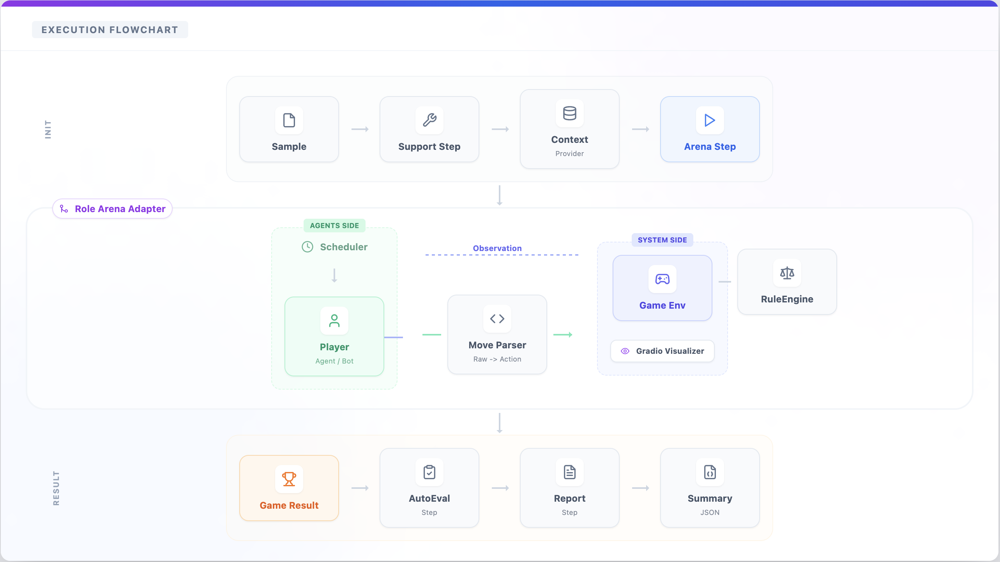
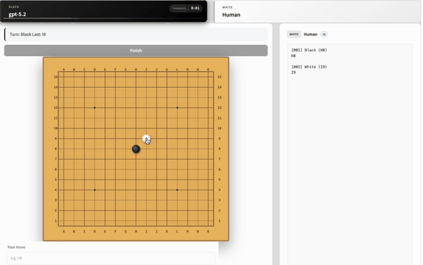

<div align="center">

# 📐 GAGE: General AI evaluation and Gauge Engine

[](https://www.python.org/) 
[](https://google.github.io/styleguide/pyguide.html)
[]()
[]()

**English** · [中文](README_zh.md)

[Overview](docs/guide/framework_overview.md) · [Sample Schema](docs/guide/sample.md) · [Game Arena](docs/guide/game_arena.md) · [Support CLI](docs/guide/support_cli.md) · [Contributing](CONTRIBUTING.md) · [AGENTS](AGENTS.md)

</div>

---

**GAGE** is a unified, extensible evaluation framework designed for large language models, multimodal (omni, robot) models, audio models and diffusion models. It is a high-performance evaluation engine built for ultra-fast execution, scalability, and flexibility, providing a unified framework for AI model evaluation, agent-based benchmarking, and game arena evaluation.

## ✨ Why GAGE？

- 🚀 **Fastest Evaluation Engine**: Built for speed. GAGE fully utilizes GPU and CPU resources to run evaluations as fast as possible, scaling smoothly from single-machine testing to million-sample, multi-cluster runs.

- 🔗 **All-in-one Evaluation Interface**: Evaluate any dataset × any model with minimal glue code. GAGE provides a unified abstraction over datasets, models, metrics, and runtimes, allowing new benchmarks or model backends to be onboarded in minutes.

- 🔌 **Extensible (Game & Agent) Sandbox**: Natively supports game-based evaluation, agent environments, GUI interaction sandboxes, and tool-augmented tasks. All environments run under the same evaluation engine, making it easy to benchmark LLMs, multimodal models, and agents in a unified way.

- 🧩 **Inheritance-Driven Extensibility**: Easily extend existing benchmarks by inheriting and overriding only what you need. Add new datasets, metrics, or evaluation logic without touching the core framework or rewriting boilerplate code.

- 📡 **Enterprise Observability**: More than logs. GAGE provides real-time metrics and visibility into each evaluation stage, making it easy to monitor runs and quickly identify performance bottlenecks or failures.

## 🧭 Design Overview

> Core Design Philosophy: Everything is a Step, Everything is configurable.

### Architecture Design


### Orchestration Design


### GameArena Design



## 🚀 Quick Start

### 1. Installation

```bash
# If you're in a mono-repo root, run: cd gage-eval-main
# Python 3.10+ recommended
python -m venv .venv
source .venv/bin/activate
pip install -r requirements.txt
```

### 2. Run Demo

```bash
# Run Echo demo (No GPU required, uses Dummy Backend)
python run.py \
  --config config/run_configs/demo_echo_run_1.yaml \
  --output-dir runs \
  --run-id demo_echo
```

### 3. View Reports

Default output structure:

```text
runs/<run_id>/
  events.jsonl  # Detailed event logs
  samples.jsonl # Samples with inputs and outputs
  summary.json  # Final score summary
```

## 📖 Advanced Configurations

| Scenario | Config Example | Description |
| :--- | :--- | :--- |
| **Basic QA** | `config/custom/piqa_qwen3.yaml` | Text multiple-choice (PIQA) |
| **LLM Judge** | `config/custom/single_task_local_judge_qwen.yaml` | Use local LLM for grading |
| **Game Arena** | `config/custom/gomoku_human_vs_llm.yaml` | Gomoku Human vs LLM match |
| **Code Gen** | `config/custom/swebench_pro_smoke.yaml` | SWE-bench (requires Docker, experimental) |

## 🎮 Game Arena Showcase

<table width="100%">
  <tr>
    <td align="center" width="40%">
      
    </td>
    <td align="center" width="50%">
      
    </td>
  </tr>
</table>

## 🗺️ Roadmap

- 🤖 **Agent Evaluation**: Add native agent benchmarking support with tool-use traces, trajectory scoring, and safety checks.
- 🎮 **GameArena Expansion**: Grow the game catalog and add richer rulesets, schedulers, and evaluation metrics.
- 🛠️ **Gage-Client**: A dedicated client tool focused on streamlined configuration management, failure diagnostics, and benchmark onboarding.
- 🌐 **Distributed Inference**: Introduce `RoleType Controller` architecture to support multi-node task sharding and load balancing for massive runs.
- 🚀 **Benchmark Expansion**: Continuous growth of the evaluation suite across diverse domains with out-of-the-box configs and guidance.

## ⚠️ Status

This project is in internal validation; APIs, configs, and docs may change rapidly.
