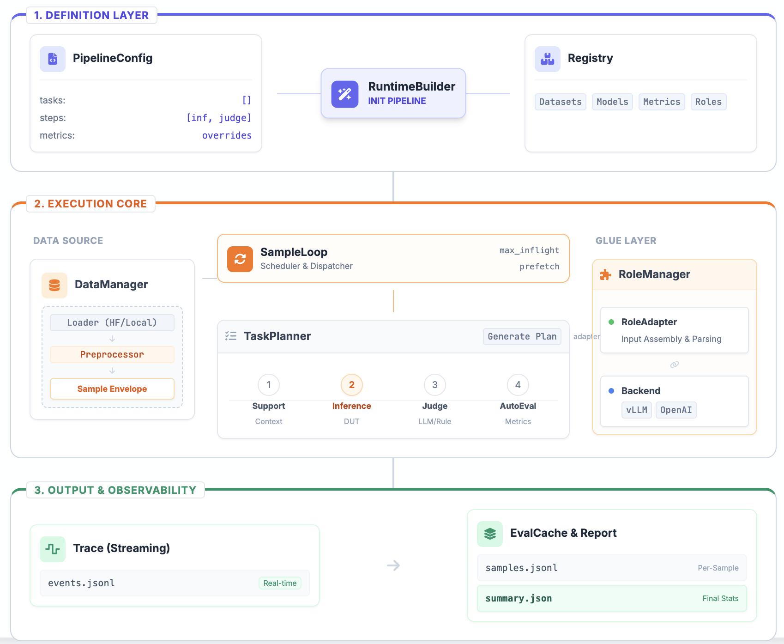

<div align="center">

# 📐 Gage-Eval

[](https://www.python.org/) [](https://google.github.io/styleguide/pyguide.html) []() []()

**新一代高性能、模块化大模型评测框架**

[English](README.md) · **中文**

[框架总览](docs/guide/framework_overview_zh.md) · [Sample 契约](docs/guide/sample_zh.md) · [Game Arena](docs/guide/game_arena_zh.md) · [Support 模块](docs/guide/support_cli_zh.md) · [贡献指南](CONTRIBUTING.md) · [编码规范](AGENTS.md)

</div>

---

**Gage-Eval** 是一个为生产环境设计的评估框架，旨在解决复杂评测链路中的**可扩展性**与**可复现性**问题。它通过 **Step-Chain**（步骤链）编排与 **RoleAdapter**（角色适配器）解耦，让评测像搭积木一样简单。

## ✨ 核心特性

- 🚀 **智能自适应执行引擎**：内置 **多种硬件环境感知**与**动态背压 (Backpressure)** 机制。在大规模评测中智能平衡吞吐量与显存占用，从根源上杜绝 OOM 风险。
- 🧬 **继承式配置体系**：独创 **`Pipeline` -> `Run` 双层配置架构**，强调 **Benchmark 固化与版本化管理**。支持配置蒸馏 (Distill) 与运行时覆盖，大幅降低复杂任务的维护成本。
- 📡 **企业级全链路观测**：超越静态日志，提供 **HTTP 实时遥测**与**缓冲区深度透视**。无缝集成生产级监控大盘，毫秒级定位性能瓶颈。
- 🔌 **全能角色适配器**：统一抽象 **Agent / API / Docker 沙箱 / 本地模型**。内置连接池管理，让 SWE-bench 等复杂任务的编排像搭积木一样简单。
- 🔗 **工业级流水线编排**：基于标准化 Sample 契约，自由编排（例如：`Support -> Inference -> Judge`）流程。打造如工业流水线般的高效数据处理链路。

## 🏗️ 架构概览

> 核心设计理念：Everything is a Step, Everything is configurable.




## 🚀 快速开始

### 1. 环境准备

```bash
# 推荐使用 Python 3.10+
# 如果你在 mono-repo 根目录，请先执行：cd gage-eval-main
python -m venv .venv
source .venv/bin/activate
pip install -r requirements.txt
```

### 2. 运行第一个 Demo

```bash
# 运行 Echo 演示（无需 GPU，使用 Dummy Backend）
python run.py \
  --config config/run_configs/demo_echo_run_1.yaml \
  --output-dir runs \
  --run-id demo_echo
```

### 3. 查看报告

默认产物结构如下：

```text
runs/<run_id>/
  events.jsonl  # 详细事件日志
  samples.jsonl # 包含输入输出的样本
  summary.json  # 最终评分摘要
```

## 📖 进阶配置

| 场景 | 配置文件示例 | 说明 |
| :--- | :--- | :--- |
| **基础问答** | `config/custom/piqa_qwen3.yaml` | 文本多选任务 (PIQA) |
| **LLM 裁判** | `config/custom/single_task_local_judge_qwen.yaml` | 使用本地 LLM 进行打分 |
| **代码能力** | `config/custom/swebench_pro_smoke.yaml` | SWE-bench (需 Docker 环境) |

## 🗺️ 近期计划

- 🛠️ **Gage-Client 工程化**：打造独立的客户端工具，优化配置管理、失败样本定位及 Benchmark 接入脚手架。
- 🌐 **多机分布式推理**：引入 `RoleType Controller` 架构，支持超大规模评测任务的任务分片与负载均衡。
- 🚀 **Benchmark 矩阵扩展**：持续丰富各领域评测集，提供开箱即用的标准配置、指标解释与排障指引。

## ⚠️ 状态

当前处于内部验证期：API、配置与文档可能随实现快速迭代。
