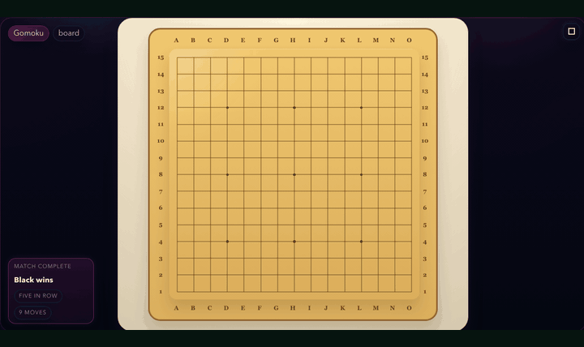
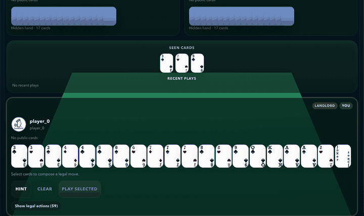
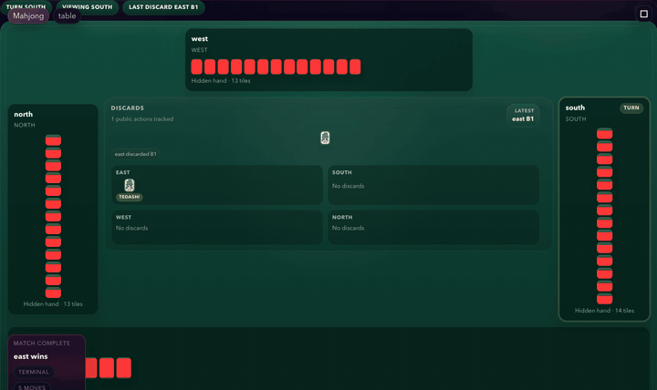
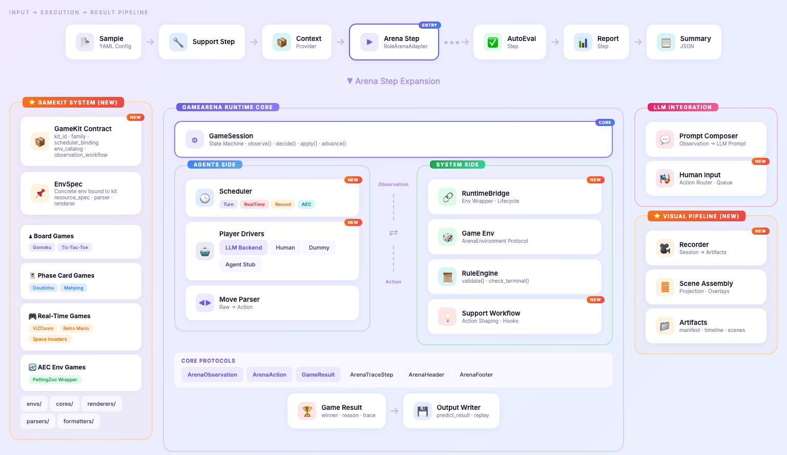

<div align="center">

# 📐 GAGE: General AI evaluation and Gauge Engine

[](https://www.python.org/) [](https://google.github.io/styleguide/pyguide.html) []() []()

[English](README.md) · **中文**

📧 **负责人邮箱:** [zhangrongjunchen@myhexin.com](mailto:zhangrongjunchen@myhexin.com)

[框架总览](docs/guide/framework_overview_zh.md) · [Sample 契约](docs/guide/sample_zh.md) · [智能配置简化](docs/guide/smart_defaults_zh.md) · [Game Arena](docs/guide/game_arena_zh.md) · [Arena Visual 控制面](docs/guide/game_arena_topics/game_arena_visual_control_zh.md) · [Agent 模块](docs/guide/agent_evaluation_zh.md) · [Benchmark](docs/guide/benchmark_zh.md) · [贡献指南](CONTRIBUTING.md) · [编码规范](AGENTS.md)

</div>

---

**GAGE** 是面向大语言模型、多模态模型、音频模型、扩散模型、Agent 与游戏环境的统一可扩展评测框架。它用同一套评测引擎组织数据集、模型后端、指标、Arena 运行时、结构化输出和可回放产物。

## Game Arena 展示

<p align="center"><!--
--><!--
--></p>

<p align="center">
  
  
  
</p>

## 为什么选择 GAGE？

- **快速评测引擎**：本地冒烟、模型对战和较大批量 Benchmark 都使用同一条 Pipeline。
- **统一评测接口**：数据集、后端、角色适配器、指标和输出契约通过配置组合，减少每个任务的粘合代码。
- **Game 与 Agent 沙箱**：Game Arena、AppWorld、SWE-bench 风格任务、GUI 交互和工具增强任务共享同一套运行与产物模型。
- **可回放 GameKit 运行时**：五子棋、井字棋、斗地主、麻将、PettingZoo Space Invaders、Retro Mario、ViZDoom 都会写出结构化 arena trace 和 `arena_visual` session。
- **运行可观测性**：运行产物包含 `summary.json`、样本输出、日志与视觉产物，便于事后排查。

## 设计概览

> 核心设计理念：Everything is a Step, Everything is configurable.

### 架构设计


### 编排设计


### GameArena 设计



## 快速开始

### 1. 环境准备

```bash
# 如果你在 mono-repo 根目录：
cd gage-eval-main

# 推荐使用 Python 3.10+
python -m venv .venv
source .venv/bin/activate
pip install -r requirements.txt
```

Game Arena LLM 配置推荐使用 `*_openai_gamekit.yaml` 变体，并 export `OPENAI_API_KEY`。模型默认 `gpt-5.4`；如需覆盖模型，设置 `GAGE_GAME_ARENA_LLM_MODEL`；如需使用 OpenAI-compatible endpoint，设置 `OPENAI_API_BASE`。

### 2. 运行基础 Demo

```bash
python run.py \
  --config config/run_configs/demo_echo_run_1.yaml \
  --output-dir runs \
  --run-id demo_echo
```

### 3. 查看报告

默认产物结构如下：

```text
runs/<run_id>/
  events.jsonl
  samples.jsonl
  summary.json
  samples/
    <task_id>/
      <sample_id>.json
```

## 进阶配置

| 场景 | 配置文件示例 | 说明 |
| :--- | :--- | :--- |
| **GameArena人机对战** | `config/custom/doudizhu/doudizhu_human_visual_gamekit.yaml` | 浏览器控制斗地主，与 LLM 玩家对战 |
| **GameArena纯人工控制** | `config/custom/retro_mario/retro_mario_human_visual_gamekit.yaml` | 浏览器控制实时 Retro Mario session |
| **Agent 评测** | `config/custom/appworld/appworld_official_jsonl.yaml` | AppWorld 沙箱评测 |
| **代码能力** | `config/custom/swebench_pro/swebench_pro_smoke_agent.yaml` | SWE-bench 风格冒烟；需要 Docker |
| **文本测评** | `config/custom/aime24/aime2024_chat.yaml` | AIME、GPQA、Math500 等文本 Benchmark |
| **多模态** | `config/custom/mathvista/chat.yaml` | MathVista 等多模态 Benchmark |
| **LLM 裁判** | `config/custom/examples/single_task_local_judge_qwen.yaml` | 本地 LLM 裁判示例 |

## 近期计划

- **Agent 评测能力**：完善轨迹评分和安全检查。
- **Game Arena 扩展**：扩充 GameKit 游戏目录，并保持浏览器控制、回放和输出契约一致。
- **Gage-Client 工程化**：优化配置管理、失败样本定位和 Benchmark 接入脚手架。
- **多机分布式推理**：支持超大规模评测任务的任务分片与负载均衡。
- **Benchmark 矩阵扩展**：持续补充评测配置、指标解释与排障指引。

## 状态

当前处于内部验证期：API、配置与文档可能随实现快速迭代。
