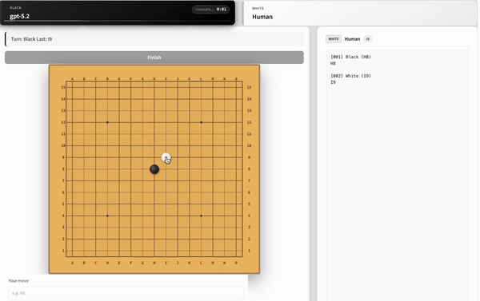
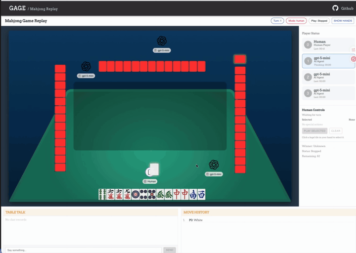
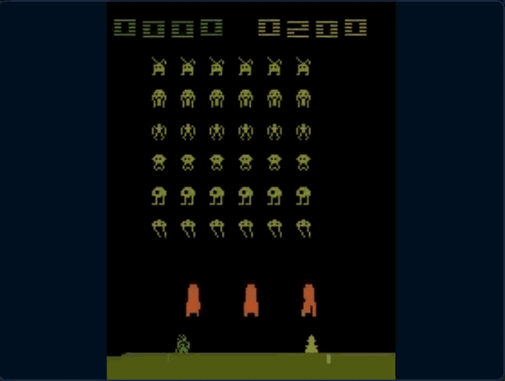
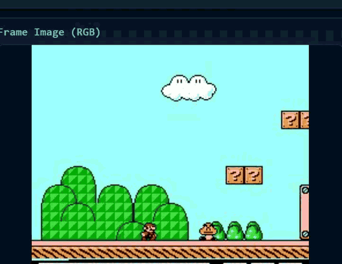
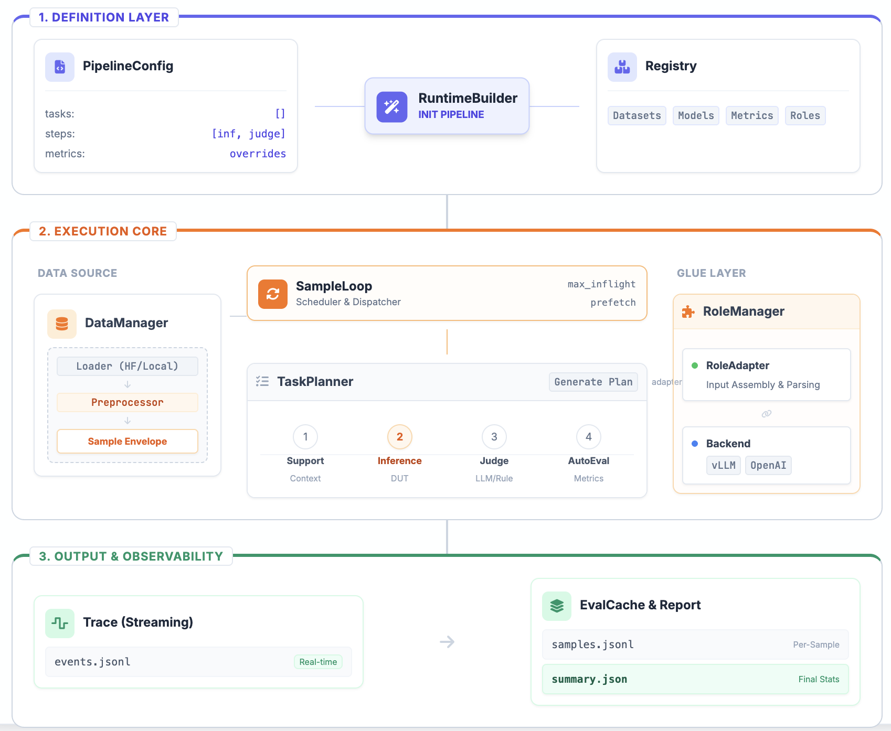
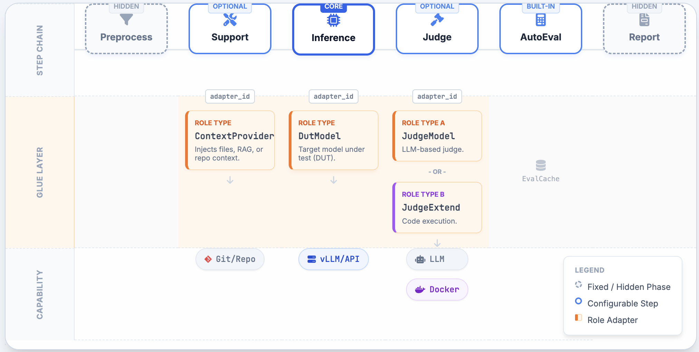
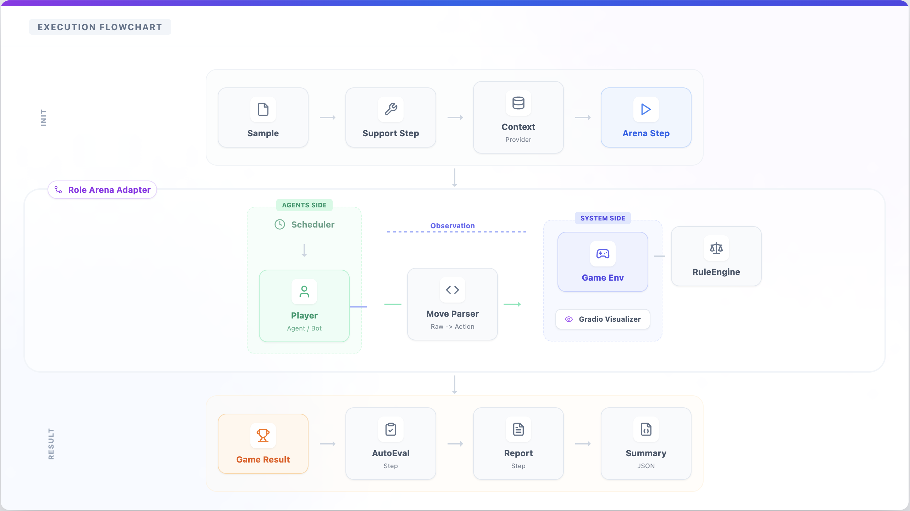

<div align="center">

# 📐 GAGE: General AI evaluation and Gauge Engine

[](https://www.python.org/) [](https://google.github.io/styleguide/pyguide.html) []() []()

[English](README.md) · **中文**

<div align="center">

📧 **负责人邮箱:** [zhangrongjunchen@myhexin.com](mailto:zhangrongjunchen@myhexin.com)

</div>

[框架总览](docs/guide/framework_overview_zh.md) · [Sample 契约](docs/guide/sample_zh.md) · [Game Arena](docs/guide/game_arena_zh.md) · [Agent 模块](docs/guide/agent_evaluation_zh.md) · [Benchmark](docs/guide/benchmark_zh.md) · [Support 模块](docs/guide/support_cli_zh.md) · [贡献指南](CONTRIBUTING.md) · [编码规范](AGENTS.md)

</div>

---

**GAGE** 是面向大语言模型、多模态（全模态、机器人）模型、音频模型与扩散模型的统一可扩展评测框架。它是一套高性能评测引擎，强调极致执行效率、可扩展性与灵活性，为 AI 模型评测、Agent 基准与 Game Arena 对战评测提供统一底座。

## 🎮 Game Arena 

<p align="center"><!--
--><!--
--></p>

<p align="center">
  
  
  
</p>

## ✨ 为什么选择 GAGE？

- 🚀 **极速评测引擎**：以性能为先，充分利用 GPU 与 CPU 资源，从单机测试到百万样本、多集群评测都能平滑扩展。

- 🔗 **一体化评测接口**：以最少粘合代码评测任意数据集 × 任意模型。统一抽象数据集、模型、指标与运行时，快速接入新基准或新后端。

- 🔌 **可扩展沙箱（Game 与 Agent）**：原生支持游戏评测、Agent 环境、GUI 交互沙箱与工具增强任务。全部能力运行在同一评测引擎中，统一评测 LLM、多模态模型与 Agent。

- 🧩 **继承式扩展**：通过继承与覆写扩展已有基准，新增数据集、指标或评测逻辑无需修改核心框架或重写样板代码。

- 📡 **企业级可观测性**：不止日志，提供运行阶段的实时指标与可视化能力，便于监控评测并快速定位性能瓶颈与失败原因。

## 🧭 设计概览

> 核心设计理念：Everything is a Step, Everything is configurable.

### 架构设计



### 编排设计



### GameArena 设计



## 🚀 快速开始

### 1. 环境准备

```bash
# 推荐使用 Python 3.10+
# 如果你在 mono-repo 根目录，请先执行：cd gage-eval-main
python -m venv .venv
source .venv/bin/activate
pip install -r requirements.txt
```

### 2. 运行第一个 Demo

```bash
# 运行 Echo 演示（无需 GPU，使用 Dummy Backend）
python run.py \
  --config config/run_configs/demo_echo_run_1.yaml \
  --output-dir runs \
  --run-id demo_echo
```

### 3. 查看报告

默认产物结构如下：

```text
runs/<run_id>/
  events.jsonl  # 详细事件日志
  samples.jsonl # 包含输入输出的样本
  summary.json  # 最终评分摘要
```

## 📖 进阶配置

| 场景 | 配置文件示例 | 说明 |
| :--- | :--- | :--- |
| **Game Arena** | `config/custom/doudizhu_human_vs_llm.yaml` | 斗地主 Human vs LLM 对战 |
| **Agent 评测** | `config/custom/appworld_official_jsonl.yaml` | 使用 Appworld 沙箱环境 |
| **代码能力** | `config/custom/swebench_pro_smoke.yaml` | SWE-bench (需 Docker 环境，实验性) |
| **文本测评** | `config/custom/aime2024_chat.yaml` | 相关: AIME 2024, AIME 2025, GPQA, Math500 |
| **多模态** | `config/custom/mathvista_vllm_async_chat.yaml` | 相关: MME, HLE, MathVista |
| **LLM 裁判** | `config/custom/single_task_local_judge_qwen.yaml` | 使用本地 LLM 进行打分 |

## 🗺️ 近期计划

- 🤖 **Agent 评测能力**：完善工具调用轨迹、过程对齐与安全检查，形成可复用的 Agent 评测模板。
- 🎮 **GameArena 游戏扩展**：补充更多对战类型、规则配置与可视化能力，形成可扩展的游戏评测矩阵。
- 🛠️ **Gage-Client 工程化**：打造独立的客户端工具，优化配置管理、失败样本定位及 Benchmark 接入脚手架。
- 🌐 **多机分布式推理**：引入 `RoleType Controller` 架构，支持超大规模评测任务的任务分片与负载均衡。
- 🚀 **Benchmark 矩阵扩展**：持续丰富各领域评测集，提供开箱即用的标准配置、指标解释与排障指引。

## ⚠️ 状态

当前处于内部验证期：API、配置与文档可能随实现快速迭代。
