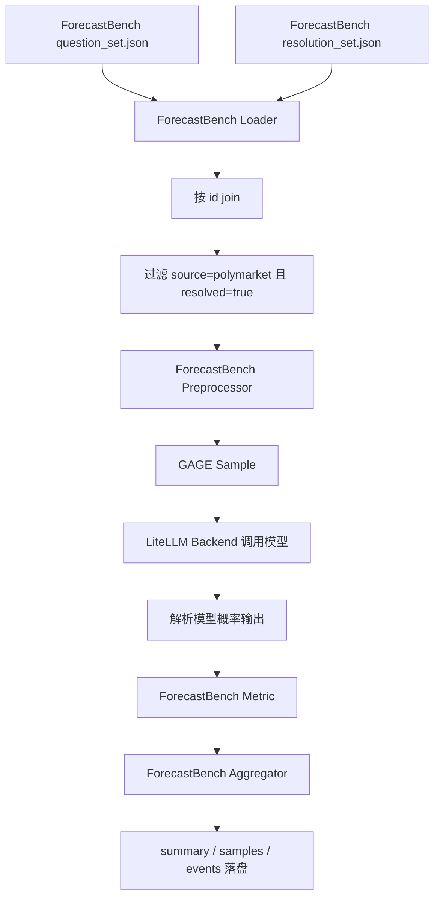

# ForecastBench Polymarket 静态评测接入 README

本文说明如何在 GAGE 中运行 ForecastBench 的 Polymarket 静态评测子集。文档中的路径均使用占位符，拉取仓库后按自己的机器替换即可。

## 1. 接入范围

当前接入范围只包含 ForecastBench 公开数据中的 Polymarket 已结算 market questions：

```yaml
source_filter:
  - polymarket
resolved_only: true
question_type: market
```

这意味着当前不是 ForecastBench 官方 leaderboard 的完整复刻，而是一个静态评测子集：

- 只读取 `source=polymarket` 的题目
- 只保留 `resolved=true` 的样本
- 不接 ForecastBench dataset questions
- 不接未结算问题
- 不实现 live / longitudinal runner
- 不实现官方 difficulty-adjusted leaderboard

## 2. 数据契约

ForecastBench 数据由题目文件和答案文件组成：

| 文件 | 作用 | 顶层字段 |
|---|---|---|
| `question_set.json` | 题目集，包含 question、background、freeze market value 等 | `questions` |
| `resolution_set.json` | 结算集，包含 resolved、resolved_to、resolution_date 等 | `resolutions` |

GAGE loader 会按 `id` 关联两类记录：

```text
question.id == resolution.id
```

关联后形成 raw record，再由 ForecastBench preprocessor 转成 GAGE `Sample`。

## 3. 评测链路



相关代码：

- `src/gage_eval/assets/datasets/loaders/forecastbench_loader.py`
- `src/gage_eval/assets/datasets/preprocessors/forecastbench/forecastbench_preprocessor.py`
- `src/gage_eval/metrics/builtin/forecastbench.py`

## 4. 配置文件

当前提供两个配置：

| 配置 | 用途 |
|---|---|
| `config/custom/forecastbench/polymarket_static_smoke.yaml` | smoke 测试，默认 `max_samples=5` |
| `config/custom/forecastbench/polymarket_static_full.yaml` | 单个 question set 的全量 Polymarket resolved 样本 |

真实数据路径通过环境变量传入：

```text
FORECASTBENCH_QUESTION_SET_PATH
FORECASTBENCH_RESOLUTION_SET_PATH
```

模型服务通过 LiteLLM 兼容环境变量传入：

```text
FORECASTBENCH_API_BASE
FORECASTBENCH_MODEL
FORECASTBENCH_API_KEY
```

## 5. 环境准备

先拉取 GAGE 仓库并进入项目目录：

```bash
git clone <GAGE_REPO_URL> <GAGE_REPO>
cd <GAGE_REPO>
```

安装项目依赖。下面命令仅作为通用示例，实际可以替换成项目推荐的 conda、uv 或内部镜像环境：

```bash
python -m venv .venv
source .venv/bin/activate
python -m pip install -U pip
python -m pip install -e .
```

Windows PowerShell 对应写法：

```powershell
python -m venv .venv
.\.venv\Scripts\Activate.ps1
python -m pip install -U pip
python -m pip install -e .
```

## 6. 下载 ForecastBench 数据

选择一个本机数据目录，例如 `<FORECASTBENCH_DATA_DIR>`：

```bash
python - <<'PY'
from huggingface_hub import snapshot_download

snapshot_download(
    repo_id="forecastingresearch/forecastbench-datasets",
    repo_type="dataset",
    local_dir="<FORECASTBENCH_DATA_DIR>",
)
PY
```

如果缺少 `huggingface_hub`：

```bash
python -m pip install huggingface_hub
```

下载后目录通常包含：

```text
<FORECASTBENCH_DATA_DIR>/datasets/question_sets/
<FORECASTBENCH_DATA_DIR>/datasets/resolution_sets/
```

## 7. Smoke 运行

Smoke 配置默认使用仓库内 fixture，可用于快速验证链路。

Bash：

```bash
cd <GAGE_REPO>

export PYTHONPATH=src
export PYTHONIOENCODING=utf-8
export PYTHONUTF8=1

export FORECASTBENCH_API_BASE=<OPENAI_COMPATIBLE_API_BASE>
export FORECASTBENCH_MODEL=<LITELLM_MODEL_ID>
export FORECASTBENCH_API_KEY=<API_KEY>

mkdir -p runs

python run.py \
  --config config/custom/forecastbench/polymarket_static_smoke.yaml \
  --output-dir runs \
  --run-id forecastbench_smoke \
  2>&1 | tee runs/forecastbench_smoke.log
```

PowerShell：

```powershell
cd <GAGE_REPO>

$env:PYTHONPATH = "src"
$env:PYTHONIOENCODING = "utf-8"
$env:PYTHONUTF8 = "1"

$env:FORECASTBENCH_API_BASE = "<OPENAI_COMPATIBLE_API_BASE>"
$env:FORECASTBENCH_MODEL = "<LITELLM_MODEL_ID>"
$env:FORECASTBENCH_API_KEY = "<API_KEY>"

New-Item -ItemType Directory -Force runs | Out-Null

python run.py `
  --config config/custom/forecastbench/polymarket_static_smoke.yaml `
  --output-dir runs `
  --run-id forecastbench_smoke `
  2>&1 | Tee-Object -FilePath runs/forecastbench_smoke.log
```

## 8. 运行真实 question set

选择一组 ForecastBench question set 和 resolution set：

```text
<FORECASTBENCH_DATA_DIR>/datasets/question_sets/<DATE>-llm.json
<FORECASTBENCH_DATA_DIR>/datasets/resolution_sets/<DATE>_resolution_set.json
```

Bash：

```bash
cd <GAGE_REPO>

export PYTHONPATH=src
export PYTHONIOENCODING=utf-8
export PYTHONUTF8=1

export FB_DATA=<FORECASTBENCH_DATA_DIR>
export FORECASTBENCH_API_BASE=<OPENAI_COMPATIBLE_API_BASE>
export FORECASTBENCH_MODEL=<LITELLM_MODEL_ID>
export FORECASTBENCH_API_KEY=<API_KEY>

export FORECASTBENCH_QUESTION_SET_PATH=$FB_DATA/datasets/question_sets/<DATE>-llm.json
export FORECASTBENCH_RESOLUTION_SET_PATH=$FB_DATA/datasets/resolution_sets/<DATE>_resolution_set.json

mkdir -p runs

python run.py \
  --config config/custom/forecastbench/polymarket_static_full.yaml \
  --output-dir runs \
  --run-id forecastbench_<MODEL_ALIAS>_<DATE> \
  2>&1 | tee runs/forecastbench_<MODEL_ALIAS>_<DATE>.log
```

PowerShell：

```powershell
cd <GAGE_REPO>

$env:PYTHONPATH = "src"
$env:PYTHONIOENCODING = "utf-8"
$env:PYTHONUTF8 = "1"

$env:FB_DATA = "<FORECASTBENCH_DATA_DIR>"
$env:FORECASTBENCH_API_BASE = "<OPENAI_COMPATIBLE_API_BASE>"
$env:FORECASTBENCH_MODEL = "<LITELLM_MODEL_ID>"
$env:FORECASTBENCH_API_KEY = "<API_KEY>"

$env:FORECASTBENCH_QUESTION_SET_PATH = "$env:FB_DATA\datasets\question_sets\<DATE>-llm.json"
$env:FORECASTBENCH_RESOLUTION_SET_PATH = "$env:FB_DATA\datasets\resolution_sets\<DATE>_resolution_set.json"

New-Item -ItemType Directory -Force runs | Out-Null

python run.py `
  --config config/custom/forecastbench/polymarket_static_full.yaml `
  --output-dir runs `
  --run-id forecastbench_<MODEL_ALIAS>_<DATE> `
  2>&1 | Tee-Object -FilePath runs/forecastbench_<MODEL_ALIAS>_<DATE>.log
```

## 9. 全量跑法

`polymarket_static_full.yaml` 一次只消费一组 question set / resolution set。如果要跑完整 ForecastBench Polymarket resolved 子集，需要遍历所有有对应 resolution set 的日期切片。

伪代码：

```text
for each <DATE>-llm.json in question_sets:
  if resolution_sets/<DATE>_resolution_set.json exists:
    set FORECASTBENCH_QUESTION_SET_PATH
    set FORECASTBENCH_RESOLUTION_SET_PATH
    run polymarket_static_full.yaml
```

数据规模以当前下载的数据为准。可以用 `summary.json` 或独立统计脚本确认每个日期切片最终保留的 Polymarket resolved 样本数。

## 10. 模型输出格式

当前 prompt 接近 ForecastBench 官方 market prompt，要求模型输出概率：

```text
*0.42*
```

metric 解析时支持：

- 官方风格：`*0.42*`
- JSON 风格：`{"forecast": 0.42}`
- 纯数字：`0.42`

最终概率会被 clamp 到 `[0, 1]`。无法解析的输出会计入 `parse_error`。

## 11. 指标口径

GAGE 当前输出的是静态 simple scoring，不等价于 ForecastBench 官方 leaderboard。

| 指标 | 中文含义 | 计算方式 |
|---|---|---|
| `average_brier` | 平均 Brier 分数 | `mean((p - y)^2)` |
| `brier_index_simple` | 简化 Brier Index | `(1 - sqrt(average_brier)) * 100` |
| `accuracy_at_0_5` | 0.5 阈值命中率 | `p >= 0.5` 是否和 `y >= 0.5` 一致 |
| `parse_error_rate` | 输出解析失败率 | `mean(parse_error)` |
| `avg_abs_error` | 平均绝对误差 | `mean(abs(p - y))` |
| `clamp_rate` | 概率越界截断率 | `mean(clamp_applied)` |
| `average_market_baseline_brier` | 市场冻结价格 baseline 的平均 Brier | `mean((freeze_datetime_value - y)^2)` |

当前未实现官方 leaderboard 的：

- difficulty-adjusted Brier
- bootstrap 95% CI
- p-value
- Peer
- BSS
- simulation rank probability
- official ranking

## 12. 产物位置

运行后主要查看：

```text
runs/<run-id>/summary.json
runs/<run-id>/samples.jsonl
runs/<run-id>/samples/
runs/<run-id>/events.jsonl
runs/<run-id>.log
```

其中：

- `summary.json`：聚合指标
- `samples.jsonl`：样本级结果索引
- `samples/**.json`：单 case 的 prompt、raw response、parsed forecast、metric 明细
- `events.jsonl`：执行事件流
- `<run-id>.log`：终端日志

## 13. 可信度验证

建议按三层验证：

1. 数据 join 正确性：确认 question set 和 resolution set 按 `id` join，并且只保留 Polymarket resolved 样本。
2. 评分链路正确性：用固定 forecast set 或 fixture 验证 parser、Brier、aggregator 是否稳定。
3. 官方框架对照：同一模型、同一 question set 下，对比 GAGE 与 ForecastBench 官方 runner 的 forecast 分布、parse error 和 simple Brier。

详细说明见：

```text
docs/guide/forecastbench-trust-validation.md
```

## 14. 常见问题

### 14.1 为什么不是官方 leaderboard 分数？

官方 leaderboard 使用 difficulty-adjusted Brier，并且会做 bootstrap CI、p-value、人类 forecaster 对比、rank simulation 等统计处理。GAGE 当前 P0 只做静态 simple scoring。

### 14.2 为什么 prompt 里会有 freeze market price？

ForecastBench 官方 market prompt 本身有带 freeze value 的版本。这个设定更像评估模型能否利用市场信息做预测，或者能否 beat market baseline，不是纯粹无市场价格的预测能力评估。

### 14.3 `average_market_baseline_brier` 覆盖不满怎么办？

这个字段只在样本有 `freeze_datetime_value` 时计算。若部分样本缺失冻结价格，baseline 样本数会小于总样本数，解释结果时需要说明覆盖率。

### 14.4 `parse_error_rate` 很高怎么办？

检查单样本产物里的 raw response。常见原因是模型没有按概率格式输出，或 reasoning 内容太长导致最终答案不可解析。可以尝试提高 `max_new_tokens`、关闭 thinking、或强化输出格式要求。
