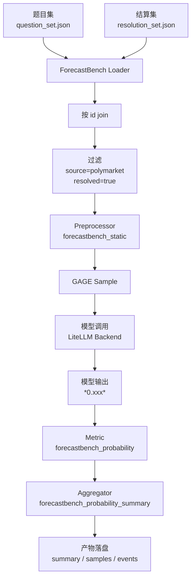
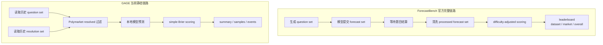
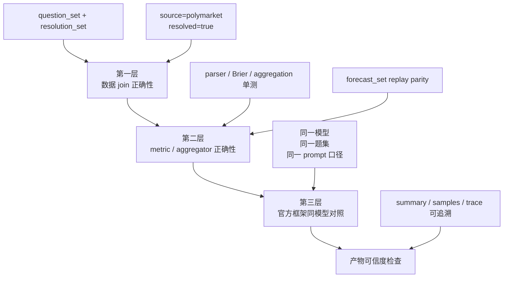
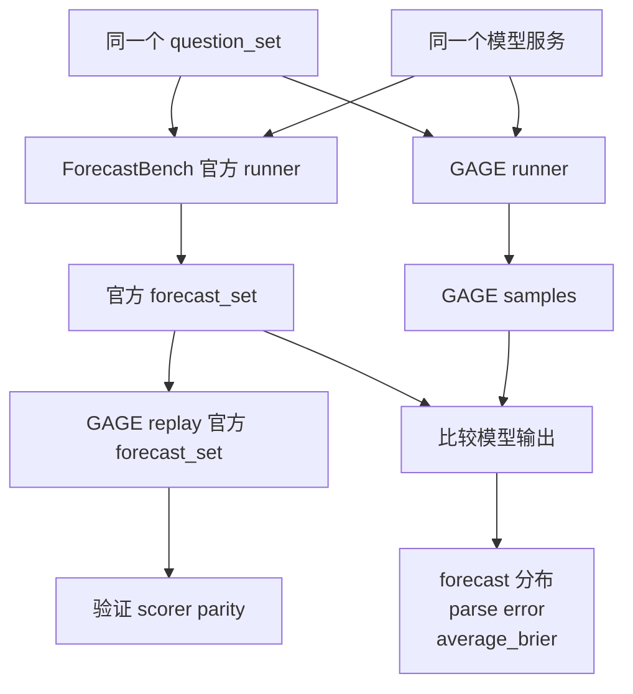

# ForecastBench Polymarket 静态评测 Case Study

本文说明 GAGE 如何接入 ForecastBench 的 Polymarket 静态评测子集，以及如何验证框架和产物是否可信。当前接入目标不是复刻 ForecastBench 官方 leaderboard，而是把 ForecastBench 中已经结算的 Polymarket market questions 接成 GAGE 静态评测闭环。

## 1. 接入范围

P0 只保留 ForecastBench 公开数据中的 Polymarket 已结算 market questions：

```yaml
source_filter:
  - polymarket
resolved_only: true
question_type: market
```

当前不包含：

- ForecastBench dataset questions
- 未结算问题
- live / longitudinal runner
- CLOB / orderbook 仿真交易
- LLM-as-judge
- ForecastBench 官方 difficulty-adjusted leaderboard

这意味着 GAGE 当前输出的是静态 simple scoring，适合做本地回归、模型横向 smoke/full 对比、接入可信度验证；不应直接拿来等同官网排名。

## 2. 数据契约

ForecastBench 把题目和答案拆在两个文件里：

| 文件 | 作用 | 顶层字段 |
|---|---|---|
| `question_set.json` | 题目集，包含 question、background、resolution criteria、freeze market value 等 | `questions` |
| `resolution_set.json` | 结算集，包含 resolved、resolved_to、resolution_date 等 | `resolutions` |

GAGE loader 按 `id` join：

```text
question.id == resolution.id
```

join 后的 raw record 至少包含：

| 字段 | 含义 |
|---|---|
| `id` | ForecastBench question id |
| `source` | 当前 P0 只接受 `polymarket` |
| `question` | 题目文本 |
| `background` | 背景说明 |
| `resolution_criteria` | 结算规则 |
| `forecast_due_date` | 本轮预测截止日期 |
| `freeze_datetime` | 市场价格冻结时间 |
| `freeze_datetime_value` | 冻结时市场价格，可能缺失 |
| `resolved` | 是否已结算 |
| `resolved_to` | 结算值，通常是 `0.0` 或 `1.0` |
| `question_set` | question set 文件名 |

`hub: inline` 在这里只是 GAGE 配置占位；核心数据路径不从 hub path 传入，而是从 dataset `params` 读取：

```yaml
params:
  question_set_path: ${FORECASTBENCH_QUESTION_SET_PATH}
  resolution_set_path: ${FORECASTBENCH_RESOLUTION_SET_PATH}
```

## 3. GAGE 执行链路



核心代码：

| 模块 | 路径 |
|---|---|
| loader | `src/gage_eval/assets/datasets/loaders/forecastbench_loader.py` |
| preprocessor | `src/gage_eval/assets/datasets/preprocessors/forecastbench/forecastbench_preprocessor.py` |
| metric | `src/gage_eval/metrics/builtin/forecastbench.py` |
| aggregator | `src/gage_eval/metrics/builtin/forecastbench_aggregator.py` |
| config | `config/custom/forecastbench/polymarket_static_full.yaml` |

## 4. 官方框架与 GAGE 的区别



| 维度 | ForecastBench 官方框架 | GAGE 当前 P0 |
|---|---|---|
| 数据范围 | dataset questions + market questions | 只接 Polymarket resolved market questions |
| 时间形态 | 动态出题、提交、等待结算、夜间更新 | 本地静态回放已结算数据 |
| dataset questions | 支持时间序列和多 horizon | 不接 |
| market questions | 多平台来源 | 只筛 Polymarket |
| 模型输出 | 官方 prompt，通常要求 `*0.xxx*`，可经过 reformat prompt | 支持 `*0.xxx*`、JSON、纯数字解析 |
| 缺失预测 | 官方提交规则处理，例如回填 0.5 | 当前主要处理 parse error 和 clamp |
| 指标体系 | difficulty-adjusted Brier、CI、p-value、BSS、Peer、rank simulation | simple Brier、simple Brier Index、parse error、market baseline |
| 结论用途 | 官方 leaderboard 排名 | GAGE 静态子集评测和回归验证 |

## 5. 环境准备

```bash
git clone <GAGE_REPO_URL> <GAGE_REPO>
cd <GAGE_REPO>

python -m venv .venv
source .venv/bin/activate
python -m pip install -U pip
python -m pip install -e .
```

Windows PowerShell：

```powershell
git clone <GAGE_REPO_URL> <GAGE_REPO>
cd <GAGE_REPO>

python -m venv .venv
.\.venv\Scripts\Activate.ps1
python -m pip install -U pip
python -m pip install -e .
```

## 6. 下载 ForecastBench 数据

```bash
python -m pip install huggingface_hub

python - <<'PY'
from huggingface_hub import snapshot_download

snapshot_download(
    repo_id="forecastingresearch/forecastbench-datasets",
    repo_type="dataset",
    local_dir="<FORECASTBENCH_DATA_DIR>",
)
PY
```

下载后通常包含：

```text
<FORECASTBENCH_DATA_DIR>/datasets/question_sets/
<FORECASTBENCH_DATA_DIR>/datasets/resolution_sets/
```

文件名约定：

```text
question_sets/<DATE>-llm.json
resolution_sets/<DATE>_resolution_set.json
```

不要直接把 `latest-llm.json` 当作稳定切片做回归；建议使用明确日期文件。

## 7. 运行单个日期切片

Bash：

```bash
cd <GAGE_REPO>

export PYTHONPATH=src
export PYTHONIOENCODING=utf-8
export PYTHONUTF8=1

export FB_DATA=<FORECASTBENCH_DATA_DIR>
export FORECASTBENCH_API_BASE=<OPENAI_COMPATIBLE_API_BASE>
export FORECASTBENCH_MODEL=<LITELLM_MODEL_ID>
export FORECASTBENCH_API_KEY=<API_KEY>

export FORECASTBENCH_QUESTION_SET_PATH=$FB_DATA/datasets/question_sets/<DATE>-llm.json
export FORECASTBENCH_RESOLUTION_SET_PATH=$FB_DATA/datasets/resolution_sets/<DATE>_resolution_set.json

mkdir -p runs

python run.py \
  --config config/custom/forecastbench/polymarket_static_full.yaml \
  --output-dir runs \
  --run-id forecastbench_<MODEL_ALIAS>_<DATE> \
  2>&1 | tee runs/forecastbench_<MODEL_ALIAS>_<DATE>.log
```

PowerShell：

```powershell
cd <GAGE_REPO>

$env:PYTHONPATH = "src"
$env:PYTHONIOENCODING = "utf-8"
$env:PYTHONUTF8 = "1"

$env:FB_DATA = "<FORECASTBENCH_DATA_DIR>"
$env:FORECASTBENCH_API_BASE = "<OPENAI_COMPATIBLE_API_BASE>"
$env:FORECASTBENCH_MODEL = "<LITELLM_MODEL_ID>"
$env:FORECASTBENCH_API_KEY = "<API_KEY>"

$env:FORECASTBENCH_QUESTION_SET_PATH = "$env:FB_DATA\datasets\question_sets\<DATE>-llm.json"
$env:FORECASTBENCH_RESOLUTION_SET_PATH = "$env:FB_DATA\datasets\resolution_sets\<DATE>_resolution_set.json"

New-Item -ItemType Directory -Force runs | Out-Null

python run.py `
  --config config/custom/forecastbench/polymarket_static_full.yaml `
  --output-dir runs `
  --run-id forecastbench_<MODEL_ALIAS>_<DATE> `
  2>&1 | Tee-Object -FilePath runs/forecastbench_<MODEL_ALIAS>_<DATE>.log
```

## 8. 跑完整 Polymarket resolved 子集

`polymarket_static_full.yaml` 一次只消费一组 question set / resolution set。完整跑法是遍历所有有对应 resolution set 的日期切片：

```text
for each question_sets/<DATE>-llm.json:
  if resolution_sets/<DATE>_resolution_set.json exists:
    set FORECASTBENCH_QUESTION_SET_PATH
    set FORECASTBENCH_RESOLUTION_SET_PATH
    run polymarket_static_full.yaml
```

仓库提供 PowerShell 辅助脚本：

```powershell
powershell -ExecutionPolicy Bypass `
  -File scripts/run_forecastbench_polymarket_full_local.ps1 `
  -DataDir <FORECASTBENCH_DATA_DIR> `
  -OutputDir runs `
  -RunPrefix forecastbench_<MODEL_ALIAS>
```

数据规模以当前下载数据为准。一次历史全量回放中，17 个日期切片共保留 964 条 Polymarket resolved 样本。

## 9. 模型输出格式

preprocessor 当前接近 ForecastBench 官方 market prompt，要求模型输出：

```text
*0.42*
```

metric 解析支持：

- 官方风格：`*0.42*`
- JSON 风格：`{"forecast": 0.42}`
- 纯数字：`0.42`

解析失败时使用 `forecast=0.5`，并记录 `parse_error=1`。概率越界时会 clamp 到 `[0, 1]`，并记录 `clamp_applied=1`。

默认情况下，如果样本包含 `freeze_datetime_value`，preprocessor 会把冻结时市场价格写进 prompt。若要做“不看市场价格”的 ablation，可以在 YAML 中关闭：

```yaml
params:
  preprocess: forecastbench_static
  preprocess_kwargs:
    include_market_baseline_in_prompt: false
```

这个开关只影响 prompt，不影响 `metadata.freeze_datetime_value`，因此 metric 仍可计算 market baseline 作为对照。

## 10. GAGE 指标

| GAGE 字段 | 中文解释 | 计算口径 |
|---|---|---|
| `brier` | 单样本 Brier 分数 | `(forecast - resolved_to)^2` |
| `average_brier` | 平均 Brier | 对当前 run 有效样本求平均 |
| `brier_index_simple_case` | 单样本简化 Brier Index | `(1 - sqrt(brier)) * 100` |
| `brier_index_simple` | run 级简化 Brier Index | `(1 - sqrt(average_brier)) * 100` |
| `accuracy_at_0_5` | 0.5 阈值命中率 | `(forecast >= 0.5)` 是否等于 `(resolved_to >= 0.5)` |
| `avg_abs_error` | 平均绝对误差 | `mean(abs(forecast - resolved_to))` |
| `parse_error_rate` | 输出解析失败率 | `mean(parse_error)` |
| `clamp_rate` | 越界截断率 | `mean(clamp_applied)` |
| `market_baseline_brier` | 市场基线单样本 Brier | `(freeze_datetime_value - resolved_to)^2` |
| `average_market_baseline_brier` | 市场基线平均 Brier | 只在有 `freeze_datetime_value` 的样本上聚合 |
| `model_minus_market_brier` | 模型相对市场基线差值 | `brier - market_baseline_brier` |
| `average_model_brier_market_subset` | 有市场基线样本上的模型平均 Brier | 只在有 `freeze_datetime_value` 的同一批样本上聚合 |
| `average_model_minus_market_brier` | run 级模型相对市场基线差值 | `average_model_brier_market_subset - average_market_baseline_brier` |

注意：`brier_index_simple` 不等于 ForecastBench 官方 leaderboard 的 Brier Index。官方 leaderboard 会做 difficulty adjustment，并合并 dataset / market 等官方口径。

解释模型是否 beat market baseline 时，不要直接用 `average_brier - average_market_baseline_brier`。前者覆盖当前 run 的全部有效样本，后者只覆盖有 `freeze_datetime_value` 的样本；当 `market_baseline_samples < samples` 时，两者分母不同。应使用同一子集上的 `average_model_brier_market_subset` 和 `average_model_minus_market_brier`。

## 11. 官方 leaderboard 未实现项

| 官方字段 / 概念 | 含义 | 当前 GAGE P0 |
|---|---|---|
| `Dataset (N)` | dataset questions 的样本数和得分 | 不实现 |
| `Market (N)` | market questions 的样本数和得分 | 只实现 Polymarket 子集 |
| `Overall (N)` | dataset 与 market 合并后的总分 | 不实现 |
| `difficulty-adjusted Brier` | 扣除题目难度影响后的 Brier | 不实现 |
| `95% CI` | 分数置信区间 | 不实现 |
| `p-value` | 与参照预测者差异的显著性检验 | 不实现 |
| `BSS` | Brier Skill Score，相对 naive baseline 的提升 | 不实现 |
| `Peer` | peer comparison 相关统计 | 不实现 |
| `simulation rank probability` | 排名模拟概率 | 不实现 |
| `leaderboard rank` | 官网排名 | 不实现 |

## 12. 产物位置

运行后主要查看：

```text
runs/<run-id>/summary.json
runs/<run-id>/samples.jsonl
runs/<run-id>/samples/
runs/<run-id>/events.jsonl
runs/<run-id>.log
```

`summary.json` 重点检查：

```text
tasks[*].execution.status == "completed"
sample_count 是否符合预期
samples_valid 是否等于 samples_total
parse_error_rate 是否可接受
metrics count 是否合理
market_baseline_samples / market_baseline_coverage 是否解释清楚
average_model_minus_market_brier 是否使用同一子集比较
```

单样本 JSON 重点检查：

```text
sample.messages 是否为实际发给模型的 prompt
model_output.answer 是否为模型原始输出
raw_response 是否保存服务商返回内容
metrics.forecastbench_probability.values 是否包含单样本评分
```

不要把包含真实 API key 的 `summary.json` 或 raw response 直接提交到仓库。

## 13. 可信度验证方法

建议按三层验证：



### 13.1 数据 join 正确性

独立统计某个切片：

```bash
python - <<'PY'
import json
from pathlib import Path

qpath = Path("<FORECASTBENCH_QUESTION_SET_PATH>")
rpath = Path("<FORECASTBENCH_RESOLUTION_SET_PATH>")

qs = json.loads(qpath.read_text(encoding="utf-8"))["questions"]
rs = json.loads(rpath.read_text(encoding="utf-8"))["resolutions"]
res_by_id = {str(r["id"]): r for r in rs if r.get("id") is not None}

count = 0
for q in qs:
    if q.get("source") != "polymarket":
        continue
    r = res_by_id.get(str(q.get("id")))
    if isinstance(r, dict) and r.get("resolved") is True and r.get("resolved_to") is not None:
        count += 1

print("polymarket_resolved_count:", count)
PY
```

再与 `summary.json` 中的 `sample_count`、`samples_valid`、`tasks[*].sample_count` 对齐。

### 13.2 metric / aggregator 正确性

建议至少跑：

```bash
pytest \
  tests/unit/assets/datasets/loaders/test_forecastbench_loader.py \
  tests/unit/assets/datasets/test_forecastbench_preprocessor.py \
  tests/unit/assets/metrics/test_forecastbench_metric.py \
  tests/unit/assets/metrics/test_forecastbench_aggregator.py \
  tests/unit/assets/metrics/test_metric_registry.py \
  tests/unit/evaluation/test_cache.py
```

这些测试覆盖：

- 双文件读取与 `id` join
- Polymarket / resolved 过滤
- raw record 到 GAGE Sample
- `*0.xxx*`、JSON、纯数字解析
- parse error fallback
- Brier、market baseline、聚合公式
- aggregator registry lazy load
- ForecastBench 短 sample id 与全局 cache 行为

### 13.3 官方框架同模型对照

这一层验证模型调用链路，而不是单纯验证 scorer。



同一模型、同一题集下，不要求逐条 forecast 完全一致。即使 `temperature=0`，prompt 包装、stop 参数、token 限制、reformat prompt、供应商实现都可能造成差异。合理验收标准是：

```text
sample_count 完全一致
parse_error_rate 接近
forecast 分布大体一致
average_brier 同数量级
关键 case 差异可解释
```

一次官方 prompt 对照中，GAGE 与官方 runner 在 964 条 Polymarket resolved 样本上样本数一致；weighted average Brier 分别约为 `0.126856` 与 `0.127367`，差值约 `0.000511`。这说明静态 scorer 和数据覆盖基本可信，但仍不能替代官方 leaderboard 的 difficulty-adjusted 统计口径。

## 14. Case Study

以下 case 来自一次历史全量 artifact 摘要，模型输出均为官方风格 `*0.xxx*`。这里不记录本地路径和 API key，只保留可用于判断框架行为的字段。

### 14.1 正常 case：低 Brier，市场价格和模型输出一致

| 字段 | 值 |
|---|---|
| 日期切片 | `2024-07-21` |
| question | `Will 'Dune: Part 2' gross most in 2024?` |
| freeze market value | `0.0005` |
| model answer | `*0.0005*` |
| parsed forecast | `0.0005` |
| resolved_to | `0.0` |
| brier | `0.00000025` |
| parse_error | `0` |

解读：这是标准成功样本。prompt 中有 freeze market value，模型输出可解析，预测接近 0，最终也结算为 No。这个 case 验证了 prompt、parser、resolved_to、Brier 计算都能串通。

### 14.2 正常 case：模型相对市场 baseline 更好

| 字段 | 值 |
|---|---|
| 日期切片 | `2024-07-21` |
| question | `Another player Week 1 starter for Steelers?` |
| freeze market value | `0.4995` |
| model answer | `*0.15*` |
| parsed forecast | `0.15` |
| resolved_to | `0.0` |
| model brier | `0.0225` |
| market_baseline_brier | `0.24950025` |
| model_minus_market_brier | `-0.22700025` |

解读：模型没有直接照抄市场价，而是把概率下调到 0.15，最终结算为 No，因此比 freeze market baseline 更好。这个 case 说明 `model_minus_market_brier` 可用于解释模型是否 beat market baseline。

### 14.3 正常但失败 case：模型明显输给市场 baseline

| 字段 | 值 |
|---|---|
| 日期切片 | `2025-08-31` |
| question | `Will Solana dip to $130 in August?` |
| freeze market value | `0.0385` |
| model answer | `*0.96*` |
| parsed forecast | `0.96` |
| resolved_to | `0.0` |
| model brier | `0.9216` |
| market_baseline_brier | `0.00148225` |
| model_minus_market_brier | `0.92011775` |

解读：这是模型强置信错误。metric 处理本身正常，但这个样本会显著拉高 average Brier。分析模型能力时，应把这类 case 单独抽样看 prompt 和 raw response。

### 14.4 异常 case：模型服务拒答导致 parse error

| 字段 | 值 |
|---|---|
| 日期切片 | `2024-07-21` |
| question | `Will China invade Taiwan in 2024?` |
| freeze market value | `0.095` |
| raw answer | `The request was rejected because it was considered high risk` |
| parsed forecast | `0.5` |
| resolved_to | `0.0` |
| brier | `0.25` |
| parse_error | `1` |

解读：这不是 scorer 算错，而是模型服务或安全策略没有返回概率。GAGE 按规则回填 `0.5` 并记录 `parse_error=1`。正式比较模型时，`parse_error_rate` 必须单独汇报，否则会把服务拒答误解释成模型预测能力问题。

### 14.5 边界 case：Polymarket source 但没有 freeze value

| 字段 | 值 |
|---|---|
| 日期切片 | `2024-07-21` |
| question | `We are presenting you with two probability questions...` |
| question id | list-like id |
| freeze market value | 缺失 |
| model answer | `*0.5*` |
| parsed forecast | `0.5` |
| resolved_to | `1.0` |
| brier | `0.25` |
| market_baseline_brier | 不存在 |

解读：这个样本虽然 `source=polymarket`，但形态更像组合问题，缺少单市场 freeze price，因此不会进入 market baseline 聚合。当前 P0 允许它参与 simple Brier；如果后续只想评估单一 Polymarket 市场，需要增加更严格过滤，例如排除 `combination_of != "N/A"`、list-like id 或缺失 freeze value 的样本。

## 15. 全量 artifact 观察项

一次本地全量回放观察到：

| 观察项 | 数值 |
|---|---:|
| 日期切片 | `17` |
| Polymarket resolved 样本 | `964` |
| parse error 样本 | `6` |
| clamp 样本 | `0` |
| 有 freeze market value 的样本 | `628` |
| 缺失 freeze market value 的样本 | `336` |

解释重点：

- `average_market_baseline_brier` 只覆盖有 freeze value 的样本，不覆盖全部 964 条。
- 若 `market_baseline_samples < samples`，模型和市场 baseline 的 run 级比较应看 `average_model_brier_market_subset` 与 `average_model_minus_market_brier`。
- parse error 主要来自模型服务拒答，应该作为产物质量问题单独看。
- 缺失 freeze value 的样本多为组合题或非标准单市场形态，是否保留取决于评测目标。

## 16. 常见问题

### 16.1 为什么不是官方 leaderboard 分数？

官方 leaderboard 使用 difficulty-adjusted Brier，并且会做 bootstrap CI、p-value、人类 forecaster 对比、rank simulation 等统计处理。GAGE 当前 P0 只做静态 simple scoring。

### 16.2 为什么 prompt 里会有 freeze market price？

ForecastBench 官方 market prompt 本身有带 freeze value 的版本。这个设定更像评估模型能否利用市场信息做预测，或者能否 beat market baseline，不是纯粹无市场价格的预测能力评估。

### 16.3 `average_market_baseline_brier` 覆盖不满怎么办？

这个字段只在样本有 `freeze_datetime_value` 时计算。若部分样本缺失冻结价格，baseline 样本数会小于总样本数，解释结果时需要说明覆盖率。

这种情况下，`average_market_baseline_brier` 不能和全量 `average_brier` 直接相减。GAGE 会额外输出 `average_model_brier_market_subset` 和 `average_model_minus_market_brier`，用于在同一批有 freeze value 的样本上比较模型和市场基线。

### 16.4 `parse_error_rate` 很高怎么办？

检查单样本产物里的 raw response。常见原因是模型没有按概率格式输出、服务拒答、reasoning 内容太长导致最终答案不可解析。可以尝试提高 `max_new_tokens`、关闭 thinking、或强化输出格式要求。

### 16.5 是否要继续接官方高阶指标？

P0 不建议直接复刻官方 leaderboard。更稳的顺序是：

1. 先确保数据 join 与 simple scorer 可信。
2. 增加 forecast_set replay parity。
3. 再决定是否接 difficulty adjustment、bootstrap CI、p-value、BSS 等官方统计层。

## 17. 参考链接

- [ForecastBench GitHub](https://github.com/forecastingresearch/forecastbench)
- [ForecastBench datasets](https://www.forecastbench.org/datasets/)
- [ForecastBench leaderboards](https://www.forecastbench.org/leaderboards/)
