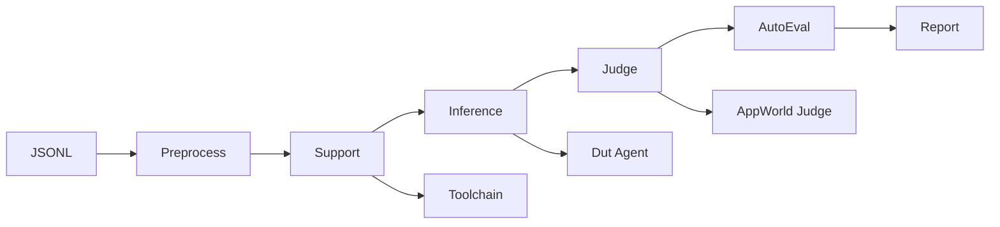
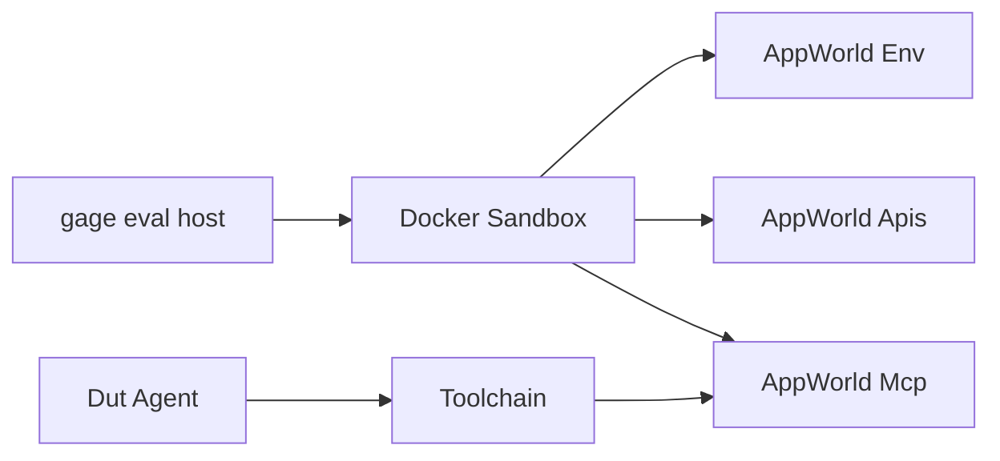

# Agent Evaluation Guide AppWorld

English | [中文](agent_evaluation_zh.md)

This guide explains the AppWorld-based agent evaluation workflow in gage-eval. It uses `appworld_official_jsonl` as the reference configuration and focuses on the evaluation chain, sandbox, and the end-to-end setup.

## 0. Document Map

- Project overview: [`README.md`](../../README.md)
- Sample contract: [`sample.md`](sample.md)
- AppWorld config: [`config/custom/appworld_official_jsonl.yaml`](../../config/custom/appworld_official_jsonl.yaml)
- AppWorld image and export scripts: [`docker/appworld/`](../../docker/appworld/)

## 1. Agent Evaluation Overview

### 1.1 Evaluation Chain



### 1.2 Core Components

| Component | Purpose | Code and config |
| --- | --- | --- |
| JSONL Loader | Read exported AppWorld JSONL files | `src/gage_eval/assets/datasets/loaders/jsonl_loader.py`, `config/custom/appworld_official_jsonl.yaml` |
| AppWorld Preprocessor | Normalize Sample and metadata | `src/gage_eval/assets/datasets/preprocessors/appworld_preprocessor.py` |
| Toolchain Adapter | MCP discovery, Meta-Tool generation, docs injection | `src/gage_eval/role/adapters/toolchain.py` |
| DUT Agent | AgentLoop execution and tool calls | `src/gage_eval/role/adapters/dut_agent.py` |
| AppWorld Hooks | /initialize and /save bridge | `src/gage_eval/sandbox/integrations/appworld/hooks.py` |
| AppWorld Judge | appworld evaluate inside container | `src/gage_eval/role/judge/appworld_evaluate.py` |
| AppWorld Metrics | TGC SGC pass fail difficulty | `src/gage_eval/metrics/builtin/appworld.py` |

### 1.3 In-Context Tool Schema

AppWorld exposes a large tool inventory, so the default config enables Meta-Tools with Docs-in-Prompt. Toolchain aggregates tools into `call_<app>` and injects tool documentation into the system prompt.

| Config | Meaning | Default |
| --- | --- | --- |
| meta_tool_mode | Enable Meta-Tools | true |
| tool_doc_enabled | Inject tool documentation | true |
| tool_doc_format | Document format text or app_kv | text |

`tool_doc_format: text` emits compact signatures with parameters. Switch to `app_kv` for the official `app_name: api_name: description` layout.

### 1.4 Extensibility  AgentBackend and SandboxDriver

AgentBackend types:

| type | Description | Code |
| --- | --- | --- |
| agent_class | In-process class execution | `src/gage_eval/role/agent/backends/class_backend.py` |
| agent_http | Remote HTTP agent service | `src/gage_eval/role/agent/backends/http_backend.py` |
| agent_mcp | MCP agent endpoint | `src/gage_eval/role/agent/backends/mcp_backend.py` |
| agent_cli | Local CLI execution | `src/gage_eval/role/agent/backends/cli_backend.py` |
| model_backend | Reuse model backends as agent engines | `src/gage_eval/role/agent/backends/model_backend.py` |

SandboxDriver types:

| Driver | runtime values | Description | Code |
| --- | --- | --- | --- |
| Docker Driver | docker appworld aio llm opensandbox | Docker-based runtime family | `src/gage_eval/sandbox/docker_runtime.py` and derived runtimes |
| Local Process | local | Local subprocess sandbox | `src/gage_eval/sandbox/local_runtime.py` |
| Remote Driver | remote | Remote sandbox proxy | `src/gage_eval/sandbox/remote_runtime.py` |

AppWorld evaluations use the Docker Driver today; other drivers are reserved for extensibility.

## 2. Sandbox

### 2.1 Topology



### 2.2 Lifecycle and Hooks

| Stage | Trigger | Action | Key fields |
| --- | --- | --- | --- |
| PreHook | Before inference | Call AppWorld /initialize | task_id subset experiment_name ground_truth_mode |
| AgentLoop | During inference | MCP tool calls and responses | allowed_apps tool_doc_format |
| PostHook | After inference | Call AppWorld /save | task_id |
| Judge | Judge step | appworld evaluate in container | appworld_root experiment_name |

### 2.3 Artifacts and Isolation

| Artifact | AppWorld location | gage-eval output | Notes |
| --- | --- | --- | --- |
| Task outputs | /run/experiments/outputs | runs/<run_id>/appworld_artifacts/<task_id>/ | Exported by judge export_outputs |
| Per-sample result | AppWorld evaluation JSON | runs/<run_id>/samples.jsonl | eval_result.appworld |
| Summary metrics | AppWorld aggregate | runs/<run_id>/summary.json | summary generator |

For test_normal and test_challenge, ground truth is minimized and sensitive outputs are redacted to avoid leakage.

## 3. Config and Usage Workflow

### 3.1 Preheat Steps

1. Build the AppWorld image:

```bash
cd gage-eval-main
# If building from source, make sure reference/agents/appworld-main is present with LFS files
# git lfs pull reference/agents/appworld-main

docker build -t appworld-mcp:latest -f docker/appworld/Dockerfile docker/appworld
```

2. Export JSONL datasets to the host:

```bash
cd gage-eval-main
bash docker/appworld/export_datasets.sh \
  --image appworld-mcp:latest \
  --output ../local-datasets/appworld
```

The output directory contains `train.jsonl`, `dev.jsonl`, `test_normal.jsonl`, `test_challenge.jsonl`, and `manifest.json`.

### 3.2 Run Evaluation

```bash
cd gage-eval-main
export OPENAI_API_KEY=your_key
python run.py \
  --config config/custom/appworld_official_jsonl.yaml \
  --run-id appworld_official_jsonl_run_$(date +%H%M%S) \
  --output-dir runs/appworld_official_jsonl
```

### 3.3 Artifact Layout

| Path | Contents |
| --- | --- |
| runs/<run_id>/events.jsonl | Trace events for debugging |
| runs/<run_id>/samples.jsonl | Per-sample outputs and evaluations |
| runs/<run_id>/summary.json | Aggregated metrics |
| runs/<run_id>/appworld_artifacts/ | Exported container outputs |

### 3.4 Common Tweaks

| Goal | Where to edit |
| --- | --- |
| Switch subsets | dataset path and preprocess_kwargs.subset |
| Full evaluation | increase or remove max_samples |
| Tool docs format | tool_doc_format text or app_kv |
| Disable forced tools | agent_backends.force_tool_choice |
| Adjust ports | sandbox_profiles.runtime_configs.ports |
| Test subset metrics | remove pass fail difficulty in metrics |
| Disable export | appworld_judge.export_outputs false |
