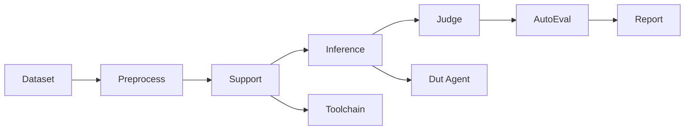
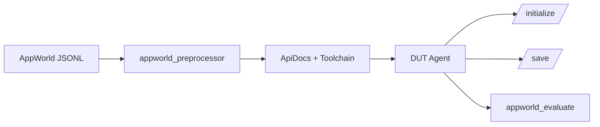
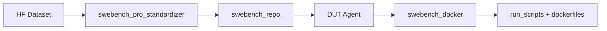
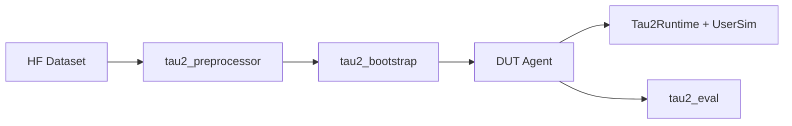

# Agent Evaluation Guide (AppWorld / SWE-bench Pro / Tau2)

English | [中文](agent_evaluation_zh.md)

This guide covers the agent evaluation workflows supported in gage-eval: AppWorld, SWE-bench Pro, and Tau2. It focuses on how to run each evaluation, required setup, key configuration knobs, and where results are written.

> Path note: commands assume you are in the `gage-eval-main/` repo root. Replace placeholder paths (for example, `/path/to/...`) with your local paths.

## 0. Document Map

- Project overview: [`README.md`](../../README.md)
- Sample contract: [`sample.md`](sample.md)
- AppWorld config: [`config/custom/appworld_official_jsonl.yaml`](../../config/custom/appworld_official_jsonl.yaml)
- SWE-bench config: [`config/custom/swebench_pro_smoke_agent.yaml`](../../config/custom/swebench_pro_smoke_agent.yaml)
- Tau2 configs: [`config/custom/tau2/`](../../config/custom/tau2/)

## 1. Common Evaluation Chain



All three benchmarks follow the same step order. Differences live in the dataset loader, sandbox runtime, judge implementation, and metrics.

## 2. AppWorld Evaluation

### 2.1 Workflow Snapshot



### 2.2 Prerequisites

- Docker is required (AppWorld judge runs inside a container).
- If you build from source, place the official AppWorld repo under a local path and adjust your Docker build context if needed.

### 2.3 Prepare the AppWorld Image and Dataset

1. Build the AppWorld image:

```bash
cd gage-eval-main
# If building from source, make sure the AppWorld repo is present with LFS files
# git lfs pull /path/to/appworld-repo

docker build -t appworld-mcp:latest -f docker/appworld/Dockerfile docker/appworld
```

2. Export JSONL datasets to the host:

```bash
cd gage-eval-main
bash docker/appworld/export_datasets.sh \
  --image appworld-mcp:latest \
  --output ../local-datasets/appworld
```

The output directory contains `train.jsonl`, `dev.jsonl`, `test_normal.jsonl`, `test_challenge.jsonl`, and `manifest.json`.

### 2.4 Run Evaluation

```bash
cd gage-eval-main
export OPENAI_API_KEY=your_key
python run.py \
  --config config/custom/appworld_official_jsonl.yaml \
  --run-id appworld_official_jsonl_run_$(date +%H%M%S) \
  --output-dir runs/appworld_official_jsonl
```

### 2.5 Metrics and Outputs

- Metrics: `tgc`, `sgc`, `pass`, `fail`, `difficulty` (see `src/gage_eval/metrics/builtin/appworld.py`).
- Artifacts: `runs/<run_id>/appworld_artifacts/` stores exported container outputs.
- Summary: `runs/<run_id>/summary.json`.

### 2.6 Core Configuration Knobs (AppWorld)

| Config location | Key | Meaning / best practice |
| --- | --- | --- |
| `datasets[*].params.path` | JSONL path | Point to `train/dev/test_normal/test_challenge` as needed. |
| `datasets[*].params.preprocess_kwargs.subset` | subset | Keep aligned with the JSONL file. |
| `datasets[*].params.preprocess_kwargs.ground_truth_mode` | ground truth | `full` for train/dev; test subsets auto downgrade to minimal. |
| `sandbox_profiles[*].image` | image | AppWorld image tag (`appworld-mcp:latest`). |
| `sandbox_profiles[*].runtime_configs.ports` | ports | Ensure host ports are free; update if conflicts exist. |
| `role_adapters.toolchain.params` | tool docs | `meta_tool_mode`, `tool_doc_enabled`, `tool_doc_format` control tool schema injection. |
| `role_adapters.dut_agent.params.max_turns` | max turns | Add a safety cap for tool loops. |
| `role_adapters.appworld_judge.params.implementation_params.export_outputs` | export outputs | Keep `true` if you need container artifacts. |

### 2.7 Official Best Practices → gage-eval Mapping (AppWorld)

| Official practice | gage-eval implementation |
| --- | --- |
| Use tool docs and API descriptions to constrain actions | `api_descriptions_context` + `toolchain_main` with `tool_doc_format: schema_yaml` |
| Separate task initialization and persistence | `appworld_initialize` pre-hook + `appworld_save` post-hook |
| Isolate each task | `sandbox_profiles` with `lifecycle: per_task` and `concurrency: 1` |
| Avoid leakage on test splits | `ground_truth_mode` enforced by preprocessor for test subsets |

## 3. SWE-bench Pro Evaluation

### 3.1 Workflow Snapshot



### 3.2 Prerequisites

- Docker is required; the judge runs the official test workflow in containers.
- SWE-bench run scripts and dockerfiles are bundled under `third_party/swebench_pro/`.
- Dataset is pulled from HuggingFace (`ScaleAI/SWE-bench_Pro`) via the HF loader.

### 3.3 Default Config (Smoke Subset)

The default config `swebench_pro_smoke_agent.yaml` is a smoke-only evaluation:

- Filters instances using `third_party/swebench_pro/run_scripts/smoke_instance_ids.txt`.
- Uses per-sample Docker containers (`runtime: docker`) with network blocked by default.
- Judges with `swebench_docker` (offline test execution).

### 3.4 Run Evaluation

```bash
cd gage-eval-main
export OPENAI_API_KEY=your_key
python run.py \
  --config config/custom/swebench_pro_smoke_agent.yaml \
  --run-id swebench_pro_smoke_run_$(date +%H%M%S) \
  --output-dir runs/swebench_pro_smoke
```

### 3.5 Metrics and Outputs

- Metrics: resolve rate (`swebench_resolve_rate`), failure reasons (`swebench_failure_reason`).
- Judge logs: `runs/<run_id>/logs/` and per-instance workspaces under `runs/<run_id>/logs/<instance_id>/`.

If you need a full evaluation, remove the smoke allowlist in the dataset preprocessor and adjust `max_samples`/`concurrency`.

### 3.6 Core Configuration Knobs (SWE-bench Pro)

| Config location | Key | Meaning / best practice |
| --- | --- | --- |
| `datasets[*].hub_params.hub_id` | dataset hub | Default `ScaleAI/SWE-bench_Pro`. |
| `datasets[*].params.preprocess_kwargs.smoke_ids_path` | smoke filter | Remove for full runs. |
| `sandbox_profiles[*].runtime_configs.network_mode` | network | Keep blocked for reproducibility. |
| `role_adapters.swebench_docker_judge.params.implementation_params` | judge | `scripts_dir`, `dockerfiles_dir`, `dockerhub_username`, `test_timeout_s`, `docker_platform`. |
| `role_adapters.dut_agent.params.max_turns` | max turns | Prevent runaway tool loops. |
| `metrics[*].aggregation` | failure counts | `categorical_count` for failure reasons. |

### 3.7 Official Best Practices → gage-eval Mapping (SWE-bench Pro)

| Official practice | gage-eval implementation |
| --- | --- |
| Run tests in isolated Docker containers | `swebench_docker` + `runtime: docker` |
| Use official run scripts and dockerfiles | `implementation_params.scripts_dir` + `dockerfiles_dir` |
| Block network for reproducibility | `runtime_configs.network_mode: none` and `block_network: true` |
| Enforce platform compatibility | `docker_platform: linux/amd64` |
| Respect timeouts and resource limits | `test_timeout_s`, `resources.cpu/memory` |

## 4. Tau2 Evaluation

### 4.1 Workflow Snapshot



### 4.2 Prerequisites (Install Official Tau2 Code)

Tau2 runtime and preprocessing require the official `tau2` Python package. Install it from the official Tau2 repo (clone it to any local path you control):

```bash
git clone https://github.com/sierra-research/tau2-bench
cd tau2-bench
python -m venv .venv
source .venv/bin/activate
pip install -e .
```

Important: run gage-eval using the same Python environment where `tau2` is installed (so the import is available).

Optional sanity check:

```bash
tau2 check-data
```

### 4.3 Dataset (HF Download) and Data Directory

The Tau2 loader downloads the dataset from HuggingFace (`HuggingFaceH4/tau2-bench-data`) into `TAU2_DATA_DIR` (or the default `./local-datasets/tau2`).

- Default config sets: `data_dir: ${TAU2_DATA_DIR:-./local-datasets/tau2}`
- Set `HUGGINGFACEHUB_API_TOKEN` if the HF download needs authentication.

### 4.4 Run Evaluation

Example (airline base split):

```bash
cd gage-eval-main
export OPENAI_API_KEY=your_key
export TAU2_DATA_DIR=/path/to/tau2-data
python run.py \
  --config config/custom/tau2/tau2_airline_base.yaml \
  --run-id tau2_airline_base_run_$(date +%H%M%S) \
  --output-dir runs/tau2_airline_base
```

Run all subsets with 10 samples each:

```bash
cd gage-eval-main
python run.py \
  --config config/custom/tau2/tau2_all_subsets_base.yaml \
  --run-id tau2_all_subsets_base_run_$(date +%H%M%S) \
  --output-dir runs/tau2_all_subsets_base
```

### 4.5 Metrics and Outputs

- Metrics: `tau2_reward`, `tau2_pass`, `tau2_pass_hat_k`, `tau2_agent_cost`, `tau2_user_cost`.
- Summary generator: `tau2_summary` produces `pass_hat_k` and per-domain averages in `summary.json`.
- Tau2 user simulator relies on the official Tau2 runtime (LiteLLM), so API keys must be configured in the environment for the user model.

### 4.6 Core Configuration Knobs (Tau2)

| Config location | Key | Meaning / best practice |
| --- | --- | --- |
| `datasets[*].params.domain` | domain | `airline`, `retail`, `telecom`, `mock`. |
| `datasets[*].params.task_split` | split | Must use `base` for official comparison. |
| `datasets[*].params.num_trials` | trials | Use `num_trials >= k` if you need `pass@k`. Keep trials consistent across tasks. |
| `datasets[*].params.seed` | seed | Base seed; trial seed is `seed + trial`. Fix for reproducibility. |
| `datasets[*].params.num_tasks` | sampling | Use for smoke runs; remove for full evaluation. |
| `datasets[*].params.data_dir` | data path | Path to HF snapshot or local data directory. |
| `sandbox_profiles[*].runtime_configs.user_model` | user sim | Configure the user LLM (LiteLLM-compatible). |
| `sandbox_profiles[*].runtime_configs.max_steps` | max steps | Prevent infinite loops. |
| `metrics[*]` | pass-hat | `tau2_pass_hat_k` produces `pass_hat@1..k` based on min trials. |

Tau2 pass@k best practice:
- Fix `seed` for reproducibility.
- Keep `num_trials` identical across tasks.
- Ensure `num_trials >= k`; otherwise `pass_hat@k` is capped by the minimum trials across tasks.

## 5. Appendix: Common Concepts

| Term | Explanation |
| --- | --- |
| DUT Agent | The “device under test” agent being evaluated. In configs this maps to the `dut_agent` role adapter. |
| Toolchain | The support step that injects tool schemas and tool docs into the prompt. |
| Support step | Non-inference steps that prepare context (prompts, tools, docs) before agent execution. |
| Judge | The evaluation stage that scores agent outputs (for example, AppWorld judge or SWE-bench docker judge). |
| AutoEval | The aggregation step that turns per-sample metrics into summary metrics. |
| Sandbox | The isolated execution environment for tools, tests, and external services (Docker or local runtime). |
| User Simulator | In Tau2, the simulated user that interacts with the agent through the environment. |
| pass@k / pass_hat@k | Probability estimate that at least one of k trials succeeds; Tau2 computes pass_hat@k from multiple trials. |

## 6. Note on Future Images

We will provide custom Docker images for AppWorld and Tau2 to remove the manual preparation steps (building/installing the official code and datasets).
