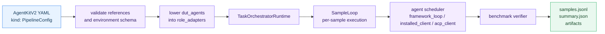

# AgentKitV2 Evaluation Guide

English | [中文](agent_evaluation_zh.md)

AgentKitV2 is the native GAGE path for per-sample agent evaluation. It keeps the public YAML shape close to the concepts an agent benchmark author thinks about: model backends, agents, benchmark kits, environments, DUT bindings, tasks, metrics, and reports. At load time, GAGE validates those sections, lowers them into the standard `PipelineConfig`, and executes them through the normal step-chain runtime.

Use this guide for AppWorld, SWE-bench Pro, and Tau2 runs that should be managed by GAGE itself. If the benchmark is owned by an external harness such as Harbor, use the [External Harness guide](external_harness.md) instead.

> Path note: commands assume you are in the `gage-eval-main/` repository root.

## 0. Document Map

- Project overview: [`README.md`](../../README.md)
- Framework overview: [`framework_overview.md`](framework_overview.md)
- Sample contract: [`sample.md`](sample.md)
- External Harness and Harbor: [`external_harness.md`](external_harness.md)
- Manual AgentKitV2 E2E configs: [`config/custom/manual_e2e/`](../../config/custom/manual_e2e/)
- AppWorld configs: [`config/custom/appworld/`](../../config/custom/appworld/)
- SWE-bench Pro configs: [`config/custom/swebench_pro/`](../../config/custom/swebench_pro/)
- Tau2 configs: [`config/custom/tau2/`](../../config/custom/tau2/)

## 1. Where AgentKitV2 Fits

AgentKitV2 is still a `PipelineConfig` workflow. The dedicated top-level sections are a more compact authoring surface, not a separate runtime.


```mermaid
flowchart LR
  YAML["AgentKitV2 YAML\nkind: PipelineConfig"] --> Validate["validate references\nand environment schema"]
  Validate --> Lower["lower dut_agents\ninto role_adapters"]
  Lower --> Runtime["TaskOrchestratorRuntime"]
  Runtime --> SampleLoop["SampleLoop\nper-sample execution"]
  SampleLoop --> Scheduler["agent scheduler\nframework_loop / installed_client / acp_client"]
  Scheduler --> Verifier["benchmark verifier"]
  Verifier --> Report["samples.jsonl\nsummary.json\nartifacts"]

  classDef input fill:#E8F3FF,stroke:#2F80ED,color:#143A5A;
  classDef process fill:#F4ECFF,stroke:#7B61FF,color:#2E1A67;
  classDef output fill:#E9F8EF,stroke:#27AE60,color:#174A2A;
  class YAML input;
  class Validate,Lower,Runtime,SampleLoop,Scheduler,Verifier process;
  class Report output;
```

The main implementation points are:

| Area | Code |
| --- | --- |
| AgentKitV2 schema, validation, and lowering | `src/gage_eval/config/agentkit_v2.py` |
| Standard `PipelineConfig` model | `src/gage_eval/config/pipeline_config.py` |
| Runtime binding resolution | `src/gage_eval/agent_runtime/resolver.py` |
| Framework-loop scheduler | `src/gage_eval/agent_runtime/schedulers/framework_loop.py` |
| AppWorld kit | `src/gage_eval/agent_eval_kits/appworld/` |
| SWE-bench kit | `src/gage_eval/agent_eval_kits/swebench/` |
| Tau2 kit | `src/gage_eval/agent_eval_kits/tau2/` |

## 2. Configuration Shape

An AgentKitV2 config uses `kind: PipelineConfig` and these top-level sections:

| Section | Purpose |
| --- | --- |
| `backends` | Reusable model endpoints, commonly `litellm` or another OpenAI-compatible backend. |
| `agents` | Agent runtime policy: scheduler type, backend reference, max turns, tool behavior, prompt settings. |
| `benchmarks` | Benchmark kit reference and benchmark-specific config. |
| `environments` | Runtime environment definition. Providers currently include `local_process`, `docker`, and `e2b`. |
| `dut_agents` | Binding from one agent to one environment and one benchmark. This becomes a `dut_agent` role adapter after lowering. |
| `tasks` | Standard GAGE tasks. AgentKitV2 uses the regular `inference` + `auto_eval` step chain from the standard `PipelineConfig` step library, not a v2-specific runtime extension. |
| `metrics` / `summary_generators` | Benchmark metrics and summary generation. |

Minimal binding pattern:

```yaml
agents:
  - agent_id: tau2_agent
    scheduler:
      type: framework_loop
      backend_id: lmstudio_litellm
      config:
        max_turns: 200

environments:
  - env_id: tau2_local_process
    provider: local_process
    profile_id: tau2-local-process
    lifecycle: per_sample
    profile:
      asset_dir: src/gage_eval/agent_eval_kits/tau2/environment/local_process

dut_agents:
  - dut_id: tau2_dut
    agent_id: tau2_agent
    env_id: tau2_local_process
    benchmark_id: tau2_airline
```

After loading, `dut_agents[]` is lowered into `role_adapters[]`; the public concept remains `PipelineConfig`.

## 3. Scheduler and Environment Choices

### 3.1 Scheduler Types

| Scheduler | Use when | Notes |
| --- | --- | --- |
| `framework_loop` | GAGE should run the agent loop, tool calls, observations, and final answer handling. | Most local LM Studio / LiteLLM examples use this path. |
| `installed_client` | An external local service owns the loop and GAGE exchanges requests/results with it. | Useful for Codex-like or app-specific agent clients. |
| `acp_client` | An ACP-compatible client owns the loop. | Uses the same binding model but a different client contract. |

### 3.2 Environment Providers

| Provider | Typical benchmark | Notes |
| --- | --- | --- |
| `local_process` | Tau2 | Runs local benchmark services or simulators on the host. |
| `docker` | SWE-bench Pro, AppWorld | Creates per-sample containers for repo workspaces, tools, or verifiers. |
| `e2b` | SWE-bench Pro wrapper smoke tests | Requires E2B credentials and remote sandbox availability. |

AgentKitV2 currently supports only `lifecycle: per_sample`. Other values fail validation at load time with `config.environment.lifecycle.per_task` or `config.environment.lifecycle.unsupported`.

## 4. Run a 1-Case Tau2 Smoke

This is the lightest live check for the native AgentKitV2 path because it uses a local process environment and an OpenAI-compatible model endpoint.

```bash
cd gage-eval-main

export LMSTUDIO_BASE_URL=http://127.0.0.1:1234/v1
export LMSTUDIO_LITELLM_MODEL=openai/qwen/qwen3.5-9b
export LMSTUDIO_API_KEY=dummy

TAU2_MAX_TURNS=2 \
TAU2_MAX_STEPS=2 \
TAU2_NUM_TRIALS=1 \
TAU2_TRIAL_REPEATS=1 \
python run.py \
  --config config/custom/manual_e2e/agentkit_v2_tau2_local_lmstudio.yaml \
  --max-samples 1 \
  --concurrency 1 \
  --cpus 2 \
  --gpus 0 \
  --run-id agentkit-v2-tau2-$(date +%Y%m%d-%H%M%S)
```

For a real Tau2 run, raise `TAU2_MAX_TURNS` and `TAU2_MAX_STEPS` to match your evaluation budget. The smoke values above only prove that config loading, scheduler execution, model calls, metrics, and report writing are connected.

## 5. Run a 1-Case SWE-bench Pro Smoke

Use the manual LM Studio config when you want to exercise Docker-backed AgentKitV2 execution with one SWE-bench Pro instance.

```bash
cd gage-eval-main

export LMSTUDIO_BASE_URL=http://127.0.0.1:1234/v1
export LMSTUDIO_LITELLM_MODEL=openai/qwen/qwen3.5-9b
export LMSTUDIO_API_KEY=dummy

SWEBENCH_MAX_TURNS=2 \
SWEBENCH_TRIAL_REPEATS=1 \
python run.py \
  --config config/custom/manual_e2e/agentkit_v2_swebench_pro_docker_lmstudio_smoke1_qutebrowser.yaml \
  --max-samples 1 \
  --concurrency 1 \
  --cpus 4 \
  --gpus 0 \
  --run-id agentkit-v2-swebench-$(date +%Y%m%d-%H%M%S)
```

Important operational notes:

- Docker must be running.
- The selected instance may need an image pull the first time it runs.
- The config blocks network inside the benchmark environment by default.
- `SWEBENCH_MAX_TURNS=2` is only a smoke cap. It is usually too low for a useful patch.

## 6. AppWorld Paths

AppWorld configs live under `config/custom/appworld/`. The current examples include demo, runtime, LM Studio, and installed-client variants.

Common preparation:

```bash
cd gage-eval-main
docker build -t appworld-mcp:latest -f docker/appworld/Dockerfile docker/appworld

bash docker/appworld/export_datasets.sh \
  --image appworld-mcp:latest \
  --output ../local-datasets/appworld
```

Example run:

```bash
python run.py \
  --config config/custom/appworld/appworld_official_jsonl.yaml \
  --run-id appworld-$(date +%Y%m%d-%H%M%S) \
  --output-dir runs
```

Use an installed-client config only when the external client service is available and intentionally owns the agent loop.

## 7. Outputs and Inspection

AgentKitV2 writes the same core run files as other GAGE pipelines:

```text
runs/<run_id>/
  events.jsonl
  samples.jsonl
  summary.json
  samples/
    task_<task_id>/
      <sample_id>.json
```

Useful inspection order:

1. `summary.json`: task status, sample counts, metrics, and summary generator output.
2. `samples.jsonl`: normalized sample, `predict_result`, `eval_result`, and agent trace.
3. `samples/task_<task_id>/...`: per-sample cache artifacts.
4. `events.jsonl`: step start/end/failure events and runtime health.

Agent traces are carried in `predict_result[0].agent_trace` when the scheduler or imported result can provide them. AgentKitV2 framework-loop steps use a stable trace-step shape; ExternalHarness imports translate provider-native traces into the same general shape.

## 8. Troubleshooting

| Symptom | What to check |
| --- | --- |
| `config.legacy_key.*` | The YAML still contains an old top-level key. Keep `kind: PipelineConfig` and use the current sections. |
| `config.reference.missing ...` | A `dut_agents[]` binding references a missing `agent_id`, `env_id`, or `benchmark_id`. |
| `scheduler.backend_id.required` | `framework_loop` agents must reference a declared backend. |
| Docker run hangs before model calls | The benchmark image may be pulling or initializing. Check Docker Desktop and container logs. |
| Tau2 sample finishes but reward is 0 | The chain ran, but the agent did not solve the task. Increase turn/step budgets before judging model quality. |
| Missing `agent_trace` | Confirm the scheduler path emits trace events; for external harness imports, see the provider translator in `external_harness_kits`. |

## 9. AgentKitV2 vs ExternalHarness

Use AgentKitV2 when GAGE owns the per-sample runtime and scheduler. Use ExternalHarness when another framework owns the task lifecycle and GAGE should delegate, wait, parse, and import results.

| Need | Use |
| --- | --- |
| GAGE framework loop, GAGE environments, per-sample execution | AgentKitV2 |
| Harbor JobConfig, Harbor task registry, Harbor trial tree | ExternalHarness |
| Native AppWorld / SWE-bench / Tau2 configs | AgentKitV2 |
| Terminal-Bench 2.0 through Harbor | ExternalHarness |
