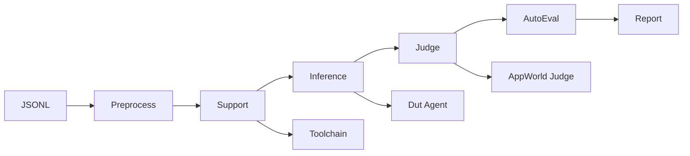
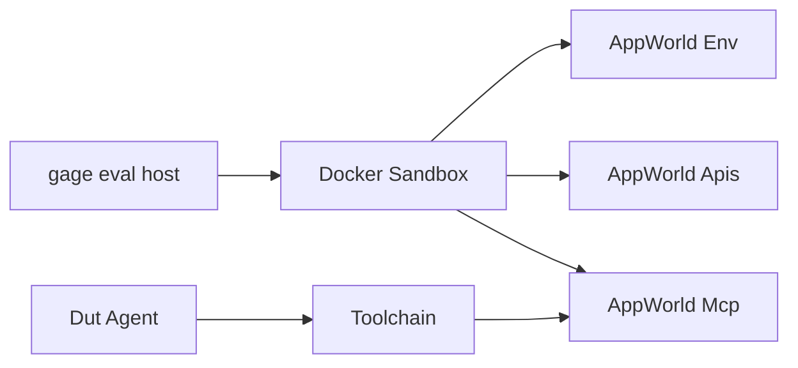

# Agent 评测指南 AppWorld

中文 | [English](agent_evaluation.md)

gage-eval 提供基于 AppWorld 的 Agent 评测流程。本指南以 `appworld_official_jsonl` 配置为例，覆盖评测链路、Sandbox 与配置使用流程。内容以 `gage-eval-main/` 当前实现为准。

## 0. 文档导航

- 项目首页（中文）：[`README_zh.md`](../../README_zh.md)
- Sample 契约：[`sample_zh.md`](sample_zh.md)
- AppWorld 配置：[`config/custom/appworld_official_jsonl.yaml`](../../config/custom/appworld_official_jsonl.yaml)
- AppWorld 镜像与数据导出脚本：[`docker/appworld/`](../../docker/appworld/)

## 1. Agent 评测概览

### 1.1 评测链路



### 1.2 关键组件与落点

| 组件 | 作用 | 代码与配置落点 |
| --- | --- | --- |
| JSONL Loader | 读取导出的 AppWorld JSONL | `src/gage_eval/assets/datasets/loaders/jsonl_loader.py`、`config/custom/appworld_official_jsonl.yaml` |
| AppWorld Preprocessor | 标准化 Sample，写入 task_id subset allowed_apps | `src/gage_eval/assets/datasets/preprocessors/appworld_preprocessor.py` |
| Toolchain Adapter | MCP 工具发现、Meta-Tool 生成与文档注入 | `src/gage_eval/role/adapters/toolchain.py` |
| DUT Agent | AgentLoop 调度与工具调用 | `src/gage_eval/role/adapters/dut_agent.py` |
| AppWorld Hooks | /initialize 与 /save 对接 | `src/gage_eval/sandbox/integrations/appworld/hooks.py` |
| AppWorld Judge | 容器内执行 appworld evaluate 并回收结果 | `src/gage_eval/role/judge/appworld_evaluate.py` |
| AppWorld Metrics | TGC SGC pass fail difficulty 统计 | `src/gage_eval/metrics/builtin/appworld.py` |

### 1.3 In-Context Tool Schema

AppWorld 工具数量庞大，默认启用 Meta-Tool + Docs-in-Prompt 方案：Toolchain 将工具按 App 聚合为 `call_<app>`，并把工具说明注入系统 Prompt。

| 配置项 | 说明 | 默认值 |
| --- | --- | --- |
| meta_tool_mode | 启用 Meta-Tool 模式 | true |
| tool_doc_enabled | 注入工具文档 | true |
| tool_doc_format | 文档格式 text 或 app_kv | text |

`tool_doc_format: text` 会输出带参数签名的文档；切换为 `app_kv` 可得到官方示例风格的 `app_name: api_name: description` 结构。

### 1.4 扩展性  AgentBackend 与 SandboxDriver

AgentBackend 类型划分：

| type | 说明 | 代码落点 |
| --- | --- | --- |
| agent_class | 进程内类调用 | `src/gage_eval/role/agent/backends/class_backend.py` |
| agent_http | 远程 HTTP Agent 服务 | `src/gage_eval/role/agent/backends/http_backend.py` |
| agent_mcp | MCP 协议 Agent | `src/gage_eval/role/agent/backends/mcp_backend.py` |
| agent_cli | 进程内 CLI 调用 | `src/gage_eval/role/agent/backends/cli_backend.py` |
| model_backend | 复用模型后端作为 Agent 引擎 | `src/gage_eval/role/agent/backends/model_backend.py` |

SandboxDriver 类型划分：

| Driver | runtime 值 | 说明 | 代码落点 |
| --- | --- | --- | --- |
| Docker Driver | docker appworld aio llm opensandbox | Docker 基础运行时族 | `src/gage_eval/sandbox/docker_runtime.py` 与派生类 |
| Local Process | local | 本地子进程沙箱 | `src/gage_eval/sandbox/local_runtime.py` |
| Remote Driver | remote | 远端沙箱服务代理 | `src/gage_eval/sandbox/remote_runtime.py` |

当前 AppWorld 评测使用 Docker Driver，其余 Driver 作为可扩展后端保留。

## 2. Sandbox

### 2.1 运行拓扑



### 2.2 生命周期与 Hook

| 阶段 | 触发点 | 动作 | 关键字段 |
| --- | --- | --- | --- |
| PreHook | inference 之前 | 调用 AppWorld /initialize | task_id subset experiment_name ground_truth_mode |
| AgentLoop | inference 期间 | MCP 工具调用与工具返回 | allowed_apps tool_doc_format |
| PostHook | inference 之后 | 调用 AppWorld /save | task_id |
| Judge | judge step | 容器内执行 appworld evaluate | appworld_root experiment_name |

### 2.3 产物与隔离策略

| 产物 | AppWorld 位置 | gage-eval 产物 | 说明 |
| --- | --- | --- | --- |
| 评测输出 | /run/experiments/outputs | runs/<run_id>/appworld_artifacts/<task_id>/ | 通过 judge export_outputs 导出 |
| 单样本结果 | AppWorld 输出 JSON | runs/<run_id>/samples.jsonl | eval_result.appworld 写入 |
| 汇总指标 | AppWorld aggregate | runs/<run_id>/summary.json | summary 统计 |

测试集子集 test_normal 与 test_challenge 会自动最小化 ground_truth 并裁剪输出细节，避免泄露隐藏答案。

## 3. 配置与使用流程

### 3.1 预热步骤

1. 构建 AppWorld 镜像（使用源码或指定版本）：

```bash
cd gage-eval-main
# 若使用源码构建，请确保 reference/agents/appworld-main 已准备好并包含 LFS 文件
# git lfs pull reference/agents/appworld-main

docker build -t appworld-mcp:latest -f docker/appworld/Dockerfile docker/appworld
```

2. 导出 JSONL 测试集到本地目录：

```bash
cd gage-eval-main
bash docker/appworld/export_datasets.sh \
  --image appworld-mcp:latest \
  --output ../local-datasets/appworld
```

导出后目录包含：`train.jsonl`、`dev.jsonl`、`test_normal.jsonl`、`test_challenge.jsonl` 与 `manifest.json`。

### 3.2 运行评测

```bash
cd gage-eval-main
export OPENAI_API_KEY=your_key
python run.py \
  --config config/custom/appworld_official_jsonl.yaml \
  --run-id appworld_official_jsonl_run_$(date +%H%M%S) \
  --output-dir runs/appworld_official_jsonl
```

### 3.3 产物目录

| 目录 | 内容 |
| --- | --- |
| runs/<run_id>/events.jsonl | 事件追踪与诊断信息 |
| runs/<run_id>/samples.jsonl | 每个样本的模型输出与评测结果 |
| runs/<run_id>/summary.json | 指标汇总 |
| runs/<run_id>/appworld_artifacts/ | 从容器导出的任务产物 |

### 3.4 常见配置调整

| 需求 | 修改位置 |
| --- | --- |
| 切换子集 | dataset path 与 preprocess_kwargs.subset |
| 全量评测 | 提高或移除 max_samples |
| 工具文档格式 | tool_doc_format text 或 app_kv |
| 关闭强制工具 | agent_backends.force_tool_choice 置空 |
| 调整容器端口 | sandbox_profiles.runtime_configs.ports |
| 测试集指标 | metrics 中移除 pass fail difficulty |
| 禁用导出 | appworld_judge.export_outputs 设为 false |
