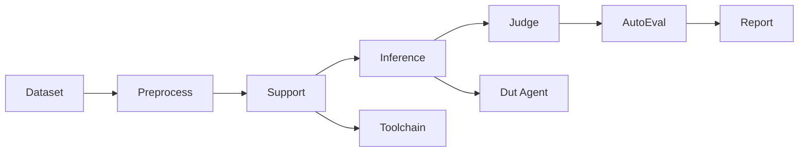
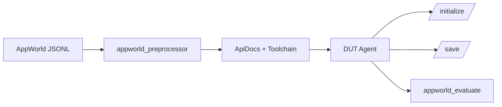
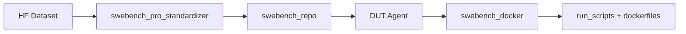
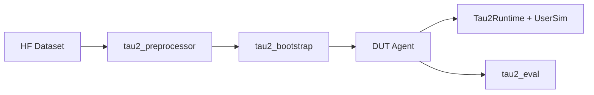

# Agent 评测指南（AppWorld / SWE-bench Pro / Tau2）

中文 | [English](agent_evaluation.md)

gage-eval 当前支持 AppWorld、SWE-bench Pro 与 Tau2 三类 Agent 评测。本指南以“如何运行”为主，介绍必要的准备步骤、核心配置项与产物位置。

> 路径说明：命令默认在 `gage-eval-main/` 仓库根目录执行，文中 `/path/to/...` 请替换为你的本地路径。

## 0. 文档导航

- 项目首页（中文）：[`README_zh.md`](../../README_zh.md)
- Sample 契约：[`sample_zh.md`](sample_zh.md)
- AppWorld 配置：[`config/custom/appworld_official_jsonl.yaml`](../../config/custom/appworld_official_jsonl.yaml)
- SWE-bench 配置：[`config/custom/swebench_pro_smoke_agent.yaml`](../../config/custom/swebench_pro_smoke_agent.yaml)
- Tau2 配置目录：[`config/custom/tau2/`](../../config/custom/tau2/)

## 1. 通用评测链路



三类评测的步骤一致，差异主要来自数据加载器、Sandbox 运行时、裁判实现与指标配置。

## 2. AppWorld 评测

### 2.1 评测流程概览



### 2.2 前置条件

- 需要 Docker（裁判在容器内运行）。
- 若使用源码构建镜像，请先将官方 AppWorld 仓库放到本地路径，并在需要时调整 Docker 构建上下文。

### 2.3 构建镜像并导出数据集

1. 构建 AppWorld 镜像：

```bash
cd gage-eval-main
# 若使用源码构建，请确保本地 AppWorld 仓库已准备好并包含 LFS 文件
# git lfs pull /path/to/appworld-repo

docker build -t appworld-mcp:latest -f docker/appworld/Dockerfile docker/appworld
```

2. 导出 JSONL 数据集到本地：

```bash
cd gage-eval-main
bash docker/appworld/export_datasets.sh \
  --image appworld-mcp:latest \
  --output ../local-datasets/appworld
```

目录中会生成 `train.jsonl`、`dev.jsonl`、`test_normal.jsonl`、`test_challenge.jsonl` 与 `manifest.json`。

### 2.4 运行评测

```bash
cd gage-eval-main
export OPENAI_API_KEY=your_key
python run.py \
  --config config/custom/appworld_official_jsonl.yaml \
  --run-id appworld_official_jsonl_run_$(date +%H%M%S) \
  --output-dir runs/appworld_official_jsonl
```

### 2.5 指标与产物

- 指标：`tgc`、`sgc`、`pass`、`fail`、`difficulty`（见 `src/gage_eval/metrics/builtin/appworld.py`）。
- 产物：`runs/<run_id>/appworld_artifacts/` 保存容器导出的执行结果。
- 汇总：`runs/<run_id>/summary.json`。

### 2.6 核心配置项（AppWorld）

| 配置位置 | 配置项 | 说明 / 建议 |
| --- | --- | --- |
| `datasets[*].params.path` | JSONL 路径 | 指向 `train/dev/test_normal/test_challenge` 对应文件。 |
| `datasets[*].params.preprocess_kwargs.subset` | subset | 与 JSONL 文件保持一致。 |
| `datasets[*].params.preprocess_kwargs.ground_truth_mode` | ground truth | `full` 用于 train/dev，测试集会自动降级为最小值。 |
| `sandbox_profiles[*].image` | image | AppWorld 镜像标签（`appworld-mcp:latest`）。 |
| `sandbox_profiles[*].runtime_configs.ports` | 端口 | 确保端口可用，冲突时需调整。 |
| `role_adapters.toolchain.params` | 工具文档 | `meta_tool_mode` / `tool_doc_enabled` / `tool_doc_format` 控制工具注入方式。 |
| `role_adapters.dut_agent.params.max_turns` | 最大轮次 | 防止工具循环失控。 |
| `role_adapters.appworld_judge.params.implementation_params.export_outputs` | 导出产物 | 需要容器产物时保持 `true`。 |

### 2.7 官方最佳实践 → gage-eval 落地（AppWorld）

| 官方实践 | gage-eval 落地 |
| --- | --- |
| 用 API Docs 约束工具调用 | `api_descriptions_context` + `toolchain_main`（`tool_doc_format: schema_yaml`） |
| 初始化与保存解耦 | `appworld_initialize` pre-hook + `appworld_save` post-hook |
| 任务隔离、可复现 | `lifecycle: per_task` + `concurrency: 1` |
| 测试集避免泄漏 | preprocessor 自动降级 `ground_truth_mode` |

## 3. SWE-bench Pro 评测

### 3.1 评测流程概览



### 3.2 前置条件

- 需要 Docker（裁判会在容器内执行官方测试流程）。
- 评测脚本与 Dockerfiles 已包含在 `third_party/swebench_pro/`。
- 数据集通过 HF 拉取（`ScaleAI/SWE-bench_Pro`）。

### 3.3 默认配置（冒烟子集）

默认配置 `swebench_pro_smoke_agent.yaml` 为冒烟评测：

- 使用 `third_party/swebench_pro/run_scripts/smoke_instance_ids.txt` 做子集过滤。
- Sandbox 使用 `runtime: docker`，默认阻断网络。
- 裁判使用 `swebench_docker`，离线执行测试。

### 3.4 运行评测

```bash
cd gage-eval-main
export OPENAI_API_KEY=your_key
python run.py \
  --config config/custom/swebench_pro_smoke_agent.yaml \
  --run-id swebench_pro_smoke_run_$(date +%H%M%S) \
  --output-dir runs/swebench_pro_smoke
```

### 3.5 指标与产物

- 指标：`swebench_resolve_rate`、`swebench_failure_reason`。
- 裁判日志：`runs/<run_id>/logs/`，每个 instance 会有独立 workspace 子目录。

如需全量评测，移除子集过滤并调整 `max_samples` / `concurrency`。

### 3.6 核心配置项（SWE-bench Pro）

| 配置位置 | 配置项 | 说明 / 建议 |
| --- | --- | --- |
| `datasets[*].hub_params.hub_id` | 数据集 | 默认 `ScaleAI/SWE-bench_Pro`。 |
| `datasets[*].params.preprocess_kwargs.smoke_ids_path` | 冒烟过滤 | 全量评测需移除。 |
| `sandbox_profiles[*].runtime_configs.network_mode` | 网络 | 为可复现评测建议阻断。 |
| `role_adapters.swebench_docker_judge.params.implementation_params` | 裁判参数 | `scripts_dir` / `dockerfiles_dir` / `dockerhub_username` / `test_timeout_s` / `docker_platform`。 |
| `role_adapters.dut_agent.params.max_turns` | 最大轮次 | 防止工具循环失控。 |
| `metrics[*].aggregation` | 失败计数 | `categorical_count` 统计失败原因。 |

### 3.7 官方最佳实践 → gage-eval 落地（SWE-bench Pro）

| 官方实践 | gage-eval 落地 |
| --- | --- |
| 在隔离容器内运行测试 | `swebench_docker` + `runtime: docker` |
| 使用官方 run_scripts 与 dockerfiles | `implementation_params.scripts_dir` + `dockerfiles_dir` |
| 阻断网络确保可复现 | `runtime_configs.network_mode: none` 且 `block_network: true` |
| 平台兼容 | `docker_platform: linux/amd64` |
| 设置超时与资源上限 | `test_timeout_s`、`resources.cpu/memory` |

## 4. Tau2 评测

### 4.1 评测流程概览



### 4.2 前置条件（安装官方 Tau2 代码）

Tau2 的运行时与预处理依赖官方 `tau2` 包。请克隆官方仓库到你本地任意路径并安装：

```bash
git clone https://github.com/sierra-research/tau2-bench
cd tau2-bench
python -m venv .venv
source .venv/bin/activate
pip install -e .
```

注意：运行 gage-eval 时需使用同一个 Python 环境，确保 `tau2` 能被导入。

可选检查：

```bash
tau2 check-data
```

### 4.3 数据集（HF 拉取）与数据目录

Tau2 loader 会从 HuggingFace 下载数据集（`HuggingFaceH4/tau2-bench-data`），落到 `TAU2_DATA_DIR`（默认 `./local-datasets/tau2`）：

- 默认配置：`data_dir: ${TAU2_DATA_DIR:-./local-datasets/tau2}`
- 如 HF 需要鉴权，请设置 `HUGGINGFACEHUB_API_TOKEN`。

### 4.4 运行评测

以 airline base 为例：

```bash
cd gage-eval-main
export OPENAI_API_KEY=your_key
export TAU2_DATA_DIR=/path/to/tau2-data
python run.py \
  --config config/custom/tau2/tau2_airline_base.yaml \
  --run-id tau2_airline_base_run_$(date +%H%M%S) \
  --output-dir runs/tau2_airline_base
```

一次性跑全部子集（每类 10 个样本）：

```bash
cd gage-eval-main
python run.py \
  --config config/custom/tau2/tau2_all_subsets_base.yaml \
  --run-id tau2_all_subsets_base_run_$(date +%H%M%S) \
  --output-dir runs/tau2_all_subsets_base
```

### 4.5 指标与产物

- 指标：`tau2_reward`、`tau2_pass`、`tau2_pass_hat_k`、`tau2_agent_cost`、`tau2_user_cost`。
- 汇总：`tau2_summary` 会在 `summary.json` 中输出 `pass_hat_k` 与分域统计。
- Tau2 的 User Simulator 通过官方 LiteLLM 调用模型，请确保 User 模型所需 API Key 已配置。

### 4.6 核心配置项（Tau2）

| 配置位置 | 配置项 | 说明 / 建议 |
| --- | --- | --- |
| `datasets[*].params.domain` | domain | `airline`、`retail`、`telecom`、`mock`。 |
| `datasets[*].params.task_split` | split | 官方评测必须使用 `base`。 |
| `datasets[*].params.num_trials` | 多试次 | 若需要 `pass@k`，请保证 `num_trials >= k` 且所有任务一致。 |
| `datasets[*].params.seed` | 随机种子 | trial 的 seed = `seed + trial`；固定 seed 便于复现实验。 |
| `datasets[*].params.num_tasks` | 采样数 | 冒烟/调试用；全量评测需移除。 |
| `datasets[*].params.data_dir` | 数据目录 | HF snapshot 或本地数据目录。 |
| `sandbox_profiles[*].runtime_configs.user_model` | 用户模型 | LiteLLM 兼容模型名。 |
| `sandbox_profiles[*].runtime_configs.max_steps` | 最大步数 | 防止死循环。 |
| `metrics[*]` | pass-hat | `tau2_pass_hat_k` 会按最小试次输出 `pass_hat@1..k`。 |

Tau2 多试次 / seed 最佳实践：
- 固定 `seed` 保证可复现。
- 所有 task 使用相同 `num_trials`。
- 若需要 `pass@k`，确保 `num_trials >= k`，否则 `pass_hat@k` 会被最小试次限制。

## 5. 附录：通用概念说明

| 术语 | 解释 |
| --- | --- |
| DUT Agent | 被评测的目标 Agent，对应配置中的 `dut_agent` 角色适配器。 |
| Toolchain | 注入工具 schema 与工具文档的 support 步骤。 |
| Support step | 推理前的准备步骤，用于组装上下文、工具与文档。 |
| Judge | 评测阶段，对输出进行裁判打分（如 AppWorld judge、SWE-bench docker judge）。 |
| AutoEval | 汇总阶段，将单样本指标聚合成总体指标。 |
| Sandbox | 评测隔离运行环境（Docker 或本地 runtime）。 |
| User Simulator | Tau2 中模拟用户的组件，通过环境与 Agent 交互。 |
| pass@k / pass_hat@k | k 次试次中至少一次成功的估计指标；Tau2 通过多试次计算 pass_hat@k。 |

## 6. 备注（后续优化）

后续我们会提供 AppWorld 与 Tau2 的定制镜像，省去用户手动准备与安装的步骤。
