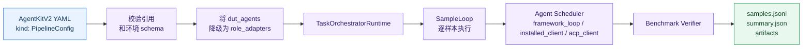

# AgentKitV2 评测指南

中文 | [English](agent_evaluation.md)

AgentKitV2 是 GAGE 原生的逐样本 Agent 评测路径。它把 YAML 的公开形态组织成评测作者更容易理解的几组概念：模型后端、Agent、Benchmark Kit、执行环境、DUT 绑定、任务、指标与报告。加载配置时，GAGE 会校验这些 section，降级为标准 `PipelineConfig`，再交给现有 Step 链路运行。

如果 AppWorld、SWE-bench Pro 或 Tau2 的执行过程应由 GAGE 管理，请使用本指南。如果任务生命周期由 Harbor 等外部框架管理，请改看 [External Harness 指南](external_harness_zh.md)。

> 路径说明：命令默认在 `gage-eval-main/` 仓库根目录执行。

## 0. 文档导航

- 项目首页：[`README_zh.md`](../../README_zh.md)
- 框架总览：[`framework_overview_zh.md`](framework_overview_zh.md)
- Sample 契约：[`sample_zh.md`](sample_zh.md)
- External Harness 与 Harbor：[`external_harness_zh.md`](external_harness_zh.md)
- AgentKitV2 手动 E2E 配置：[`config/custom/manual_e2e/`](../../config/custom/manual_e2e/)
- AppWorld 配置：[`config/custom/appworld/`](../../config/custom/appworld/)
- SWE-bench Pro 配置：[`config/custom/swebench_pro/`](../../config/custom/swebench_pro/)
- Tau2 配置：[`config/custom/tau2/`](../../config/custom/tau2/)

## 1. AgentKitV2 在框架中的位置

AgentKitV2 仍然是 `PipelineConfig` workflow。它的专用顶层 section 是更紧凑的配置书写面，不是另一套运行时。


```mermaid
flowchart LR
  YAML["AgentKitV2 YAML\nkind: PipelineConfig"] --> Validate["校验引用\n和环境 schema"]
  Validate --> Lower["将 dut_agents\n降级为 role_adapters"]
  Lower --> Runtime["TaskOrchestratorRuntime"]
  Runtime --> SampleLoop["SampleLoop\n逐样本执行"]
  SampleLoop --> Scheduler["Agent Scheduler\nframework_loop / installed_client / acp_client"]
  Scheduler --> Verifier["Benchmark Verifier"]
  Verifier --> Report["samples.jsonl\nsummary.json\nartifacts"]

  classDef input fill:#E8F3FF,stroke:#2F80ED,color:#143A5A;
  classDef process fill:#F4ECFF,stroke:#7B61FF,color:#2E1A67;
  classDef output fill:#E9F8EF,stroke:#27AE60,color:#174A2A;
  class YAML input;
  class Validate,Lower,Runtime,SampleLoop,Scheduler,Verifier process;
  class Report output;
```

主要实现落点：

| 模块 | 代码位置 |
| --- | --- |
| AgentKitV2 schema、校验与 lowering | `src/gage_eval/config/agentkit_v2.py` |
| 标准 `PipelineConfig` 模型 | `src/gage_eval/config/pipeline_config.py` |
| runtime binding 解析 | `src/gage_eval/agent_runtime/resolver.py` |
| framework-loop scheduler | `src/gage_eval/agent_runtime/schedulers/framework_loop.py` |
| AppWorld kit | `src/gage_eval/agent_eval_kits/appworld/` |
| SWE-bench kit | `src/gage_eval/agent_eval_kits/swebench/` |
| Tau2 kit | `src/gage_eval/agent_eval_kits/tau2/` |

## 2. 配置结构

AgentKitV2 配置使用 `kind: PipelineConfig`，常见顶层 section 如下：

| Section | 作用 |
| --- | --- |
| `backends` | 可复用模型端点，常见为 `litellm` 或 OpenAI-compatible backend。 |
| `agents` | Agent 运行策略：scheduler 类型、backend 引用、最大轮数、工具行为、prompt 设置。 |
| `benchmarks` | Benchmark kit 引用与 benchmark-specific 配置。 |
| `environments` | 运行环境定义。当前 provider 包括 `local_process`、`docker`、`e2b`。 |
| `dut_agents` | 将一个 agent 绑定到一个 environment 和一个 benchmark；加载后会变成 `dut_agent` role adapter。 |
| `tasks` | 标准 GAGE task。AgentKitV2 使用标准 `PipelineConfig` step 库中的常规 `inference` + `auto_eval` 链路，不是 v2 专有运行时扩展。 |
| `metrics` / `summary_generators` | Benchmark 指标与汇总生成器。 |

最小绑定模式：

```yaml
agents:
  - agent_id: tau2_agent
    scheduler:
      type: framework_loop
      backend_id: lmstudio_litellm
      config:
        max_turns: 200

environments:
  - env_id: tau2_local_process
    provider: local_process
    profile_id: tau2-local-process
    lifecycle: per_sample
    profile:
      asset_dir: src/gage_eval/agent_eval_kits/tau2/environment/local_process

dut_agents:
  - dut_id: tau2_dut
    agent_id: tau2_agent
    env_id: tau2_local_process
    benchmark_id: tau2_airline
```

加载后，`dut_agents[]` 会被降级为 `role_adapters[]`。公开概念仍统一为 `PipelineConfig`。

## 3. Scheduler 与环境选择

### 3.1 Scheduler 类型

| Scheduler | 适用场景 | 说明 |
| --- | --- | --- |
| `framework_loop` | 由 GAGE 管理 agent loop、工具调用、observation 与最终回答。 | 本地 LM Studio / LiteLLM 示例通常走这条路径。 |
| `installed_client` | 外部本地服务拥有 agent loop，GAGE 只交换 request/result。 | 适合 Codex-like 或应用自带 agent client。 |
| `acp_client` | ACP-compatible client 拥有 agent loop。 | 绑定模型一致，但 client contract 不同。 |

### 3.2 环境 Provider

| Provider | 常见 benchmark | 说明 |
| --- | --- | --- |
| `local_process` | Tau2 | 在宿主机启动本地 benchmark 服务或 user simulator。 |
| `docker` | SWE-bench Pro、AppWorld | 为 repo workspace、工具或 verifier 创建逐样本容器。 |
| `e2b` | SWE-bench Pro wrapper smoke | 需要 E2B 凭据和远端 sandbox 可用。 |

AgentKitV2 当前只支持 `lifecycle: per_sample`。其他 lifecycle 会在配置加载阶段以 `config.environment.lifecycle.per_task` 或 `config.environment.lifecycle.unsupported` 直接失败。

## 4. 运行 Tau2 单样本 smoke

这是最轻量的 AgentKitV2 live 检查：使用 local process 环境和 OpenAI-compatible 模型端点。

```bash
cd gage-eval-main

export LMSTUDIO_BASE_URL=http://127.0.0.1:1234/v1
export LMSTUDIO_LITELLM_MODEL=openai/qwen/qwen3.5-9b
export LMSTUDIO_API_KEY=dummy

TAU2_MAX_TURNS=2 \
TAU2_MAX_STEPS=2 \
TAU2_NUM_TRIALS=1 \
TAU2_TRIAL_REPEATS=1 \
python run.py \
  --config config/custom/manual_e2e/agentkit_v2_tau2_local_lmstudio.yaml \
  --max-samples 1 \
  --concurrency 1 \
  --cpus 2 \
  --gpus 0 \
  --run-id agentkit-v2-tau2-$(date +%Y%m%d-%H%M%S)
```

真实评测时请提高 `TAU2_MAX_TURNS` 和 `TAU2_MAX_STEPS`。上面的 smoke 值只验证配置加载、scheduler 执行、模型调用、指标与报告写盘链路。

## 5. 运行 SWE-bench Pro 单样本 smoke

如果要验证 Docker-backed AgentKitV2 执行，可以使用手动 LM Studio 配置中的一个 SWE-bench Pro 实例。

```bash
cd gage-eval-main

export LMSTUDIO_BASE_URL=http://127.0.0.1:1234/v1
export LMSTUDIO_LITELLM_MODEL=openai/qwen/qwen3.5-9b
export LMSTUDIO_API_KEY=dummy

SWEBENCH_MAX_TURNS=2 \
SWEBENCH_TRIAL_REPEATS=1 \
python run.py \
  --config config/custom/manual_e2e/agentkit_v2_swebench_pro_docker_lmstudio_smoke1_qutebrowser.yaml \
  --max-samples 1 \
  --concurrency 1 \
  --cpus 4 \
  --gpus 0 \
  --run-id agentkit-v2-swebench-$(date +%Y%m%d-%H%M%S)
```

运行注意事项：

- Docker 必须已启动。
- 首次运行所选 instance 时可能需要拉取镜像。
- 配置默认会阻断 benchmark 环境内网络。
- `SWEBENCH_MAX_TURNS=2` 只是 smoke cap，通常不足以产出有效 patch。

## 6. AppWorld 路径

AppWorld 配置位于 `config/custom/appworld/`，当前包含 demo、runtime、LM Studio、installed-client 等变体。

常见准备步骤：

```bash
cd gage-eval-main
docker build -t appworld-mcp:latest -f docker/appworld/Dockerfile docker/appworld

bash docker/appworld/export_datasets.sh \
  --image appworld-mcp:latest \
  --output ../local-datasets/appworld
```

示例运行：

```bash
python run.py \
  --config config/custom/appworld/appworld_official_jsonl.yaml \
  --run-id appworld-$(date +%Y%m%d-%H%M%S) \
  --output-dir runs
```

只有当外部 client service 已启动并且你希望它拥有 agent loop 时，才使用 installed-client 配置。

## 7. 产物与排查顺序

AgentKitV2 写出的核心产物与其他 GAGE pipeline 一致：

```text
runs/<run_id>/
  events.jsonl
  samples.jsonl
  summary.json
  samples/
    task_<task_id>/
      <sample_id>.json
```

推荐排查顺序：

1. `summary.json`：task 状态、样本数、指标和 summary generator 输出。
2. `samples.jsonl`：标准化 sample、`predict_result`、`eval_result`、agent trace。
3. `samples/task_<task_id>/...`：逐样本 cache artifact。
4. `events.jsonl`：step start/end/failure event 与 runtime health。

当 scheduler 或导入结果能提供轨迹时，Agent trace 会进入 `predict_result[0].agent_trace`。AgentKitV2 framework-loop 产出稳定的 trace step 形态；ExternalHarness 导入时会把 provider-native trace 翻译到同一类形态。

## 8. 常见问题

| 现象 | 检查项 |
| --- | --- |
| `config.legacy_key.*` | YAML 仍包含旧版顶层字段。保留 `kind: PipelineConfig`，使用当前 section。 |
| `config.reference.missing ...` | `dut_agents[]` 引用了不存在的 `agent_id`、`env_id` 或 `benchmark_id`。 |
| `scheduler.backend_id.required` | `framework_loop` agent 必须引用已声明的 backend。 |
| Docker run 在模型调用前长时间无输出 | 可能正在拉取镜像或初始化容器。检查 Docker Desktop 与容器日志。 |
| Tau2 样本完成但 reward 为 0 | 链路跑通但任务未解决。评估模型能力前请提高 turn/step budget。 |
| 缺少 `agent_trace` | 确认 scheduler 是否产出 trace；外部导入路径请检查 `external_harness_kits` 中的 provider translator。 |

## 9. AgentKitV2 与 ExternalHarness 的边界

当 GAGE 拥有逐样本 runtime 与 scheduler 时，使用 AgentKitV2。当另一个框架拥有任务生命周期，而 GAGE 只负责委托、等待、解析、导入结果时，使用 ExternalHarness。

| 需求 | 选择 |
| --- | --- |
| GAGE framework loop、GAGE environments、逐样本执行 | AgentKitV2 |
| Harbor JobConfig、Harbor task registry、Harbor trial tree | ExternalHarness |
| 原生 AppWorld / SWE-bench / Tau2 配置 | AgentKitV2 |
| 通过 Harbor 运行 Terminal-Bench 2.0 | ExternalHarness |
