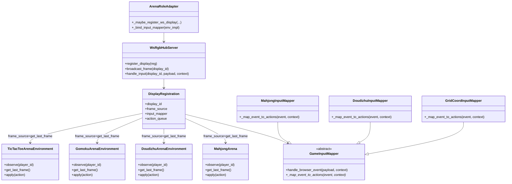

# Arena C线二期：4款老游戏接入新标准与框架（以麻将为验证）

## 1. 现状（2026-02-26）

### 1.1 基建状态
- `ws_rgb_server + GameInputMapper + replay v1` 主链路已在 `feat/arena_inf` 合入。
- `ArenaRoleAdapter` 已具备 websocket display 注册能力，但此前 `input mapper` 只绑定了 `retro`。
- `MahjongArena` 缺少 `get_last_frame()`，导致 `display_mode=websocket` 下无法注册显示源。

### 1.2 已完成的二期试点（本次）
- 新增 `MahjongInputMapper`，支持 `action/move/action_index/chat` 到 `ArenaAction` 载荷映射。
- `ArenaRoleAdapter._bind_input_mapper()` 新增 `mahjong` 分支，保留 `retro` 原逻辑。
- `MahjongArena` 增加 `get_last_frame()` 与帧缓存维护，打通 websocket display 注册前置条件。
- 增加单测覆盖：mapper、adapter 注册、mahjong frame export。
- 新增 `DoudizhuInputMapper`，并在 `ArenaRoleAdapter._bind_input_mapper()` 增加 `doudizhu` 分支。
- `DoudizhuArenaEnvironment` 增加 `get_last_frame()` 与帧缓存维护，完成 websocket display 可注册条件。
- 增加单测覆盖：doudizhu mapper、adapter 注册、doudizhu frame export。
- 新增通用 `GridCoordInputMapper`（供 Gomoku/TicTacToe 复用）。
- `GomokuArenaEnvironment` / `TicTacToeArenaEnvironment` 均增加 `get_last_frame()` 与帧缓存维护。
- `ArenaRoleAdapter._bind_input_mapper()` 新增 `gomoku/tictactoe` 分支绑定。
- 增加单测覆盖：grid mapper、gomoku/tictactoe frame export、adapter ws display 注册。

## 2. 二期目标
- 让 4 款老游戏（Mahjong / Doudizhu / Gomoku / TicTacToe）统一接入：
  - websocket 显示/输入协议
  - `GameInputMapper` 标准映射
  - replay v1 统一消费链路
- 约束：不改坏 A/B 线已合入能力，增量对齐 `feat/arena_inf`。

## 3. 怎么做（分阶段）

### Phase-2.1（已完成）麻将试点
- 路径：`MahjongInputMapper -> ArenaRoleAdapter._bind_input_mapper -> MahjongArena.get_last_frame`。
- 验证点：
  - websocket payload 能映射到 action_queue。
  - websocket display 可拉取最近帧。
  - replay 相关测试无回归。

### Phase-2.2（已完成）Doudizhu 接入
- 已新增 `DoudizhuInputMapper`（显式 action + legal_moves 校验 + pass alias）。
- 已为 `DoudizhuArenaEnvironment` 增加 `get_last_frame()` 与帧缓存刷新。
- 已完成 adapter 绑定与 ws display 注册单测覆盖。

### Phase-2.3（已完成）Gomoku/TicTacToe 接入
- 已新增 `GridCoordInputMapper`（支持 `move/coord/action` 与 `action_index`）。
- 已为 `GomokuArenaEnvironment` / `TicTacToeArenaEnvironment` 增加 `get_last_frame()`。
- 已完成 adapter 绑定与 ws display 注册单测覆盖。

### Phase-2.4（已完成）联调与发布门禁
- 回归以下测试分组：
  - input/ws: `test_input_mapping.py`, `test_ws_rgb_hub_server.py`
  - adapter: `test_arena_adapter_coverage.py`
  - replay: `test_replay_schema_writer.py`, `test_replay_server_v1.py`, `test_arena_replay_v1_output.py`, `test_sample_envelope_arena_trace.py`
- 当前状态：全量回归通过（本地本轮 `47 passed`）。
- 维持“与本期无关错误可忽略”策略（如 `mmsu` 相关）。

## 4. 涉及文件与作用

### 4.1 本次新增
- `src/gage_eval/role/arena/games/mahjong/mahjong_input_mapper.py`
  - Mahjong websocket 输入映射实现。
- `src/gage_eval/role/arena/games/doudizhu/doudizhu_input_mapper.py`
  - Doudizhu websocket 输入映射实现。
- `src/gage_eval/role/arena/games/common/grid_coord_input_mapper.py`
  - Gomoku/TicTacToe 共用坐标输入映射实现。
- `tests/unit/role/arena/test_mahjong_frame_export.py`
  - Mahjong `get_last_frame()` 导出能力单测（stub core，离线可跑）。
- `tests/unit/role/arena/test_doudizhu_frame_export.py`
  - Doudizhu `get_last_frame()` 导出能力单测（stub core，离线可跑）。
- `tests/unit/role/arena/test_gomoku_frame_export.py`
  - Gomoku `get_last_frame()` 导出能力单测。
- `tests/unit/role/arena/test_tictactoe_frame_export.py`
  - TicTacToe `get_last_frame()` 导出能力单测。
- `docs/guide/arena_c_line_phase2_legacy4_integration_guide_20260226.md`
  - 本文档。

### 4.2 本次修改
- `src/gage_eval/role/adapters/arena.py`
  - `_bind_input_mapper` 新增 `mahjong/doudizhu/gomoku/tictactoe` 绑定分支。
- `src/gage_eval/role/arena/games/mahjong/env.py`
  - 新增 `_last_frame` 缓存、`get_last_frame()`、帧构建与渲染辅助方法。
- `src/gage_eval/role/arena/games/mahjong/__init__.py`
  - 导出 `MahjongInputMapper`。
- `src/gage_eval/role/arena/games/doudizhu/env.py`
  - 新增 `_last_frame` 缓存、`get_last_frame()`、帧构建辅助方法。
- `src/gage_eval/role/arena/games/doudizhu/__init__.py`
  - 导出 `DoudizhuInputMapper`。
- `src/gage_eval/role/arena/games/gomoku/env.py`
  - 新增 `_last_frame` 缓存与 `get_last_frame()`。
- `src/gage_eval/role/arena/games/tictactoe/env.py`
  - 新增 `_last_frame` 缓存与 `get_last_frame()`。
- `src/gage_eval/role/arena/games/common/__init__.py`
  - 导出 `GridCoordInputMapper`。
- `tests/unit/role/arena/test_input_mapping.py`
  - 新增 Mahjong/Doudizhu/Grid mapper 行为测试。
- `tests/unit/role/arena/test_arena_adapter_coverage.py`
  - 新增 mahjong/doudizhu/gomoku/tictactoe adapter mapper 绑定与 websocket display 注册测试。

## 5. 类图（当前）



## 6. 问题记录

### 6.1 seq 时序歧义问题（已修复）
- 问题：`frame` 事件默认从 1 开始编号，可能与 `action` 事件冲突，影响二期严格按 `seq` 消费。
- 结论：不是文档要求，而是实现缺陷。
- 状态：已修复为全局递增 `seq`（action/frame/result 单调一致）。

## 7. C线接入指南（给后续新游戏）

1. 环境层实现 `get_last_frame()`（返回 JSON 可序列化结构）。
2. 为游戏新增 `*InputMapper`（显式 action 优先，必要时加 legal_moves 校验）。
3. 在 `ArenaRoleAdapter._bind_input_mapper()` 增加 `env_impl` 分支绑定。
4. 确保 `display_mode=websocket` 时 `frame_source` 与 `input_mapper` 均可用。
5. 补最小单测：
   - mapper 输入->输出
   - adapter display 注册
   - env frame 导出
   - replay 主链路无回归

## 8. 开发提示词（直接可用）

```text
你是 GAGE arena 二期开发工程师。请在保持 feat/arena_inf 现有行为不变的前提下，为 <GAME_IMPL> 接入 websocket + GameInputMapper + replay 统一链路：
1) 为对应 env 增加 get_last_frame()；
2) 新增 <Game>InputMapper，优先支持 payload.action/move，必要时支持 action_index；
3) 在 ArenaRoleAdapter._bind_input_mapper() 增加 <GAME_IMPL> 分支；
4) 新增/更新单测覆盖 mapper、adapter display 注册、env frame export；
5) 运行并汇报以下测试：
   - tests/unit/role/arena/test_input_mapping.py
   - tests/unit/role/arena/test_ws_rgb_hub_server.py
   - tests/unit/role/arena/test_arena_adapter_coverage.py
   - tests/unit/role/arena/test_replay_schema_writer.py
   - tests/unit/tools/test_replay_server_v1.py
若出现与本期无关错误（如 mmsu），仅在报告中注明并忽略。
```
