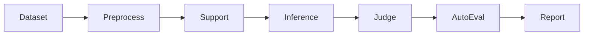

# gage-eval Benchmark Guide

This document provides execution commands and detailed descriptions for benchmark configs that exist in the current `gage-eval-main/` repository.

## Common Evaluation Chain


## Usage Overview

Run commands assume you are in the `gage-eval-main/` repository root and use the core entry point `run.py`.

* **`--config`**: Path to the YAML configuration defining the model, prompts, and dataset parameters.
* **`--output-dir`**: Where logs and results are stored.
* **`--run-id`**: Unique identifier for the specific evaluation run.

## Supported Backend Engines

The framework supports multiple inference backends to ensure flexibility across different environments. Currently supported engines include, but are not limited to:

* **vLLM**: Optimized for high-throughput serving of local models.
* **LiteLLM**: A unified interface for calling various external LLM APIs (OpenAI, Anthropic, etc.).

To switch between backends, modify the `backend_id` parameter within the `role_adapters` section of your specific benchmark YAML file:

```yaml
role_adapters:
  - adapter_id: dut_mmlu_pro_vllm_qwen
    role_type: dut_model
    backend_id: "vllm"  # Options: vllm, litellm, etc.
```
If you need a full evaluation, adjust `max_samples`/`limit`.

## Config

### BizFinBench v2
BizFinBench.v2 is the secend release of BizFinBench. It is built entirely on real-world user queries from
Chinese and U.S. equity markets. It bridges the gap between academic evaluation and actual financial operations.

**Authentic & Real-Time:** 100% derived from real financial platform queries, integrating online assessment capabilities.
**Expert-Level Difficulty:** A challenging dataset of 29,578 Q&A pairs requiring professional financial reasoning.
**Comprehensive Coverage:** Spans 4 core business scenarios, 8 fundamental tasks, and 2 online tasks.

#### Execution Command
```bash
python run.py \
  --config config/custom/biz_fin_bench_v2/bizfinbench_v2.yaml \
  --output-dir ./gage_runs/final_test \
  --run-id bizfinbench_v2
```

### MRCR v2
OpenAI MRCR (Multi-round co-reference resolution) is a long context dataset for benchmarking an LLM's ability to distinguish between multiple needles hidden in context. This eval is inspired by the MRCR eval first introduced by Gemini (https://arxiv.org/pdf/2409.12640v2). OpenAI MRCR expands the tasks's difficulty and provides opensource data for reproducing results.

#### Execution Command
```bash
python run.py \
  --config config/custom/mrcr/openai_mrcr.yaml \
  --output-dir ./gage_runs/final_test \
  --run-id mrcr
```
#### Detailed Configuration

The following table outlines the key parameters used to customize the evaluation of the model's long-context retrieval and reasoning capabilities.

| Parameter | Description | Supported Values |
| --- | --- | --- |
| **`needle_type`** | Defines the complexity of the "Needle-in-a-Haystack" test by specifying how many distinct pieces of information (needles) are hidden within the context window. | `2needle`, `4needle`, `8needle` |
| **`max_content_window`** | Specifies the maximum token length of the "haystack" (the input text) used during evaluation. This defines the limit of the model's context capacity to be tested. | *Integer (e.g., 32768, 128000)* |


### Global PIQA
Global PIQA is a participatory commonsense reasoning benchmark for over 100 languages, constructed by hand by 335 researchers from 65 countries around the world. The 116 language varieties in Global PIQA cover five continents, 14 language families, and 23 writing systems. In the non-parallel split of Global PIQA, over 50% of examples reference
local foods, customs, traditions, or other culturally-specific elements.

#### Execution Command
```bash
python run.py \
  --config config/custom/global_piqa/global_piqa_chat.yaml \
  --output-dir ./gage_runs/final_test \
  --run-id global_piqa
```

### LiveCodeBench

**LiveCodeBench** provides a "live" updating framework for the holistic evaluation of LLMs on coding tasks. By continuously integrating new problems from competitive programming platforms, it effectively mitigates data contamination.

#### Key Evaluation Dimensions:

* **Code Generation:** Writing functional code from natural language requirements.
* **Test Output Prediction:** Predicting the result of a specific code snippet and input.
* **Code Execution:** Simulating the logical flow of code to determine its behavior.

#### Execution Command

```bash
python run.py \
  --config config/custom/live_code_bench/live_code_bench_test.yaml \
  --output-dir ./gage_runs/final_test \
  --run-id live_code_bench_test
```

#### Detailed Configuration

| Parameter | Description | Supported Values |
| --- | --- | --- |
| **`scenario`** | Defines the specific evaluation task. | `codegeneration`, `codeexecution`, `testoutputprediction` |
| **`release_version`** | Specifies the dataset version to track performance over time. | `release_v1` through `release_v6` |
| **`local_dir`** | The directory path where the downloaded dataset is cached. | *Local file path* |

### GPQA-Diamond

**GPQA-Diamond** is a high-difficulty, multiple-choice Q&A dataset featuring questions authored and peer-reviewed by experts in **Biology, Physics, and Chemistry**. The benchmark is specifically designed to be "Google-proof," testing the ceiling of scientific reasoning in LLMs.

To illustrate the difficulty: experts answering questions outside their primary domain (e.g., a physicist tackling a chemistry problem) achieve only **34% accuracy**, despite having over 30 minutes and full internet access.

#### Execution Command

```bash
python run.py \
  --config config/custom/gpqa_diamond/async_chat.yaml \
  --output-dir ./gage_runs/final_test \
  --run-id gpqa_diamond

```

#### Detailed Configuration

| Parameter | Description | Supported Values |
| --- | --- | --- |
| **`gpqa_prompt_type`** | Determines the prompting strategy and context injection method used for the evaluation. | `zero_shot`, `chain_of_thought`, `self_consistency`, `5_shot`, `retrieval`, `retrieval_content` |

### MathVista
MathVista is a consolidated Mathematical reasoning benchmark within Visual contexts. It consists of three newly created datasets, IQTest, FunctionQA, and PaperQA, which address the missing visual domains and are tailored to evaluate logical reasoning on puzzle test figures, algebraic reasoning over functional plots, and scientific reasoning with academic paper figures, respectively. It also incorporates 9 MathQA datasets and 19 VQA datasets from the literature, which significantly enrich the diversity and complexity of visual perception and mathematical reasoning challenges within our benchmark. In total, MathVista includes 6,141 examples collected from 31 different datasets.

#### Execution Command

```bash
python run.py \
  --config config/custom/mathvista/chat.yaml \
  --output-dir ./gage_runs/final_test \
  --run-id mathvista_chat

```

#### Detailed Configuration

| Parameter | Description | Supported Values |
| --- | --- | --- |
| **`use_caption`** | Determines whether to provide textual descriptions of the images to the model. | `true`, `false` |
| **`use_ocr`** | Enables or disables the inclusion of extracted Optical Character Recognition (OCR) text from the figures. | `true`, `false` |
| **`shot_num`** | The number of few-shot examples included in the prompt context. | *Integer (e.g., 0, 3, 5)* |
| **`shot_type`** | Defines the reasoning format for few-shot examples. | `'solution'` (Natural Language), `'code'` (Program-of-Thought) |


### AMO-Bench
AMO-Bench, an Advanced Mathematical reasoning benchmark with Olympiad level or even higher difficulty, comprising 50 human-crafted problems. Existing benchmarks have widely leveraged high school math competitions for evaluating mathematical reasoning capabilities of large language models (LLMs). However, many existing math competitions are becoming less effective for assessing top-tier LLMs due to performance saturation (e.g., AIME24/25). To address this, AMO-Bench introduces more rigorous challenges by ensuring all 50 problems are (1) cross-validated by experts to meet at least the International Mathematical Olympiad (IMO) difficulty standards, and (2) entirely original problems to prevent potential performance leakages from data memorization. Moreover, each problem in AMO-Bench requires only a final answer rather than a proof, enabling automatic and robust grading for evaluation.

AMO-Bench uses different evaluation methods based on answer_type:
- **description**: Uses LLM judge for semantic comparison
- **number/set**: Uses math_verify parser for mathematical equivalence
- **variable**: Uses try_list with sympy solver for function verification

#### Execution Command
```bash
python GAGE/run.py \
  --config GAGE/config/custom/amo-bench/amo.yaml \
  --output-dir ./gage_runs/final_test \
  --run-id amo_bench
```

### HMMT (Harvard-MIT Mathematics Tournament)
This dataset contains the questions from HMMT February 2025 used for the MathArena Leaderboard. HMMT is a prestigious mathematics competition organized by Harvard and MIT students, featuring challenging problems that test advanced mathematical reasoning and problem-solving skills.

#### Execution Command
```bash
python GAGE/run.py \
  --config GAGE/config/custom/hmmt/feb_2025.yaml \
  --output-dir ./gage_runs/final_test \
  --run-id hmmt
```

### BeyondAIME
BeyondAIME is a curated test set designed to benchmark advanced mathematical reasoning. Its creation was guided by the following core principles to ensure a fair and challenging evaluation:

* **High Difficulty**: Problems are sourced from high-school and university mathematics competitions, with a difficulty level greater than or equal to that of AIME Problems #11-15.
* **Contamination-Resistant**: Every problem has been manually revised to be unique, ensuring it will not be found in standard pre-training corpora and providing a true test of a model's reasoning abilities.
* **Focus on Reasoning, Not Knowledge**: The dataset exclusively tests reasoning by ensuring that problems do not require mathematical knowledge beyond the standard university level.
* **Robust Problem Design**: The dataset avoids "pseudo-proof" problems. For problems requiring proof-like steps, they have been reformulated so that guessing the answer is as difficult as formally solving the problem.
* **Automated & Accurate Evaluation**: Each problem's answer is a positive integer, allowing for an unambiguous and 100% accurate automated verification of model performance.

#### Execution Command
```bash
python GAGE/run.py \
  --config GAGE/config/custom/beyond_aime/beyond_aime_chat.yaml \
  --output-dir ./gage_runs/final_test \
  --run-id beyond_aime
```
### AIME 2024
This dataset contains problems from the American Invitational Mathematics Examination (AIME) 2024. AIME is a prestigious high school mathematics competition known for its challenging mathematical problems.

#### Execution Command
```bash
python run.py \
  --config config/custom/aime24/aime2024_chat.yaml \
  --output-dir ./gage_runs/final_test \
  --run-id aime2024
```

### AIME 2025
American Invitational Mathematics Examination (AIME) 2025

#### Execution Command
```bash
python run.py \
  --config config/custom/aime25/aime2025_chat.yaml \
  --output-dir ./gage_runs/final_test \
  --run-id aime2025
```

### MMLU-Pro
MMLU-Pro dataset is a more robust and challenging massive multi-task understanding dataset tailored to more rigorously benchmark large language models' capabilities. This dataset contains 12K complex questions across various disciplines.

#### Execution Command

```bash
python run.py \
  --config config/custom/mmlu_pro/mmlu_pro_chat.yaml \
  --output-dir ./gage_runs/final_test \
  --run-id mmlu_pro_chat

```

#### Detailed Configuration

| Parameter | Description | Supported Values |
| --- | --- | --- |
| **`n_few_shot`** | Specifies the number of in-context examples provided to the model before the target question to guide its response format and reasoning. | *Integer (e.g., 0, 5)* |

### HLE
Humanity's Last Exam (HLE) is a multi-modal benchmark at the frontier of human knowledge, designed to be the final closed-ended academic benchmark of its kind with broad subject coverage. Humanity's Last Exam consists of 2,500 questions across dozens of subjects, including mathematics, humanities, and the natural sciences. HLE is developed globally by subject-matter experts and consists of multiple-choice and short-answer questions suitable for automated grading.

#### Execution Command
```bash
python run.py \
  --config config/custom/hle/hle_chat.yaml \
  --output-dir ./gage_runs/final_test \
  --run-id hle
```

### MATH500
This dataset contains a subset of 500 problems from the MATH benchmark that OpenAI created in their Let's Verify Step by Step paper.
#### Execution Command
```bash
python run.py \
  --config config/custom/math500/chat.yaml \
  --output-dir ./gage_runs/final_test \
  --run-id math500
```

### MME
MME is a comprehensive evaluation benchmark for Multimodal Large Language Models (MLLMs).
#### Execution Command
```bash
python run.py \
  --config config/custom/mme/chat.yaml \
  --output-dir ./gage_runs/final_test \
  --run-id mme
```


### MMAU-Pro

MMAU-Pro is a comprehensive benchmark designed to evaluate **audio intelligence in multimodal models**.
It covers speech, environmental sounds, music and their combinations, spanning **49 distinct perceptual and reasoning skills** such as acoustic source characterization, acoustic scene reasoning, temporal and quantitative reasoning, and procedural reasoning ([dataset card](https://huggingface.co/datasets/gamma-lab-umd/MMAU-Pro)).

The dataset contains **5,305 expert-annotated audio–question–answer triplets**, with audio clips collected from diverse real-world scenarios (including long-form and multi-audio cases).

#### 1. Pre-Execution

Before running the evaluation, prepare a local JSONL version of the test split and the corresponding audio files.
Each JSONL record should follow the same field schema as the Hugging Face dataset (e.g. `id`, `audio_path`, `question`, `answer`, `choices`, `length_type`, `perceptual_skills`, `reasoning_skills`, `category`, `transcription`, etc.).

#### 2. Execution Command

Use the following command to initiate the benchmark process:

```bash
python run.py \
  --config config/custom/mmau_pro/mmau_pro_audio.yaml \
  --output-dir ./gage_runs_mmau_pro/final_test \
  --run-id mmau_pro
```

#### 3. Detailed Configuration

| Parameter | Description | Supported Values |
| --- | --- | --- |
| **`path`** | Path to the local MMAU-Pro JSONL file (schema aligned with `gamma-lab-umd/MMAU-Pro`). | *Valid JSONL file path* |
| **`audio_path_root`** | Root directory where the referenced audio files (e.g. `data/*.wav`) are stored. | *Valid directory path* |
| **`audio_index`** | Index of the audio segment to be used when multiple audio paths are provided per sample. | *Non-negative integer (default `0`)* |
| **`model_path` / `tokenizer_path`** | Local path to the audio-capable model and tokenizer (e.g. Qwen2-Audio family) used by the vLLM backend. | *Model directory containing `config.json` and tokenizer files* |


### ARC-AGI-2
ARC-AGI-2 contains 1,000 public training tasks and 120 public evaluation tasks.

#### Execution Command
```bash
python run.py \
  --config config/custom/arcagi2/arcagi2_vllm_async_chat.yaml \
  --output-dir ./gage_runs/final_test \
  --run-id mme
```

### CharXiv
CharXiv: Charting Gaps in Realistic Chart Understanding in Multimodal LLMs, which is a diverse and challenging chart understanding benchmark fully curated by human experts. It includes 2,323 high-resolution charts manually sourced from arXiv preprints. Each chart is paired with 4 descriptive questions (3 answerable and 1 unanswerable) and 1 reasoning question, all of which require open-vocabulary short answers that are easily verifiable.

#### Execution Command
```bash
python run.py \
  --config config/custom/charxiv/charxiv_vllm_async_chat.yaml \
  --output-dir ./gage_runs_charxiv_reasoning/final_test \
  --run-id charxiv_reasoning
```

### ScreenSpot-Pro
ScreenSpot-Pro is an advanced benchmark specifically designed to evaluate GUI Grounding (Graphical User Interface) capabilities for large multimodal models in professional, high-resolution environments. Unlike general UI benchmarks, it focuses on the precision required for autonomous computer use in complex software ecosystems.

#### Execution Command
```bash
python run.py \
  --config config/custom/screen_spot/screenspot_pro_vllm_async_chat.yaml \
  --output-dir ./gage_runs_screenspot_pro/final_test \
  --run-id screenspot_pro
```

### SimpleQA Verified
A 1,000-prompt factuality benchmark from Google DeepMind and Google Research, designed to reliably evaluate LLM parametric knowledge.

#### Execution Command
```bash
python run.py \
  --config config/custom/simpleqa_verified/simpleqa_verified_vllm_async_chat.yaml \
  --output-dir ./gage_simpleqa-verified/simpleqa-verified \
  --run-id simpleqa-verified
```


### MMSU
MMSU, a comprehensive benchmark designed specifically for understanding and reasoning in spoken language. MMSU comprises 5,000 meticulously curated audio-question-answer triplets across 47 distinct tasks. To ground our benchmark in linguistic theory, we systematically incorporate a wide range of linguistic phenomena, including phonetics, prosody, syntax, syntactics, semantics, and paralinguistics.

#### Pre-Execution

Before running the evaluation, download the dataset from Hugging Face:

> **[MMSU Dataset on Hugging Face](https://huggingface.co/datasets/ddwang2000/MMSU)**

#### Execution Command

Use the following command to initiate the benchmark process:

```bash
python run.py \
  --config config/custom/mmsu/mmsu_audio.yaml \
  --output-dir ./gage_runs/final_test \
  --run-id mmsu

```

####  Detailed Configuration
| Parameter | Description | Supported Values |
| --- | --- | --- |
| **`audio_path_root`** | The root directory where the downloaded MMSU data is stored. | *Valid System Path* |


### Inverse IFEval
is a novel benchmark designed to evaluate large language models' (LLMs) ability to follow counterintuitive instructions that deliberately deviate from conventional training paradigms. The dataset challenges models to override their ingrained training conventions and faithfully execute instructions that conflict with standard cognitive patterns or annotation norms.

#### Execution Command

Use the following command to initiate the benchmark process:

```bash
python GAGE/run.py \
  --config GAGE/config/custom/inverse_ifeval/inverse_ifeval_qwen_omni_suite.yaml \
  --output-dir ./gage_runs/final_test \
  --run-id inverse_ifeval
```
