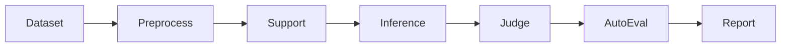

# GAGE LLM Evaluation Framework: Benchmark Guide
This document provides execution commands and detailed descriptions for the supported benchmarks in the `GAGE` framework.

## Common Evaluation Chain


## Usage Overview

All benchmarks are executed via the core entry point `GAGE/run.py`.

* **`--config`**: Path to the YAML configuration defining the model, prompts, and dataset parameters.
* **`--output-dir`**: Where logs and results are stored.
* **`--run-id`**: Unique identifier for the specific evaluation run.

## Supported Backend Engines

The framework supports multiple inference backends to ensure flexibility across different environments. Currently supported engines include, but are not limited to:

* **vLLM**: Optimized for high-throughput serving of local models.
* **LiteLLM**: A unified interface for calling various external LLM APIs (OpenAI, Anthropic, etc.).

To switch between backends, modify the `backend_id` parameter within the `role_adapters` section of your specific benchmark YAML file:

```yaml
role_adapters:
  - adapter_id: dut_mmlu_pro_vllm_qwen
    role_type: dut_model
    backend_id: "vllm"  # Options: vllm, litellm, etc.
```
If you need a full evaluation, adjust `max_samples`/`limit`.

## Config

### BizFinBench v2
BizFinBench.v2 is the secend release of BizFinBench. It is built entirely on real-world user queries from 
Chinese and U.S. equity markets. It bridges the gap between academic evaluation and actual financial operations.

**Authentic & Real-Time:** 100% derived from real financial platform queries, integrating online assessment capabilities.
**Expert-Level Difficulty:** A challenging dataset of 29,578 Q&A pairs requiring professional financial reasoning.
**Comprehensive Coverage:** Spans 4 core business scenarios, 8 fundamental tasks, and 2 online tasks.

#### Execution Command
```bash
python GAGE/run.py \
  --config GAGE/config/custom/biz_fin_bench_v2/bizfinbench_v2.yaml \
  --output-dir ./gage_runs/final_test \
  --run-id bizfinbench_v2
```

### MRCR v2
OpenAI MRCR (Multi-round co-reference resolution) is a long context dataset for benchmarking an LLM's ability to distinguish between multiple needles hidden in context. This eval is inspired by the MRCR eval first introduced by Gemini (https://arxiv.org/pdf/2409.12640v2). OpenAI MRCR expands the tasks's difficulty and provides opensource data for reproducing results.

#### Execution Command
```bash
python GAGE/run.py \
  --config GAGE/config/custom/mrcr/openai_mrcr.yaml \
  --output-dir ./gage_runs/final_test \
  --run-id mrcr
```
#### Detailed Configuration

The following table outlines the key parameters used to customize the evaluation of the model's long-context retrieval and reasoning capabilities.

| Parameter | Description | Supported Values |
| --- | --- | --- |
| **`needle_type`** | Defines the complexity of the "Needle-in-a-Haystack" test by specifying how many distinct pieces of information (needles) are hidden within the context window. | `2needle`, `4needle`, `8needle` |
| **`max_content_window`** | Specifies the maximum token length of the "haystack" (the input text) used during evaluation. This defines the limit of the model's context capacity to be tested. | *Integer (e.g., 32768, 128000)* |


### Global PIQA
Global PIQA is a participatory commonsense reasoning benchmark for over 100 languages, constructed by hand by 335 researchers from 65 countries around the world. The 116 language varieties in Global PIQA cover five continents, 14 language families, and 23 writing systems. In the non-parallel split of Global PIQA, over 50% of examples reference
local foods, customs, traditions, or other culturally-specific elements.

#### Execution Command
```bash
python GAGE/run.py \
  --config GAGE/config/custom/global_piqa/global_piqa_chat.yaml \
  --output-dir ./gage_runs/final_test \
  --run-id global_piqa
```  

### LiveCodeBench

**LiveCodeBench** provides a "live" updating framework for the holistic evaluation of LLMs on coding tasks. By continuously integrating new problems from competitive programming platforms, it effectively mitigates data contamination. 

#### Key Evaluation Dimensions:

* **Code Generation:** Writing functional code from natural language requirements.
* **Test Output Prediction:** Predicting the result of a specific code snippet and input.
* **Code Execution:** Simulating the logical flow of code to determine its behavior.

#### Execution Command

```bash
python GAGE/run.py \
  --config GAGE/config/custom/live_code_bench/live_code_bench_test.yaml \
  --output-dir ./gage_runs/final_test \
  --run-id live_code_bench_test
```

#### Detailed Configuration

| Parameter | Description | Supported Values |
| --- | --- | --- |
| **`scenario`** | Defines the specific evaluation task. | `codegeneration`, `codeexecution`, `testoutputprediction` |
| **`release_version`** | Specifies the dataset version to track performance over time. | `release_v1` through `release_v6` |
| **`local_dir`** | The directory path where the downloaded dataset is cached. | *Local file path* |

### GPQA-Diamond

**GPQA-Diamond** is a high-difficulty, multiple-choice Q&A dataset featuring questions authored and peer-reviewed by experts in **Biology, Physics, and Chemistry**. The benchmark is specifically designed to be "Google-proof," testing the ceiling of scientific reasoning in LLMs.

To illustrate the difficulty: experts answering questions outside their primary domain (e.g., a physicist tackling a chemistry problem) achieve only **34% accuracy**, despite having over 30 minutes and full internet access.

#### Execution Command

```bash
python GAGE/run.py \
  --config GAGE/config/custom/gpqa_diamond/async_chat.yaml \
  --output-dir ./gage_runs/final_test \
  --run-id gpqa_diamond

```

#### Detailed Configuration

| Parameter | Description | Supported Values |
| --- | --- | --- |
| **`gpqa_prompt_type`** | Determines the prompting strategy and context injection method used for the evaluation. | `zero_shot`, `chain_of_thought`, `self_consistency`, `5_shot`, `retrieval`, `retrieval_content` |

### MathVista
MathVista is a consolidated Mathematical reasoning benchmark within Visual contexts. It consists of three newly created datasets, IQTest, FunctionQA, and PaperQA, which address the missing visual domains and are tailored to evaluate logical reasoning on puzzle test figures, algebraic reasoning over functional plots, and scientific reasoning with academic paper figures, respectively. It also incorporates 9 MathQA datasets and 19 VQA datasets from the literature, which significantly enrich the diversity and complexity of visual perception and mathematical reasoning challenges within our benchmark. In total, MathVista includes 6,141 examples collected from 31 different datasets.

#### Execution Command

```bash
python GAGE_dev/run.py \
  --config GAGE_dev/config/custom/mathvista/chat.yaml \
  --output-dir ./gage_runs/final_test \
  --run-id mathvista_chat

```

#### Detailed Configuration

| Parameter | Description | Supported Values |
| --- | --- | --- |
| **`use_caption`** | Determines whether to provide textual descriptions of the images to the model. | `true`, `false` |
| **`use_ocr`** | Enables or disables the inclusion of extracted Optical Character Recognition (OCR) text from the figures. | `true`, `false` |
| **`shot_num`** | The number of few-shot examples included in the prompt context. | *Integer (e.g., 0, 3, 5)* |
| **`shot_type`** | Defines the reasoning format for few-shot examples. | `'solution'` (Natural Language), `'code'` (Program-of-Thought) |


### AIME 2024
This dataset contains problems from the American Invitational Mathematics Examination (AIME) 2024. AIME is a prestigious high school mathematics competition known for its challenging mathematical problems.

#### Execution Command
```bash
python GAGE/run.py \
  --config GAGE/config/custom/aime24/aime2024_chat.yaml \
  --output-dir ./gage_runs/final_test \
  --run-id aime2024
```

### AIME 2025
American Invitational Mathematics Examination (AIME) 2025

#### Execution Command
```bash
python GAGE/run.py \
  --config GAGE/config/custom/aime25/aime2025_chat.yaml \
  --output-dir ./gage_runs/final_test \
  --run-id aime2025
```

### MMLU-Pro
MMLU-Pro dataset is a more robust and challenging massive multi-task understanding dataset tailored to more rigorously benchmark large language models' capabilities. This dataset contains 12K complex questions across various disciplines.

#### Execution Command

```bash
python GAGE/run.py \
  --config GAGE/config/custom/mmlu_pro/mmlu_pro_chat.yaml \
  --output-dir ./gage_runs/final_test \
  --run-id mmlu_pro_chat

```

#### Detailed Configuration

| Parameter | Description | Supported Values |
| --- | --- | --- |
| **`n_few_shot`** | Specifies the number of in-context examples provided to the model before the target question to guide its response format and reasoning. | *Integer (e.g., 0, 5)* |

### HLE
Humanity's Last Exam (HLE) is a multi-modal benchmark at the frontier of human knowledge, designed to be the final closed-ended academic benchmark of its kind with broad subject coverage. Humanity's Last Exam consists of 2,500 questions across dozens of subjects, including mathematics, humanities, and the natural sciences. HLE is developed globally by subject-matter experts and consists of multiple-choice and short-answer questions suitable for automated grading.

#### Execution Command
```bash
python GAGE/run.py \
  --config GAGE/config/custom/hle/hle_chat.yaml \
  --output-dir ./gage_runs/final_test \
  --run-id hle
```

### MATH500
This dataset contains a subset of 500 problems from the MATH benchmark that OpenAI created in their Let's Verify Step by Step paper.
#### Execution Command
```bash
python GAGE/run.py \
  --config GAGE/config/custom/math500/chat.yaml \
  --output-dir ./gage_runs/final_test \
  --run-id math500
```

### MME
MME is a comprehensive evaluation benchmark for Multimodal Large Language Models (MLLMs).
#### Execution Command
```bash
python GAGE/run.py \
  --config GAGE/config/custom/mme/chat.yaml \
  --output-dir ./gage_runs/final_test \
  --run-id mme
```