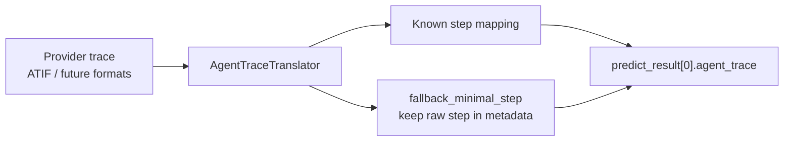

# External Harness Guide (Harbor)

English | [中文](external_harness_zh.md)

External Harness is the GAGE path for task-batch frameworks that own their own job lifecycle. Instead of running one GAGE `SampleLoop` item at a time, GAGE delegates a full task batch to an external harness, waits for its job result, parses provider-native artifacts, and imports the evidence back into normal GAGE samples, metrics, reports, and raw artifacts.

The current implementation provides a Harbor provider under `external_harness_kits/harbor`.

> Path note: commands assume you are in the `gage-eval-main/` repository root.

## 0. Document Map

- Project overview: [`README.md`](../../README.md)
- AgentKitV2 native agent runs: [`agent_evaluation.md`](agent_evaluation.md)
- Harbor Terminal-Bench 2.0 config: [`config/custom/external_harness_kits/harbor_terminal_bench2_lmstudio_1case.yaml`](../../config/custom/external_harness_kits/harbor_terminal_bench2_lmstudio_1case.yaml)
- Harbor SWE-bench Pro config: [`config/custom/external_harness_kits/harbor_swebench_pro_lmstudio_1case.yaml`](../../config/custom/external_harness_kits/harbor_swebench_pro_lmstudio_1case.yaml)
- One-case test data: [`tests/data/external_harness_kits/`](../../tests/data/external_harness_kits/)

## 1. When to Use External Harness

Use External Harness when the benchmark framework already has its own task registry, launcher, trial execution model, and verifier layout.

| Need | Use |
| --- | --- |
| GAGE owns the per-sample agent loop | AgentKitV2 |
| Harbor owns task selection, job config, trials, verifier, and result tree | External Harness |
| You need normal GAGE `samples.jsonl` and `summary.json` from an external job | External Harness |
| You only need a static model/dataset evaluation | Standard `PipelineConfig` sample loop |

Current Harbor-backed examples:

| Config | Benchmark | Agent | Dataset source |
| --- | --- | --- | --- |
| `harbor_terminal_bench2_lmstudio_1case.yaml` | Terminal-Bench 2.0 | Harbor `base_agent` / Terminus-2 | Local task directory |
| `harbor_swebench_pro_lmstudio_1case.yaml` | SWE-bench Pro | Harbor `installed_client` / SWE-agent | Harbor registry mirror |

## 2. Runtime Flow

```mermaid
flowchart LR
  Config["PipelineConfig\nexecution_mode: task_batch_harness"] --> Runtime["TaskBatchRuntimeEntry"]
  Runtime --> RunStep["harbor_run step"]
  RunStep --> Adapter["HarborAdapter.translate"]
  Adapter --> JobConfig["Harbor JobConfig\nharbor_job.json"]
  JobConfig --> Launcher["Harbor launcher subprocess"]
  Launcher --> JobTree["Harbor job/trial tree"]
  JobTree --> ResultStep["harbor_result step"]
  ResultStep --> Parser["parse_harbor_results"]
  Parser --> Writer["SampleArtifactWriter"]
  Writer --> Outputs["samples.jsonl\nsummary.json\nexternal_harness/ manifest\nsample artifacts"]

  classDef input fill:#E8F3FF,stroke:#2F80ED,color:#143A5A;
  classDef process fill:#F4ECFF,stroke:#7B61FF,color:#2E1A67;
  classDef output fill:#E9F8EF,stroke:#27AE60,color:#174A2A;
  class Config input;
  class Runtime,RunStep,Adapter,JobConfig,Launcher,JobTree,ResultStep,Parser,Writer process;
  class Outputs output;
```



Important implementation points:

| Area | Code |
| --- | --- |
| Task-batch SPI | `src/gage_eval/external_harness_kits/base.py` |
| Task-batch runtime entry | `src/gage_eval/evaluation/task_batch_runtime.py` |
| Harbor adapter | `src/gage_eval/role/adapters/harbor.py` |
| Harbor run/result steps | `src/gage_eval/pipeline/steps/harbor.py` |
| Harbor launcher subprocess | `src/gage_eval/external_harness_kits/harbor/launcher.py` |
| Harbor result parser | `src/gage_eval/external_harness_kits/harbor/results.py` |
| Trace translation SPI | `src/gage_eval/external_harness_kits/trace_translation.py` |
| Harbor ATIF translator | `src/gage_eval/external_harness_kits/harbor/trace_translation.py` |
| Imported sample artifact writer | `src/gage_eval/pipeline/sample_artifact_writer.py` |

## 3. Config Contract

External Harness uses the same `PipelineConfig` root, with one task using `execution_mode: task_batch_harness`.

```yaml
tasks:
  - task_id: tb2_one_case
    dataset_id: tb2_one_case
    execution_mode: task_batch_harness
    max_samples: 1
    concurrency: 1
    steps:
      - step: harbor_run
        adapter_id: harbor_tb2
      - step: harbor_result
        adapter_id: harbor_tb2
```

The adapter is a role adapter, but it is not a per-sample `dut_agent`. It implements `TaskBatchHarnessAdapter`.

```yaml
role_adapters:
  - adapter_id: harbor_tb2
    role_type: external_harness
    class_path: gage_eval.role.adapters.harbor:HarborAdapter
    backend_id: lmstudio_qwen
    env_id: tb2_docker
    capabilities:
      - task_batch_harness
```

The environment and backend are first-class PipelineConfig sections. `HarborAdapter` translates them into Harbor environment and agent config.

## 4. Run Terminal-Bench 2.0 Through Harbor

This config uses a local one-case Terminal-Bench task directory and a pre-pulled Docker image.

Prerequisites:

```bash
cd gage-eval-main
python -c "from harbor.job import Job; print(Job)"
docker image inspect alexgshaw/gpt2-codegolf:20251031
curl -fsS http://127.0.0.1:1234/v1/models >/dev/null
```

Run:

```bash
cd gage-eval-main

export LMSTUDIO_BASE_URL=http://127.0.0.1:1234/v1
export LMSTUDIO_LITELLM_MODEL=lm_studio/qwen/qwen3.5-9b
export LMSTUDIO_API_KEY=EMPTY

HARBOR_TB2_MAX_TURNS=2 \
python run.py \
  --config config/custom/external_harness_kits/harbor_terminal_bench2_lmstudio_1case.yaml \
  --run-id harbor-tb2-$(date +%Y%m%d-%H%M%S) \
  --cpus 2 \
  --gpus 0
```

For a manual quality run, remove the smoke cap or set `HARBOR_TB2_MAX_TURNS=200`.

## 5. Run SWE-bench Pro Through Harbor

This config uses Harbor's `swebenchpro@1.0` registry path and one pinned Ansible task. The agent is Harbor's installed SWE-agent.

Pull the task image referenced in the config before running:

```bash
# Image tag comes from the pinned task definition / registry mirror.
TASK_IMAGE="jefzda/sweap-images:ansible.ansible-ansible__ansible-11c1777d56664b1acb56b387a1ad6aeadef1391d-v0f01c69f1e2528b935359cfe578530722bca2c59"
docker pull "$TASK_IMAGE"
```

Run a short smoke:

```bash
cd gage-eval-main

export LMSTUDIO_BASE_URL=http://127.0.0.1:1234/v1
export LMSTUDIO_API_KEY=EMPTY

HARBOR_SWEBENCH_PRO_MAX_TURNS=2 \
python run.py \
  --config config/custom/external_harness_kits/harbor_swebench_pro_lmstudio_1case.yaml \
  --run-id harbor-swebench-pro-$(date +%Y%m%d-%H%M%S) \
  --cpus 2 \
  --gpus 0
```

The config passes `OPENAI_BASE_URL=http://host.docker.internal:1234/v1` into the Harbor trial container by default so SWE-agent can reach LM Studio from Docker Desktop on macOS. Override `HARBOR_TRIAL_OPENAI_BASE_URL` if your Docker networking is different.

## 6. Outputs

External Harness writes both GAGE-native outputs and provider raw artifacts.

```text
runs/<run_id>/
  events.jsonl
  samples.jsonl
  summary.json
  external_harness/
    manifest.json
    <task_id>/
      <adapter_id>/
        invocation.json
        job_config.json
        harbor_job.json
        launcher_result.json
        jobs/
          <job_name>/
            result.json
            job.log
            <trial_name>/
              result.json
  samples/
    task_<task_id>/
      <sample_id>.json
  artifacts/
    <task_id>/
      <sample_id>/
        infra/
          harbor_invocation.json
          harbor_job_result.json
        trials/
          trial_0001/
            infra/
              harbor_raw_result.json
```

The run-level manifest uses schema `gage.external_harness.raw_archive.v1`. It points to `job_config`, `launcher_result`, `jobs_dir`, and workdir artifacts under `external_harness/`.

## 7. Imported Samples and Metrics

`harbor_result` imports Harbor outputs into normal GAGE samples:

- `sample.task_type`: `external_harness.harbor`
- `sample.predict_result`: primary Harbor answer and imported trace
- `sample.eval_result`: `harbor_resolve_rate`, `harbor_score_mean`, trial pass values, verifier evidence
- `trial_results`: AgentKitV2-style trial records
- `artifact_refs`: refs to raw Harbor result and infra artifacts

The Harbor summary generator adds:

| Field | Meaning |
| --- | --- |
| `external_harness.harbor.sample_count` | Number of imported samples. |
| `trial_count` | Parsed Harbor trial count. |
| `completed` / `failed` / `aborted` / `skipped` | Trial status counts. |
| `harbor_resolve_rate` | Mean solve/pass signal projected from verifier rewards. |
| `harbor_score_mean` | Mean numeric score. |
| `external_trial_pass_hat_k.pass_hat@1` | Pass-hat projection for one-trial smoke configs. |
| `raw_artifact_paths` | GAGE artifact refs for Harbor raw evidence. |
| `failure_rollup` | Status/failure-code/failure-domain counts. |

## 8. Trace Import

ExternalHarness does not assume every provider has the same raw trace schema. The common contract is an AgentKitV2-style `agent_trace` list, plus a fallback policy.



Harbor currently uses `HarborATIFTranslator`. Unknown ATIF step shapes fall back to a minimal step and preserve the original provider step under `metadata.raw_<source_format>_step`.

## 9. Failure and Cleanup Behavior

The Harbor launcher runs in a subprocess and writes `launcher_result.json`. GAGE terminates launcher process groups on interrupt using a graceful-then-force path. `HarborAdapter.shutdown()` writes `cancelled.json` for active invocations so a partial job can be imported as aborted evidence instead of disappearing.

Common failure codes include:

| Code | Meaning |
| --- | --- |
| `harbor.launcher_failed` | Harbor launcher exited with failure before producing a valid job result. |
| `harbor.job_result_missing` | Job-level `result.json` is missing and no trial evidence can be imported. |
| `harbor.trial_exception` | Harbor reported a trial exception. |
| `harbor.verifier_result_missing` | Trial exists but verifier evidence is missing. |
| `external_harness.cancelled.subprocess_aborted` | GAGE marked an active Harbor job cancelled during shutdown. |
| `external_harness.parse.job_result_missing_partial` | Job result is missing but trial files are importable. |
| `external_harness.parse.trial_count_mismatch` | Parsed trial count differs from expected trial policy. |

## 10. Troubleshooting

| Symptom | What to check |
| --- | --- |
| Harbor import fails before launch | `python -c "from harbor.job import Job"` inside your active environment. |
| Docker image missing | Pull the image referenced in the config or task Dockerfile before live runs. |
| LM Studio reachable on host but not in container | Use `HARBOR_TRIAL_OPENAI_BASE_URL=http://host.docker.internal:1234/v1` on Docker Desktop. |
| Harbor appears silent | Enable `params.harness.launcher.live_log: true` or inspect `external_harness/<task>/<adapter>/jobs/<job>/job.log`. |
| Run returns reward 0.0 | The chain can still be valid; reward 0 means the model did not solve the task. |
| Partial artifacts after Ctrl+C | Check `cancelled.json`, `launcher_result.json`, and the Harbor job tree under `external_harness/`. |

## 11. Extension Notes

To add another provider, keep the split used by Harbor:

1. Implement `TaskBatchHarnessAdapter` with `translate`, `launch`, `poll_until_done`, and `parse_results`.
2. Place provider code under `src/gage_eval/external_harness_kits/<provider>/`.
3. Add task-level steps only when the generic `harbor_run` / `harbor_result` shape is not enough.
4. Implement an `AgentTraceTranslator` for provider-native traces.
5. Add contract tests so the provider still imports samples through `SampleArtifactWriter`.

Do not add a provider registry until there is more than one real provider that needs dynamic discovery.
