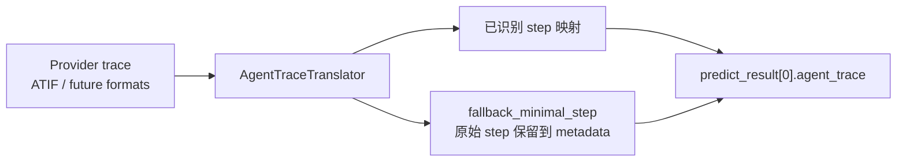

# External Harness 指南（Harbor）

中文 | [English](external_harness.md)

External Harness 是 GAGE 面向 task-batch 外部框架的运行路径。与 GAGE 逐样本执行 `SampleLoop` 不同，这条路径会把一个完整 task batch 委托给外部 harness，等待其 job result，解析 provider-native 产物，再导入为标准 GAGE samples、metrics、reports 和 raw artifacts。

当前实现的 provider 是 Harbor，代码位于 `external_harness_kits/harbor`。

> 路径说明：命令默认在 `gage-eval-main/` 仓库根目录执行。

## 0. 文档导航

- 项目首页：[`README_zh.md`](../../README_zh.md)
- AgentKitV2 原生 Agent 评测：[`agent_evaluation_zh.md`](agent_evaluation_zh.md)
- Harbor Terminal-Bench 2.0 配置：[`config/custom/external_harness_kits/harbor_terminal_bench2_lmstudio_1case.yaml`](../../config/custom/external_harness_kits/harbor_terminal_bench2_lmstudio_1case.yaml)
- Harbor SWE-bench Pro 配置：[`config/custom/external_harness_kits/harbor_swebench_pro_lmstudio_1case.yaml`](../../config/custom/external_harness_kits/harbor_swebench_pro_lmstudio_1case.yaml)
- 单样本测试数据：[`tests/data/external_harness_kits/`](../../tests/data/external_harness_kits/)

## 1. 什么时候使用 External Harness

当 benchmark 框架已经拥有自己的任务注册表、launcher、trial 执行模型和 verifier 目录结构时，使用 External Harness。

| 需求 | 选择 |
| --- | --- |
| GAGE 拥有逐样本 agent loop | AgentKitV2 |
| Harbor 拥有任务选择、JobConfig、trials、verifier 和 result tree | External Harness |
| 希望从外部 job 得到标准 GAGE `samples.jsonl` 和 `summary.json` | External Harness |
| 只是静态模型/数据集评测 | 标准 `PipelineConfig` sample loop |

当前 Harbor 示例：

| 配置 | Benchmark | Agent | 数据来源 |
| --- | --- | --- | --- |
| `harbor_terminal_bench2_lmstudio_1case.yaml` | Terminal-Bench 2.0 | Harbor `base_agent` / Terminus-2 | 本地 task 目录 |
| `harbor_swebench_pro_lmstudio_1case.yaml` | SWE-bench Pro | Harbor `installed_client` / SWE-agent | Harbor registry mirror |

## 2. 运行链路

```mermaid
flowchart LR
  Config["PipelineConfig\nexecution_mode: task_batch_harness"] --> Runtime["TaskBatchRuntimeEntry"]
  Runtime --> RunStep["harbor_run step"]
  RunStep --> Adapter["HarborAdapter.translate"]
  Adapter --> JobConfig["Harbor JobConfig\nharbor_job.json"]
  JobConfig --> Launcher["Harbor launcher subprocess"]
  Launcher --> JobTree["Harbor job/trial tree"]
  JobTree --> ResultStep["harbor_result step"]
  ResultStep --> Parser["parse_harbor_results"]
  Parser --> Writer["SampleArtifactWriter"]
  Writer --> Outputs["samples.jsonl\nsummary.json\nexternal_harness/ manifest\nsample artifacts"]

  classDef input fill:#E8F3FF,stroke:#2F80ED,color:#143A5A;
  classDef process fill:#F4ECFF,stroke:#7B61FF,color:#2E1A67;
  classDef output fill:#E9F8EF,stroke:#27AE60,color:#174A2A;
  class Config input;
  class Runtime,RunStep,Adapter,JobConfig,Launcher,JobTree,ResultStep,Parser,Writer process;
  class Outputs output;
```



主要实现落点：

| 模块 | 代码位置 |
| --- | --- |
| Task-batch SPI | `src/gage_eval/external_harness_kits/base.py` |
| Task-batch runtime entry | `src/gage_eval/evaluation/task_batch_runtime.py` |
| Harbor adapter | `src/gage_eval/role/adapters/harbor.py` |
| Harbor run/result step | `src/gage_eval/pipeline/steps/harbor.py` |
| Harbor launcher subprocess | `src/gage_eval/external_harness_kits/harbor/launcher.py` |
| Harbor result parser | `src/gage_eval/external_harness_kits/harbor/results.py` |
| Trace translation SPI | `src/gage_eval/external_harness_kits/trace_translation.py` |
| Harbor ATIF translator | `src/gage_eval/external_harness_kits/harbor/trace_translation.py` |
| 导入样本 artifact writer | `src/gage_eval/pipeline/sample_artifact_writer.py` |

## 3. 配置契约

External Harness 仍使用同一个 `PipelineConfig` 根结构，其中 task 使用 `execution_mode: task_batch_harness`。

```yaml
tasks:
  - task_id: tb2_one_case
    dataset_id: tb2_one_case
    execution_mode: task_batch_harness
    max_samples: 1
    concurrency: 1
    steps:
      - step: harbor_run
        adapter_id: harbor_tb2
      - step: harbor_result
        adapter_id: harbor_tb2
```

Adapter 仍声明在 `role_adapters` 中，但它不是逐样本 `dut_agent`，而是实现 `TaskBatchHarnessAdapter`。

```yaml
role_adapters:
  - adapter_id: harbor_tb2
    role_type: external_harness
    class_path: gage_eval.role.adapters.harbor:HarborAdapter
    backend_id: lmstudio_qwen
    env_id: tb2_docker
    capabilities:
      - task_batch_harness
```

`environments` 和 `backends` 是 `PipelineConfig` 的一级字段。`HarborAdapter` 会把它们翻译为 Harbor environment 和 agent config。

## 4. 通过 Harbor 运行 Terminal-Bench 2.0

该配置使用本地单样本 Terminal-Bench task 目录和预先拉取的 Docker 镜像。

前置检查：

```bash
cd gage-eval-main
python -c "from harbor.job import Job; print(Job)"
docker image inspect alexgshaw/gpt2-codegolf:20251031
curl -fsS http://127.0.0.1:1234/v1/models >/dev/null
```

运行：

```bash
cd gage-eval-main

export LMSTUDIO_BASE_URL=http://127.0.0.1:1234/v1
export LMSTUDIO_LITELLM_MODEL=lm_studio/qwen/qwen3.5-9b
export LMSTUDIO_API_KEY=EMPTY

HARBOR_TB2_MAX_TURNS=2 \
python run.py \
  --config config/custom/external_harness_kits/harbor_terminal_bench2_lmstudio_1case.yaml \
  --run-id harbor-tb2-$(date +%Y%m%d-%H%M%S) \
  --cpus 2 \
  --gpus 0
```

如果是手动质量评测，请移除 smoke cap，或设置 `HARBOR_TB2_MAX_TURNS=200`。

## 5. 通过 Harbor 运行 SWE-bench Pro

该配置使用 Harbor `swebenchpro@1.0` registry 路径，并固定一个 Ansible 任务。Agent 是 Harbor 内置 installed SWE-agent。

运行前拉取配置中指定任务镜像：

```bash
# 镜像 tag 来自固定 task definition / registry mirror。
TASK_IMAGE="jefzda/sweap-images:ansible.ansible-ansible__ansible-11c1777d56664b1acb56b387a1ad6aeadef1391d-v0f01c69f1e2528b935359cfe578530722bca2c59"
docker pull "$TASK_IMAGE"
```

运行短 smoke：

```bash
cd gage-eval-main

export LMSTUDIO_BASE_URL=http://127.0.0.1:1234/v1
export LMSTUDIO_API_KEY=EMPTY

HARBOR_SWEBENCH_PRO_MAX_TURNS=2 \
python run.py \
  --config config/custom/external_harness_kits/harbor_swebench_pro_lmstudio_1case.yaml \
  --run-id harbor-swebench-pro-$(date +%Y%m%d-%H%M%S) \
  --cpus 2 \
  --gpus 0
```

配置默认把 `OPENAI_BASE_URL=http://host.docker.internal:1234/v1` 传入 Harbor trial 容器，便于 Docker Desktop on macOS 中的 SWE-agent 访问 LM Studio。如果你的 Docker 网络不同，请覆盖 `HARBOR_TRIAL_OPENAI_BASE_URL`。

## 6. 产物结构

External Harness 同时写 GAGE-native 产物和 provider raw artifacts。

```text
runs/<run_id>/
  events.jsonl
  samples.jsonl
  summary.json
  external_harness/
    manifest.json
    <task_id>/
      <adapter_id>/
        invocation.json
        job_config.json
        harbor_job.json
        launcher_result.json
        jobs/
          <job_name>/
            result.json
            job.log
            <trial_name>/
              result.json
  samples/
    task_<task_id>/
      <sample_id>.json
  artifacts/
    <task_id>/
      <sample_id>/
        infra/
          harbor_invocation.json
          harbor_job_result.json
        trials/
          trial_0001/
            infra/
              harbor_raw_result.json
```

Run-level manifest 使用 schema `gage.external_harness.raw_archive.v1`。它会指向 `external_harness/` 下的 `job_config`、`launcher_result`、`jobs_dir` 和 workdir artifact。

## 7. 导入样本与指标

`harbor_result` 会把 Harbor 输出导入为普通 GAGE sample：

- `sample.task_type`: `external_harness.harbor`
- `sample.predict_result`: 主 trial 的 Harbor answer 和导入 trace
- `sample.eval_result`: `harbor_resolve_rate`、`harbor_score_mean`、trial pass values、verifier evidence
- `trial_results`: AgentKitV2-style trial records
- `artifact_refs`: Harbor raw result 和 infra artifact 的引用

Harbor summary generator 会补充：

| 字段 | 含义 |
| --- | --- |
| `external_harness.harbor.sample_count` | 导入样本数。 |
| `trial_count` | 解析到的 Harbor trial 数。 |
| `completed` / `failed` / `aborted` / `skipped` | trial 状态计数。 |
| `harbor_resolve_rate` | 从 verifier reward 投影出的平均解题/通过信号。 |
| `harbor_score_mean` | 平均数值分数。 |
| `external_trial_pass_hat_k.pass_hat@1` | 单 trial smoke 配置下的 pass-hat 投影。 |
| `raw_artifact_paths` | Harbor raw evidence 的 GAGE artifact refs。 |
| `failure_rollup` | status/failure-code/failure-domain 计数。 |

## 8. Trace 导入

ExternalHarness 不假设所有 provider 都有相同 raw trace schema。统一契约是 AgentKitV2-style `agent_trace` 列表，以及 fallback policy。



Harbor 当前使用 `HarborATIFTranslator`。无法识别的 ATIF step 会退化为 minimal step，并把原始 provider step 保存在 `metadata.raw_<source_format>_step` 中。

## 9. 失败与清理行为

Harbor launcher 运行在子进程中，并写出 `launcher_result.json`。GAGE 在中断时会按 graceful-then-force 方式终止 launcher process group。`HarborAdapter.shutdown()` 会为活跃 invocation 写 `cancelled.json`，使 partial job 可以作为 aborted evidence 被导入，而不是消失。

常见失败码：

| Code | 含义 |
| --- | --- |
| `harbor.launcher_failed` | Harbor launcher 在产出有效 job result 前失败退出。 |
| `harbor.job_result_missing` | job-level `result.json` 缺失，且没有可导入 trial evidence。 |
| `harbor.trial_exception` | Harbor 报告 trial exception。 |
| `harbor.verifier_result_missing` | trial 存在但 verifier evidence 缺失。 |
| `external_harness.cancelled.subprocess_aborted` | GAGE shutdown 时将活跃 Harbor job 标记为 cancelled。 |
| `external_harness.parse.job_result_missing_partial` | job result 缺失，但 trial 文件仍可导入。 |
| `external_harness.parse.trial_count_mismatch` | 解析到的 trial 数与 trial policy 预期不一致。 |

## 10. 常见问题

| 现象 | 检查项 |
| --- | --- |
| Harbor 在 launch 前失败 | 在当前 Python 环境执行 `python -c "from harbor.job import Job"`。 |
| Docker image missing | live 前先拉取配置或 task Dockerfile 中引用的镜像。 |
| 宿主机可访问 LM Studio，但容器内不可访问 | Docker Desktop 环境下使用 `HARBOR_TRIAL_OPENAI_BASE_URL=http://host.docker.internal:1234/v1`。 |
| Harbor 看起来没有日志 | 启用 `params.harness.launcher.live_log: true`，或查看 `external_harness/<task>/<adapter>/jobs/<job>/job.log`。 |
| reward 为 0.0 | 链路仍可能有效；0 只表示模型没有解出该任务。 |
| Ctrl+C 后存在 partial artifact | 检查 `cancelled.json`、`launcher_result.json` 和 `external_harness/` 下的 Harbor job tree。 |

## 11. 扩展新 Provider

新增 provider 时，沿用 Harbor 的分层：

1. 实现 `TaskBatchHarnessAdapter` 的 `translate`、`launch`、`poll_until_done`、`parse_results`。
2. Provider 代码放到 `src/gage_eval/external_harness_kits/<provider>/`。
3. 只有当通用 `harbor_run` / `harbor_result` 形态不够时，才新增 task-level step。
4. 为 provider-native trace 实现 `AgentTraceTranslator`。
5. 增加 contract tests，确保 provider 仍通过 `SampleArtifactWriter` 导入样本。

在出现多个真实 provider 且确实需要动态发现之前，不引入 provider registry。
