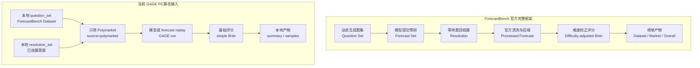
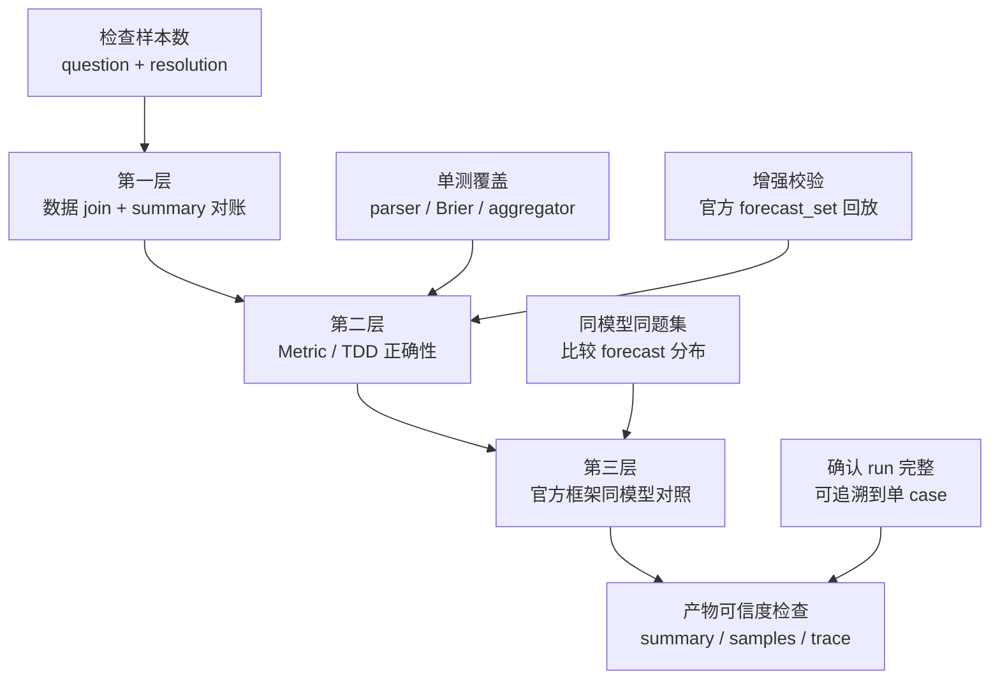
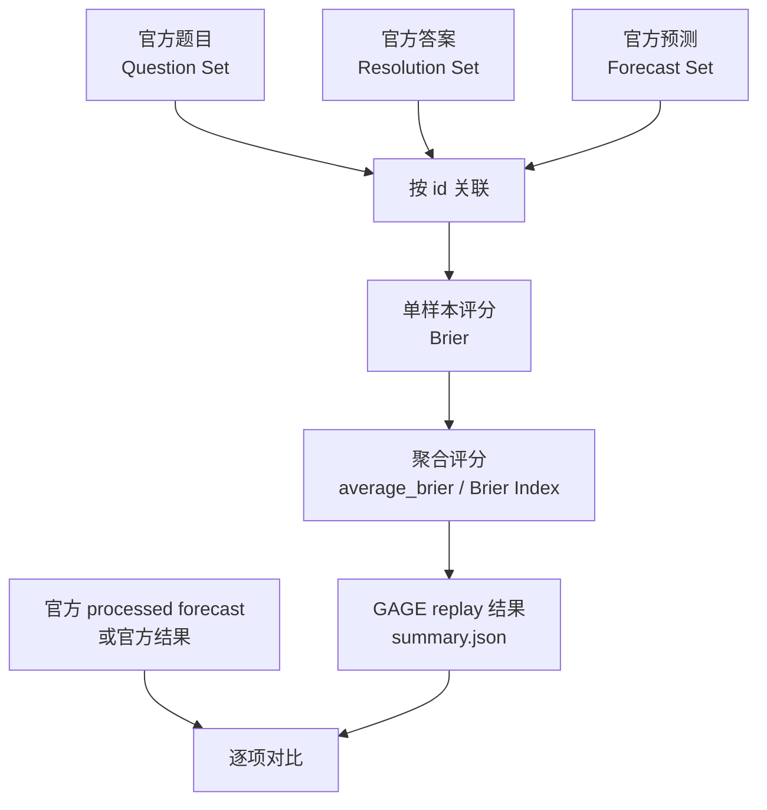
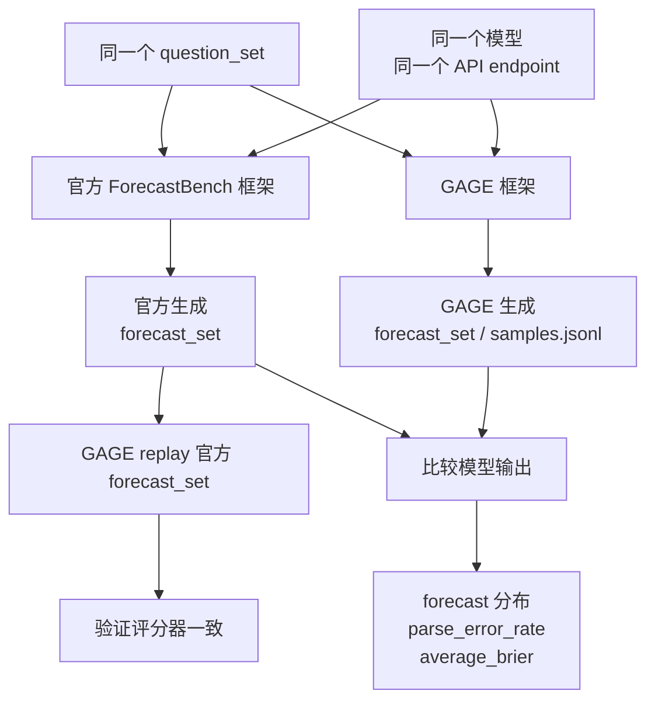

# ForecastBench 接入可信度验证方案

本文档说明如何验证 GAGE 接入 ForecastBench Polymarket 静态评测后，框架本身和评测产物是否可信。

这里要验证两件事：

- **框架可信度**：GAGE 是否正确读取 ForecastBench 数据、join 题目和答案、计算 Brier 等指标。
- **产物可信度**：一次模型评测 run 的产物是否完整、可复查、可解释。

不建议直接用「GAGE 跑出来的模型分数」和 ForecastBench 官网 leaderboard 分数硬比。官网 leaderboard 使用 difficulty-adjusted Brier、跨 dataset / market 聚合、置信区间、提交规则等完整机制；当前 GAGE P0 接的是 `source=polymarket` 且 `resolved=true` 的静态子集，口径不同。

## 官方框架和当前 GAGE 评测的区别

先明确边界：当前 GAGE 接入不是 ForecastBench 官方 leaderboard 的完整复刻，而是 ForecastBench 数据中 Polymarket 已结算题目的静态评分子集。



核心差异：

| 维度 | ForecastBench 官方框架 | 当前 GAGE P0 |
|---|---|---|
| 数据范围 | market questions + dataset questions | 只接 Polymarket 来源的已结算题目 |
| 时间形态 | 动态出题、提交、等待结算、夜间更新 | 本地静态回放已结算数据 |
| dataset questions | 支持时间序列问题和多个 horizon | 不接入 |
| market questions | 包含 Polymarket、Manifold、Metaculus 等来源 | 只筛 Polymarket |
| forecast 生成 | 官方框架调用模型，或团队提交 forecast set | GAGE 调模型，或后续 replay 官方 forecast set |
| 输出格式 | 官方 prompt 通常要求 `*0.xxx*`，可用 reformat prompt 清洗 | 当前 metric 支持 `*0.xxx*`、JSON、纯数字 |
| 缺失预测 | 官方提交规则会处理缺失预测，例如回填 `0.5` | 当前模型 run 主要处理 parse error 和 clamp，不等同官方提交规则 |
| 排名机制 | difficulty-adjusted Brier + Brier Index + CI + p-value 等 | simple Brier + simple Brier Index + 基础可观测指标 |
| 结论口径 | 可用于官方 leaderboard 排名 | 只能说明 GAGE 静态子集评测结果 |

因此，当前 GAGE 产物的正确说法是：

```text
ForecastBench Polymarket resolved static eval
```

不应该说成：

```text
ForecastBench official leaderboard reproduction
```

## 当前接入范围

当前 GAGE 的目标是只接 ForecastBench 中的 Polymarket 已结算 market questions：

```yaml
source_filter:
  - polymarket
resolved_only: true
question_type: market
```

实际实现上，loader 当前主要按 `source_filter` 和 `resolved_only` 过滤；如果某些 Polymarket 记录本身是组合题、`freeze_datetime_value=N/A`，也会进入样本集合。这会影响 market baseline 覆盖率，需要在产物分析时单独说明。

本机数据目录：

```text
E:\Developing\GAGE\.gage_cache\forecastbench-datasets
```

本机已跑产物目录：

```text
E:\fb_runs
```

当前全量 Polymarket resolved 子集为 `964` 条，分布在 17 个 `question_set` 日期切片中。正式可用 run 目录为 `E:\fb_runs\fbm-*`。其中 `fbm-2025-03-30-r2` 是临时验证目录，不计入正式总量。

## 总体验证链路



## 第一层：数据 Join 正确性

这一层验证 GAGE 是否正确读取 ForecastBench 的题目和答案。

输入文件：

```text
datasets/question_sets/<DATE>-llm.json
datasets/resolution_sets/<DATE>_resolution_set.json
```

验证规则：

```text
1. 读取 question_set 中的 questions
2. 读取 resolution_set 中的 resolutions
3. 按 id join question 和 resolution
4. 只保留 source == "polymarket"
5. 只保留 resolved == true
6. 统计每个日期切片样本数
```

验收标准：

```text
每个 question_set 的 Polymarket resolved 样本数稳定
question.id 和 resolution.id join 无异常
resolved_to 字段存在且可用于评分
freeze_datetime_value 覆盖率可解释
```

当前本机统计结果：

```text
TOTAL 964
2024-07-21 119
2025-03-02 82
2025-03-16 73
2025-03-30 72
2025-04-13 79
2025-04-27 87
2025-05-11 60
2025-05-25 59
2025-06-08 67
2025-06-22 63
2025-08-03 29
2025-08-17 43
2025-08-31 44
2025-10-26 45
2025-11-09 16
2025-11-23 14
2025-12-07 12
```

注意：`freeze_datetime_value` 不是每条样本都有。例如 `2024-07-21` 有 119 条 resolved Polymarket 样本，但只有 59 条有可用的 freeze market value。因此 `average_market_baseline_brier` 只覆盖这 59 条，不能直接代表 119 条全量市场基线。

GAGE 正式 run 结束后会生成 `summary.json`，这也是第一层数据正确性的主要产物。重点看这些字段：

```text
summary.sample_count
summary.samples_total
summary.samples_valid
summary.tasks[0].sample_count
summary.tasks[0].dataset_metadata.question_set_path
summary.tasks[0].dataset_metadata.resolution_set_path
summary.tasks[0].execution.status
summary.run.metadata.validation_summary
```

第一层的判断方式是：

```text
1. 独立脚本统计 question_set + resolution_set join 后的 Polymarket resolved 数量
2. GAGE run 生成 summary.json
3. 对比 summary.sample_count / samples_total / tasks[0].sample_count 是否一致
4. 确认 execution.status == "completed"
5. 确认 validation_summary 没有异常 drop
```

这层能证明：

```text
GAGE loader 产出的样本集合数量和过滤口径可信
```

这层还不能证明：

```text
metric 公式完全正确
模型输出可信
官方 leaderboard 口径已经复刻
```

## 第二层：评分器正确性

这一层是最关键的框架校验。

它分成两个层次：

```text
1. TDD 单元测试：验证 metric 公式、输出解析和聚合逻辑
2. 官方 forecast_set replay：验证同一份官方预测答案下，GAGE 与官方结果是否一致
```

第 1 步验证 GAGE 自己的 metric 实现没有明显公式错误。第 2 步才是和官方框架做 parity check。

官方 forecast_set replay 的目标是验证：

```text
同一个 question_set
同一个 resolution_set
同一个 forecast_set
```

GAGE 和官方框架算出来的分数是否一致。

Replay 不调用模型。它验证的是 GAGE 的 loader、join、parser、metric、aggregator 是否对齐官方口径。

### 当前已有的 TDD 覆盖

当前代码里已经有 ForecastBench 相关单元测试，但它们是 TDD 风格的合成样例，不是官方 forecast_set 回放。

已有测试覆盖：

| 测试文件 | 覆盖内容 |
|---|---|
| `tests/unit/assets/datasets/loaders/test_forecastbench_loader.py` | question / resolution 双文件读取、官方 `questions` / `resolutions` envelope、按 id join、`source_filter`、`resolved_only`、`max_samples` |
| `tests/unit/assets/metrics/test_forecastbench_metric.py` | JSON / `*0.xxx*` / 纯数字解析、Brier、abs error、0.5 阈值命中率、parse fallback、clamp、market baseline |
| `tests/unit/assets/metrics/test_forecastbench_aggregator.py` | `average_brier`、`brier_index_simple`、`average_market_baseline_brier` 的聚合逻辑 |
| `tests/unit/assets/datasets/test_forecastbench_preprocessor.py` | Prompt 和 Sample 转换逻辑 |

当前 fixture 里有：

```text
tests/fixtures/forecastbench/smoke_question_set.json
tests/fixtures/forecastbench/smoke_resolution_set.json
```

当前 fixture 里没有：

```text
官方 forecast_set
官方 processed forecast_set
```

因此，现有 TDD 能证明：

```text
metric 公式、解析逻辑、聚合逻辑在构造样例上正确
```

但还不能证明：

```text
GAGE 对官方 forecast_set 的 replay 结果与官方完全一致
```

这个缺口需要用官方公开的 `forecast sets` / `processed forecast sets` 再补一个 parity test。

### 什么是 forecast_set

`forecast_set` 可以理解成某个模型交出的预测答案。它通常包含：

```json
{
  "organization": "...",
  "model": "...",
  "question_set": "2025-03-02-llm.json",
  "forecasts": [
    {
      "id": "0x...",
      "source": "polymarket",
      "forecast": 0.42,
      "resolution_date": null
    }
  ]
}
```

官方 ForecastBench 数据页公开 `forecast sets` 和 `processed forecast sets`。这类文件最适合做评分回放校验。

### Replay 模式



Replay 模式要求：

```text
跳过 inference
直接读取 forecast_set.forecasts[*].forecast
按 id 找到 resolution.resolved_to
逐条计算 brier = (forecast - resolved_to)^2
聚合 average_brier
计算 brier_index_simple = (1 - sqrt(average_brier)) * 100
```

验收标准：

```text
sample_count 完全一致
单样本 forecast 完全一致
单样本 resolved_to 完全一致
单样本 brier 逐条一致
run 级 average_brier 误差 < 1e-6
run 级 brier_index_simple 误差 < 1e-6
```

如果这一层通过，就可以说明：

```text
GAGE 的 ForecastBench 静态评分链路可信
```

如果这一层不通过，优先排查：

```text
id join 是否错位
forecast 是否 parse 错
resolved_to 是否读反
缺失 forecast 是否按官方规则处理
聚合样本集合是否一致
```

## 第三层：官方框架同模型对照

这一层验证的是模型调用链路，而不是纯评分器。

做法是用 ForecastBench 官方框架和 GAGE 分别调用同一个模型、同一个 question_set，再比较输出差异。



需要尽量对齐的参数：

```text
官方 market prompt
输出格式 *0.xxx*
是否带 freeze value
是否启用 reformat prompt
temperature = 0
max tokens
thinking 是否关闭
模型名称和模型版本
API base URL
```

这一层不要强求逐条预测完全一致。即使 `temperature=0`，不同框架在 prompt 包装、stop 参数、reformat、token 限制、供应商实现上有细微差异，也可能导致预测不同。

合理验收标准：

```text
parse_error_rate 接近
forecast 分布大体一致
average_brier 同数量级
关键 case 差异可解释
```

如果官方框架生成的 forecast_set 被 GAGE replay 后分数一致，但 GAGE 自己调用模型生成的 forecast_set 差异较大，说明问题主要在：

```text
prompt / inference 参数 / 输出解析 / 模型服务行为
```

而不是 GAGE 的 scorer。

## Metrics 口径差异

这一节专门说明官方 metrics 和当前 GAGE metrics 的差异。它是判断产物可信度时最容易混淆的地方。

### 官方 leaderboard metrics

ForecastBench 官网 leaderboard 更接近「排行榜统计系统」，不是单纯把每条题的 Brier 平均一下。官方关注的是跨模型、跨时间、跨题集的公平比较，因此会使用难度校正和不确定性估计。

| 官方字段 / 概念 | 含义 | 当前 GAGE P0 是否实现 |
|---|---|---|
| `Dataset (N)` | dataset questions 的样本数和得分 | 不实现 |
| `Market (N)` | market questions 的样本数和得分 | 只实现 Polymarket 子集，不等同官方 market 全量 |
| `Overall (N)` | dataset 与 market 组合后的总分 | 不实现 |
| `Brier score` | 单题基础评分 `(forecast - outcome)^2` | 实现基础版本 |
| `difficulty-adjusted Brier` | 扣除题目难度影响后的 Brier | 不实现 |
| `Brier Index` | 官方 leaderboard 的 0-100 分制转换 | 只实现 simple 版本 |
| `95% CI` | 分数置信区间 | 不实现 |
| `p-value` | 与参照预测者差异的显著性检验 | 不实现 |
| `BSS` | Brier Skill Score，相对 naive baseline 的提升 | 不实现 |
| `Peer` | peer comparison 相关榜单统计 | 不实现 |
| `simulation rank probability` | 排名模拟概率 | 不实现 |
| `leaderboard rank` | 官网排名 | 不实现 |

### 当前 GAGE metrics

当前 GAGE 输出的是静态子集的基础评分和可观测指标，重点是让每条 case 可追溯、可复算。

| GAGE 字段 | 中文解释 | 计算口径 |
|---|---|---|
| `brier` | 单样本 Brier 分数 | `(forecast - resolved_to)^2` |
| `average_brier` | 平均 Brier | 对当前 run 中所有有效样本的 `brier` 求平均 |
| `brier_index_simple_case` | 单样本简化 Brier Index | `(1 - sqrt(brier)) * 100` |
| `brier_index_simple` | run 级简化 Brier Index | `(1 - sqrt(average_brier)) * 100` |
| `accuracy_at_0_5` | 0.5 阈值命中率 | `(forecast >= 0.5)` 是否等于 `(resolved_to >= 0.5)` |
| `avg_abs_error` | 平均绝对误差 | `mean(abs(forecast - resolved_to))` |
| `parse_error_rate` | 输出解析失败率 | 解析失败样本占比 |
| `clamp_rate` | 越界截断率 | 预测值被截断到 `[0, 1]` 的占比 |
| `market_baseline_brier` | 市场基线单样本 Brier | `(freeze_datetime_value - resolved_to)^2`，仅有 freeze value 时存在 |
| `average_market_baseline_brier` | 市场基线平均 Brier | 只在有 `freeze_datetime_value` 的样本上聚合 |
| `model_minus_market_brier` | 模型相对市场基线差值 | `brier - market_baseline_brier` |

需要特别注意：

```text
GAGE 的 brier_index_simple 不是 ForecastBench 官方 leaderboard 的 Brier Index 完整口径。
```

两者都可能使用 0-100 分制转换，但官方 leaderboard 会先做 difficulty adjustment，并且会合并 dataset / market 等官方口径。当前 GAGE 只是基于当前静态子集的 `average_brier` 做 simple 转换。

`average_market_baseline_brier` 也不是全量样本指标。它只覆盖有 `freeze_datetime_value` 的样本。例如 `2024-07-21` 这批有 119 条 resolved Polymarket 样本，但只有 59 条能计算 market baseline。

## 产物可信度检查

每个正式 run 至少检查这些文件：

```text
E:\fb_runs\<RUN_ID>\summary.json
E:\fb_runs\<RUN_ID>\samples.jsonl
E:\fb_runs\<RUN_ID>\samples\task_forecastbench_polymarket_static_full\*.json
```

`summary.json` 重点检查：

```text
tasks[0].execution.status == "completed"
sample_count == tasks[0].sample_count
samples_valid == samples_total
parse_error_rate 是否可接受
metrics[0].count 是否合理
market_baseline_samples 覆盖率是否解释清楚
```

`samples.jsonl` 重点检查：

```text
每条样本有 sample_id
每条样本有 model_output
每条样本有 metrics.forecastbench_probability
forecast / resolved_to / brier 可追溯
```

单样本 JSON 重点检查：

```text
sample.messages[0] 是否为实际发给模型的 prompt
model_output.answer 是否为模型原始输出
raw_response 是否保存服务商返回内容
metrics.forecastbench_probability.values 是否包含单样本评分
```

单样本指标解释：

```text
forecast: 模型预测概率
resolved_to: 最终结算结果，通常 0 或 1
brier: (forecast - resolved_to)^2
brier_index_simple_case: 单 case 简化 Brier Index
accuracy_at_0_5: 概率按 0.5 阈值转 Yes/No 后是否命中
parse_error: 输出是否解析失败
clamp_applied: 预测值是否被截断到 [0, 1]
market_baseline_brier: freeze market value 的 Brier，仅有 freeze value 时存在
model_minus_market_brier: 模型 Brier 减市场基线 Brier
```

## 当前产物的可信度边界

当前本机 `E:\fb_runs\fbm-*` 产物可以用于：

```text
验证 GAGE 能跑通 ForecastBench Polymarket resolved 子集
分析 Xiaomi Mimo 在该子集上的 simple Brier 表现
逐 case 查看 prompt、模型输出和评分
比较模型预测和 freeze market baseline 的差异
```

当前产物不能直接用于：

```text
声称复现 ForecastBench 官方 leaderboard
声称模型在完整 ForecastBench 上的官方排名
声称 difficulty-adjusted Brier / CI / p-value 已经对齐官方
```

## 推荐落地顺序

1. 固化第一层数据统计脚本，作为 loader 回归测试。
2. 用当前 TDD 测试守住 metric 基础公式、解析和聚合逻辑。
3. 实现 `forecast_set replay` 模式，跳过 inference 直接评分官方 forecast_set。
4. 用官方 processed forecast set 做 parity test，确认 scorer 误差在 `1e-6` 内。
5. 用官方框架和 GAGE 跑同一个模型、同一个 question_set，比较 forecast 分布和 parse_error_rate。
6. 再决定是否补 difficulty-adjusted leaderboard、bootstrap CI、p-value 等官方高阶指标。

## 参考链接

- ForecastBench 官网数据页：https://www.forecastbench.org/datasets/
- ForecastBench Leaderboards：https://www.forecastbench.org/leaderboards/
- ForecastBench GitHub：https://github.com/forecastingresearch/forecastbench
