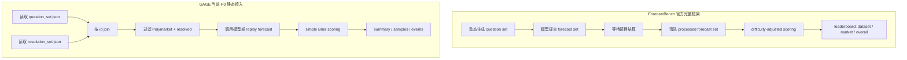
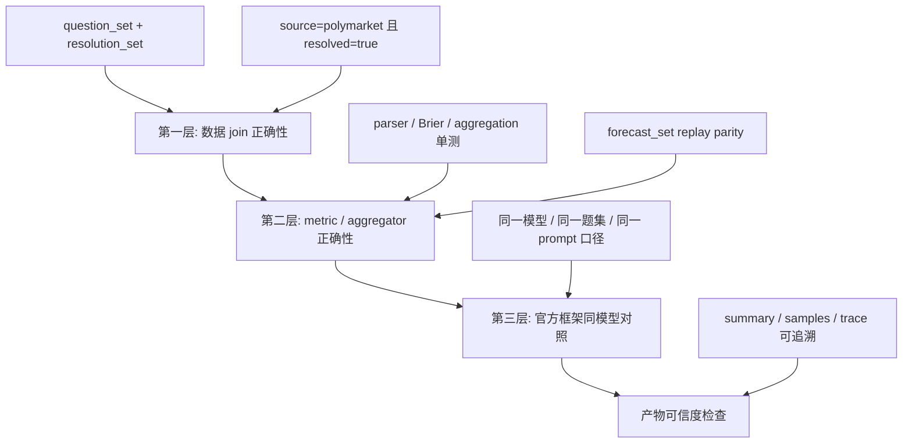
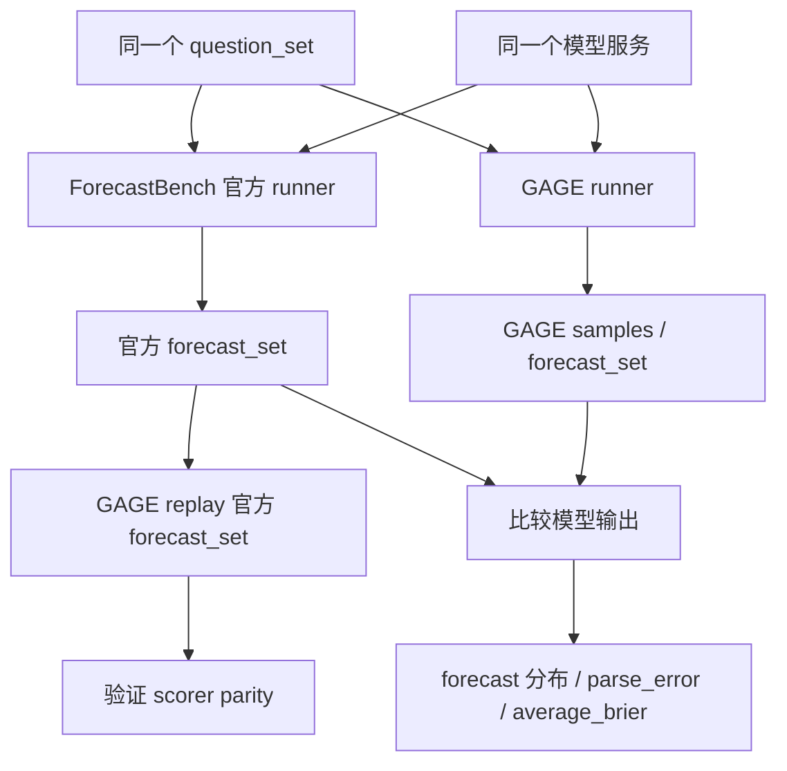

# ForecastBench 接入可信度验证方案

本文说明如何验证 GAGE 接入 ForecastBench Polymarket 静态评测后的可信度。重点不是复刻 ForecastBench 官方 leaderboard，而是确认 GAGE 的数据读取、样本过滤、模型输出解析、指标计算和产物落盘是可信的。

## 1. 先明确边界

当前 GAGE 接入的是：

```text
ForecastBench Polymarket resolved static eval
```

不是：

```text
ForecastBench official leaderboard reproduction
```

当前范围：

```yaml
source_filter:
  - polymarket
resolved_only: true
question_type: market
```

也就是说，GAGE 只评测 ForecastBench 数据中 `source=polymarket` 且已经结算的 market questions。

## 2. 官方框架与 GAGE 当前链路的区别



| 维度 | ForecastBench 官方框架 | GAGE 当前 P0 |
|---|---|---|
| 数据范围 | dataset questions + market questions | 只接 Polymarket resolved market questions |
| 时间形态 | 动态出题、提交、等待结算、夜间更新 | 本地静态回放已结算数据 |
| dataset questions | 支持时间序列和多 horizon | 不接入 |
| market questions | 多个预测平台来源 | 只筛 Polymarket |
| 模型输出 | 官方 prompt，通常要求 `*0.xxx*`，可经过 reformat prompt | 支持 `*0.xxx*`、JSON、纯数字解析 |
| 缺失预测 | 官方提交规则处理，例如回填 0.5 | 当前主要处理 parse error 和 clamp |
| 指标体系 | difficulty-adjusted Brier、CI、p-value、BSS、Peer、rank simulation | simple Brier、simple Brier Index、parse error、market baseline |
| 结论用途 | 官方 leaderboard 排名 | GAGE 静态子集评测和回归验证 |

## 3. 可信度验证分三层



## 4. 第一层：数据 join 正确性

这一层验证 GAGE 是否正确读取 ForecastBench 的题目和答案。

输入文件：

```text
<FORECASTBENCH_DATA_DIR>/datasets/question_sets/<DATE>-llm.json
<FORECASTBENCH_DATA_DIR>/datasets/resolution_sets/<DATE>_resolution_set.json
```

验证规则：

```text
1. 读取 question_set.questions
2. 读取 resolution_set.resolutions
3. 按 id join question 和 resolution
4. 只保留 source == "polymarket"
5. 只保留 resolved == true
6. 统计最终样本数
```

验收标准：

```text
每个样本都有 question.id 和 resolution.id
每个样本都有 resolved_to
每个样本满足 source == "polymarket"
每个样本满足 resolved == true
GAGE summary 中的样本数与独立统计一致
```

可以用下面脚本独立统计某个切片：

```bash
python - <<'PY'
import json
from pathlib import Path

qpath = Path("<FORECASTBENCH_QUESTION_SET_PATH>")
rpath = Path("<FORECASTBENCH_RESOLUTION_SET_PATH>")

qs = json.loads(qpath.read_text(encoding="utf-8"))["questions"]
rs = json.loads(rpath.read_text(encoding="utf-8"))["resolutions"]
res_by_id = {str(r["id"]): r for r in rs if r.get("id") is not None}

count = 0
for q in qs:
    if q.get("source") != "polymarket":
        continue
    r = res_by_id.get(str(q.get("id")))
    if isinstance(r, dict) and r.get("resolved") is True:
        count += 1

print("polymarket_resolved_count:", count)
PY
```

运行 GAGE 后，对比：

```text
runs/<run-id>/summary.json
```

重点看：

```text
sample_count
samples_total
samples_valid
tasks[*].sample_count
tasks[*].execution.status
```

这一层能证明：

```text
GAGE loader 产出的样本集合和过滤口径可信
```

这一层不能证明：

```text
metric 公式完全正确
模型输出可信
官方 leaderboard 口径已经复刻
```

## 5. 第二层：metric / aggregator 正确性

这一层验证评分器是否可信。

当前 TDD 覆盖：

| 测试文件 | 覆盖内容 |
|---|---|
| `tests/unit/assets/datasets/loaders/test_forecastbench_loader.py` | 双文件读取、官方 envelope、按 id join、source filter、resolved filter、max samples |
| `tests/unit/assets/datasets/test_forecastbench_preprocessor.py` | ForecastBench raw record 到 GAGE Sample 的转换 |
| `tests/unit/assets/metrics/test_forecastbench_metric.py` | `*0.xxx*`、JSON、纯数字解析，Brier、abs error、accuracy、clamp、market baseline |
| `tests/unit/assets/metrics/test_forecastbench_aggregator.py` | `average_brier`、`brier_index_simple`、`average_market_baseline_brier` 聚合 |

建议验证命令：

```bash
cd <GAGE_REPO>
export PYTHONPATH=src

pytest \
  tests/unit/assets/datasets/loaders/test_forecastbench_loader.py \
  tests/unit/assets/datasets/test_forecastbench_preprocessor.py \
  tests/unit/assets/metrics/test_forecastbench_metric.py \
  tests/unit/assets/metrics/test_forecastbench_aggregator.py
```

当前单测能证明：

```text
GAGE 的 parser、Brier 公式和聚合逻辑在构造样例上正确
```

但更严格的验证还需要官方 forecast set replay。

## 6. forecast_set replay parity

`forecast_set` 可以理解为某个模型对一个 question set 提交的预测答案。理想情况下，应支持一个 replay 模式：

```text
跳过 inference
直接读取 forecast_set.forecasts[*].forecast
按 id 找到 resolution.resolved_to
逐条计算 brier = (forecast - resolved_to)^2
聚合 average_brier
计算 brier_index_simple = (1 - sqrt(average_brier)) * 100
```

Replay 的目标是验证：

```text
同一个 question_set
同一个 resolution_set
同一个 forecast_set
GAGE 和官方框架算出的分数是否一致
```

验收标准建议：

```text
sample_count 完全一致
单样本 forecast 一致
单样本 resolved_to 一致
单样本 brier 逐条一致
run 级 average_brier 误差 < 1e-6
run 级 brier_index_simple 误差 < 1e-6
```

如果这一层通过，可以说明：

```text
GAGE 的 ForecastBench 静态评分链路可信
```

如果不通过，优先排查：

```text
id join 是否错位
forecast 是否 parse 错
resolved_to 是否读取错误
缺失 forecast 是否按同一规则处理
聚合样本集合是否一致
```

## 7. 第三层：官方框架同模型对照

这一层验证模型调用链路，而不是单纯验证 scorer。

做法：

```text
1. 用 ForecastBench 官方框架调用同一模型
2. 用 GAGE 调用同一模型
3. 使用同一个 question_set / resolution_set
4. 尽量对齐 prompt、temperature、max tokens、输出格式和 API endpoint
5. 比较 forecast 分布、parse_error_rate、average_brier
```

对照链路：



这一层不要求逐条 forecast 完全一致。即使 `temperature=0`，不同框架在 prompt 包装、stop 参数、token 限制、reformat prompt、供应商实现上也可能造成差异。

合理验收标准：

```text
parse_error_rate 接近
forecast 分布大体一致
average_brier 同数量级
关键 case 差异可解释
```

如果官方 forecast_set 被 GAGE replay 后分数一致，但 GAGE 自己调用模型得到的 forecast 差异很大，问题更可能在：

```text
prompt / inference 参数 / 输出解析 / 模型服务行为
```

而不是 scorer。

## 8. metrics 口径差异

### 8.1 官方 leaderboard metrics

ForecastBench 官方 leaderboard 更接近排行统计系统，不是简单平均每条题目的 Brier。

| 官方字段 / 概念 | 含义 | 当前 GAGE P0 是否实现 |
|---|---|---|
| `Dataset (N)` | dataset questions 的样本数和得分 | 不实现 |
| `Market (N)` | market questions 的样本数和得分 | 只实现 Polymarket 子集，不等于官方 market 全量 |
| `Overall (N)` | dataset 与 market 合并后的总分 | 不实现 |
| `Brier score` | 单题基础评分 `(forecast - outcome)^2` | 实现基础版本 |
| `difficulty-adjusted Brier` | 扣除题目难度影响后的 Brier | 不实现 |
| `Brier Index` | 官方 leaderboard 的 0-100 分制转换 | 只实现 simple 版本 |
| `95% CI` | 分数置信区间 | 不实现 |
| `p-value` | 与参照预测者差异的显著性检验 | 不实现 |
| `BSS` | Brier Skill Score，相对 naive baseline 的提升 | 不实现 |
| `Peer` | peer comparison 相关统计 | 不实现 |
| `simulation rank probability` | 排名模拟概率 | 不实现 |
| `leaderboard rank` | 官网排名 | 不实现 |

### 8.2 GAGE 当前 metrics

| GAGE 字段 | 中文解释 | 计算口径 |
|---|---|---|
| `brier` | 单样本 Brier 分数 | `(forecast - resolved_to)^2` |
| `average_brier` | 平均 Brier | 对当前 run 有效样本求平均 |
| `brier_index_simple_case` | 单样本简化 Brier Index | `(1 - sqrt(brier)) * 100` |
| `brier_index_simple` | run 级简化 Brier Index | `(1 - sqrt(average_brier)) * 100` |
| `accuracy_at_0_5` | 0.5 阈值命中率 | `(forecast >= 0.5)` 是否等于 `(resolved_to >= 0.5)` |
| `avg_abs_error` | 平均绝对误差 | `mean(abs(forecast - resolved_to))` |
| `parse_error_rate` | 输出解析失败率 | 解析失败样本占比 |
| `clamp_rate` | 越界截断率 | 预测值被截断到 `[0, 1]` 的占比 |
| `market_baseline_brier` | 市场基线单样本 Brier | `(freeze_datetime_value - resolved_to)^2`，仅有 freeze value 时存在 |
| `average_market_baseline_brier` | 市场基线平均 Brier | 只在有 `freeze_datetime_value` 的样本上聚合 |
| `model_minus_market_brier` | 模型相对市场基线差值 | `brier - market_baseline_brier` |

注意：

```text
GAGE 的 brier_index_simple 不等于 ForecastBench 官方 leaderboard 的 Brier Index 完整口径。
```

官方 leaderboard 会先做 difficulty adjustment，并合并 dataset / market 等官方口径；GAGE 当前只是基于静态 Polymarket 子集的 `average_brier` 做 simple 转换。

## 9. 产物可信度检查

每次正式 run 至少检查：

```text
runs/<run-id>/summary.json
runs/<run-id>/samples.jsonl
runs/<run-id>/samples/
runs/<run-id>/events.jsonl
runs/<run-id>.log
```

`summary.json` 重点检查：

```text
tasks[*].execution.status == "completed"
sample_count 是否符合预期
samples_valid 是否等于 samples_total
parse_error_rate 是否可接受
metrics count 是否合理
market_baseline_samples 覆盖率是否解释清楚
```

`samples.jsonl` 重点检查：

```text
每条样本有 sample_id
每条样本有 model_output
每条样本有 forecastbench_probability metric
forecast / resolved_to / brier 可追溯
```

单样本 JSON 重点检查：

```text
sample.messages 是否为实际发给模型的 prompt
model_output.answer 是否为模型原始输出
raw_response 是否保存服务商返回内容
metrics.forecastbench_probability.values 是否包含单样本评分
```

## 10. 推荐落地顺序

1. 先用 smoke fixture 跑通链路。
2. 用独立统计脚本核对某个 question set 的 Polymarket resolved 样本数。
3. 跑 `polymarket_static_full.yaml`，检查 `summary.json` 样本数和执行状态。
4. 跑 ForecastBench 相关单测，确认 parser、metric、aggregator 仍然通过。
5. 增加官方 forecast set replay parity test。
6. 再用官方框架和 GAGE 调同一模型做端到端对照。
7. 最后再考虑是否补 difficulty-adjusted leaderboard、bootstrap CI、p-value 等官方高阶指标。

## 11. 参考链接

- [ForecastBench datasets](https://www.forecastbench.org/datasets/)
- [ForecastBench leaderboards](https://www.forecastbench.org/leaderboards/)
- [ForecastBench GitHub](https://github.com/forecastingresearch/forecastbench)
