# gage-eval

English | [中文](framework_overview_zh.md)

gage-eval is an extensible evaluation framework for large language models. It is built on **Step-chain orchestration** and the **RoleAdapter glue layer**, and uses a single `PipelineConfig` YAML to describe data loading, preprocessing, inference, judging, scoring, and reporting.

> Status: internal validation. Docs follow OSS conventions, but the ground truth is the latest implementation in `gage-eval-main/`.

## 0. Docs

- Project home: [`README.md`](../../README.md) / [`README_zh.md`](../../README_zh.md)
- Testing: [`TESTING.md`](../../TESTING.md)
- Example configs: [`config/custom/`](../../config/custom/), [`config/builtin_templates/`](../../config/builtin_templates/), [`config/run_configs/`](../../config/run_configs/)
- Support module (experimental, will be replaced by gage-client): [`support_cli.md`](support_cli.md)
- Sample schema: [`sample.md`](sample.md)
- Agent evaluation: [`agent_evaluation.md`](agent_evaluation.md)
- Game Arena: [`game_arena.md`](game_arena.md)

## 1. Project Overview

### 1.1 What you can do

- Benchmark evaluation: multiple choice, QA, math, code (MMLU, PIQA, GPQA)
- Multimodal evaluation: VQA, DocVQA, reasoning (MMMU, DocVQA, MathVista)
- LLM-as-judge: score model outputs with a judge model
- SWE-bench Pro: offline judging with context injection and Docker
- Game Arena: turn-based board games for Human vs LLM and LLM vs LLM

### 1.2 Key features

| Feature | Description | Code |
| --- | --- | --- |
| Step-chain orchestration | Compose `support -> inference -> judge -> auto_eval` by YAML order | `src/gage_eval/evaluation/sample_loop.py`, `src/gage_eval/evaluation/task_planner.py` |
| RoleAdapter glue layer | Steps only reference `adapter_id`; adapters assemble inputs and call backends | `src/gage_eval/role/adapters/`, `src/gage_eval/role/role_manager.py` |
| Registry extensions | Register datasets, backends, roles, metrics via `@registry.asset` and auto-discovery | `src/gage_eval/registry/`, `src/gage_eval/__init__.py` |
| High-throughput concurrency | Bounded-buffer SampleLoop with backpressure (`prefetch_factor/max_inflight`) | `src/gage_eval/evaluation/sample_loop.py` |
| Unified artifacts | `events.jsonl`, `samples.jsonl`, `summary.json` | `src/gage_eval/observability/trace.py`, `src/gage_eval/evaluation/cache.py`, `src/gage_eval/pipeline/steps/report.py` |
| SWE-bench dock | `context_provider` + `judge_extend` for reproducible offline judging | `src/gage_eval/role/adapters/context_provider.py`, `src/gage_eval/role/adapters/judge_extend.py` |
| Agent evaluation | DUTAgent + Toolchain + Sandbox execution for tool-using agents | `src/gage_eval/role/adapters/dut_agent.py`, `src/gage_eval/role/adapters/toolchain.py`, `src/gage_eval/sandbox/` |
| Game Arena | Turn-based game evaluation with human interaction | `src/gage_eval/role/arena/`, `src/gage_eval/role/adapters/arena.py` |

### 1.3 End-to-end flow


### 1.4 Step view

From the pipeline perspective, there are two **hidden but fixed** stages:

- Fixed start: preprocessing after data loading (raw record to standardized Sample)
- Fixed end: ReportStep aggregates and outputs `summary.json` (no explicit step needed)

The diagram below shows how each step binds to a RoleAdapter via `adapter_id`. Common step and role combinations are listed in the table.


Common step and role combinations:

| step_type | common role_type | purpose |
| --- | --- | --- |
| `support` | `context_provider`, `toolchain`, `modal_processor`, `helper_model` | context injection and multimodal prep |
| `inference` | `dut_model`, `dut_agent`, `helper_model` | model inference or agent execution |
| `judge` | `judge_model`, `judge_extend` | LLM judge or strict offline judge |
| `auto_eval` | builtin | per-sample metrics and cache |
| `report` | builtin | aggregated report and summary |

#### 1.4.1 Basic evaluation example

A basic evaluation includes only **inference and metrics** (`inference -> auto_eval`). `preprocess` and `report` are fixed stages.

Example config: `gage-eval-main/config/custom/piqa_qwen3.yaml`

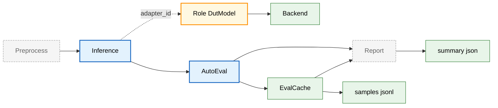

Execution highlights:

- `inference`: call `dut_model`, write `model_output` to `sample.predict_result`
- `auto_eval`: compute per-sample metrics and write `samples.jsonl`
- `report`: aggregate metrics and output `summary.json`

#### 1.4.2 LLM judge example

LLM judge evaluation adds a judge step: `inference -> judge -> auto_eval`.

Example config: `gage-eval-main/config/custom/single_task_local_judge_qwen.yaml`

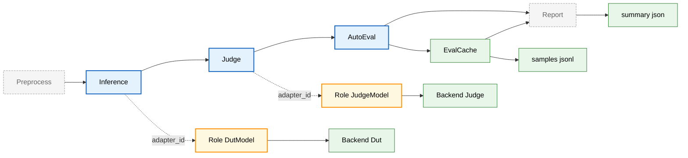

Execution highlights:

- `judge`: consume `sample` and `model_output`, write to `sample.eval_result`, can be used by metrics
- `auto_eval`: compute metrics from model output or judge output via `prediction_field`

#### 1.4.3 SWE-bench example

SWE-bench is a representative static evaluation: `support -> inference -> judge -> auto_eval`.

Example config: `gage-eval-main/config/custom/swebench_pro_smoke.yaml`

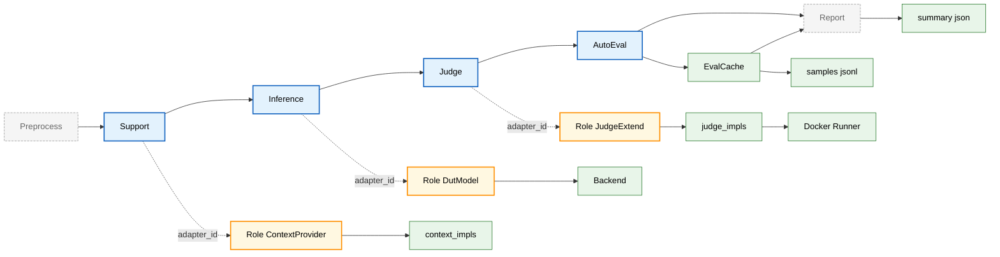

Execution highlights:

- `support`: inject repo structure and key files into `sample.support_outputs`, may also mutate `sample.inputs`
- `judge`: offline judge via `judge_extend`, write resolved and failure_reason, logs under `runs/<run_id>/logs`
- `auto_eval`: aggregate resolved results and failure stats

#### 1.4.4 Game Arena example

Game Arena runs turn-based matches via `support -> arena -> auto_eval`, with Human vs LLM or LLM vs LLM.

Example config: `gage-eval-main/config/custom/gomoku_human_vs_llm.yaml`

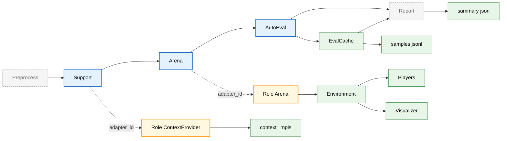

Execution highlights:

- `support`: inject game rules and the initial board via `context_provider`
- `arena`: run the game loop across environment, players, and parser; push UI updates when enabled; output to `model_output` and `predict_result`
- `auto_eval`: compute metrics from `model_output` and write cache

#### 1.4.5 Agent evaluation example

Agent evaluation runs `support -> inference -> judge -> auto_eval`, where `dut_agent` executes AgentLoop, Toolchain injects tools, and Sandbox isolates side effects.

Example config: `gage-eval-main/config/custom/appworld_official_jsonl.yaml`

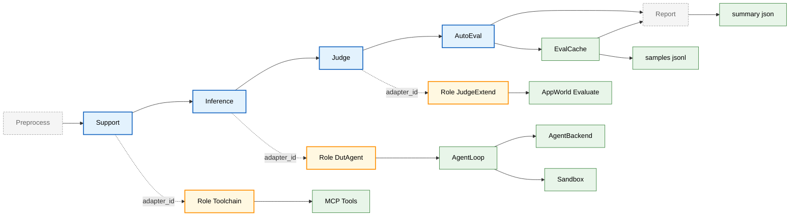

## 2. Quickstart

### 2.1 Requirements

- Python 3.10+
- Linux + CUDA recommended for local vLLM
- CPU is fine for HTTP backends or dummy demos

### 2.2 Install

From the mono-repo root:

```bash
python -m venv .venv
source .venv/bin/activate
pip install -r gage-eval-main/requirements.txt
```

> Path note: example commands assume you run from the repo root.

### 2.3 Run the minimal demo

This demo uses the dummy backend and does not require a real model.

```bash
python gage-eval-main/run.py \
  --config gage-eval-main/config/run_configs/demo_echo_run_1.yaml \
  --output-dir runs \
  --run-id demo_echo
```

### 2.4 Output structure

A run writes to `runs/<run_id>/`:

```text
runs/<run_id>/
  events.jsonl          # event stream
  samples.jsonl         # AutoEval cache, one line per sample
  summary.json          # aggregated metrics and timings
  samples/              # optional, per-sample or sharded outputs
  logs/                 # judge logs such as SWE-bench
```

Artifact sources:

| File | Writer | Notes |
| --- | --- | --- |
| `events.jsonl` | `ObservabilityTrace` | key events, local file or HTTP sink |
| `samples.jsonl` | `EvalCache` | per-sample snapshot of model and metrics |
| `summary.json` | `ReportStep` + `EvalCache` | aggregated metrics and summary generators |

### 2.5 Python SDK example

```bash
PYTHONPATH=gage-eval-main/src python - <<'PY'
from pathlib import Path
import yaml

import gage_eval  # noqa: F401
from gage_eval.config import build_default_registry
from gage_eval.config.pipeline_config import PipelineConfig
from gage_eval.evaluation.runtime_builder import build_runtime
from gage_eval.observability.trace import ObservabilityTrace
from gage_eval.role.resource_profile import NodeResource, ResourceProfile

payload = yaml.safe_load(Path("gage-eval-main/config/custom/piqa_qwen3.yaml").read_text(encoding="utf-8"))
config = PipelineConfig.from_dict(payload)

registry = build_default_registry()
profile = ResourceProfile(nodes=[NodeResource(node_id="local", gpus=1, cpus=8)])
trace = ObservabilityTrace(run_id="sdk_demo")

runtime = build_runtime(config=config, registry=registry, resource_profile=profile, trace=trace)
runtime.run()
PY
```

## 3. Core Concepts

### 3.1 Step chain

#### 3.1.1 Step list and responsibilities

| step_type | frequency | typical role_type | purpose |
| --- | --- | --- | --- |
| `support` | 0 to N per sample | `context_provider` | context injection and tooling |
| `inference` | 0 or 1 per sample | `dut_model` | model inference |
| `judge` | 0 or 1 per sample | `judge_model` or `judge_extend` | scoring or strict offline judge |
| `auto_eval` | 0 or 1 per sample | builtin | compute metrics and cache |
| `report` | once per run | builtin | write `summary.json` |

#### 3.1.2 Step contract

| Step | Input payload fields | Output target |
| --- | --- | --- |
| `support` | `sample`, `step` | append to `sample.support_outputs` or mutate `sample` |
| `inference` | `sample` | append to `sample.predict_result` |
| `judge` | `sample`, `model_output`, `trace` | merge into `sample.eval_result` |
| `auto_eval` | `sample`, `model_output`, `judge_output` | write `samples.jsonl` and events |

Execution snippet from `src/gage_eval/evaluation/task_planner.py`:

```python
# StepExecutionContext.execute_judge
payload = {
    "sample": self.sample,
    "model_output": self._model_output or {},
    "trace": self.trace,
}
self._judge_output = self.judge.execute(payload, self.role_manager, self.trace)
update_eval_result(self.sample, self._judge_output)
```

#### 3.1.3 Per-sample sequence view


### 3.2 RoleAdapter glue layer

RoleAdapter decouples step semantics from backend execution:

- Steps only reference `adapter_id`.
- RoleAdapters assemble inputs, prompts, and backends.
- RoleManager builds RolePools and reuses role instances under concurrency.

#### 3.2.1 Runtime relationship

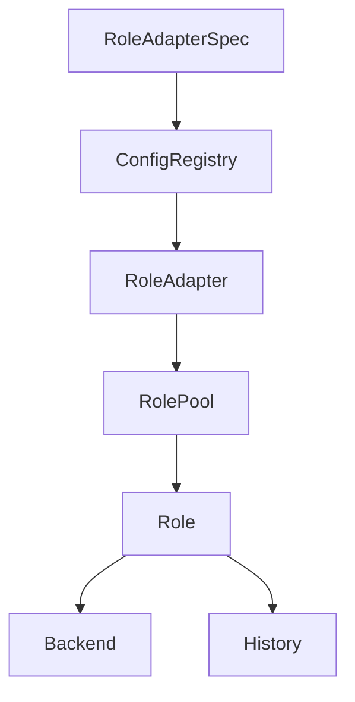

#### 3.2.2 Dock style RoleAdapters

Dock style adapters allow composition without rewriting orchestration.

| Dock style | role_type example | Extension point | Typical config | Scenario |
| --- | --- | --- | --- | --- |
| Implementation selection | `context_provider`, `judge_extend` | choose impl from registry | `params.implementation` | RAG, offline judge |
| Backend composition | `dut_model`, `judge_model` | switch backend | `backend_id` or `backend` | model inference |
| Capability orchestration | `toolchain`, `dut_agent` | declarative tooling | `params`, `capabilities` | tools and agents |

##### 3.2.2.1 Implementation selection

```python
# 1) Select an implementation by name
impl_cls = registry.get("context_impls", implementation)
self._impl = impl_cls(**implementation_params)

# 2) Support provide and aprovide, normalize to async
provider = getattr(self._impl, "aprovide", None) or getattr(self._impl, "provide", None)
self._provider = ensure_async(provider)
```

##### 3.2.2.2 Backend composition

`dut_model/helper_model/judge_model` treat model execution as backends:

- **Switch backends**: change `backend.type` (e.g., `openai_http`, `vllm`, `dummy`)
- **Reuse**: declare `backends[].backend_id` and reference by RoleAdapter
- **Fast experiments**: inline `backend` inside RoleAdapter for quick tests

##### 3.2.2.3 Capability orchestration

These adapters glue tools, multimodal processing, or agent logic into the step chain.

### 3.3 Runtime modes

#### 3.3.1 Single task PipelineRuntime

When `tasks` is empty:

- The runtime selects one dataset (override with CLI `--dataset-id`)
- It executes `custom.steps` or the builtin flow

#### 3.3.2 Multi task TaskOrchestratorRuntime

When `tasks` is not empty:

- Each TaskSpec binds a dataset, a step chain, and metrics
- Tasks run sequentially, sharing the same `run_id` and `RoleManager`
- `summary.json` records the `tasks` list

Config example (from `gage-eval-main/config/custom/multi_task_openai_http_demo.yaml`):

```yaml
metrics:
  - metric_id: multi_choice_acc
    implementation: multi_choice_accuracy
  - metric_id: docvqa_anls
    implementation: docvqa_anls
  - metric_id: latency
    implementation: latency

tasks:
  - task_id: mmlu_business_ethics_http_eval
    dataset_id: mmlu_business_ethics
    steps:
      - step: inference
        adapter_id: dut_text
      - step: auto_eval
    metric_overrides:
      - metric_id: multi_choice_acc
      - metric_id: latency
    max_samples: 5
    reporting:
      sinks:
        - type: console

  - task_id: docvqa_http_eval
    dataset_id: docvqa_val
    steps:
      - step: inference
        adapter_id: dut_docvqa
      - step: auto_eval
    metric_overrides:
      - metric_id: docvqa_anls
      - metric_id: latency
    max_samples: 5
```

Task override fields:

| Field | Purpose |
| --- | --- |
| `steps` | override step chain |
| `metric_overrides` | override metric set |
| `max_samples` | override sample limit |
| `concurrency/prefetch_factor/max_inflight` | override scheduling and backpressure |
| `reporting` | override sinks; events still go to `runs/*/events.jsonl` |

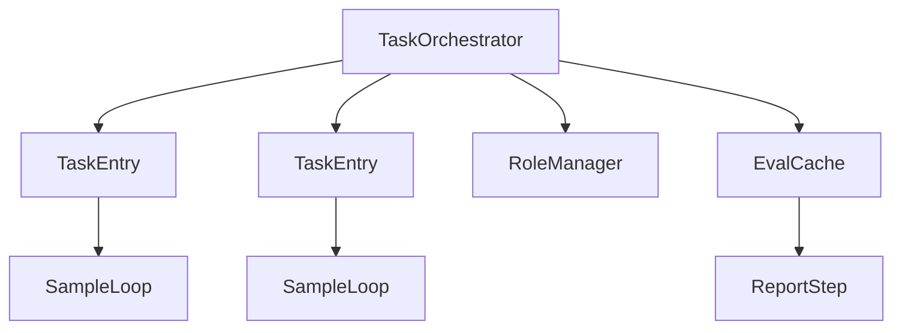

### 3.4 Sample schema

Samples are standardized across data and evaluation. The default validator lives in `src/gage_eval/assets/datasets/validation.py`.

Recommended minimal fields:

| Field | Type | Notes |
| --- | --- | --- |
| `id` | str | sample id |
| `messages` | list | chat messages, supports multimodal content |
| `choices` | list | structured options, optional |
| `inputs` | dict | preprocessed inputs, such as `prompt` or `multi_modal_data` |
| `metadata` | dict | task metadata such as answers or repo info |
| `predict_result` | list | inference outputs, appended by runtime |
| `eval_result` | dict | judge outputs and metrics |

#### 3.4.1 Example: multimodal standardized Sample

```json
{
  "id": "demo_0001",
  "messages": [
    {
      "role": "user",
      "content": [
        { "type": "text", "text": "What does the image say" },
        { "type": "image_url", "image_url": { "url": "https://example.com/demo.png" } }
      ]
    }
  ],
  "choices": [],
  "inputs": {
    "prompt": "What does the image say",
    "multi_modal_data": {
      "image": ["https://example.com/demo.png"]
    }
  },
  "metadata": {
    "label": "hello"
  },
  "predict_result": [
    {
      "index": 0,
      "answer": "hello",
      "message": {
        "role": "assistant",
        "content": [{ "type": "text", "text": "hello" }]
      }
    }
  ],
  "eval_result": {}
}
```

Common message content types:

| type | Example | Notes |
| --- | --- | --- |
| `text` | `{ "type": "text", "text": "..." }` | text fragment |
| `image_url` | `{ "type": "image_url", "image_url": { "url": "..." } }` | image url or data url |
| `audio_url` | `{ "type": "audio_url", "audio_url": { "url": "..." } }` | audio url or data url |
| `file_url` | `{ "type": "file_url", "file_url": { "url": "..." } }` | file url |

> Inference outputs are normalized into `message.content` segments when writing `predict_result`.

#### 3.4.2 Multimodal normalization rules

Preprocessing performs two operations:

- `normalize_messages`: inject `sample.visual/sample.audio` into user messages (`_inject_modal_fragments`)
- `merge_multimodal_inputs`: collect media refs into `inputs.multi_modal_data` (`merge_multimodal_inputs`)

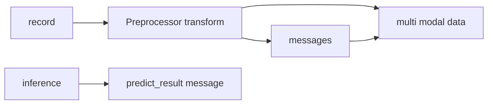

Practical tips:

- **Prefer `messages`**: most backends consume chat messages; `multi_modal_data` is a media reference table
- **Keep reproducibility**: use `doc_to_visual` to convert local files into data urls

#### 3.4.3 Protocol implementation status

The standardized Sample protocol is already implemented in the codebase:

- The canonical envelope helpers live in `src/gage_eval/evaluation/sample_envelope.py` (`append_predict_result`, `update_eval_result`, `resolve_model_output`).
- The dataclass representation and adapters are in `src/gage_eval/assets/datasets/sample.py`.
- Validation is enforced by `SampleValidator` in `src/gage_eval/assets/datasets/validation.py` and is configurable via `datasets[].schema`.

### 3.5 Game Arena runtime lane

Game Arena is implemented as a first-class `arena` step, sharing the same Sample envelope and output flow as standard runs.

Key wiring points:

- **RoleAdapter**: `role_type: arena` in `role_adapters`, implemented by `src/gage_eval/role/adapters/arena.py`.
- **Runtime objects**: environment, parser, players, scheduler, and visualizer are resolved via registries under `src/gage_eval/role/arena/`.
- **Outputs**: the arena loop writes to `model_output` and `predict_result`, then `auto_eval` computes metrics (e.g., win rate, illegal move rate).

Common configs to start with:

- `config/custom/gomoku_human_vs_llm.yaml`
- `config/custom/tictactoe_human_vs_llm.yaml`

For the full spec and UI wiring, see `docs/guide/game_arena.md`.

## 4. Config details

### 4.1 PipelineConfig structure

A typical config (details omitted):

```yaml
api_version: gage/v1alpha1
kind: PipelineConfig
metadata:
  name: demo

custom:
  steps:
    - step: inference
    - step: auto_eval

datasets: []
backends: []
role_adapters: []
metrics: []
tasks: []
```

Fields:

| Field | Description | Code entry |
| --- | --- | --- |
| `datasets` | dataset definitions | `src/gage_eval/assets/datasets/loaders/` |
| `backends` | backend list for roles | `src/gage_eval/role/model/backends/` |
| `role_adapters` | role glue layer | `src/gage_eval/config/registry.py` |
| `custom.steps` | default step chain | `src/gage_eval/evaluation/pipeline.py` |
| `tasks` | multi-task entry | `src/gage_eval/evaluation/task_plan.py` |
| `metrics` | metric set | `src/gage_eval/metrics/` |
| `summary_generators` | summary extensions | `src/gage_eval/pipeline/steps/report.py` |

#### 4.1.1 ID references

gage configs emphasize **declaration and reference**. Define resources at the top level, then reference by id.

- dataset: `datasets[].dataset_id` referenced by `tasks[].dataset_id` (legacy `dataset_ref`)
- role adapter: `role_adapters[].adapter_id` referenced by `steps[].adapter_id` (legacy `role_ref`)
- backend: `backends[].backend_id` referenced by `role_adapters[].backend_id` or inline `backend`
- prompt: `prompts[].prompt_id` referenced by `role_adapters[].prompt_id`
- metric: `metrics[].metric_id` referenced by `tasks[].metric_overrides[].metric_id`

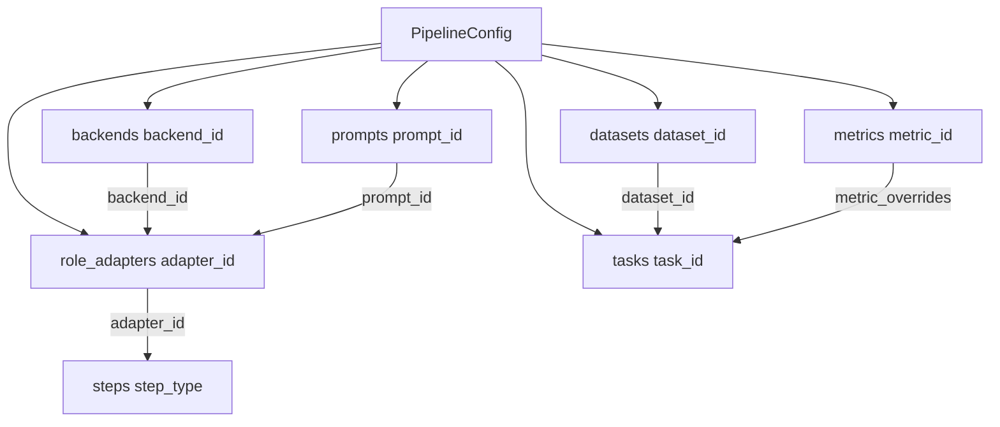

### 4.2 Datasets

#### 4.2.1 HuggingFace Hub

Example: `gage-eval-main/config/custom/mmmu_qwen_vl.yaml`

Key fields:

- `hub: huggingface`
- `hub_params.hub_id/subset/split`
- `loader: hf_hub`
- `params.preprocess`: preprocessor id from registry
- `params.doc_to_visual`: multimodal injection callable

#### 4.2.2 Local JSONL

Example: `gage-eval-main/config/custom/docvqa_qwen_vl.yaml`

Key fields:

- `loader: jsonl`
- `params.path`: JSONL path, repo-root relative recommended
- `params.streaming`: optional, may be auto-enabled for large files

#### 4.2.3 Preprocess and doc_to_visual

`doc_to_visual/doc_to_text/doc_to_audio` refer to callables, for example `gage_eval.assets.datasets.utils.multimodal:embed_local_message_images`.

Implementation notes (`src/gage_eval/assets/datasets/loaders/loader_utils.py`):

- inherit same-name arguments from `preprocess_kwargs`
- pass extra args via `doc_to_visual_kwargs`

#### 4.2.4 Builtin preprocess pipeline

Regardless of custom preprocessors, all records are normalized into the standardized Sample. The core template method is `BasePreprocessor.transform` in `src/gage_eval/assets/datasets/preprocessors/base.py`:

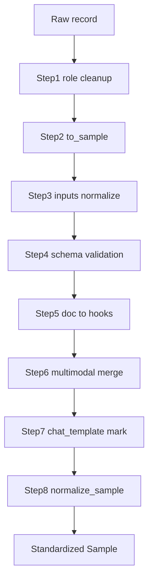

### 4.3 Backends

Common backends (`backend.type`):

| backend type | Scenario | Notes |
| --- | --- | --- |
| `vllm` | Local inference | AsyncLLMEngine with text and multimodal support |
| `litellm` | Remote service | Unified API over OpenAI, Anthropic, Kimi, Grok |
| `sglang` | High-throughput inference | SGLang server integration |
| `tgi` | High-throughput inference | HuggingFace TGI server |
| `openai_http` | Remote service | OpenAI ChatCompletion compatible API |
| `dummy` | Smoke tests | echo prompt or cycle responses |

### 4.4 RoleAdapters

#### 4.4.1 Model RoleAdapters

Model RoleAdapters compose backends and switch execution engines per role type:

- `dut_model`: target model
- `helper_model`: helper model for support or judge
- `judge_model`: LLM-as-judge

Base class: `src/gage_eval/role/adapters/model_role_adapter.py`

Binding options:

- reference `backends[].backend_id` (recommended)
- inline `backend` for quick experiments

Example:

```yaml
backends:
  - backend_id: qwen3_openai_http
    type: openai_http
    config:
      base_url: http://127.0.0.1:1234/v1
      model: qwen3

role_adapters:
  - adapter_id: dut_text
    role_type: dut_model
    backend_id: qwen3_openai_http
    prompt_id: multi_choice_infer_prompt
    capabilities: [chat_completion]
```

#### 4.4.2 context_provider dock

- Use for RAG, knowledge injection, repo context
- Select implementation via `params.implementation` from `context_impls`
- Default example: SWE-bench `swebench_repo`

#### 4.4.3 judge_extend dock

- Use for non-LLM or strict judges
- Select implementation via `params.implementation` from `judge_impls`
- Default example: SWE-bench `swebench_docker`

#### 4.4.4 Step and Role combinations

| step_type | common role_type | Notes |
| --- | --- | --- |
| `support` | `context_provider`, `toolchain`, `modal_processor`, `helper_model` | context injection, tool prep, multimodal prep |
| `inference` | `dut_model`, `dut_agent` | model inference or agent flow |
| `judge` | `judge_model`, `judge_extend` | LLM judge or offline judge |
| `auto_eval` | builtin | metric compute and aggregation |
| `report` | builtin | output `summary.json` |

### 4.5 Metrics

Metrics are computed per sample and aggregated globally.

#### 4.5.1 Per-sample computation

- Runs in `auto_eval`: `AutoEvalStep.execute` calls `MetricInstance.evaluate`
- Writes `samples.jsonl` with `sample/model_output/judge_output/metrics`

#### 4.5.2 Aggregation

- Aggregators accumulate in `MetricInstance.evaluate`
- `ReportStep.finalize` triggers `AutoEvalStep.aggregated_metrics` and `finalize`
- Writes aggregated metrics to `summary.json`

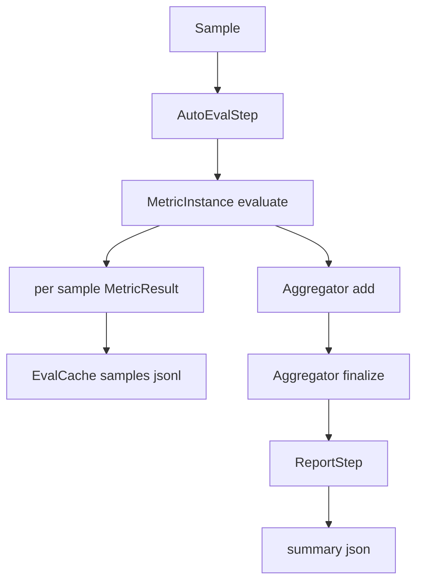

#### 4.5.3 Metric config forms

`metrics` supports multiple equivalent formats (see `_normalize_metric_entry`).

| Form | YAML example | When to use |
| --- | --- | --- |
| String shorthand | `- exact_match` | builtin with no params |
| KV shorthand | `- exact_match: {case_sensitive: true}` | simple params and same id |
| Function shorthand | `- exact_match(case_sensitive=true, strip_whitespace=false)` | compact flat params |
| Full object | see below | multiple variants or stable ids |

Rules:

- Only flat `k=v` params, comma separated; supports `true/false/null`, numbers, quoted strings
- `aggregation=...` is extracted into aggregator config
- Use full objects for multiple variants of the same implementation

Example:

```yaml
metrics:
  # 1) String shorthand
  - exact_match

  # 2) KV shorthand
  - regex_match:
      pattern: "^A$"
      ignore_case: true

  # 3) Function shorthand
  - exact_match(case_sensitive=true, strip_whitespace=false)

  # 4) Full object
  - metric_id: exact_match_cs
    implementation: exact_match
    params:
      case_sensitive: true
```

### 4.6 Tasks and multi-task

- `tasks` empty: single-task runtime
- `tasks` non-empty: orchestrator runtime
- If `adapter_id` is omitted in inference, it is inferred only when exactly one `dut_model` exists

### 4.7 Runtime params, templates, and run configs

#### 4.7.1 `run.py` CLI params

Common flags (`python gage-eval-main/run.py --help`):

| Flag | Purpose |
| --- | --- |
| `--config` | config path |
| `--dataset-id` | dataset for single-task runs |
| `--gpus` | ResourceProfile GPUs |
| `--cpus` | ResourceProfile CPUs |
| `--concurrency` | override concurrency, sets `GAGE_EVAL_THREADS` |
| `--max-samples` | override sample limit, sets `GAGE_EVAL_MAX_SAMPLES` |
| `--output-dir` | output root, sets `GAGE_EVAL_SAVE_DIR` |
| `--run-id` | fixed run id for reproducibility |
| `--model-path` | override vLLM `model_path` |

#### 4.7.2 Common environment variables

| Env var | Purpose | Code |
| --- | --- | --- |
| `GAGE_EVAL_SAVE_DIR` | output root | `src/gage_eval/observability/trace.py`, `src/gage_eval/evaluation/cache.py` |
| `GAGE_EVAL_THREADS` | concurrency | `src/gage_eval/evaluation/sample_loop.py`, `src/gage_eval/evaluation/runtime_builder.py` |
| `GAGE_EVAL_MAX_SAMPLES` | max samples | `src/gage_eval/evaluation/sample_loop.py` |
| `GAGE_EVAL_PREFETCH_FACTOR` | prefetch factor | `src/gage_eval/evaluation/sample_loop.py` |
| `GAGE_EVAL_MAX_INFLIGHT` | max inflight | `src/gage_eval/evaluation/sample_loop.py` |
| `GAGE_EVAL_REPORT_HTTP_URL` | event HTTP sink | `src/gage_eval/observability/trace.py` |
| `GAGE_EVAL_ENABLE_BUFFERED_WRITER` | buffered samples writer | `src/gage_eval/evaluation/cache.py` |

#### 4.7.3 BuiltinTemplate

BuiltinTemplate solidifies a stable PipelineConfig template:

- `gage-eval-main/config/builtin_templates/<name>/vN.yaml`

Example: `gage-eval-main/config/builtin_templates/demo_echo/v1.yaml`

```yaml
kind: BuiltinTemplate
metadata:
  name: demo_echo
  version: V1
  digest: sha256:...
definition:
  datasets: [...]
  backends: [...]
  role_adapters: [...]
  custom: {steps: [...]}
```

#### 4.7.4 RunConfig

RunConfig provides runtime overrides on top of a template:

- `kind: RunConfig`
- `base_task: builtin/<name>` references a BuiltinTemplate
- `runtime` overrides datasets, backends, tasks

Example: `gage-eval-main/config/run_configs/demo_echo_run_1.yaml`

Entry modes:

- `--config` points to PipelineConfig: run directly
- `--config` points to RunConfig: compile then run and validate digest

#### 4.7.5 distill and init

distill: generate a BuiltinTemplate from PipelineConfig:

```bash
python gage-eval-main/run.py \
  --config gage-eval-main/config/custom/piqa_qwen3.yaml \
  --distill \
  --builtin-name piqa_qwen3
```

init: generate RunConfig or PipelineConfig from a BuiltinTemplate:

```bash
python gage-eval-main/run.py --init demo_echo --init-mode run-config
python gage-eval-main/run.py --init demo_echo --init-mode pipeline-config
```

## 5. Best practices

Scenario navigation table (run from repo root):

| Scenario | Level | Highlights | Config | Typical steps | Key roles |
| --- | --- | --- | --- | --- | --- |
| Minimal smoke | Starter | RunConfig compile, dummy backend | [`gage-eval-main/config/run_configs/demo_echo_run_1.yaml`](../../config/run_configs/demo_echo_run_1.yaml) | `inference -> auto_eval` | `dut_model` |
| Text multiple-choice | Starter | structured choices, auto metrics | [`gage-eval-main/config/custom/piqa_qwen3.yaml`](../../config/custom/piqa_qwen3.yaml) | `inference -> auto_eval` | `dut_model` |
| GPQA | Advanced | expert MCQ, few-shot | [`gage-eval-main/config/custom/gpqa_diamond_vllm_async_chat.yaml`](../../config/custom/gpqa_diamond_vllm_async_chat.yaml) | `inference -> auto_eval` | `dut_model` |
| LLM judge | Advanced | post-inference judge | [`gage-eval-main/config/custom/single_task_local_judge_qwen.yaml`](../../config/custom/single_task_local_judge_qwen.yaml) | `inference -> judge -> auto_eval` | `dut_model`, `judge_model` |
| Multi-task | Advanced | TaskOrchestrator, overrides | [`gage-eval-main/config/custom/multi_task_openai_http_demo.yaml`](../../config/custom/multi_task_openai_http_demo.yaml) | per-task | `dut_model` |
| DocVQA | Advanced | doc_to_visual, image_url | [`gage-eval-main/config/custom/docvqa_qwen_vl.yaml`](../../config/custom/docvqa_qwen_vl.yaml) | `inference -> auto_eval` | `dut_model` |
| MathVista | Advanced | multimodal, answer extraction | [`gage-eval-main/config/custom/mathvista_vllm_async_chat.yaml`](../../config/custom/mathvista_vllm_async_chat.yaml) | `inference -> auto_eval` | `dut_model` |
| MMMU | Advanced | HF Hub, multimodal preprocess | [`gage-eval-main/config/custom/mmmu_qwen_vl.yaml`](../../config/custom/mmmu_qwen_vl.yaml) | `inference -> auto_eval` | `dut_model` |
| SWE-bench Pro | Expert | context_provider, judge_extend, Docker | [`gage-eval-main/config/custom/swebench_pro_smoke.yaml`](../../config/custom/swebench_pro_smoke.yaml) | `support -> inference -> judge -> auto_eval` | `context_provider`, `dut_model`, `judge_extend` |

### 5.1 Step and Role patterns

| Scenario | steps | Key roles |
| --- | --- | --- |
| Pure auto evaluation | `inference -> auto_eval` | `dut_model` |
| LLM judge | `inference -> judge -> auto_eval` | `dut_model`, `judge_model` |
| Context enhanced | `support -> inference -> auto_eval` | `context_provider`, `dut_model` |
| Engineering eval | `support -> inference -> judge -> auto_eval` | `context_provider`, `dut_model`, `judge_extend` |

### 5.2 Text examples

#### 5.2.1 PIQA multiple-choice

Config: `gage-eval-main/config/custom/piqa_qwen3.yaml`

Run:

```bash
python gage-eval-main/run.py \
  --config gage-eval-main/config/custom/piqa_qwen3.yaml \
  --output-dir runs \
  --run-id piqa_smoke \
  --max-samples 50
```

#### 5.2.2 Multi-task example

Config: `gage-eval-main/config/custom/multi_task_openai_http_demo.yaml`

Notes:

- Two tasks share the same backend
- Each task uses `metric_overrides` to select a subset

### 5.3 Multimodal examples

#### 5.3.1 DocVQA

Config: `gage-eval-main/config/custom/docvqa_qwen_vl.yaml`

Notes:

- JSONL `messages` contains `image_url`
- `doc_to_visual` converts local images to data urls for remote VLMs

#### 5.3.2 MMMU

Config: `gage-eval-main/config/custom/mmmu_qwen_vl.yaml`

Notes:

- HF Hub dataset + `preprocess: mmmu_multimodal_inputs`
- TaskSpec `concurrency` controls SampleLoop

### 5.4 SWE-bench Pro

SWE-bench is a representative step and role composition:

- `support` injects repo context via `context_provider`
- `inference` produces patches
- `judge` uses `judge_extend` and Docker for offline tests
- `auto_eval` computes resolve rate and aggregates failure reasons

#### 5.4.1 Dock config notes

Config: `gage-eval-main/config/custom/swebench_pro_smoke.yaml`

Key snippet:

```yaml
custom:
  steps:
    - step: support
      adapter_id: swebench_context_provider
    - step: inference
      adapter_id: swebench_dut_model
    - step: judge
      adapter_id: swebench_docker_judge
    - step: auto_eval

role_adapters:
  - adapter_id: swebench_context_provider
    role_type: context_provider
    params:
      implementation: swebench_repo
      implementation_params:
        repo_source: docker_image
        repo_root: /app
        topk_files: 5
        block_network: true

  - adapter_id: swebench_docker_judge
    role_type: judge_extend
    params:
      implementation: swebench_docker
      implementation_params:
        scripts_dir: gage-eval-main/third_party/swebench_pro/run_scripts
        block_network: true
        test_timeout_s: 900
```

#### 5.4.2 Run command

```bash
python gage-eval-main/run.py \
  --config gage-eval-main/config/custom/swebench_pro_smoke.yaml \
  --output-dir runs \
  --run-id swebench_smoke \
  --concurrency 1
```

#### 5.4.3 Output and troubleshooting

- Check `runs/swebench_smoke/summary.json` for `swebench_summary`
- Check `runs/swebench_smoke/logs/<instance_id>/stdout.log`, `stderr.log`, `output.json`

### 5.5 Performance tuning

#### 5.5.1 SampleLoop backpressure

- `GAGE_EVAL_PREFETCH_FACTOR`: higher hides data loading latency
- `GAGE_EVAL_MAX_INFLIGHT`: limits inflight samples for memory control

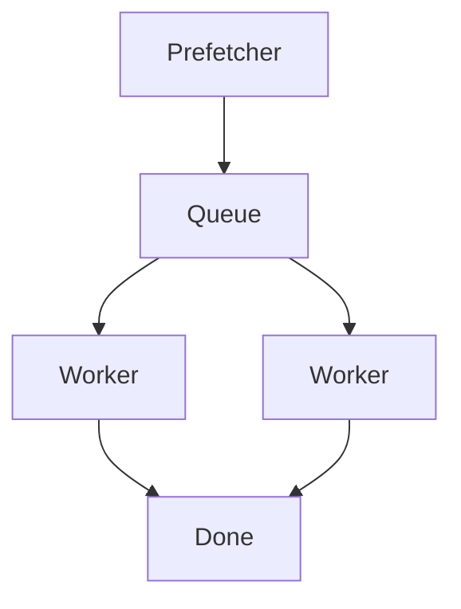

#### 5.5.2 Large scale output

Enable buffered writer for large runs:

- `GAGE_EVAL_ENABLE_BUFFERED_WRITER=1`
- or `GAGE_EVAL_BUFFER_THRESHOLD` for auto

## 6. Extension

### 6.1 Registry extension mechanism

gage uses a global Registry to manage extensible assets. The goal is to extend without touching core orchestration code.

Entry points:

- Registry singleton: `src/gage_eval/registry/__init__.py`
- Default kinds: `DEFAULT_KINDS`
- Auto-discovery: import `gage_eval` triggers `registry.auto_discover`

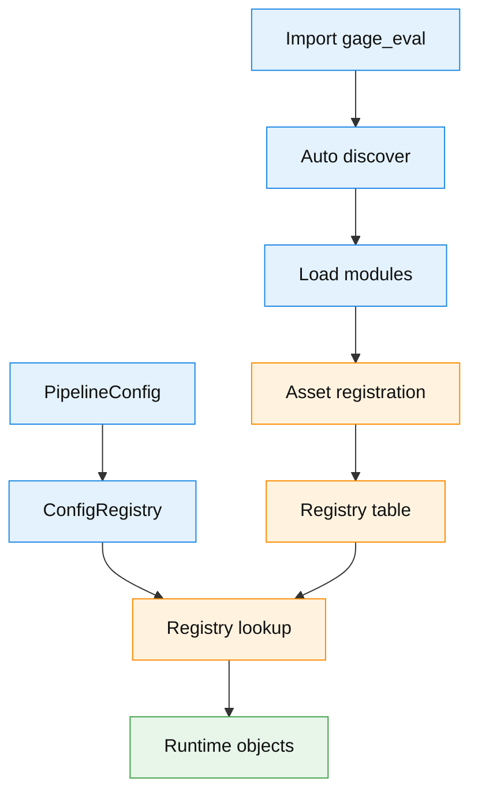

Extensible kinds (from `DEFAULT_KINDS`):

| kind | Meaning | Typical reference |
| --- | --- | --- |
| `backends` | model and service backends | `backends[].type` or inline `backend.type` |
| `roles` | role adapters | `role_adapters[].role_type` |
| `metrics` | metric calculators | `metrics[].implementation`, `tasks[].metric_overrides` |
| `context_impls` | context providers | `role_adapters[].params.implementation` |
| `judge_impls` | judge extensions | `role_adapters[].params.implementation` |
| `dataset_hubs` | dataset sources | `datasets[].hub` |
| `dataset_loaders` | dataset loaders | `datasets[].loader` |
| `dataset_preprocessors` | dataset preprocessors | `datasets[].params.preprocess` |
| `doc_converters` | doc to sample converters | reserved | 
| `prompts` | prompt templates | `prompts[].prompt_id` |
| `model_hubs` | model hubs | `models[].hub` |
| `templates` | config templates | reserved |
| `reporting_sinks` | reporting sinks | `tasks[].reporting.sinks[].type` |
| `summary_generators` | summary generators | `summary_generators[]` or env `GAGE_EVAL_SUMMARY_GENERATORS` |
| `observability_plugins` | observability plugins | `observability` config |
| `pipeline_steps` | pipeline steps | builtin step assembly |

> Only packages included in `src/gage_eval/__init__.py` auto-discover will be registered on startup; other extensions can be imported explicitly.

Extension approaches:

- **Registry-based**: place implementations under auto-discover packages and register via `@registry.asset`
- **Direct import**: reference Python paths in config, runtime imports at execution time

#### 6.1.1 Copy-paste example: register preprocessor and metric in one file

As long as a module is imported, it can register multiple assets. The example below can be copied into any importable module.

```python
from __future__ import annotations

from typing import Any, Dict

from gage_eval.assets.datasets.preprocessors.base import BasePreprocessor
from gage_eval.metrics.base import MetricContext, SimpleMetric
from gage_eval.registry import registry


@registry.asset("dataset_preprocessors", "demo_preprocess", desc="demo preprocessor", tags=("demo",))
class DemoPreprocessor(BasePreprocessor):
    name = "demo_preprocess"

    def to_sample(self, record: Dict[str, Any], **kwargs: Any) -> Dict[str, Any]:
        # Map raw record to standardized Sample fields
        prompt = str(record.get("question") or record.get("prompt") or "")
        label = record.get("answer") or record.get("label")
        return {
            "prompt": prompt,
            "label": "" if label is None else str(label),
            "metadata": {"source": "demo_preprocess"},
        }


@registry.asset("metrics", "demo_length", desc="demo metric length", tags=("demo",))
class DemoLengthMetric(SimpleMetric):
    value_key = "length"

    def compute_value(self, context: MetricContext):
        # Use context.get to read sample or output fields
        text = context.get("model_output.answer", default="") or ""
        text = str(text)
        return float(len(text)), {"preview": text[:50]}
```

YAML usage:

```yaml
datasets:
  - dataset_id: demo_dataset
    loader: jsonl
    params:
      path: local-datasets/demo.jsonl
      preprocess: demo_preprocess

metrics:
  - demo_length
```

Generate a registry manifest:

```bash
python gage-eval-main/scripts/build_registry_manifest.py --out gage-eval-main/registry_manifest.yaml
```

### 6.2 Add a new Metric

1) Implement a `SimpleMetric` under `gage-eval-main/src/gage_eval/metrics/`
2) Register via `@registry.asset("metrics", ...)`
3) Reference by `metrics[].implementation` in YAML

Template:

```python
from gage_eval.metrics.base import MetricContext, SimpleMetric
from gage_eval.registry import registry

@registry.asset("metrics", "my_metric", desc="demo metric", tags=("custom",))
class MyMetric(SimpleMetric):
    def compute_value(self, context: MetricContext):
        return 1.0, {"note": "ok"}
```

### 6.3 Add context_impls or judge_impls

- context: implement `provide` or `aprovide`, register to `context_impls`
- judge: implement `invoke` or `ainvoke`, register to `judge_impls`

### 6.4 Add a Backend

1) Implement a backend class and register to `backends`:

```python
from gage_eval.registry import registry
from gage_eval.role.model.backends.base_backend import Backend

@registry.asset("backends", "my_backend", desc="demo backend", tags=("backend",))
class MyBackend(Backend):
    async def ainvoke(self, payload: dict) -> dict:
        return {"text": "hello", "latency_ms": 1.0}
```

2) Declare in YAML and reference by RoleAdapter:

```yaml
backends:
  - backend_id: my_backend_1
    type: my_backend
    config: {}

role_adapters:
  - adapter_id: dut_demo
    role_type: dut_model
    backend_id: my_backend_1
```

### 6.5 Add a DatasetPreprocessor

1) Implement and register in `dataset_preprocessors`:

```python
from gage_eval.registry import registry
from gage_eval.assets.datasets.preprocessors.base import DatasetPreprocessor

@registry.asset("dataset_preprocessors", "my_pre", desc="demo preprocessor", tags=("dataset",))
class MyPreprocessor(DatasetPreprocessor):
    def transform(self, sample: dict, **kwargs):
        sample.setdefault("metadata", {})["preprocessed_by"] = "my_pre"
        return sample.get("inputs")
```

2) Enable in dataset config:

```yaml
datasets:
  - dataset_id: my_ds
    loader: jsonl
    params:
      path: local-datasets/my_ds.jsonl
      preprocess: my_pre
```

### 6.6 Quick dataset onboarding

`src/gage_eval/support/` is a developer helper module for benchmark authors. It turns onboarding into a pipeline: `inspect -> design -> implement`.

> Note: evaluation entrypoint remains `gage-eval-main/run.py`. The support module focuses on asset generation and wiring validation.

See [`support_cli.md`](support_cli.md).

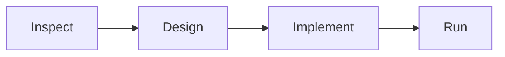

Common workflow (from repo root):

```bash
# 1) Inspect dataset
PYTHONPATH=gage-eval-main/src python -m gage_eval.support inspect <dataset_or_path> --max-samples 5

# 2) Generate design.md
PYTHONPATH=gage-eval-main/src python -m gage_eval.support design <slug>

# 3) Preview and generate assets
PYTHONPATH=gage-eval-main/src python -m gage_eval.support implement <slug>
```

> Tip: implement defaults to dry-run; add `--force` to write.

## 7. Testing and validation

- Config validation:
  ```bash
  PYTHONPATH=gage-eval-main/src python -m gage_eval.tools.config_checker \
    --config gage-eval-main/config/custom/piqa_qwen3.yaml
  ```
- See `gage-eval-main/TESTING.md` for test guidance.

## 8. Roadmap

> This section records near-term directions and may evolve with internal validation.

### 8.1 Standardized Sample and data pipeline

- Consolidate standardized Sample fields and validators across text, multimodal, and engineering tasks
- Improve data loading and preprocessing so inputs vary but outputs are unified
- Add diagnostics and debugging tools for samples

### 8.2 gage-client standalone project

- User-facing: config initialization, run management, artifact browsing
- Developer-facing: benchmarking templates and onboarding workflows
- Decouple from core runtime; `run.py` remains the minimal entrypoint

### 8.3 Multi-node inference: RoleType Controller

- Add `controller` role adapter to split scheduling and execution
- Support multi-node inference via controller, worker, and protocol configs
- Focus on sharding, load balancing, health checks, retries, and timeouts

### 8.4 Benchmark expansion

- Add and maintain benchmarks across text, multimodal, LLM judge, and engineering domains
- Provide dataset prep notes, smoke configs, metric definitions, and troubleshooting
