# gage-eval

中文 | [English](framework_overview.md)

gage-eval 是一个可扩展的大模型评测框架。它以 **Step 链路** 与 **RoleAdapter 胶水层** 为核心，通过一份 `PipelineConfig` YAML 统一描述数据加载、预处理、推理、裁判、自动打分与统计汇总，并将过程与结果以结构化产物落盘。

> 当前处于内部验证期：文档按未来开源标准撰写，但内容以 `gage-eval-main/` 最新实现为准。

## 0. 文档导航

- 项目首页（English）：[`README.md`](../../README.md)
- 项目首页（中文）：[`README_zh.md`](../../README_zh.md)
- 测试体系：[`TESTING.md`](../../TESTING.md)
- 示例配置：[`config/custom/`](../../config/custom/) 、[`config/builtin_templates/`](../../config/builtin_templates/)
- 扩展开发：[`support_cli_zh.md`](support_cli_zh.md)（support 模块指南）
- Sample 契约：[`sample_zh.md`](sample_zh.md)（标准化 Sample 设计）
- Game Arena：[`game_arena_zh.md`](game_arena_zh.md)（对战评测模块）

## 1. 项目概览

### 1.1 你可以用它做什么

- 基准评测：多选、问答、数学、代码等文本任务（如 MMLU, PIQA, GPQA）
- 多模态评测：图文问答、文档问答、视觉推理（如 MMMU, DocVQA, MathVista）
- LLM as Judge：推理后引入裁判角色判分
- 工程类评测：SWE-bench Pro，通过上下文注入与离线 Docker 裁判实现可复现评测
- 对战评测：Game Arena 支持五子棋、井字棋等回合制棋类（Human vs LLM / LLM vs LLM）

### 1.2 核心特性

| 特性 | 说明 | 代码落点 |
| --- | --- | --- |
| Step 链路编排 | `support -> inference -> judge -> auto_eval` 可组合，按 YAML 顺序执行 | `src/gage_eval/evaluation/sample_loop.py`, `src/gage_eval/evaluation/task_planner.py` |
| RoleAdapter 胶水层 | Step 只关心 `adapter_id`，RoleAdapter 负责拼装输入与对接后端 | `src/gage_eval/role/adapters/`, `src/gage_eval/role/role_manager.py` |
| Registry 扩展 | 通过 `@registry.asset` 注册 datasets/backends/roles/metrics 等资产，自动发现 | `src/gage_eval/registry/`, `src/gage_eval/__init__.py` |
| 高性能并发 | SampleLoop bounded buffer，支持 `prefetch_factor/max_inflight` 背压控制 | `src/gage_eval/evaluation/sample_loop.py` |
| 统一产物 | `events.jsonl`, `samples.jsonl`, `summary.json` | `src/gage_eval/observability/trace.py`, `src/gage_eval/evaluation/cache.py`, `src/gage_eval/pipeline/steps/report.py` |
| SWE-bench 扩展坞 | `context_provider` + `judge_extend` 将上下文与裁判解耦成可插拔实现 | `src/gage_eval/role/adapters/context_provider.py`, `src/gage_eval/role/adapters/judge_extend.py` |
| Game Arena 对战模块 | 回合制棋类评测，支持 Human/LLM 对战与可视化交互 | `src/gage_eval/role/arena/`, `src/gage_eval/role/adapters/arena.py` |

### 1.3 整体执行流程


### 1.4 Step 视角执行流程

从“流水线 step”角度看，框架有两个**隐藏但固定**的阶段：

- 固定起点：数据加载后进入预处理流水线（把原始 record 统一为标准化Sample）
- 固定终点：ReportStep 汇总并输出 `summary.json`（不需要在 steps 里声明）

下面的图用“最小结构”展示绑定机制：每个 step 通过 `adapter_id` 绑定 RoleAdapter，从而把“流程编排”和“能力实现”解耦；各 step 的常见 role_type 组合见图后表格。


step 与 role 的常见组合（示例，完整扩展点见 4.4 与 6.1）：

| step_type | 常见 role_type | 主要作用 |
| --- | --- | --- |
| `support` | `context_provider`, `toolchain`, `modal_processor`, `helper_model` | 上下文注入、工具准备、多模态处理、辅助推理 |
| `inference` | `dut_model`, `dut_agent`, `helper_model` | 被测目标推理或 agent 执行 |
| `judge` | `judge_model`, `judge_extend` | LLM 裁判或离线严格裁判 |
| `auto_eval` | 内置 | per sample 指标计算并写入缓存 |
| `report` | 内置 | 汇总输出报告与 summary |

#### 1.4.1 普通评测 示例

普通评测指 **仅包含推理与指标计算** 两个样本级 Step（`inference -> auto_eval`）。`preprocess` 与 `report` 仍然是隐藏固定阶段。

示例配置：`gage-eval-main/config/custom/piqa_qwen3.yaml`

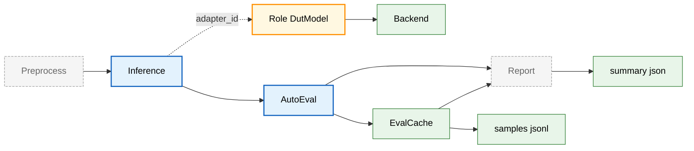

Step 执行要点：

- `inference`：调用 `dut_model` 产出 `model_output`，写入 `sample.predict_result`
- `auto_eval`：按 `metrics` 计算 per sample 结果并写入 `samples.jsonl`
- `report`：对指标聚合结果做汇总输出 `summary.json`

#### 1.4.2 裁判员模型评测 示例

裁判员模型评测指 **推理后引入 LLM 裁判**：`inference -> judge -> auto_eval`。其中 `judge` 使用 `judge_model`，本质也是“后端组合型扩展坞”。

示例配置：`gage-eval-main/config/custom/single_task_local_judge_qwen.yaml`

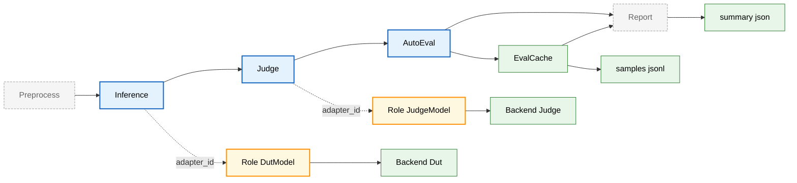

Step 执行要点：

- `judge`：输入包含 `sample` 与 `model_output`，输出写入 `sample.eval_result`，并可作为 AutoEval 的 `judge_output` 参与指标计算
- `auto_eval`：既可计算“模型输出类指标”，也可计算“基于裁判输出的指标”（例如把 `prediction_field` 指向 `judge_output.*`）

#### 1.4.3 静态评测 SWE-bench 示例

SWE-bench 属于“最复杂的静态评测”代表：通过 `support` 注入仓库上下文，通过 `judge` 离线执行测试进行严格判定，典型链路为 `support -> inference -> judge -> auto_eval`。

示例配置：`gage-eval-main/config/custom/swebench_pro_smoke.yaml`

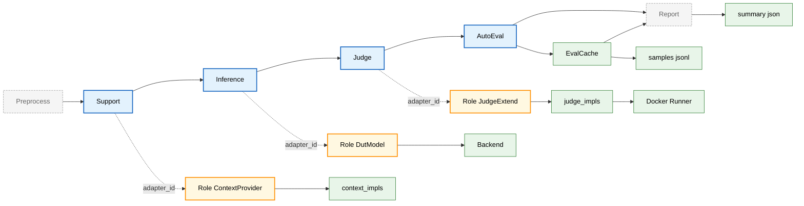

Step 执行要点：

- `support`：通常由 `context_provider` 注入 repo 结构与关键文件片段，输出追加到 `sample.support_outputs`，也允许原地更新 `sample.inputs`
- `judge`：通常由 `judge_extend` 走离线判定逻辑（例如 Docker 内运行测试），输出包含 resolved 与 failure_reason，并写日志到 `runs/<run_id>/logs`
- `auto_eval`：对 resolved 结果做指标计算与聚合，并可汇总 failure_reason 分布

#### 1.4.4 Game Arena 对战示例

Game Arena 用于回合制对战评测，典型链路为 `support -> arena -> auto_eval`，并支持 Human vs LLM 与 LLM vs LLM 的对战模式。

示例配置：`gage-eval-main/config/custom/gomoku_human_vs_llm.yaml`

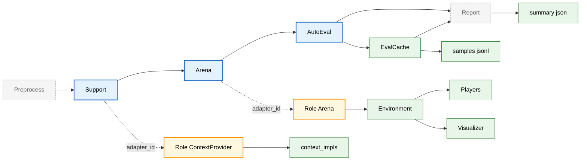

执行要点：

- `support`：注入规则说明与棋盘状态（例如 `context_provider`）。
- `arena`：负责对局主循环，驱动 environment、players、parser，并在启用可视化时推送 UI；输出写入 `model_output` 与 `predict_result`。
- `auto_eval`：基于 `model_output` 计算指标并写入缓存。

## 2. 快速开始

### 2.1 环境要求

- Python 3.10+
- 推荐：Linux + CUDA（使用本地 `vllm` 时）
- 仅跑远端 HTTP 后端或 `dummy` 示例：CPU 环境也可运行（但 `requirements.txt` 仍包含 GPU 相关依赖，可能需要自行拆分）

### 2.2 安装

在仓库根目录执行：

```bash
python -m venv .venv
source .venv/bin/activate
pip install -r gage-eval-main/requirements.txt
```

> 路径约定：本文档的示例命令默认在 **仓库根目录** 运行（因为示例 YAML 多为 repo-root 相对路径）。

### 2.3 跑通最小示例

该示例不依赖真实模型，使用 `dummy` backend 回显 prompt。

```bash
python gage-eval-main/run.py \
  --config gage-eval-main/config/run_configs/demo_echo_run_1.yaml \
  --output-dir runs \
  --run-id demo_echo
```

### 2.4 产物目录结构

一次运行的默认产物位于 `runs/<run_id>/`：

```text
runs/<run_id>/
  events.jsonl          # 可观测事件流
  samples.jsonl         # AutoEval 缓存，每行一个样本记录
  summary.json          # 汇总结果与 timings
  samples/              # 可选，namespace 分桶的 samples.jsonl 或单样本 json
  logs/                 # SWE-bench 等裁判实现的日志目录
```

产物生成来源：

| 文件 | 由谁写出 | 说明 |
| --- | --- | --- |
| `events.jsonl` | `ObservabilityTrace` | 关键阶段事件，默认本地文件，支持 HTTP 上报 |
| `samples.jsonl` | `EvalCache` | 每个样本的 `sample/model_output/judge_output/metrics` 快照 |
| `summary.json` | `ReportStep` + `EvalCache` | 汇总指标、任务信息、timings、可选的 summary_generators |

### 2.5 Python SDK 调用示例

如果你希望把 gage-eval 集成到现有 Python 工程或 CI/CD（而不是只通过 `run.py` 命令行），可以复用与 `run.py` 相同的装配逻辑：`PipelineConfig -> build_runtime -> runtime.run`。

示例（从 mono-repo 根目录运行）：

```bash
PYTHONPATH=gage-eval-main/src python - <<'PY'
from pathlib import Path
import yaml

import gage_eval  # noqa: F401 触发 registry auto-discover
from gage_eval.config import build_default_registry
from gage_eval.config.pipeline_config import PipelineConfig
from gage_eval.evaluation.runtime_builder import build_runtime
from gage_eval.observability.trace import ObservabilityTrace
from gage_eval.role.resource_profile import NodeResource, ResourceProfile

payload = yaml.safe_load(Path("gage-eval-main/config/custom/piqa_qwen3.yaml").read_text(encoding="utf-8"))
config = PipelineConfig.from_dict(payload)

registry = build_default_registry()
profile = ResourceProfile(nodes=[NodeResource(node_id="local", gpus=1, cpus=8)])
trace = ObservabilityTrace(run_id="sdk_demo")

runtime = build_runtime(config=config, registry=registry, resource_profile=profile, trace=trace)
runtime.run()
PY
```

## 3. 核心概念

### 3.1 Step 链路

#### 3.1.1 Step 列表与职责

当前核心 Step 类型：

| step_type | 发生频率 | 典型 adapter 角色 | 主要作用 |
| --- | --- | --- | --- |
| `support` | 每样本 0 到 N 次 | `context_provider` 等 | 预处理增强、上下文注入、工具准备 |
| `inference` | 每样本 0 到 1 次 | `dut_model` | 对被测模型发起推理 |
| `judge` | 每样本 0 到 1 次 | `judge_model` 或 `judge_extend` | 对推理输出进行裁判打分或判定 |
| `auto_eval` | 每样本 0 到 1 次 | 内置指标系统 | 计算指标并写入 `EvalCache` |
| `report` | 全局 1 次 | 内置 ReportStep | 汇总 `summary.json`（不需要在 steps 里声明） |

#### 3.1.2 Step 执行契约

每个 Step 的输入输出约定（以当前实现为准）：

| Step | 输入 payload 关键字段 | 输出写入位置 |
| --- | --- | --- |
| `support` | `sample`, `step` | `sample.support_outputs` 追加；支持原地修改 `sample` |
| `inference` | `sample` | `sample.predict_result` 追加 |
| `judge` | `sample`, `model_output`, `trace` | `sample.eval_result` 合并 |
| `auto_eval` | `sample`, `model_output`, `judge_output` | 写入 `samples.jsonl`；并在 `events.jsonl` 记录 `auto_eval_sample` |

下面是执行链路的真实代码片段（节选自 `src/gage_eval/evaluation/task_planner.py`，已补充中文注释）：

```python
# StepExecutionContext.execute_judge
payload = {
    "sample": self.sample,
    "model_output": self._model_output or {},
    "trace": self.trace,  # 透传 run_id 供裁判实现写日志
}
self._judge_output = self.judge.execute(payload, self.role_manager, self.trace)
update_eval_result(self.sample, self._judge_output)  # 写回 sample.eval_result
```

#### 3.1.3 单样本时序图

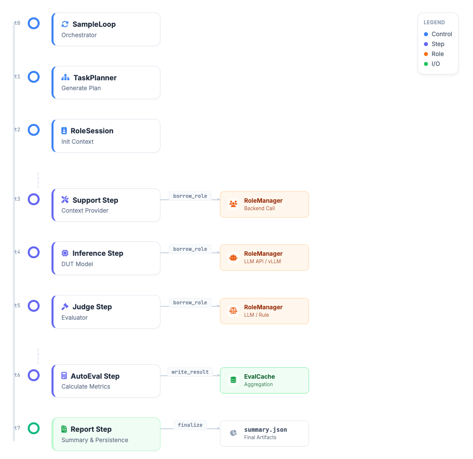

### 3.2 RoleAdapter 胶水层

RoleAdapter 是框架扩展性的核心：它把步骤语义和后端差异解耦。

- Step 只需要 `adapter_id`
- RoleAdapter 负责：输入拼装、prompt 渲染、后端调用、输出结构化
- RoleManager 负责：按 `ResourceProfile` 和并发提示构建 `RolePool`，在并发执行时复用 Role 实例与对话历史

#### 3.2.1 Role 运行时关系图

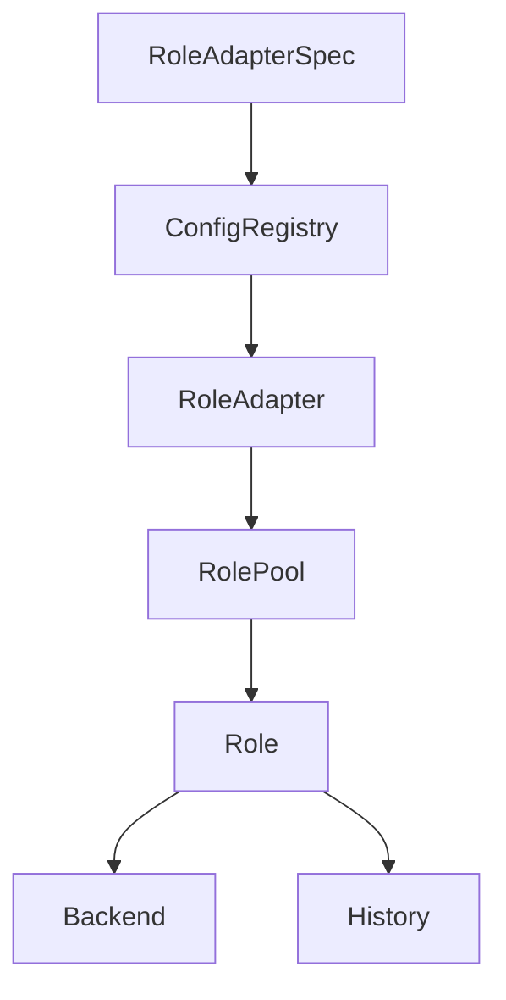

#### 3.2.2 扩展坞 RoleAdapter

扩展坞是一种“**组合式扩展**”的胶水模式：你不需要为每个评测场景重写流程，只要组合 Step，并为每个 Step 绑定一个合适的 RoleAdapter。

为了覆盖更广的评测场景，gage 把扩展点拆成了多种“扩展坞形态”（不仅限于 `context_provider/judge_extend`）：

| 扩展坞形态 | role_type 例子 | 扩展点位置 | 典型配置字段 | 典型场景 |
| --- | --- | --- | --- | --- |
| 实现选择型 | `context_provider`, `judge_extend` | 通过实现注册表选择实现 | `params.implementation`, `params.implementation_params` | RAG、repo 上下文注入、离线裁判 |
| 后端组合型 | `dut_model`, `helper_model`, `judge_model` | 通过组合 backend 切换执行引擎 | `backend_id` 或 `backend` | 被测模型推理、裁判模型推理、辅助模型 |
| 能力编排型 | `toolchain`, `modal_processor`, `dut_agent` | 通过参数声明能力与工作方式 | `params`, `capabilities` | 工具调用、多模态处理、Agent 式执行 |

##### 3.2.2.1 实现选择型扩展坞

这类 RoleAdapter 内部会读取 `params.implementation`，再从对应 registry kind 中加载一个实现类：

| role_type | 选择器字段 | 具体实现注册到 | 典型场景 |
| --- | --- | --- | --- |
| `context_provider` | `params.implementation` | `context_impls` | RAG、repo 上下文注入、工具准备 |
| `judge_extend` | `params.implementation` | `judge_impls` | 离线执行裁判、严格判定逻辑 |

关键逻辑（节选自 `src/gage_eval/role/adapters/context_provider.py`）：

```python
# 1) 根据配置选择一个实现类
impl_cls = registry.get("context_impls", implementation)
self._impl = impl_cls(**implementation_params)

# 2) 支持 provide/aprovide 两种接口，并统一为 async 调用
provider = getattr(self._impl, "aprovide", None) or getattr(self._impl, "provide", None)
self._provider = ensure_async(provider)
```

##### 3.2.2.2 后端组合型扩展坞

`dut_model/helper_model/judge_model` 本质上也是扩展坞：它们把“调用模型”抽象成 backend，并允许你通过配置直接组合不同推理引擎。

- **切换后端**：改 `backend.type`（如 `openai_http/vllm/dummy`）即可切换执行引擎
- **复用与引用**：推荐用顶层 `backends[].backend_id` 统一声明，再由 RoleAdapter 的 `backend_id` 引用
- **快速试验**：也支持在 RoleAdapter 中声明 `backend`，用于临时 inline 后端配置

##### 3.2.2.3 能力编排型扩展坞

这类 RoleAdapter 更像“能力胶水”，常用于把工具、多模态处理或 Agent 逻辑以可配置方式塞入 Step 链路中。

### 3.3 运行模式

#### 3.3.1 单任务 PipelineRuntime

当 `tasks` 为空时：

- 框架会选择一个 dataset（可用 CLI `--dataset-id` 覆盖）
- 执行 `custom.steps` 或 `builtin` 流程

#### 3.3.2 多任务 TaskOrchestratorRuntime

当 `tasks` 非空时：

- 每个 TaskSpec 绑定一个 dataset 与一组 steps 与指标
- 任务之间当前实现为顺序执行，共享同一个 `run_id` 和 `RoleManager`
- 汇总时会在 `summary.json` 中记录 `tasks` 列表

配置示例（节选自 `gage-eval-main/config/custom/multi_task_openai_http_demo.yaml`，突出 task override）：

```yaml
metrics:
  - metric_id: multi_choice_acc
    implementation: multi_choice_accuracy
  - metric_id: docvqa_anls
    implementation: docvqa_anls
  - metric_id: latency
    implementation: latency

tasks:
  - task_id: mmlu_business_ethics_http_eval
    dataset_id: mmlu_business_ethics
    steps:
      - step: inference
        adapter_id: dut_text
      - step: auto_eval
    metric_overrides:
      - metric_id: multi_choice_acc
      - metric_id: latency
    max_samples: 5
    reporting:
      sinks:
        - type: console

  - task_id: docvqa_http_eval
    dataset_id: docvqa_val
    steps:
      - step: inference
        adapter_id: dut_docvqa
      - step: auto_eval
    metric_overrides:
      - metric_id: docvqa_anls
      - metric_id: latency
    max_samples: 5
```

Task 可覆盖字段速查（以 `TaskSpec` 为准）：

| 字段 | 作用 |
| --- | --- |
| `steps` | 覆盖本 task 的 Step 链路 |
| `metric_overrides` | 覆盖本 task 的指标集合 |
| `max_samples` | 覆盖本 task 的最大样本数 |
| `concurrency/prefetch_factor/max_inflight` | 覆盖本 task 的调度与背压参数 |
| `reporting` | 覆盖本 task 的 sinks 行为（目前默认事件仍会写入 runs 下的 events.jsonl） |

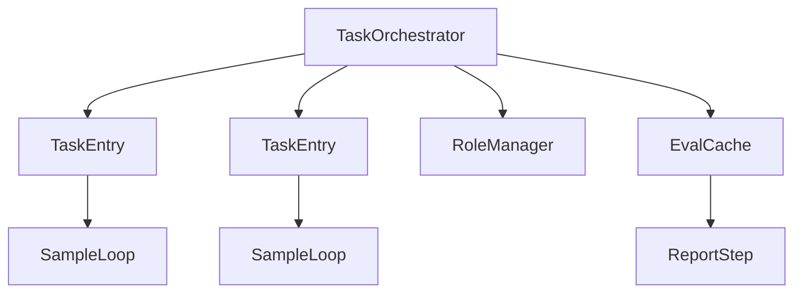

### 3.4 Sample 契约

评测过程中 Sample 在数据侧与评测侧共用一份**标准化Sample**。默认校验模型见 `src/gage_eval/assets/datasets/validation.py`。

最小必备字段建议：

| 字段 | 类型 | 说明 |
| --- | --- | --- |
| `id` | str | 样本 id |
| `messages` | list | 对话消息，支持多模态 content |
| `choices` | list | 结构化选项或标签，可为空 |
| `inputs` | dict | 预处理后输入容器，例如 `prompt` / `multi_modal_data` |
| `metadata` | dict | 任务元信息，例如答案、repo 信息等 |
| `predict_result` | list | 框架写入：推理输出历史 |
| `eval_result` | dict | 框架写入：裁判输出或评分结果 |

#### 3.4.1 示例：多模态标准化Sample

下面示例展示了 gage 推荐的多模态表达方式：以 `messages` 为主，必要时同步到 `inputs.multi_modal_data`（多模态归一化逻辑见 `src/gage_eval/assets/datasets/utils/multimodal.py:merge_multimodal_inputs`）。

```json
{
  "id": "demo_0001",
  "messages": [
    {
      "role": "user",
      "content": [
        { "type": "text", "text": "图片里写的是什么" },
        { "type": "image_url", "image_url": { "url": "https://example.com/demo.png" } }
      ]
    }
  ],
  "choices": [],
  "inputs": {
    "prompt": "图片里写的是什么",
    "multi_modal_data": {
      "image": ["https://example.com/demo.png"]
    }
  },
  "metadata": {
    "label": "hello"
  },
  "predict_result": [
    {
      "index": 0,
      "answer": "hello",
      "message": {
        "role": "assistant",
        "content": [{ "type": "text", "text": "hello" }]
      }
    }
  ],
  "eval_result": {}
}
```

消息内容片段的常用形态：

| type | 示例 | 说明 |
| --- | --- | --- |
| `text` | `{ "type": "text", "text": "..." }` | 文本片段 |
| `image_url` | `{ "type": "image_url", "image_url": { "url": "..." } }` | 图片引用或 data url |
| `audio_url` | `{ "type": "audio_url", "audio_url": { "url": "..." } }` | 音频引用或 data url |
| `file_url` | `{ "type": "file_url", "file_url": { "url": "..." } }` | 文件引用 |

> 推理输出会被统一归一化为 `message.content` 片段列表（由框架在写入 `predict_result` 时进行），便于后续 judge 与 metrics 统一读取。

#### 3.4.2 多模态归一化规则

为减少数据集之间的字段碎片化，预处理阶段会做两件事：

- `normalize_messages`：把 `sample.visual/sample.audio` 注入到 `messages` 的 user 消息中（见 `src/gage_eval/assets/datasets/utils/normalization.py:_inject_modal_fragments`）
- `merge_multimodal_inputs`：从 `visual/audio/messages` 中收集媒体引用，归并并去重到 `inputs.multi_modal_data`（见 `src/gage_eval/assets/datasets/utils/multimodal.py:merge_multimodal_inputs`）

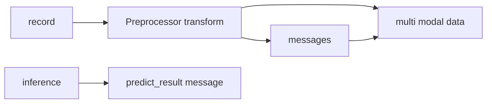

实践建议：

- **以 `messages` 为主**：多数后端以 chat messages 作为输入；`multi_modal_data` 更适合作为“媒体引用汇总表”
- **保持可复现**：本地图片建议通过 doc_to_visual 转成 data url，避免远端后端无法访问本地路径

#### 3.4.3 近期规划

Sample 标准化仍在演进中：近期会给出新的 Sample 标准化设计与更统一的字段契约，用于覆盖更多任务类型并减少配置碎片化。

更多 Sample 字段约定与演进方向见：[`sample_zh.md`](sample_zh.md)

## 4. 配置详解

### 4.1 PipelineConfig 顶层结构

一个典型配置（省略细节）：

```yaml
api_version: gage/v1alpha1
kind: PipelineConfig
metadata:
  name: demo

custom:
  steps:
    - step: inference
    - step: auto_eval

datasets: []
backends: []
role_adapters: []
metrics: []
tasks: []
```

字段说明：

| 字段 | 说明 | 代码入口 |
| --- | --- | --- |
| `datasets` | 数据源定义 | `src/gage_eval/assets/datasets/loaders/` |
| `backends` | 顶层后端列表，供 role 引用 | `src/gage_eval/role/model/backends/` |
| `role_adapters` | 角色胶水层，绑定 backend 与 prompt | `src/gage_eval/config/registry.py` |
| `custom.steps` | 单任务默认 step 链路 | `src/gage_eval/evaluation/pipeline.py` |
| `tasks` | 多任务编排入口 | `src/gage_eval/evaluation/task_plan.py` |
| `metrics` | 指标集合，task 可覆盖 | `src/gage_eval/metrics/` |
| `summary_generators` | summary 扩展生成器 | `src/gage_eval/pipeline/steps/report.py` |

#### 4.1.1 配置间 id 引用关系

gage 的配置强调“**声明与引用分离**”：先在顶层声明资源（datasets/backends/prompts/role_adapters/metrics），再通过 id 引用把它们串起来。

- dataset：`datasets[].dataset_id` 被 `tasks[].dataset_id` 引用（兼容字段 `dataset_ref`）
- role adapter：`role_adapters[].adapter_id` 被 `steps[].adapter_id` 引用（兼容字段 `role_ref`）
- backend：`backends[].backend_id` 被 `role_adapters[].backend_id` 引用（也支持在 role_adapters 内 inline `backend`）
- prompt：`prompts[].prompt_id` 被 `role_adapters[].prompt_id` 引用
- metric：`metrics[].metric_id` 被 `tasks[].metric_overrides[].metric_id` 引用（也可在 overrides 中补齐完整 spec）

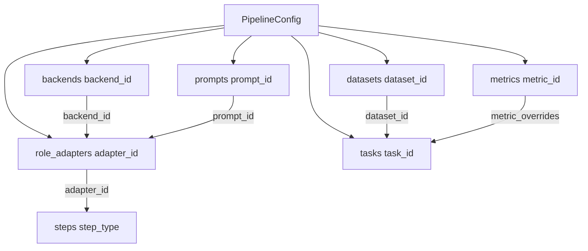

### 4.2 Datasets

#### 4.2.1 HuggingFace Hub

示例：`gage-eval-main/config/custom/mmmu_qwen_vl.yaml`

关键字段：

- `hub: huggingface`
- `hub_params.hub_id/subset/split/...`
- `loader: hf_hub`
- `params.preprocess`：指定预处理器，从 registry 解析
- `params.doc_to_visual`：多模态注入 callable

#### 4.2.2 本地 JSONL

示例：`gage-eval-main/config/custom/docvqa_qwen_vl.yaml`

关键字段：

- `loader: jsonl`
- `params.path`：JSONL 路径，建议 repo-root 相对路径
- `params.streaming`：可选，或文件较大时自动启用 streaming

#### 4.2.3 预处理与 doc_to_visual

`doc_to_visual/doc_to_text/doc_to_audio` 通过字符串引用可调用对象，例如 `gage_eval.assets.datasets.utils.multimodal:embed_local_message_images`。

实现要点（对应 `src/gage_eval/assets/datasets/loaders/loader_utils.py`）：

- 自动从 `preprocess_kwargs` 继承同名参数
- 若 callable 需要额外参数，可通过 `doc_to_visual_kwargs` 传入

#### 4.2.4 内置预处理流水线

无论你使用自定义预处理器（`params.preprocess`）还是默认兜底预处理器，最终都会把原始 record 统一为标准化Sample。其核心模板方法见 `src/gage_eval/assets/datasets/preprocessors/base.py` 的 `BasePreprocessor.transform`：

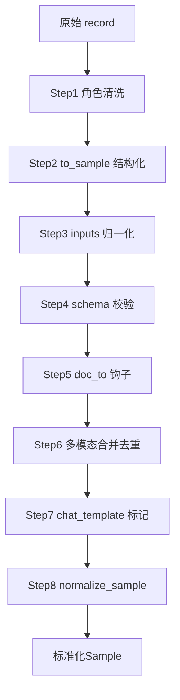

### 4.3 Backends

常用后端定位（以 `backend.type` 为准）：

| backend type | 典型场景 | 说明 |
| --- | --- | --- |
| `vllm` | 本地推理（主推） | 基于 AsyncLLMEngine，**统一支持文本与多模态**，具备高性能并发与探针能力 |
| `litellm` | 远端服务（主推） | 统一接入各类远端 API (OpenAI/Anthropic/Kimi/Grok 等)，支持参数归一化 |
| `sglang` | 高性能推理 | 接入 SGLang Server，支持极致吞吐与 KV Cache 复用 |
| `tgi` | 高性能推理 | 接入 HuggingFace TGI Server |
| `openai_http` | 远端服务 | OpenAI ChatCompletion 兼容接口 |
| `dummy` | 冒烟测试 | 回显 prompt 或按 responses 轮播 |

### 4.4 RoleAdapters

#### 4.4.1 模型类 RoleAdapter

模型类 RoleAdapter 通过组合 backend 实现“同一 role_type 切换不同推理引擎”的扩展方式：

- `dut_model`：被测模型
- `helper_model`：辅助模型（可在 support/judge 等阶段按需使用）
- `judge_model`：LLM as Judge 的裁判模型

通用实现基类：`src/gage_eval/role/adapters/model_role_adapter.py`

绑定方式（两选一）：

- `backend_id` 引用顶层 `backends[]`（推荐，便于复用）
- `backend` inline 声明后端（适合快速试验；若同时存在，inline 优先）

示例（节选，展示 backend_id 引用与 prompt 绑定）：

```yaml
backends:
  - backend_id: qwen3_openai_http
    type: openai_http
    config:
      base_url: http://127.0.0.1:1234/v1
      model: qwen3

role_adapters:
  - adapter_id: dut_text
    role_type: dut_model
    backend_id: qwen3_openai_http
    prompt_id: multi_choice_infer_prompt
    capabilities: [chat_completion]
```

#### 4.4.2 context_provider 扩展坞

- 适合做 RAG、知识注入、代码上下文准备等
- 通过 `implementation` 字段选择具体实现，从 `context_impls` registry 解析
- 默认实现示例：SWE-bench `swebench_repo`

#### 4.4.3 judge_extend 扩展坞

- 用于非 LLM 裁判或强约束裁判场景
- 通过 `implementation` 字段选择具体裁判实现，从 `judge_impls` registry 解析
- 默认实现示例：SWE-bench `swebench_docker`

#### 4.4.4 Step 与 Role 的组合关系

同一个 `PipelineConfig` 可以通过不同 step 链路 + RoleAdapter 组合覆盖不同评测场景（详见 1.4 的主图）。常见组合关系如下：

| step_type | 常见 role_type | 说明 |
| --- | --- | --- |
| `support` | `context_provider`, `toolchain`, `modal_processor`, `helper_model` | 上下文注入、工具准备、多模态预处理、辅助推理 |
| `inference` | `dut_model`, `dut_agent` | 对被测目标执行推理或 agent 流程 |
| `judge` | `judge_model`, `judge_extend` | LLM 裁判或离线严格裁判 |
| `auto_eval` | 内置 | 指标计算与聚合写入缓存 |
| `report` | 内置 | 汇总输出 `summary.json` |

### 4.5 Metrics

指标计算分两层：**per-sample 计算** 与 **汇总计算**。

#### 4.5.1 per-sample 计算

- 发生在 `auto_eval`：`AutoEvalStep.execute` 为每个样本调用 `MetricInstance.evaluate`
- 写入 `samples.jsonl`：每行包含 `sample/model_output/judge_output/metrics` 快照，便于回放与排障

#### 4.5.2 汇总计算

- 指标的聚合器在 `MetricInstance.evaluate` 时持续 `add`
- 在 `ReportStep.finalize` 触发 `AutoEvalStep.aggregated_metrics`，对聚合器 `finalize`
- 写入 `summary.json`：适合做 scoreboard 与报表展示

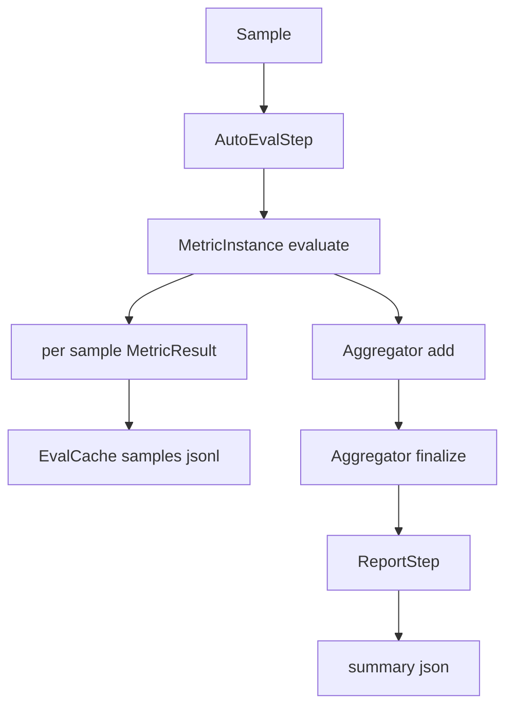

#### 4.5.3 指标配置写法与函数式简写

`metrics` 支持多种等价写法，便于在 YAML 中“少写对象，多写意图”（解析逻辑见 `src/gage_eval/config/pipeline_config.py:_normalize_metric_entry`）：

| 写法 | YAML 示例 | 适用场景 |
| --- | --- | --- |
| 字符串简写 | `- exact_match` | 不需要参数、直接使用内置实现 |
| KV 简写 | `- exact_match: {case_sensitive: true}` | 少量参数，且 `metric_id == implementation` |
| 函数式简写 | `- exact_match(case_sensitive=true, strip_whitespace=false)` | 少量扁平参数，阅读更接近“调用” |
| 完整对象 | 见下方 | 需要多个同实现不同参数的指标，或需要稳定的 `metric_id` |

函数式简写规则与限制：

- 仅支持扁平 `k=v` 参数，使用逗号分隔；值支持 `true/false/null`、整数、小数、以及带引号的字符串
- 若传入 `aggregation=...` 会被提取为聚合器配置（等价于对象写法里的 `aggregation` 字段）
- **同一 implementation 的多份参数版本**请使用“完整对象”并显式指定不同的 `metric_id`

示例：同一份配置里混用多种写法（可复制）：

```yaml
metrics:
  # 1) 字符串简写：metric_id 与 implementation 同名
  - exact_match

  # 2) KV 简写：key 为 metric_id 与 implementation，同层 dict 为 params
  - regex_match:
      pattern: "^A$"
      ignore_case: true

  # 3) 函数式简写：扁平参数更紧凑
  - exact_match(case_sensitive=true, strip_whitespace=false)

  # 4) 完整对象：同一实现的多个参数版本需要不同 metric_id
  - metric_id: exact_match_cs
    implementation: exact_match
    params:
      case_sensitive: true
```

### 4.6 Tasks 与多任务

- `tasks` 为空：走单任务 runtime
- `tasks` 非空：走多任务 orchestrator
- inference step 若省略 `adapter_id`：当且仅当存在唯一 `dut_model` 时会自动推断（见 `src/gage_eval/evaluation/task_plan.py`）

### 4.7 运行参数、模板与运行配置

#### 4.7.1 `run.py` CLI 参数

常用参数（详见 `python gage-eval-main/run.py --help`）：

| 参数 | 作用 |
| --- | --- |
| `--config` | 配置文件路径 |
| `--dataset-id` | 单任务模式下选择数据集 |
| `--gpus` | ResourceProfile 的 GPU 数，主要用于并发与池规划 |
| `--cpus` | ResourceProfile 的 CPU 数 |
| `--concurrency` | 覆盖并发度，写入 `GAGE_EVAL_THREADS` |
| `--max-samples` | 覆盖样本数上限，写入 `GAGE_EVAL_MAX_SAMPLES` |
| `--output-dir` | 产物根目录，写入 `GAGE_EVAL_SAVE_DIR` |
| `--run-id` | 固定 run_id，便于复现与比对 |
| `--model-path` | 覆盖 `vllm` 后端的 `model_path` |

#### 4.7.2 常用环境变量

| 环境变量 | 作用 | 代码落点 |
| --- | --- | --- |
| `GAGE_EVAL_SAVE_DIR` | 产物根目录 | `src/gage_eval/observability/trace.py`, `src/gage_eval/evaluation/cache.py` |
| `GAGE_EVAL_THREADS` | 并发度 | `src/gage_eval/evaluation/sample_loop.py`, `src/gage_eval/evaluation/runtime_builder.py` |
| `GAGE_EVAL_MAX_SAMPLES` | 最大样本数 | `src/gage_eval/evaluation/sample_loop.py` |
| `GAGE_EVAL_PREFETCH_FACTOR` | 预取倍数 | `src/gage_eval/evaluation/sample_loop.py` |
| `GAGE_EVAL_MAX_INFLIGHT` | 最大在途样本数 | `src/gage_eval/evaluation/sample_loop.py` |
| `GAGE_EVAL_REPORT_HTTP_URL` | 事件 HTTP 上报地址 | `src/gage_eval/observability/trace.py` |
| `GAGE_EVAL_ENABLE_BUFFERED_WRITER` | 启用 buffered samples 写入 | `src/gage_eval/evaluation/cache.py` |

#### 4.7.3 BuiltinTemplate 固化模板

BuiltinTemplate 用于把一份稳定的 PipelineConfig “固化”为可复用模板，通常落在：

- `gage-eval-main/config/builtin_templates/<name>/vN.yaml`

示例：`gage-eval-main/config/builtin_templates/demo_echo/v1.yaml`

其核心结构（示意）：

```yaml
kind: BuiltinTemplate
metadata:
  name: demo_echo
  version: V1
  digest: sha256:...
definition:
  datasets: [...]
  backends: [...]
  role_adapters: [...]
  custom: {steps: [...]}
```

#### 4.7.4 RunConfig 运行配置

RunConfig 用于“在模板基础上做运行期覆盖”，由 `run.py` 在运行前编译为 PipelineConfig：

- `kind: RunConfig`
- `base_task: builtin/<name>` 引用 BuiltinTemplate
- `runtime` 提供 datasets/backends/tasks 的覆盖参数

示例：`gage-eval-main/config/run_configs/demo_echo_run_1.yaml`

运行时同时支持两种入口：

- `--config` 指向 PipelineConfig：直接运行
- `--config` 指向 RunConfig：先编译再运行（并校验 `template_version/template_digest`）

#### 4.7.5 distill 与 init

distill：从 PipelineConfig 生成 BuiltinTemplate（默认单任务优先，多任务需显式允许）：

```bash
python gage-eval-main/run.py \
  --config gage-eval-main/config/custom/piqa_qwen3.yaml \
  --distill \
  --builtin-name piqa_qwen3
```

init：从 BuiltinTemplate 生成 RunConfig 或 PipelineConfig（输出到 `config/run_configs` 或 `config/custom`）：

```bash
python gage-eval-main/run.py --init demo_echo --init-mode run-config
python gage-eval-main/run.py --init demo_echo --init-mode pipeline-config
```

## 5. 最佳实践

先给一个“场景导航表”，方便按场景直接套用（所有示例默认以 repo-root 为工作目录运行）：

| 场景 | 难度 | 核心特性 | 配置文件 | 典型 Step 组合 | 关键 Role |
| --- | --- | --- | --- | --- | --- |
| 最小冒烟 | 入门 | RunConfig 编译；dummy backend | [`gage-eval-main/config/run_configs/demo_echo_run_1.yaml`](../../config/run_configs/demo_echo_run_1.yaml) | `inference -> auto_eval` | `dut_model` |
| 文本多选 | 入门 | 结构化 choices；自动指标 | [`gage-eval-main/config/custom/piqa_qwen3.yaml`](../../config/custom/piqa_qwen3.yaml) | `inference -> auto_eval` | `dut_model` |
| GPQA | 进阶 | 专家级多选；Few-shot | [`gage-eval-main/config/custom/gpqa_diamond_vllm_async_chat.yaml`](../../config/custom/gpqa_diamond_vllm_async_chat.yaml) | `inference -> auto_eval` | `dut_model` |
| LLM 裁判 | 进阶 | 推理后引入裁判；阈值或裁判指标 | [`gage-eval-main/config/custom/single_task_local_judge_qwen.yaml`](../../config/custom/single_task_local_judge_qwen.yaml) | `inference -> judge -> auto_eval` | `dut_model`, `judge_model` |
| 多任务编排 | 进阶 | TaskOrchestrator；task override | [`gage-eval-main/config/custom/multi_task_openai_http_demo.yaml`](../../config/custom/multi_task_openai_http_demo.yaml) | 各 task 自定义 | `dut_model` |
| DocVQA | 进阶 | doc_to_visual；image_url | [`gage-eval-main/config/custom/docvqa_qwen_vl.yaml`](../../config/custom/docvqa_qwen_vl.yaml) | `inference -> auto_eval` | `dut_model` |
| MathVista | 进阶 | 多模态输入；答案抽取 | [`gage-eval-main/config/custom/mathvista_vllm_async_chat.yaml`](../../config/custom/mathvista_vllm_async_chat.yaml) | `inference -> auto_eval` | `dut_model` |
| MMMU | 进阶 | HF Hub；多模态预处理；并发控制 | [`gage-eval-main/config/custom/mmmu_qwen_vl.yaml`](../../config/custom/mmmu_qwen_vl.yaml) | `inference -> auto_eval` | `dut_model` |
| SWE-bench Pro | 高级 | context_provider；judge_extend；离线 Docker 裁判 | [`gage-eval-main/config/custom/swebench_pro_smoke.yaml`](../../config/custom/swebench_pro_smoke.yaml) | `support -> inference -> judge -> auto_eval` | `context_provider`, `dut_model`, `judge_extend` |

### 5.1 Step 与 Role 的组合套路

用 Step 链路描述流程，用 RoleAdapter 承载能力。

| 场景 | steps 推荐 | 关键角色 |
| --- | --- | --- |
| 纯自动评测 | `inference -> auto_eval` | `dut_model` |
| LLM 裁判 | `inference -> judge -> auto_eval` | `dut_model`, `judge_model` |
| 上下文增强 | `support -> inference -> auto_eval` | `context_provider`, `dut_model` |
| 工程评测 | `support -> inference -> judge -> auto_eval` | `context_provider`, `dut_model`, `judge_extend` |

### 5.2 文本类示例

#### 5.2.1 PIQA 多选

配置：`gage-eval-main/config/custom/piqa_qwen3.yaml`

运行：

```bash
python gage-eval-main/run.py \
  --config gage-eval-main/config/custom/piqa_qwen3.yaml \
  --output-dir runs \
  --run-id piqa_smoke \
  --max-samples 50
```

#### 5.2.2 多任务示例

配置：`gage-eval-main/config/custom/multi_task_openai_http_demo.yaml`

要点：

- 两个 task 共享同一个 backend
- 每个 task 通过 `metric_overrides` 选择不同指标子集

### 5.3 多模态示例

#### 5.3.1 DocVQA

配置：`gage-eval-main/config/custom/docvqa_qwen_vl.yaml`

要点：

- JSONL 里的 `messages` 包含 `image_url`
- 使用 `doc_to_visual` 把本地图片转为 data url，供远端 Vision LLM 使用

#### 5.3.2 MMMU

配置：`gage-eval-main/config/custom/mmmu_qwen_vl.yaml`

要点：

- HF Hub 数据集 + `preprocess: mmmu_multimodal_inputs`
- TaskSpec 中 `concurrency` 控制 SampleLoop 并发

### 5.4 SWE-bench Pro

SWE-bench 是 Step 与 Role 组合的代表性场景：

- `support` 使用 `context_provider` 注入 repo 结构与关键文件片段
- `inference` 让 DUT 输出补丁
- `judge` 使用 `judge_extend` 通过 Docker 离线执行测试并判定 resolved
- `auto_eval` 计算 resolve_rate 并聚合 failure_reason

#### 5.4.1 扩展坞配置解读

配置：`gage-eval-main/config/custom/swebench_pro_smoke.yaml`

关键片段：

```yaml
custom:
  steps:
    - step: support
      adapter_id: swebench_context_provider
    - step: inference
      adapter_id: swebench_dut_model
    - step: judge
      adapter_id: swebench_docker_judge
    - step: auto_eval

role_adapters:
  - adapter_id: swebench_context_provider
    role_type: context_provider
    params:
      implementation: swebench_repo
      implementation_params:
        repo_source: docker_image
        repo_root: /app
        topk_files: 5
        block_network: true

  - adapter_id: swebench_docker_judge
    role_type: judge_extend
    params:
      implementation: swebench_docker
      implementation_params:
        scripts_dir: gage-eval-main/third_party/swebench_pro/run_scripts
        block_network: true
        test_timeout_s: 900
```

#### 5.4.2 运行命令

```bash
python gage-eval-main/run.py \
  --config gage-eval-main/config/custom/swebench_pro_smoke.yaml \
  --output-dir runs \
  --run-id swebench_smoke \
  --concurrency 1
```

#### 5.4.3 输出与排障建议

- 关注 `runs/swebench_smoke/summary.json` 的 `swebench_summary`
- 关注 `runs/swebench_smoke/logs/<instance_id>/` 下的 `stdout.log` `stderr.log` `output.json`

### 5.5 性能调优

#### 5.5.1 SampleLoop 背压参数

- `GAGE_EVAL_PREFETCH_FACTOR`：预取倍数，越大越能隐藏数据加载延迟
- `GAGE_EVAL_MAX_INFLIGHT`：在途样本上限，控制显存压力与后端压力

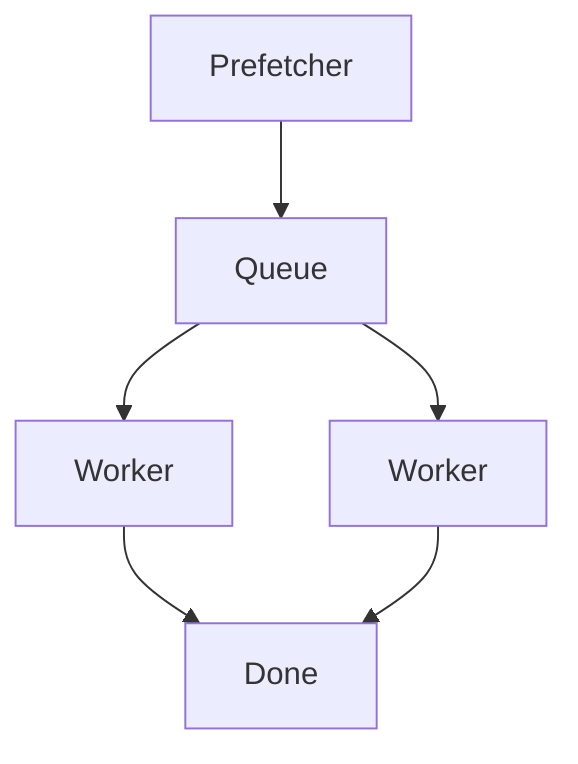

#### 5.5.2 大规模落盘

当样本数很大时可开启 buffered writer：

- `GAGE_EVAL_ENABLE_BUFFERED_WRITER=1`
- 或设置 `GAGE_EVAL_BUFFER_THRESHOLD` 让其自动启用

## 6. 扩展开发

### 6.1 资源注册机制 Registry

gage 通过全局 Registry 管理“可扩展资产”，典型目标是：**不改核心调度代码**，只通过注册与配置切换完成扩展。

核心入口：

- Registry 单例：`src/gage_eval/registry/__init__.py`
- 默认 kinds：`DEFAULT_KINDS`（可扩展资源类型清单）
- 自动发现：导入 `gage_eval` 时触发 `registry.auto_discover`（见 `src/gage_eval/__init__.py`）

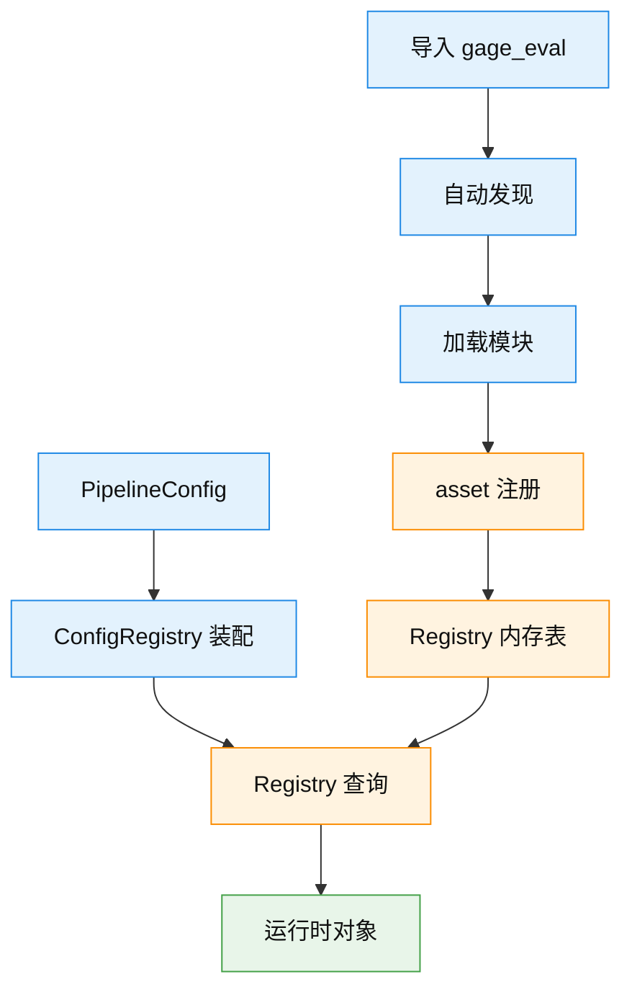

可扩展资源类型（全量，来自 `DEFAULT_KINDS`）：

| kind | 含义 | 典型引用位置 |
| --- | --- | --- |
| `backends` | 模型推理与外部服务后端 | `backends[].type` 或 role_adapters inline `backend.type` |
| `roles` | 角色适配器 | `role_adapters[].role_type` |
| `metrics` | 指标计算器 | `metrics[].implementation`、`tasks[].metric_overrides` |
| `context_impls` | 上下文提供实现 | `role_adapters[].params.implementation`，常见于 `context_provider` |
| `judge_impls` | 裁判扩展实现 | `role_adapters[].params.implementation`，常见于 `judge_extend` |
| `dataset_hubs` | 数据集源 | `datasets[].hub` |
| `dataset_loaders` | 数据集加载器 | `datasets[].loader` |
| `dataset_preprocessors` | 数据集预处理器 | `datasets[].params.preprocess` |
| `doc_converters` | Doc 转 Sample 转换器 | 预留扩展点 |
| `prompts` | Prompt 模版资产 | `prompts[].prompt_id` 被 role_adapters 引用 |
| `model_hubs` | 模型资产源 | `models[].hub` |
| `templates` | 配置模版资产 | 预留扩展点 |
| `reporting_sinks` | 报告下沉 | `tasks[].reporting.sinks[].type` |
| `summary_generators` | 报告摘要生成器 | `summary_generators[]` 或 env `GAGE_EVAL_SUMMARY_GENERATORS` |
| `observability_plugins` | 观测插件 | `observability` 配置（按需接入） |
| `pipeline_steps` | Pipeline 执行步骤 | 内置 step 装配 |

> 说明：只有被 `src/gage_eval/__init__.py` 纳入 auto-discover 的包会在启动时自动注册；其他扩展点可以通过显式 import 或配置直引方式接入。

如何扩展（两种常用方式）：

- **注册式**：把实现放在 `gage_eval` 的 auto-discover 包路径下，使用 `@registry.asset(...)` 注册
- **直引式**：在配置里直接写 Python 路径（例如 metric 用 `pkg.mod:Class`，role 用 `class_path`），由运行时 import

#### 6.1.1 Copy-paste 示例：同文件注册预处理器与指标

只要**模块能被导入**，就可以在同一个文件中同时注册多个 kind 的资产。下面示例可直接复制到一个会被导入的位置（例如 `src/gage_eval/metrics/builtin/my_assets.py`），然后在 YAML 里引用 `preprocess` 与 `metrics`。

```python
from __future__ import annotations

from typing import Any, Dict

from gage_eval.assets.datasets.preprocessors.base import BasePreprocessor
from gage_eval.metrics.base import MetricContext, SimpleMetric
from gage_eval.registry import registry


@registry.asset("dataset_preprocessors", "demo_preprocess", desc="示例预处理器", tags=("demo",))
class DemoPreprocessor(BasePreprocessor):
    name = "demo_preprocess"

    def to_sample(self, record: Dict[str, Any], **kwargs: Any) -> Dict[str, Any]:
        # 将原始 record 映射到 gage 的标准化Sample字段
        prompt = str(record.get("question") or record.get("prompt") or "")
        label = record.get("answer") or record.get("label")
        return {
            "prompt": prompt,
            "label": "" if label is None else str(label),
            "metadata": {"source": "demo_preprocess"},
        }


@registry.asset("metrics", "demo_length", desc="示例指标：统计输出长度", tags=("demo",))
class DemoLengthMetric(SimpleMetric):
    value_key = "length"

    def compute_value(self, context: MetricContext):
        # 推荐用 context.get 读取字段，支持 sample/model_output/judge_output 路径选择
        text = context.get("model_output.answer", default="") or ""
        text = str(text)
        return float(len(text)), {"preview": text[:50]}
```

对应 YAML 使用方式（节选）：

```yaml
datasets:
  - dataset_id: demo_dataset
    loader: jsonl
    params:
      path: local-datasets/demo.jsonl
      preprocess: demo_preprocess

metrics:
  - demo_length
```

查看当前已注册资产（生成 manifest）：

```bash
python gage-eval-main/scripts/build_registry_manifest.py --out gage-eval-main/registry_manifest.yaml
```

### 6.2 新增 Metric

1) 在 `gage-eval-main/src/gage_eval/metrics/` 下实现 `SimpleMetric`  
2) 使用 `@registry.asset("metrics", ...)` 注册  
3) 在 YAML 中通过 `metrics[].implementation` 引用注册名

模板示例：

```python
from gage_eval.metrics.base import MetricContext, SimpleMetric
from gage_eval.registry import registry

@registry.asset("metrics", "my_metric", desc="示例指标", tags=("custom",))  # 注册到 registry，供 YAML 引用
class MyMetric(SimpleMetric):
    def compute_value(self, context: MetricContext):
        # 返回：score 与附加信息
        return 1.0, {"note": "ok"}
```

### 6.3 新增 context_impls 或 judge_impls

- context：实现 `provide` 或 `aprovide`，注册到 `context_impls`
- judge：实现 `invoke` 或 `ainvoke`，注册到 `judge_impls`

### 6.4 新增 Backend

1) 实现一个 backend 类（可继承 `Backend` 或 `EngineBackend`）并注册到 `backends`：

```python
from gage_eval.registry import registry
from gage_eval.role.model.backends.base_backend import Backend

@registry.asset("backends", "my_backend", desc="示例后端", tags=("backend",))
class MyBackend(Backend):
    async def ainvoke(self, payload: dict) -> dict:
        # payload 为 RoleAdapter 规范化后的请求
        return {"text": "hello", "latency_ms": 1.0}
```

2) 在 YAML 中声明并被 RoleAdapter 引用：

```yaml
backends:
  - backend_id: my_backend_1
    type: my_backend
    config: {}

role_adapters:
  - adapter_id: dut_demo
    role_type: dut_model
    backend_id: my_backend_1
```

### 6.5 新增 DatasetPreprocessor

1) 实现预处理器并注册到 `dataset_preprocessors`：

```python
from gage_eval.registry import registry
from gage_eval.assets.datasets.preprocessors.base import DatasetPreprocessor

@registry.asset("dataset_preprocessors", "my_pre", desc="示例预处理器", tags=("dataset",))
class MyPreprocessor(DatasetPreprocessor):
    def transform(self, sample: dict, **kwargs):
        # 在这里把原始 record 转换为标准化Sample
        sample.setdefault("metadata", {})["preprocessed_by"] = "my_pre"
        return sample.get("inputs")
```

2) 在 dataset 配置中启用：

```yaml
datasets:
  - dataset_id: my_ds
    loader: jsonl
    params:
      path: local-datasets/my_ds.jsonl
      preprocess: my_pre
```

### 6.6 快速接入新数据集

`src/gage_eval/support/` 是面向 Benchmark 作者的“开发辅助模块”，用于把“接入一个新 Benchmark”拆成流水线：`inspect -> design -> implement`。

> 说明：评测运行入口仍以 `gage-eval-main/run.py` 为准；support 模块主要用于“生成资产与校验接线”。

详细使用指南见：[`support_cli_zh.md`](support_cli_zh.md)

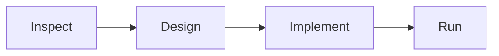

最常用工作流（从 mono-repo 根目录运行）：

```bash
# 1) 看清数据结构
PYTHONPATH=gage-eval-main/src python -m gage_eval.support inspect <dataset_or_path> --max-samples 5

# 2) 生成 design.md 单一真相源
PYTHONPATH=gage-eval-main/src python -m gage_eval.support design <slug>

# 3) 预览写盘清单并生成资产
PYTHONPATH=gage-eval-main/src python -m gage_eval.support implement <slug>
```

> 提示：support 的 implement 默认为 dry-run；确认无误后再加 `--force` 执行写盘。

## 7. 测试与校验

- 配置校验：
  ```bash
  PYTHONPATH=gage-eval-main/src python -m gage_eval.tools.config_checker \
    --config gage-eval-main/config/custom/piqa_qwen3.yaml
  ```
- 测试说明见 `gage-eval-main/TESTING.md`

## 8. 近期开发计划

> 本章记录 gage-eval 的近期演进方向，可能会根据内部验证反馈持续调整。

### 8.1 标准化Sample与数据链路

- 沉淀统一的标准化Sample字段规范与校验器，覆盖文本、多模态与工程类任务
- 优化数据加载与预处理链路，做到“输入多样、输出统一”，让 Step 与 RoleAdapter 可复用、可组合
- 补齐 Sample 诊断与排障能力，降低接入与维护成本

### 8.2 gage-client 独立项目

- 面向使用者：提供更友好的运行体验，例如配置初始化、运行参数管理、产物浏览与失败样本定位
- 面向开发者：提供更低成本的 Benchmark 接入体验，例如模板与脚手架、工作流标准化与测试基座
- 与核心运行时解耦：gage-client 聚焦体验与工程化，核心仍以 `run.py` 作为最小可运行入口

### 8.3 多机推理：RoleType Controller

- 新增 `controller` 类型 RoleAdapter，拆分“调度控制”与“实际推理执行”
- 支持通过配置声明 controller、worker 与 protocol，从单机平滑升级到多机推理
- 重点能力：任务分片、负载均衡、健康检查、重试与超时控制

### 8.4 Benchmark 持续扩展

- 持续新增并维护不同场景的 Benchmark 与参考配置，覆盖文本、多模态、LLM as Judge、工程评测等
- 对每个 Benchmark 提供：数据准备说明、最小 smoke 配置、指标解释与排障指引
