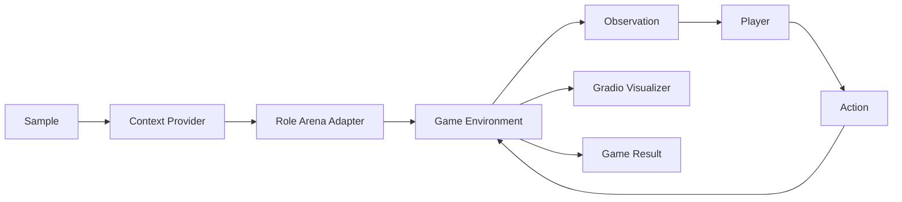
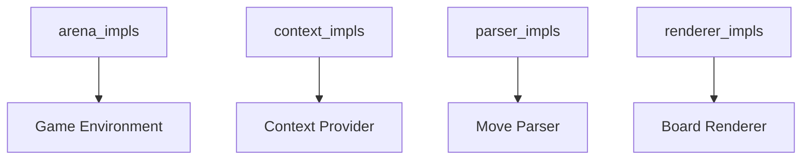

# Game Arena Guide

English | [中文](game_arena_zh.md)

Game Arena is a turn-based evaluation lane built on the `arena` role. It wires a game environment, player adapters, a move parser, and an optional Gradio UI to support **LLM vs LLM** and **Human vs LLM** matches.

## 1. Scope and goals

- Target turn-based board games with coordinate moves (e.g., Gomoku, Tic-Tac-Toe).
- Keep orchestration inside the standard pipeline (`support -> arena -> auto_eval`).
- Extend via registries, no changes to core orchestration required.

## 2. Architecture



Key runtime objects:

- **Observation**: `board_text`, `legal_moves`, `active_player`, `last_move`, `metadata`.
- **Action**: a move string (e.g., `H8` or `2,2`).
- **GameResult**: winner, result, final board, move log.

## 3. Core design principles

### 3.1 Core abstractions and role mapping

ArenaRole is a RoleAdapter instantiated by RoleManager, responsible for the full match loop and state aggregation.

| Abstraction | Responsibility |
| --- | --- |
| ArenaRole | Orchestrate the game loop and integrate state |
| Environment | Manage state and produce observations |
| RuleEngine | Validate moves and determine terminal states |
| Scheduler | Control turn order and max turns |
| Player Interface | Map observation to action |
| MoveParser | Parse text into a move |
| Visualizer | Render UI and enable human interaction |

Player mapping:

- LLM player uses the `dut_model` adapter (`LLMPlayer`).
- Human player uses the `human` adapter (`HumanPlayer`).

### 3.2 Shared vs game-specific layers

| Type | Scope | Notes |
| --- | --- | --- |
| Player Interface | Shared | Reusable across games |
| MoveParser | Shared | `grid_parser_v1` for grid coordinates |
| Visualizer | Shared | Gradio UI + renderer contract |
| Environment | Game-specific | `gomoku_local_v1`, `tictactoe_v1` |
| Rule logic | Game-specific | Integrated in each environment |
| Scheduler | Shared | `turn` and `tick` schedulers |

### 3.3 Schedulers and player hooks

| Scheduler | Behavior | Player interface |
| --- | --- | --- |
| TurnScheduler | Stop-and-wait turns | `think(observation) -> action` |
| TickScheduler | Tick-driven polling | Optional async hooks |

Optional async hooks used by TickScheduler:

```python
def start_thinking(self, observation, deadline_ms: int) -> None:
    ...

def has_action(self) -> bool:
    ...

def pop_action(self) -> ArenaAction:
    ...
```

## 4. Core components

| Component | Registry key | Example impl | Responsibility |
| --- | --- | --- | --- |
| Environment | `arena_impls` | `gomoku_local_v1`, `tictactoe_v1` | Maintain board state, apply moves, check terminal states |
| Context | `context_impls` | `gomoku_context`, `tictactoe_context` | Provide rules + board intro prompt |
| Parser | `parser_impls` | `grid_parser_v1` | Parse model output into coordinates |
| Renderer | `renderer_impls` | `gomoku_board_v1`, `tictactoe_board_v1` | HTML/CSS board rendering + click-to-move |

Supporting modules:

- **Scheduler**: `turn` or `tick` scheduling (`src/gage_eval/role/arena/schedulers`).
- **Players**: `LLMPlayer` and `HumanPlayer` (`src/gage_eval/role/arena/players`).
- **Visualizer**: Gradio UI (`src/gage_eval/role/arena/visualizers/gradio_visualizer.py`).

## 5. Registry wiring



Minimal registration pattern:

```python
from gage_eval.registry import registry

@registry.asset("arena_impls", "tictactoe_v1")
class TicTacToeArenaEnvironment:
    ...
```

## 6. Configuration example

Tic-Tac-Toe (Human vs LLM):

```yaml
role_adapters:
  - adapter_id: tictactoe_arena
    role_type: arena
    params:
      environment:
        impl: tictactoe_v1
        board_size: 3
        coord_scheme: ROW_COL
      scheduler:
        type: turn
        max_turns: 9
      parser:
        impl: grid_parser_v1
        board_size: 3
        coord_scheme: ROW_COL
      visualizer:
        enabled: true
        title: GAGE Tic-Tac-Toe Arena
        wait_for_finish: true
        coord_scheme: ROW_COL
        renderer:
          impl: tictactoe_board_v1
      players:
        - name: X
          type: backend
          ref: tictactoe_player_x_litellm
        - name: O
          type: human
          ref: tictactoe_human
```

Naming fallback:
- If `player_names` is not provided, equals the raw `player_id`, or matches a generic `Player N` label, the arena will fall back to the player adapter id (`ref`) for display. This avoids UI labels like `player_0` or `Player 0` when a backend adapter is configured.

Datasets for demos are stored under `tests/data/`:

- `tests/data/Test_Gomoku_LiteLLM.jsonl`
- `tests/data/Test_TicTacToe.jsonl`

## 7. Interaction and UI

- When a **human** player is present, the arena switches to `interactive` mode.
- Board clicks are converted to coordinates and submitted via `build_board_interaction_js`.
- If `wait_for_finish` is enabled, the UI shows a **Finish** button and the pipeline waits for a confirmation. It auto-confirms after 15 seconds.

### 7.1 UI preview


## 8. Demos and tests

Demo configs:

- `config/custom/gomoku_litellm_local.yaml`
- `config/custom/gomoku_human_vs_llm.yaml`
- `config/custom/tictactoe_litellm_local.yaml`
- `config/custom/tictactoe_human_vs_llm.yaml`

run command:

python run.py -c config/custom/gomoku_human_vs_llm.yaml
Related tests:

- `tests/unit/core/arena/test_gomoku_environment.py`
- `tests/unit/core/arena/test_tictactoe_environment.py`
- `tests/unit/core/role/test_gomoku_context.py`
- `tests/unit/core/role/test_tictactoe_context.py`
- `tests/unit/core/role/test_gomoku_board_renderer.py`
- `tests/unit/core/role/test_tictactoe_board_renderer.py`

## 9. Advanced Example: Doudizhu Showdown

### 9.1 Quick Start

Prerequisites:
- Node.js + npm
- First time setup: `cd frontend/rlcard-showdown && npm install --legacy-peer-deps`
- Set API Key: `OPENAI_API_KEY` (or `LITELLM_API_KEY`)
- Ensure `PYTHON_BIN` in `run_doudizhu_showdown` points to the correct environment

One-click Start:
```bash
scripts/oneclick/run_doudizhu_showdown.sh       # 3 AI players
scripts/oneclick/run_doudizhu_showdown_human.sh # Human vs AI
```

After startup, the script will output:
```
[oneclick] replay url: http://127.0.0.1:<port>/replay/doudizhu?...
```
If the browser does not open automatically, please manually open this URL.

Common Environment Variables:
- `RUN_ID`: Run identifier (defaults to timestamp)
- `OUTPUT_DIR`: Output directory (defaults to `./runs`)
- `FRONTEND_PORT` / `REPLAY_PORT`: Frontend and Replay Server ports (automatically increments if occupied)
- `AUTO_OPEN=0`: Disable auto-opening the browser
- `FRONTEND_DIR`: Frontend directory (defaults to `frontend/rlcard-showdown`)

### 9.2 Script Flow Explanation
(Corresponding to `scripts/oneclick/run_doudizhu_showdown.sh`)

The main flow of the script:
1. Parses project root and Python path, reads default config `config/custom/doudizhu_litellm_local.yaml`.
2. Checks if `OPENAI_API_KEY` / `LITELLM_API_KEY`, Node.js/npm, and frontend dependencies are ready.
3. Automatically selects free ports and starts the replay server.
4. Starts the frontend (`npm run start`) and attempts to open the replay page.
5. Runs `run.py` to execute the game and outputs the replay link.

Built-in defaults (can be modified in the script if necessary):
- `PYTHON_BIN`: Python interpreter path (defaults to venv inside the project).
- `CFG`: Run configuration file path (defaults to `config/custom/doudizhu_litellm_local.yaml`).
- `SAMPLE_ID`: Replay Sample ID (defaults to `doudizhu_litellm_0001`).

### 9.3 Replay and Output

Replay file path (default):
```
runs/<run_id>/replays/doudizhu_replay_<sample_id>.json
```

Replays are served by the replay server and read by the frontend via the `replay_url` parameter.
If you need to locate the replay file, you can read the JSON directly from the path above.

### 9.4 GameResult and Result Flow

The GAGE arena step produces a `GameResult` after a game ends and writes it to the sample's `predict_result` for downstream consumption (judge/auto_eval):
- Write location: `src/gage_eval/evaluation/task_planner.py` → `append_predict_result()`
- Format source: `src/gage_eval/role/adapters/arena.py::_format_result()`

Standard Fields (Consistent with Gomoku):
- `winner`: Winner player_id (or `null`)
- `result`: `"win" | "draw" | "loss"`
- `reason`: Game end reason (e.g., `terminal`/`illegal_move`/`max_turns`)
- `move_count` / `illegal_move_count`
- `final_board`: Final board snapshot (text)
- `game_log`: Detailed action log
- `rule_profile` / `win_direction` / `line_length`

Gomoku `game_log` structure (Example):
```json
{"index": 1, "player": "player_0", "coord": "H8", "row": 7, "col": 7}
```

Doudizhu `game_log` structure (`doudizhu_arena_v1`):
```json
{
  "index": 1,
  "player": "player_0",
  "action_id": 123,
  "action_text": "333444",
  "action_cards": ["S3","H3","D3","C4","S4","H4"],
  "chat": "Raise first",
  "timestamp_ms": 1730000000000
}
```

Notes:
- Doudizhu's `final_board` is a text snapshot from `_snapshot_board()`, containing Public/Private State, Legal Moves preview, Chat Log, etc.
- If downstream tasks only care about the winner/result, read `winner`/`result` directly. Use `game_log` for replay details.

### 9.5 Execution Logic (Key Flow)

#### 1) Dataset Input (System Prompt)

Location: `tests/data/Test_Doudizhu_LiteLLM.jsonl`

Core Fields:
- `messages`: System prompt, determining AI persona/tone/output format.
- `metadata.player_ids`: Player IDs (e.g., `player_0/1/2`).
- `metadata.start_player_id`: Starting player.

#### 2) Runtime Observation (Turn-based Context)

The backend constructs an observation every turn and passes it to the LLM:
- File: `src/gage_eval/role/arena/games/doudizhu/env.py`
- Entry: `observe()` and `_format_board_text()`

Observation includes:
- `Public State` / `Private State` (JSON)
- `Legal Moves (preview)` (Truncated by default)
- `Chat Log` (If chat is enabled)
- `UI_STATE_JSON` (Structured state required for frontend rendering)

`metadata` also carries:
- `player_ids` / `player_names`
- `public_state` / `private_state`
- `chat_log` / `chat_mode`

#### 3) LLM Prompt Assembly

Location: `src/gage_eval/role/arena/players/llm_player.py`

Assembly Order:
1. Dataset `messages` (System Prompt)
2. Runtime Observation (including board_text + legal moves + instructions)

When `chat_mode` is `ai-only`/`all`, it requests output:
```json
{"action": "<action>", "chat": "<short line>"}
```

Example (Actual context seen by the model):
```text
[system]
Start Doudizhu. Output exactly one legal action string such as 'pass' or card ranks like '33'. You may also output JSON: {"action": "pass", "chat": "..."}.

[user]
Active player: Player 0 (player_0)
Opponent last move: pass

Current State:
Public State:
{"round":2,"landlord_id":"player_0","last_move":"pass",...}
 
Private State:
{"hand":["S3","H3","D3","C4","S4","BJ","RJ",...],...}

Legal Moves (preview): pass, 33, 44, 34567, ...

Chat Log:
[{"player_id":"player_1","text":"I'll pass."}]...

UI_STATE_JSON:
{"player_ids":["player_0","player_1","player_2"],"hands":[...],"latest_actions":[...],...}

Status:
- Legal moves (preview): pass, 33, 44, 34567, ...

Instructions:
- Choose exactly one legal action string from the legal moves.
- Include a short table-talk line every turn.
- Output JSON: {"action": "<action>", "chat": "<short line>"}
```

#### 4) Replay Writing and Frontend Reading

Replay writing by `doudizhu_arena_v1`:
- File: `src/gage_eval/role/arena/games/doudizhu/env.py`
- Output Path: `runs/<run_id>/replays/doudizhu_replay_<sample_id>.json`

Replay Server:
- File: `src/gage_eval/tools/replay_server.py`
- URL: `/tournament/replay?run_id=...&sample_id=...`

Frontend Reading:
- File: `frontend/rlcard-showdown/src/view/ReplayView/DoudizhuReplayView.js`
- URL: `/replay/doudizhu?run_id=...&sample_id=...&live=1`

### 9.6 AI Persona/Chat Configuration

#### 1) System Prompt (Main Entry for Persona/Style)

The current version of `doudizhu_arena_v1` does not read the `ai_persona` field.
AI "Persona/Style" is mainly controlled via the system prompt in the dataset.

Edit File:
`tests/data/Test_Doudizhu_LiteLLM.jsonl`

Example (Key structure only):
```json
{
  "messages": [
    {
      "role": "system",
      "content": [
        {
          "type": "text",
          "text": "You are a calm, analytical Doudizhu player. Keep chat short and witty."
        }
      ]
    }
  ]
}
```

Note:
- All players share the same `messages`.
- If you want to distinguish player personas, you need to expand the dataset or modify the player prompt injection logic.

#### 2) Chat Toggle and Frequency

Configuration Location:
`config/custom/doudizhu_litellm_local.yaml`

Example:
```yaml
role_adapters:
  - adapter_id: doudizhu_arena
    role_type: arena
    params:
      environment:
        impl: doudizhu_arena_v1
        chat_mode: ai-only   # off | ai-only | all
        chat_every_n: 2      # Record chat every N steps
```

#### 3) Sampling Parameters (Tone/Randomness)

You can set sampling parameters (e.g., `temperature`) for each player:
```yaml
players:
  - player_id: player_0
    type: backend
    ref: doudizhu_player_0
    sampling_params:
      temperature: 0.7
```

### 9.7 Doudizhu Start Command (Manual Mode)

If you need to start manually, you can split it into three steps:

1) Start Replay Server:
```bash
PYTHONPATH=src /Users/shuo/code/GAGE/.venv/bin/python -m gage_eval.tools.replay_server --port 8000 --replay-dir ./runs
```

2) Start Frontend:
```bash
cd frontend/rlcard-showdown
REACT_APP_GAGE_API_URL="http://127.0.0.1:8000" NODE_OPTIONS="--openssl-legacy-provider" npm run start
```

3) Run Backend Inference:
```bash
/Users/shuo/code/GAGE/.venv/bin/python run.py --config config/custom/doudizhu_litellm_local.yaml --output-dir runs --run-id doudizhu_showdown_local
```

### 9.8 FAQ

- Browser fails to open page (ERR_CONNECTION_REFUSED)
  Usually means the frontend failed to start or the port is occupied. Please confirm the port number output by the script and open the corresponding URL.

- Node reports `ERR_OSSL_EVP_UNSUPPORTED`
  Use `NODE_OPTIONS=--openssl-legacy-provider` (the script already includes this).

## 10. Extension checklist

1. Add a new environment under `src/gage_eval/role/arena/games/<game>/`.
2. Register environment, context, parser, and renderer to their registries.
3. Add demo configs and tests under `config/custom/` and `tests/unit/`.
4. Validate via `run.py` with a small `max_samples`.

## 10. Mahjong quickstart (showdown)

Prereqs:
- Python deps installed (`pip install -r requirements.txt`)
- Node.js + npm ready for frontend replay
- Model keys configured (e.g. `OPENAI_API_KEY`)

One-click scripts:
```bash
bash scripts/oneclick/run_mahjong_real_ai.sh
```

```bash
bash scripts/oneclick/run_mahjong_showdown_human.sh
```

```bash
bash scripts/oneclick/run_mahjong_showdown_human_dummy.sh
```

Replay server + game only (no frontend):
```bash
bash scripts/oneclick/run_mahjong_replay_and_game.sh
```

Endpoints:
- Replay Server: `http://127.0.0.1:<replay_port>`
- Frontend (AI mode): `http://127.0.0.1:<frontend_port>/replay/mahjong?replay_path=mahjong_replay.json&mode=ai`
- Frontend (Human mode): `http://127.0.0.1:<frontend_port>/replay/mahjong?replay_path=mahjong_replay.json&mode=human&play=1&action_url=http%3A%2F%2F127.0.0.1%3A8004`

URL params (Human/AI):
- `replay_path`: replay filename (default `mahjong_replay.json`)
- `mode`: `ai`/`human`
- `play`: `1` to enable human mode
- `action_url`: backend action endpoint (URL-encoded)

Common env vars:
- `REPLAY_PORT` / `FRONTEND_PORT`
- `GAGE_EVAL_SAVE_DIR`
- `OPENAI_API_KEY`
