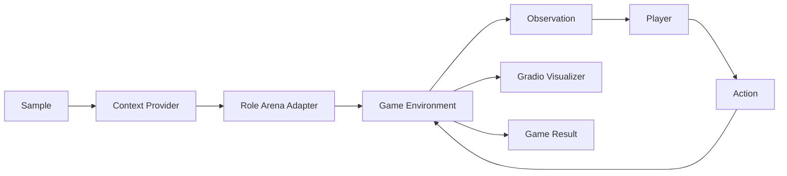
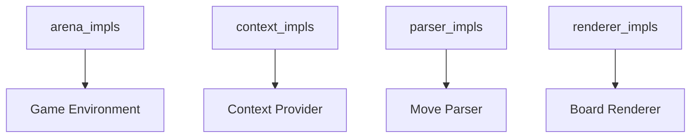
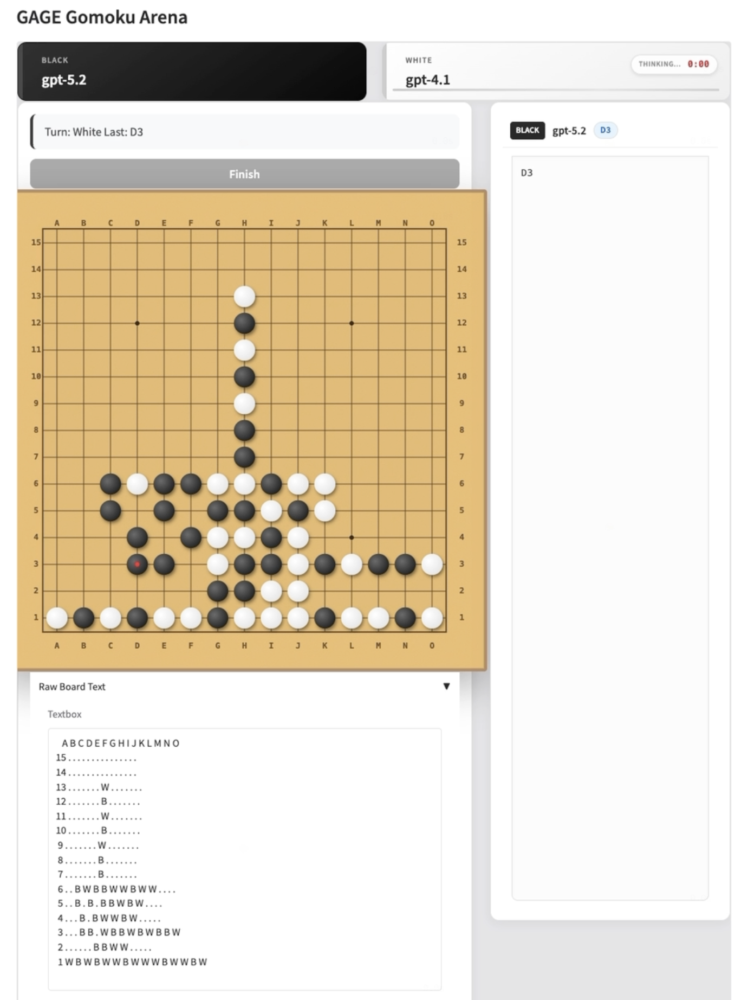
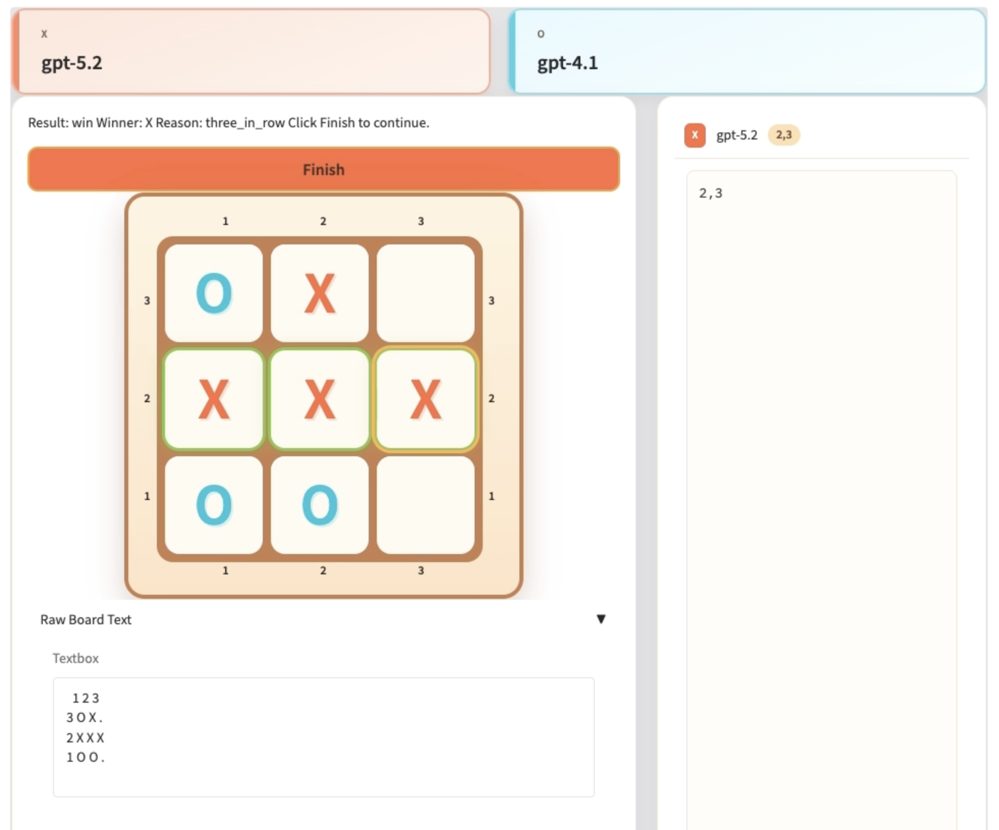

# Game Arena Guide

English | [中文](game_arena_zh.md)

Game Arena is a turn-based evaluation lane built on the `arena` role. It wires a game environment, player adapters, a move parser, and an optional Gradio UI to support **LLM vs LLM** and **Human vs LLM** matches.

## 1. Scope and goals

- Target turn-based board games with coordinate moves (e.g., Gomoku, Tic-Tac-Toe).
- Keep orchestration inside the standard pipeline (`support -> arena -> auto_eval`).
- Extend via registries, no changes to core orchestration required.

## 2. Architecture



Key runtime objects:

- **Observation**: `board_text`, `legal_moves`, `active_player`, `last_move`, `metadata`.
- **Action**: a move string (e.g., `H8` or `2,2`).
- **GameResult**: winner, result, final board, move log.

## 3. Core design principles

### 3.1 Core abstractions and role mapping

ArenaRole is a RoleAdapter instantiated by RoleManager, responsible for the full match loop and state aggregation.

| Abstraction | Responsibility |
| --- | --- |
| ArenaRole | Orchestrate the game loop and integrate state |
| Environment | Manage state and produce observations |
| RuleEngine | Validate moves and determine terminal states |
| Scheduler | Control turn order and max turns |
| Player Interface | Map observation to action |
| MoveParser | Parse text into a move |
| Visualizer | Render UI and enable human interaction |

Player mapping:

- LLM player uses the `dut_model` adapter (`LLMPlayer`).
- Human player uses the `human` adapter (`HumanPlayer`).

### 3.2 Shared vs game-specific layers

| Type | Scope | Notes |
| --- | --- | --- |
| Player Interface | Shared | Reusable across games |
| MoveParser | Shared | `grid_parser_v1` for grid coordinates |
| Visualizer | Shared | Gradio UI + renderer contract |
| Environment | Game-specific | `gomoku_local_v1`, `tictactoe_v1` |
| Rule logic | Game-specific | Integrated in each environment |
| Scheduler | Shared | `turn` and `tick` schedulers |

### 3.3 Schedulers and player hooks

| Scheduler | Behavior | Player interface |
| --- | --- | --- |
| TurnScheduler | Stop-and-wait turns | `think(observation) -> action` |
| TickScheduler | Tick-driven polling | Optional async hooks |

Optional async hooks used by TickScheduler:

```python
def start_thinking(self, observation, deadline_ms: int) -> None:
    ...

def has_action(self) -> bool:
    ...

def pop_action(self) -> ArenaAction:
    ...
```

## 4. Core components

| Component | Registry key | Example impl | Responsibility |
| --- | --- | --- | --- |
| Environment | `arena_impls` | `gomoku_local_v1`, `tictactoe_v1` | Maintain board state, apply moves, check terminal states |
| Context | `context_impls` | `gomoku_context`, `tictactoe_context` | Provide rules + board intro prompt |
| Parser | `parser_impls` | `grid_parser_v1` | Parse model output into coordinates |
| Renderer | `renderer_impls` | `gomoku_board_v1`, `tictactoe_board_v1` | HTML/CSS board rendering + click-to-move |

Supporting modules:

- **Scheduler**: `turn` or `tick` scheduling (`src/gage_eval/role/arena/schedulers`).
- **Players**: `LLMPlayer` and `HumanPlayer` (`src/gage_eval/role/arena/players`).
- **Visualizer**: Gradio UI (`src/gage_eval/role/arena/visualizers/gradio_visualizer.py`).

## 5. Registry wiring



Minimal registration pattern:

```python
from gage_eval.registry import registry

@registry.asset("arena_impls", "tictactoe_v1")
class TicTacToeArenaEnvironment:
    ...
```

## 6. Configuration example

Tic-Tac-Toe (Human vs LLM):

```yaml
role_adapters:
  - adapter_id: tictactoe_arena
    role_type: arena
    params:
      environment:
        impl: tictactoe_v1
        board_size: 3
        coord_scheme: ROW_COL
      scheduler:
        type: turn
        max_turns: 9
      parser:
        impl: grid_parser_v1
        board_size: 3
        coord_scheme: ROW_COL
      visualizer:
        enabled: true
        title: GAGE Tic-Tac-Toe Arena
        wait_for_finish: true
        coord_scheme: ROW_COL
        renderer:
          impl: tictactoe_board_v1
      players:
        - name: X
          type: backend
          ref: tictactoe_player_x_litellm
        - name: O
          type: human
          ref: tictactoe_human
```

Datasets for demos are stored under `tests/data/`:

- `tests/data/Test_Gomoku_LiteLLM.jsonl`
- `tests/data/Test_TicTacToe.jsonl`

## 7. Interaction and UI

- When a **human** player is present, the arena switches to `interactive` mode.
- Board clicks are converted to coordinates and submitted via `build_board_interaction_js`.
- If `wait_for_finish` is enabled, the UI shows a **Finish** button and the pipeline waits for a confirmation. It auto-confirms after 15 seconds.

### 7.1 UI preview





## 8. Demos and tests

Demo configs:

- `config/custom/gomoku_litellm_local.yaml`
- `config/custom/gomoku_human_vs_llm.yaml`
- `config/custom/tictactoe_litellm_local.yaml`
- `config/custom/tictactoe_human_vs_llm.yaml`

run command:

python run.py -c config/custom/gomoku_human_vs_llm.yaml
Related tests:

- `tests/unit/core/arena/test_gomoku_environment.py`
- `tests/unit/core/arena/test_tictactoe_environment.py`
- `tests/unit/core/role/test_gomoku_context.py`
- `tests/unit/core/role/test_tictactoe_context.py`
- `tests/unit/core/role/test_gomoku_board_renderer.py`
- `tests/unit/core/role/test_tictactoe_board_renderer.py`

## 9. Extension checklist

1. Add a new environment under `src/gage_eval/role/arena/games/<game>/`.
2. Register environment, context, parser, and renderer to their registries.
3. Add demo configs and tests under `config/custom/` and `tests/unit/`.
4. Validate via `run.py` with a small `max_samples`.
