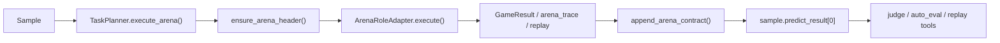
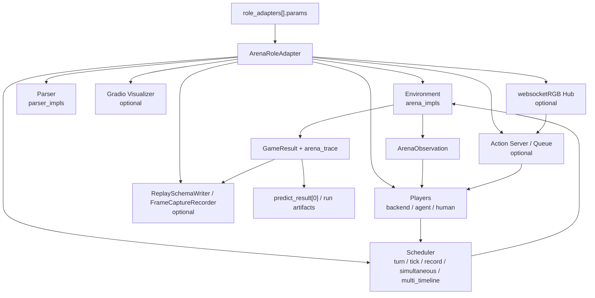

# Game Arena Overview

English | [中文](game_arena_zh.md)

Game Arena is GAGE's unified runtime framework for game matches, built on the `arena` role. It covers board games such as Gomoku and Tic-Tac-Toe, as well as ViZDoom, PettingZoo, Retro Mario, Doudizhu, Mahjong, and other match scenarios that need environment-driven execution, action parsing, replay output, and human interaction.

The current core implementation lives in:

- `src/gage_eval/role/adapters/arena.py`
- `src/gage_eval/evaluation/task_planner.py`
- `src/gage_eval/evaluation/sample_envelope.py`

## 1. Current Positioning

Arena is better understood as a unified game runtime:

- Upstream, it is still a standard pipeline stage invoked by `TaskPlanner.execute_arena()`.
- Internally, it assembles the environment, scheduler, players, parser, human input, visualization, and replay output.
- Downstream, it writes normalized match results back into the sample for `judge`, `auto_eval`, replay tooling, and later processing.

The current implementation covers the following game families:

| Category | `environment.impl` examples | Characteristics |
| --- | --- | --- |
| Board games | `gomoku_local_v1`, `tictactoe_v1` | Coordinate moves, Gradio board rendering |
| FPS / frame-driven games | `vizdoom_env_v1` | Tick/record scheduling, image frames, `websocketRGB` |
| AEC discrete-action games | `pettingzoo_aec_v1` | Discrete action parsing, rotating agents, replay |
| Retro games | `retro_env_v1` | Persistent runtime, action mapping, recording and replay |
| Card / Mahjong games | `doudizhu_rlcard_v1`, `doudizhu_arena_v1`, `mahjong_rlcard_v1` | Formatter/parser/renderer composition and structured outputs |

### 1.1 How the current integrations differ by game

- Gomoku: still the most typical board-style Arena setup. It uses `gomoku_local_v1 + gomoku_v1 + gomoku_board_v1` to build a complete Human-vs-LLM or model-vs-model loop, and remains a good example for coordinate parsing, Gradio board interaction, and basic `turn` scheduling.
- Tic-Tac-Toe: structurally similar to Gomoku, but lighter. It is often the smallest runnable example for validating the `arena` role, `visualizer`, and `human` player flow.
- ViZDoom: a frame-driven, discrete-action environment centered on `vizdoom_env_v1 + vizdoom_parser_v1`, tick or record scheduling, frame capture, `websocketRGB` display, and replay.
- PettingZoo: currently integrated through combinations such as `pettingzoo_aec_v1 + discrete_action_parser_v1`. The focus is discrete actions, rotating agents, image streaming, and replay. The current docs and screenshot use the PettingZoo Atari `space_invaders` example.
- Retro Mario: integrated through `retro_env_v1` on top of the stable-retro runtime, with emphasis on persistent runtime behavior, action mapping, recording, and `websocketRGB` / replay flows.
- Doudizhu / Mahjong: these are better understood through RLCard environments, formatter/parser/renderer composition, structured results, and frontend replay.

## 2. Position in the Pipeline

Arena is not a side path outside the pipeline. It is a standard execution stage in `TaskPlanner`:

```mermaid
flowchart LR
  A["Sample"] --> B["TaskPlanner.execute_arena()"]
  B --> C["ensure_arena_header()"]
  C --> D["ArenaRoleAdapter.execute()"]
  D --> E["GameResult / arena_trace / replay"]
  E --> F["append_arena_contract()"]
  F --> G["sample.predict_result[0]"]
  G --> H["judge / auto_eval / replay tools"]
```

The key point here is not "produce one free-form answer", but "produce a structured match result that can keep flowing downstream".

## 3. Runtime Structure

In one match, the current `ArenaRoleAdapter` dynamically assembles the following parts:

```mermaid
flowchart TD
  CFG["role_adapters[].params"] --> ADP["ArenaRoleAdapter"]
  ADP --> ENV["Environment<br/>arena_impls"]
  ADP --> SCH["Scheduler<br/>turn / tick / record / simultaneous / multi_timeline"]
  ADP --> PAR["Parser<br/>parser_impls"]
  ADP --> PLY["Players<br/>backend / agent / human"]
  ADP --> VIZ["Gradio Visualizer<br/>optional"]
  ADP --> HUM["Action Server / Queue<br/>optional"]
  ADP --> WSRGB["websocketRGB Hub<br/>optional"]
  ADP --> REC["ReplaySchemaWriter / FrameCaptureRecorder<br/>optional"]

  ENV --> OBS["ArenaObservation"]
  OBS --> PLY
  PLY --> SCH
  SCH --> ENV
  ENV --> RES["GameResult + arena_trace"]
  RES --> REC
  RES --> OUT["predict_result[0] / run artifacts"]
  HUM --> PLY
  WSRGB --> HUM
```

Two points matter most when reading the current structure:

- `Context Provider` still exists, but the current main axis in this guide is `environment + scheduler + players + parser + replay`.
- `RuleEngine` logic is now embedded inside many concrete environments instead of always appearing as a standalone layer.

## 4. The Configuration Surface That Matters More Now

Looking at current configs, Arena is better understood through these blocks:

| Config block | Responsibility | Common fields |
| --- | --- | --- |
| `environment` | Select the game environment and runtime mode | `impl`, `env_id`, `display_mode`, `replay` |
| `scheduler` | Decide how the match advances | `type`, `tick_ms`, `max_turns`, `max_ticks` |
| `parser` | Turn model output into actions | `impl`, `action_labels`, `coord_scheme` |
| `players` | Define participant types | `type=backend/agent/human`, `ref`, `timeout_ms` |
| `visualizer` | Enable Gradio observer or interactive UI | `enabled`, `renderer.impl`, `wait_for_finish` |
| `human_input` | Enable input queue, action server, and ws_rgb hub | `enabled`, `port`, `ws_port` |

Current scheduler support includes:

- `turn`: classic stop-and-wait turns, suitable for Gomoku and Tic-Tac-Toe.
- `tick`: fixed-interval polling, suitable for real-time or quasi-real-time scenes.
- `record`: advances on a recording cadence and writes replay-friendly traces.
- `simultaneous`: multiple players act on the same frame.
- `multi_timeline`: multiple lanes / timelines advance together.

## 5. Structured Output Contract

Arena writes structured results back into the sample instead of only printing logs.

### 5.1 Sample header

`ensure_arena_header()` writes a header under `sample.metadata.game_arena`, including fields such as:

- `engine_id`
- `seed`
- `mode`
- `players`
- `start_time_ms`

### 5.2 Sample result

`append_arena_contract()` normalizes Arena output into:

- `sample.predict_result[0].arena_trace`
- `sample.predict_result[0].game_arena`

Where:

- `arena_trace` stores step-level actions, timestamps, legality, timeout details, and related runtime facts.
- `game_arena` stores the terminal summary such as `winner_player_id`, `termination_reason`, `total_steps`, `final_scores`, and `episode_returns`.

### 5.3 Run artifacts

Besides sample fields, Arena may also write:

- `replay_path` / `replay_v1_path`
- `game_log` or `game_log_path`
- `replay.json`, `events.jsonl`
- Frame capture directories when frame capture is enabled

That is why the current Arena guide needs to cover both scheduling logic and artifact contracts. A board-only explanation is not enough here.

## 6. Interaction Modes and Visualization

At the moment, Arena has at least two main interaction paths:

### 6.1 Gradio board interaction

This is suitable for games with explicit board renderers, such as Gomoku and Tic-Tac-Toe:

- Enable it with `visualizer.enabled: true`.
- Render the board through `renderer_impls`.
- When a `human` player exists, the UI switches into interactive mode.

### 6.2 `websocketRGB` image-stream interaction

This is suitable for ViZDoom, PettingZoo, and Retro Mario, where frame streams and image observations matter more.

At the code level, the implementation still mostly uses the `ws_rgb` name, while the docs often call it `websocketRGB`. In the current repository, both refer to the same runtime capability:

- The environment provides image frames, for example through `get_last_frame()`.
- `ArenaRoleAdapter` registers a display when `display_mode=websocket/ws`.
- Human input flows back into `HumanPlayer` through the action queue and the `ws_rgb` viewer.
- Replay tools can reconstruct a `ws_rgb` display from stored artifacts.

## 7. Visual Examples

### 7.1 Gomoku

Gomoku shows the classic board-style interaction. It is a good example for understanding `renderer_impls`, coordinate parsing, and the Human-vs-LLM loop.

### 7.2 Tic-Tac-Toe

Tic-Tac-Toe is the lighter board example and is commonly used as a fast validation target for the Arena main flow and interactive UI.

### 7.3 ViZDoom

ViZDoom is presented here as a full environment integration with image observations, action mapping, scheduling, and replay.

Related topic guides:

- [ViZDoom Guide](game_arena_topics/game_arena_vizdoom.md)
- [websocketRGB Runtime and Replay Guide](game_arena_topics/websocketRGB_runtime_replay_guide.md)

### 7.4 PettingZoo: Space Invaders

This screenshot shows `space_invaders` from the PettingZoo Atari family. The current integration style focuses on discrete actions, image streaming, and replay, which makes it a good fit for Atari-like multi-agent or rotating-agent environments.

Related topic guides:

- [PettingZoo Guide](game_arena_topics/game_arena_pettingzoo.md)
- [PettingZoo Atari Run Commands](game_arena_topics/pettingzoo_atari_run_commands.md)
- [websocketRGB Runtime and Replay Guide](game_arena_topics/websocketRGB_runtime_replay_guide.md)

### 7.5 Retro Mario

This screenshot shows the current stable-retro Mario integration. Like ViZDoom and PettingZoo, it is centered on runtime-driven execution, action mapping, image observation, and replay instead of traditional board rendering.

Related topic guides:

- [Retro Mario Guide](game_arena_topics/game_arena_retro_mario.md)
- [websocketRGB Runtime and Replay Guide](game_arena_topics/websocketRGB_runtime_replay_guide.md)

## 8. Topic Entry Points

The current topic guides are better linked from the main guide as a single hub:

- [ViZDoom](game_arena_topics/game_arena_vizdoom.md)
- [Retro Mario](game_arena_topics/game_arena_retro_mario.md)
- [PettingZoo](game_arena_topics/pettingzoo_atari_run_commands.md)
- [Doudizhu Showdown](game_arena_topics/doudizhu_showdown.md)
- [websocketRGB Runtime and Replay Guide](game_arena_topics/websocketRGB_runtime_replay_guide.md)
