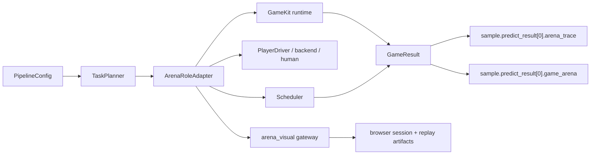
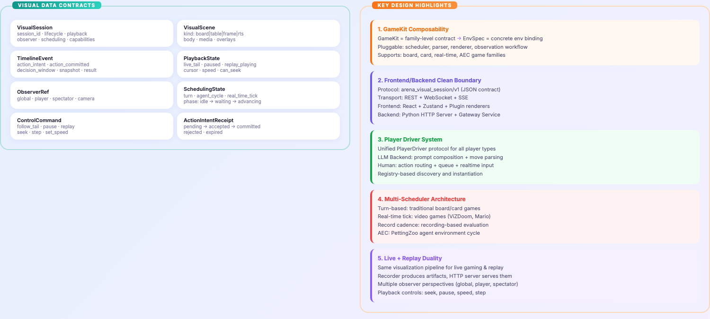
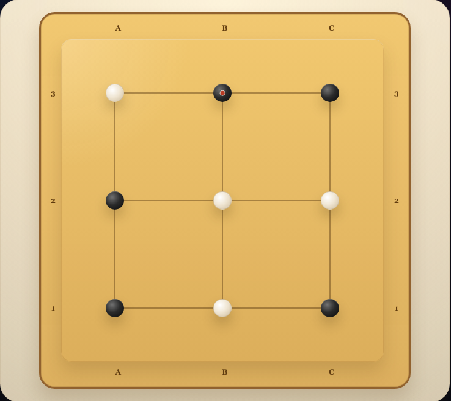
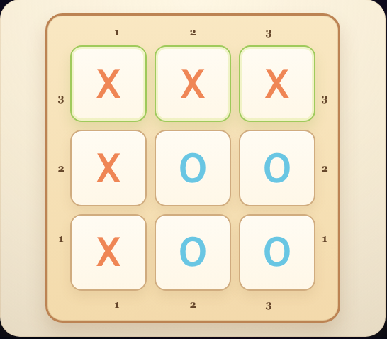
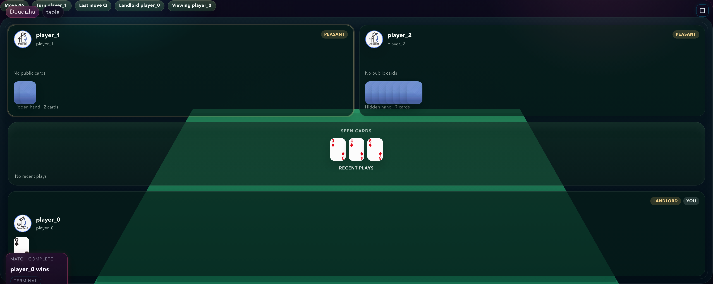
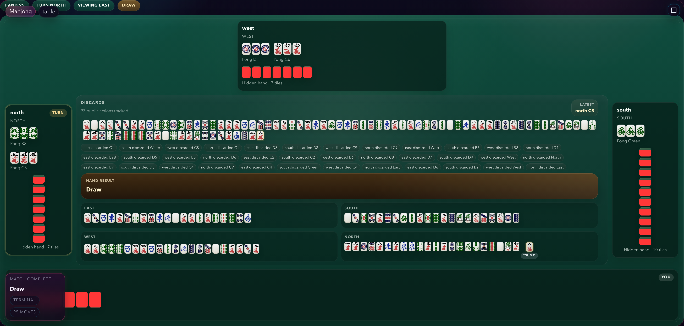
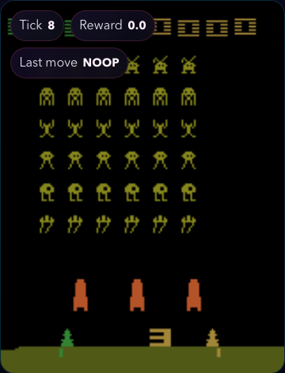
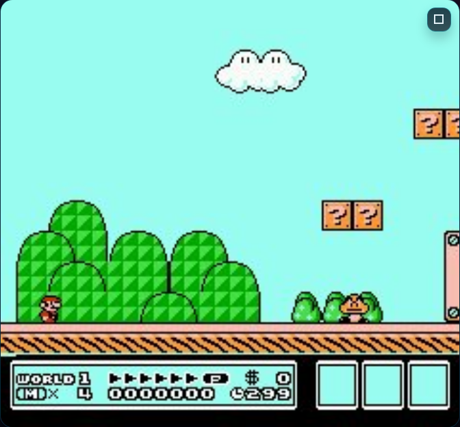

# Game Arena Overview

English | [中文](game_arena_zh.md)

Game Arena is GAGE's unified runtime for game-based evaluation. The current mainline implementation is centered on GameKit configs, `ArenaRoleAdapter`, structured arena output, and the unified `arena_visual` browser host.

Use this page as the durable overview. For browser operation details, use [Arena Visual Browser Control](game_arena_topics/game_arena_visual_control.md).

## 1. Current Runtime Shape

Current Game Arena configs use the same pipeline shape as other GAGE tasks:



```mermaid
flowchart LR
  A["PipelineConfig"] --> B["TaskPlanner"]
  B --> C["ArenaRoleAdapter"]
  C --> D["GameKit runtime"]
  C --> E["PlayerDriver / backend / human"]
  C --> F["Scheduler"]
  C --> G["arena_visual gateway"]
  D --> H["GameResult"]
  F --> H
  G --> I["browser session + replay artifacts"]
  H --> J["sample.predict_result[0].arena_trace"]
  H --> K["sample.predict_result[0].game_arena"]
```

Board, table, and frame games all write the same visual session contract under:

```text
runs/<run_id>/replays/<sample_id>/arena_visual_session/v1/
```

The browser route is `/sessions/<sample_id>?run_id=<run_id>`. Runtime data is served by the Python gateway under `/arena_visual/sessions/...` and rendered by the prebuilt `frontend/arena-visual/dist` checked into this repository; regular users do not need a Node/npm environment.

## 2. Supported GameKit Families

| Family | Current configs | Visual shape |
| --- | --- | --- |
| Gomoku | `config/custom/gomoku/*_gamekit.yaml` | Board scene |
| Tic-Tac-Toe | `config/custom/tictactoe/*_gamekit.yaml` | Board scene |
| Doudizhu | `config/custom/doudizhu/*_gamekit.yaml` | Table scene |
| Mahjong | `config/custom/mahjong/*_gamekit.yaml` | Table scene |
| PettingZoo Space Invaders | `config/custom/pettingzoo/space_invaders_*_gamekit.yaml` | Frame scene |
| Retro Mario | `config/custom/retro_mario/*_gamekit.yaml` | Frame scene |
| ViZDoom | `config/custom/vizdoom/*_gamekit.yaml` | Frame scene |

LLM configs now come in two families. Existing local configs are kept for internal/local testing. New `*_openai_gamekit.yaml` configs are the user-facing API path and read credentials from the environment:

```bash
export OPENAI_API_KEY="<YOUR_OPENAI_API_KEY>"
# Optional: defaults to gpt-5.4.
export GAGE_GAME_ARENA_LLM_MODEL="gpt-5.4"
# Optional: local or hosted OpenAI-compatible endpoint.
export OPENAI_API_BASE="https://api.openai.com/v1"
```

Use `OPENAI_API_BASE` plus `GAGE_GAME_ARENA_LLM_MODEL` for open-source local models served through an OpenAI-compatible API. No backend YAML edit is required.

Closed-source OpenAI API example:

```bash
export OPENAI_API_KEY="<YOUR_OPENAI_API_KEY>"
export GAGE_GAME_ARENA_LLM_MODEL="gpt-5.4"
unset OPENAI_API_BASE
```

Open-source OpenAI-compatible service example:

```bash
export OPENAI_API_BASE="http://127.0.0.1:<PORT>/v1"
export OPENAI_API_KEY="<LOCAL_SERVICE_API_KEY_OR_DUMMY_VALUE>"
export GAGE_GAME_ARENA_LLM_MODEL="<LOCAL_MODEL_NAME>"
```

## 3. Configuration Surface

GameKit configs are organized around `role_adapters[].params`:

| Block | Purpose |
| --- | --- |
| `game_kit` / `env` | Select the game family and concrete environment preset. |
| `runtime_overrides` | Tune board size, realtime cadence, legal moves, frame capture, replay, or backend mode. |
| `players` | Bind each seat to `dummy`, `llm`, or `human`. |
| `human_input` | Enable browser-submitted actions and live input queues. |
| `visualizer` | Enable `arena_visual`, choose the browser port, launch behavior, and media transport. |

Common visualizer fields:

```yaml
visualizer:
  enabled: true
  mode: arena_visual
  launch_browser: true
  live_scene_scheme: http_pull
  linger_after_finish_s: 15.0
```

Frame-driven games can also use `binary_stream` or `low_latency_channel` when a config explicitly enables that path.

## 4. Run Entrypoints

Canonical scripts live under `scripts/run/arenas/`.

```bash
# PettingZoo Space Invaders OpenAI visual LLM run
bash scripts/run/arenas/pettingzoo/run.sh --mode llm_visual_openai

# Retro Mario pure-human realtime browser control
bash scripts/run/arenas/retro_mario/run.sh --mode human_visual

# ViZDoom OpenAI visual LLM run
bash scripts/run/arenas/vizdoom/run.sh --mode llm_visual_openai

# Doudizhu OpenAI visual LLM run
bash scripts/run/arenas/doudizhu/run.sh --mode llm_visual_openai

# Mahjong OpenAI visual LLM run
bash scripts/run/arenas/mahjong/run.sh --mode llm_visual_openai
```

Visual runs write replayable `arena_visual_session/v1` artifacts under the run directory. Browser playback controls use those artifacts through the Arena Visual session page.

## 5. Choose a Topic

Use the topic docs as task-oriented runbooks:

| Need | Start Here |
| --- | --- |
| Smallest board-game smoke and human coordinate input | [Tic-Tac-Toe Guide](game_arena_topics/game_arena_tictactoe.md) |
| Larger board coordinates, win-line output, and 15x15 browser runs | [Gomoku Guide](game_arena_topics/game_arena_gomoku.md) |
| Three-seat card table, legal action text, and chat metadata | [Doudizhu Guide](game_arena_topics/game_arena_doudizhu.md) |
| Four-seat card table and longer human acceptance runs | [Mahjong Guide](game_arena_topics/game_arena_mahjong.md) |
| Atari AEC frames, ROM checks, and low-latency media transport | [PettingZoo Atari Guide](game_arena_topics/game_arena_pettingzoo_atari.md) |
| Stable-retro ROM import and macro keyboard actions | [Retro Mario Guide](game_arena_topics/game_arena_retro_mario.md) |
| ViZDoom rendering, POV telemetry, and discrete action ids | [ViZDoom Guide](game_arena_topics/game_arena_vizdoom.md) |
| Shared browser controls, session APIs, input route, and replay artifacts | [Arena Visual Browser Control](game_arena_topics/game_arena_visual_control.md) |

## 6. Output Contract

Arena writes structured results back into samples:

- `sample.predict_result[0].arena_trace`: step-level actions, legality, timestamps, retries, scheduler facts, and runtime metadata.
- `sample.predict_result[0].game_arena`: terminal summary such as winner, reason, total steps, scores, and episode returns.
- `artifacts.visual_session_ref`: pointer to the `arena_visual_session/v1/manifest.json` sidecar when visual output is enabled.

Typical run output:

```text
runs/<run_id>/
  summary.json
  samples.jsonl
  replays/<sample_id>/arena_visual_session/v1/
    manifest.json
    timeline.jsonl
    scenes/
    media/
```



## 7. Visual Examples

### Gomoku



### Tic-Tac-Toe



### Doudizhu



### Mahjong



### PettingZoo Space Invaders



### Retro Mario



### ViZDoom


## 8. Related Docs

- [Arena Visual Browser Control](game_arena_topics/game_arena_visual_control.md)
- [Gomoku Guide](game_arena_topics/game_arena_gomoku.md)
- [Tic-Tac-Toe Guide](game_arena_topics/game_arena_tictactoe.md)
- [Doudizhu Guide](game_arena_topics/game_arena_doudizhu.md)
- [Mahjong Guide](game_arena_topics/game_arena_mahjong.md)
- [PettingZoo Atari Guide](game_arena_topics/game_arena_pettingzoo_atari.md)
- [Retro Mario Guide](game_arena_topics/game_arena_retro_mario.md)
- [ViZDoom Guide](game_arena_topics/game_arena_vizdoom.md)
