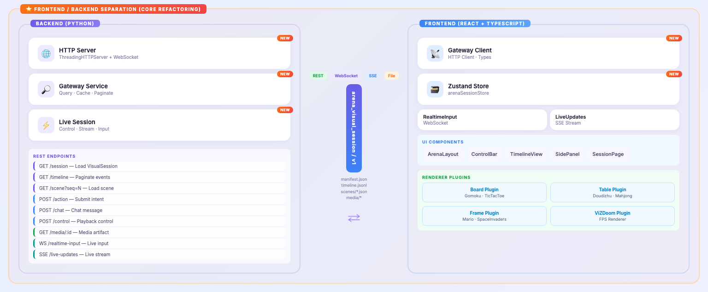
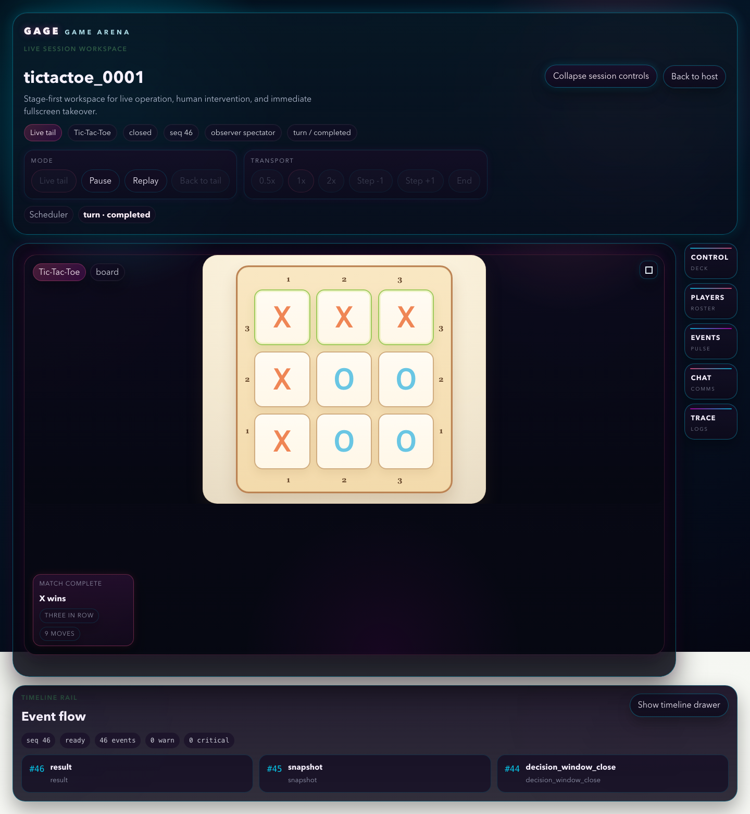
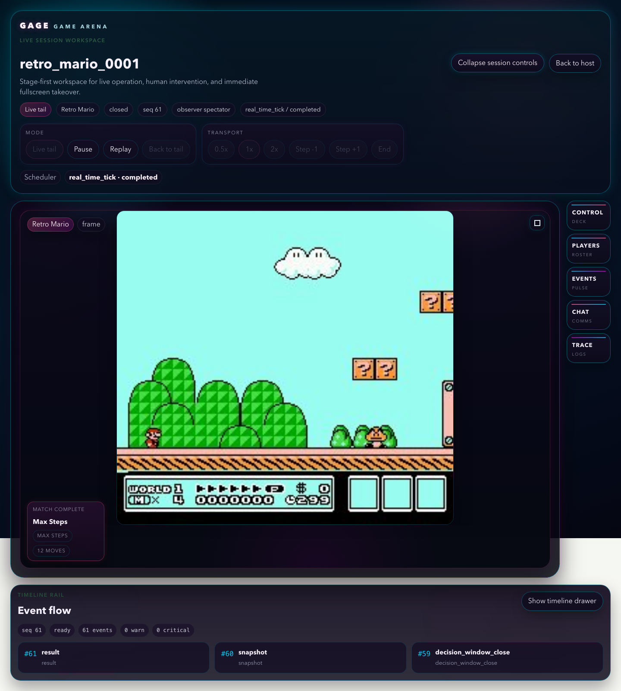

# Arena Visual Browser Control

English | [中文](game_arena_visual_control_zh.md)

This guide explains how to operate the unified Arena Visual browser page used by GameKit runs. The browser route is `/sessions/<session_id>?run_id=<run_id>`, and the page talks to the Python gateway through `/arena_visual/sessions/...` API routes.





Frame-based games use the same control surface. Retro Mario keeps the frame scene inside the stage while the right rail stays collapsed until you open a panel:



## 1. Open a Session

Most visual GameKit configs open the browser automatically when:

```yaml
visualizer:
  enabled: true
  mode: arena_visual
  launch_browser: true
```

Manual URL shape:

```text
http://127.0.0.1:<visual_port>/sessions/<sample_id>?run_id=<run_id>
```

The `run_id` query parameter disambiguates duplicate sample ids across different runs. If the page is served by the Vite dev server, pass the Python gateway through `VITE_ARENA_GATEWAY_BASE_URL`.

## 2. Backend and Frontend Assets

Normal GameKit runs start the Python Arena Visual gateway from the `visualizer` block in YAML. The gateway serves the browser route and the `/arena_visual/sessions/...` JSON, action, timeline, event, chat, control, and media APIs. The repository includes the prebuilt `frontend/arena-visual/dist`, and the Python gateway reads the browser page from that directory. Regular users only need the Python runtime, a browser, and the API key, ROM, or desktop rendering support required by the selected game; they do not need Node/npm and do not need to start a separate frontend dev server.

The browser page is provided by the React app under `frontend/arena-visual`. You only need frontend project tooling when developing, testing, rebuilding that app, or when `frontend/arena-visual/dist/index.html` is missing. Use the current Node.js LTS line and the committed `package-lock.json` for reproducible installs:

```bash
cd frontend/arena-visual
npm ci
npm test
npm run build
```

When debugging through the Vite dev server, start a visual GameKit run first, then point `VITE_ARENA_GATEWAY_BASE_URL` at the Python gateway printed by that run:

```bash
cd frontend/arena-visual
VITE_ARENA_GATEWAY_BASE_URL=http://127.0.0.1:<visual_port> npm run dev
```

Open the local URL printed by Vite. `<visual_port>` is the Python Arena Visual gateway port, not the Vite port. Common environment checks:

- If `npm ci` fails, confirm Node/npm are available; remove an incomplete `node_modules` directory before retrying.
- If the Vite page opens but has no session data, confirm `VITE_ARENA_GATEWAY_BASE_URL` points at the active Python gateway.
- If the ordinary GameKit page is blank or stuck loading, first confirm `frontend/arena-visual/dist/index.html` exists, then inspect the Python gateway logs and browser console; rebuild the frontend only when `dist` is missing or after changing `frontend/arena-visual`.

## 3. Runtime Contracts

GameKit visual sessions share these runtime contracts:

| Contract | Where to Look | Meaning |
| --- | --- | --- |
| `ArenaObservation` | `src/gage_eval/role/arena/types.py` | Per-turn view delivered to a player: `board_text`, `view`, `legal_actions`, `metadata`, and optional prompt data. |
| LLM turn prompt | `src/gage_eval/role/arena/player_drivers/llm_backend.py` | Built-in LLM players receive sample messages plus one user message derived from active player, view text, and legal moves. |
| `ArenaAction` | `src/gage_eval/role/arena/types.py` | Player output applied by the environment: `player`, `move`, `raw`, and metadata. |
| `GameResult` | `src/gage_eval/role/arena/types.py` | Terminal game summary: winner, result, reason, move counts, final board, move log, and `arena_trace`. |
| `arena_trace` | `sample.predict_result[0].arena_trace` | Scheduler-owned per-step trace with action, legality, timing, retry, reward, and timeline metadata. |
| `game_arena` footer | `sample.predict_result[0].game_arena` | Terminal summary used by reports: total steps, winner, termination reason, ranks, scores, or returns when available. |
| Visual session | `runs/<run_id>/replays/<sample_id>/arena_visual_session/v1/manifest.json` | Replayable browser artifact containing session metadata, timeline, scenes, and media refs. |

For a typical visual run, first inspect `summary.json`, then the sample row in `samples.jsonl`, then `replays/<sample_id>/replay.json`, `events.jsonl`, and `arena_visual_session/v1/manifest.json`.

## 4. Page Regions

| Region | Purpose |
| --- | --- |
| Session command deck | Shows session id, game name, lifecycle, observer, scheduler family, and control expansion. |
| Stage | Renders the board, table, or frame scene through the game plugin. |
| Session controls | Live/replay transport controls; visible after `Expand session controls`. |
| Utility rail | Opens Control, Players, Events, Chat, and Trace panels. |
| Timeline drawer | Shows recent events and lets you inspect event flow. |

## 5. Session Command Deck

The top deck is the starting point for operation:

- `Expand session controls`: opens the transport controls.
- `Collapse session controls`: hides the transport controls.
- `Back to host`: returns to the Arena Visual host page.
- Status pills show playback mode, game plugin, lifecycle, scene seq, observer, and scheduler state.

The deck stays separate from the game stage so screenshots for README or game docs can crop the gameplay area without carrying the whole control page.

## 6. Playback Controls

After expanding the controls, the page exposes:

| Control | Behavior |
| --- | --- |
| `Live tail` | Follow the newest live scene. |
| `Pause` | Stop automatic tail following at the current scene. |
| `Replay` | Play recorded scenes from the current cursor. |
| `Back to tail` | Return from replay/paused mode to the newest live scene. |
| `0.5x / 1x / 2x` | Change replay playback speed. |
| `Step -1 / Step +1` | Move one event or scene backward/forward when available. |
| `End` | Seek to the latest available scene. |
| `Restart` | Request a live restart when the backend advertises support. |
| `Finish` | Request a controlled session finish. |

Disabled controls usually mean the backend has not advertised that capability, the session is still loading, or a previous control command is pending.

## 7. Utility Rail Panels

The right rail opens shared panels:

- `Control`: host receipts, current mode, active actor, observer, input transport, and readiness hints.
- `Players`: observer selection and player roster.
- `Events`: semantic event summaries from the current scene.
- `Chat`: chat log and chat submitter when supported.
- `Trace`: trace lines and lower-level diagnostics.

Only one utility panel is open at a time. Click the active rail button again to close it.

## 8. Human Input

When `human_input.enabled: true`, the browser submits actions through the session action route:

```text
POST /arena_visual/sessions/<sample_id>/actions?run_id=<run_id>
```

Realtime configs can advertise websocket input:

```text
WS /arena_visual/sessions/<sample_id>/actions/ws?run_id=<run_id>
```

Board plugins usually submit coordinates, table plugins submit legal action text, and frame plugins submit action ids or macro moves. Each GameKit owns the final input mapper, so the game topic documents the accepted action shape.

If input does not affect the match:

- Confirm the session status is `live_running`.
- Confirm the scheduler accepts human intent.
- Open the Control panel and check the input transport signal.
- Check that the URL includes the correct `run_id` when sample ids are reused.

## 9. Timeline and Replay

The timeline drawer shows recent events such as `action_intent`, `action_committed`, `snapshot`, `frame_ref`, `chat`, and `result`.

Use it to check whether the browser action was accepted, whether the scene cursor moved, and whether the run reached a terminal result. For finished runs, replay works from the same `arena_visual_session/v1` artifacts.

## 10. Common Troubleshooting

| Symptom | Check |
| --- | --- |
| Page opens but stays loading | Confirm `runs/<run_id>/replays/<sample_id>/arena_visual_session/v1/manifest.json` exists. |
| Wrong run opens | Add `?run_id=<run_id>` to disambiguate duplicate sample ids. |
| Controls are disabled | The session may be closed, loading, or missing backend capability flags. |
| Human input is ignored | Check `human_input.enabled`, active actor, and Control panel input transport. |
| Frame scene is blank | Check the scene media transport: `http_pull`, `binary_stream`, or `low_latency_channel`. |
| Browser did not open automatically | Use the printed session URL or set `visualizer.launch_browser: true`. |
| Frontend dev server cannot reach a session | Check `VITE_ARENA_GATEWAY_BASE_URL` and the Python gateway port printed by the run. |
| Replay artifact is missing | Confirm the run reached a sample and did not stop before the visual recorder wrote `arena_visual_session/v1`. |

## 11. Related Docs

- [Game Arena Overview](../game_arena.md)
- [Gomoku Guide](game_arena_gomoku.md)
- [Tic-Tac-Toe Guide](game_arena_tictactoe.md)
- [Doudizhu Guide](game_arena_doudizhu.md)
- [Mahjong Guide](game_arena_mahjong.md)
- [PettingZoo Atari Guide](game_arena_pettingzoo_atari.md)
- [Retro Mario Guide](game_arena_retro_mario.md)
- [ViZDoom Guide](game_arena_vizdoom.md)
