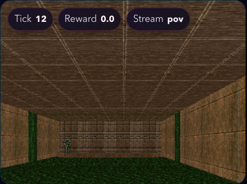

# ViZDoom Game Arena Guide

English | [中文](game_arena_vizdoom_zh.md)

ViZDoom uses the GameKit realtime duel runtime and the Arena Visual frame scene. It covers discrete action ids, POV frames, telemetry, and desktop-aware human browser control.

## 1. Canonical Files

| Use | File |
| --- | --- |
| Dummy headless smoke | `config/custom/vizdoom/vizdoom_dummy_gamekit.yaml` |
| Human visual | `config/custom/vizdoom/vizdoom_human_visual_gamekit.yaml` |
| Local test LLM headless | `config/custom/vizdoom/vizdoom_llm_headless_gamekit.yaml` |
| Local test LLM visual | `config/custom/vizdoom/vizdoom_llm_visual_gamekit.yaml` |
| OpenAI LLM headless | `config/custom/vizdoom/vizdoom_llm_headless_openai_gamekit.yaml` |
| OpenAI LLM visual | `config/custom/vizdoom/vizdoom_llm_visual_openai_gamekit.yaml` |

## 2. Prerequisites

ViZDoom depends on `vizdoom` and `pygame`, both listed in `requirements.txt`. Visual and human paths need a desktop or compatible render/input environment; headless dummy smoke is the fastest environment check.

```bash
pip install -r requirements.txt

export OPENAI_API_KEY="<YOUR_OPENAI_API_KEY>"
# Optional: defaults to gpt-5.4.
export GAGE_GAME_ARENA_LLM_MODEL="gpt-5.4"
# Optional: OpenAI-compatible service override.
export OPENAI_API_BASE="https://api.openai.com/v1"
```

For the official OpenAI API, keep the default endpoint or leave `OPENAI_API_BASE` unset. For an open-source model served through an OpenAI-compatible API, set `OPENAI_API_BASE` and `GAGE_GAME_ARENA_LLM_MODEL`; no YAML backend edit is required.

Normal runs do not require Node/npm. Node/npm is only needed when developing or rebuilding `frontend/arena-visual`; see [Arena Visual Browser Control](game_arena_visual_control.md#2-backend-and-frontend-assets).

## 3. Quick Runs

Run commands from the repository root after activating the project Python environment.

```bash
bash scripts/run/arenas/vizdoom/run.sh --mode dummy --max-samples 1
```

```bash
OPENAI_API_KEY="<YOUR_OPENAI_API_KEY>" bash scripts/run/arenas/vizdoom/run.sh --mode llm_visual_openai --max-samples 1
```

Use this first to validate ViZDoom, websocketRGB, and browser viewing before adding model-backed runs.

What the websocketRGB helper does:

1. Picks a Python executable.
2. Validates the config path.
3. Chooses a free `WS_RGB_PORT`.
4. Starts `python run.py --config ...` in the background.
5. Waits until `http://127.0.0.1:<port>/ws_rgb/viewer` is reachable.
6. Prints the ready viewer URL and optionally auto-opens the browser.

Useful variables for this example:

- `PYTHON_BIN`: Python executable
- `CFG`: Defaults to `config/custom/vizdoom/vizdoom_dummy_vs_dummy_ws_rgb.yaml`
- `RUN_ID`: Output run id under `runs/`
- `OUTPUT_DIR`: Defaults to `runs`
- `WS_RGB_HOST`: Defaults to `127.0.0.1`
- `WS_RGB_PORT`: Defaults to `5800`

If you want the local-window validation path instead, use:

```bash
bash scripts/run/arenas/vizdoom/run.sh --mode human_visual --max-samples 1
```

Use `--max-samples 0` with any OpenAI config to validate config loading without executing a sample.

## 4. Mode and Config Mapping

The `scripts/run/arenas/vizdoom/run.sh` script selects Python from `--python-bin`, then `PYTHON_BIN`, then the active virtualenv/conda env, then `python`/`python3`. It prints the resolved Python, mode, config, output directory, and run id before calling `run.py`.

| Entry | Config | Use |
| --- | --- | --- |
| `dummy` | `config/custom/vizdoom/vizdoom_dummy_gamekit.yaml` | Headless dummy smoke. |
| `llm_headless` | `config/custom/vizdoom/vizdoom_llm_headless_gamekit.yaml` | Local test LLM without browser. |
| `llm_visual` | `config/custom/vizdoom/vizdoom_llm_visual_gamekit.yaml` | Local test LLM with browser. |
| `llm_headless_openai` | `config/custom/vizdoom/vizdoom_llm_headless_openai_gamekit.yaml` | OpenAI LLM without browser. |
| `llm_visual_openai` | `config/custom/vizdoom/vizdoom_llm_visual_openai_gamekit.yaml` | OpenAI LLM with browser. |
| `human_visual` | `config/custom/vizdoom/vizdoom_human_visual_gamekit.yaml` | Human realtime browser input. |

`--config <path>` always overrides the script mode mapping when a script is available.

## 5. Browser Control

Visual configs use `visualizer.mode: arena_visual`. The browser opens a session URL shaped like:

```text
http://127.0.0.1:<visual_port>/sessions/<sample_id>?run_id=<run_id>
```

For the shared command deck, transport controls, utility rail, timeline, and replay states, see [Arena Visual Browser Control](game_arena_visual_control.md).



## 6. Human Input

The frame plugin maps W/Up to forward, A/Left and D/Right to turn, and Space/Enter/J to fire when matching legal actions are available. Direct payloads can submit discrete action ids or legal action names through `action`, `move`, `selected_action`, `selected_move`, `value`, or `text`; `action_id`, `action_index`, `move_index`, or `index` can select from the legal action list.

## 7. Output and Replay Artifacts

Visual runs write both evaluation output and replayable Arena Visual artifacts:

```text
runs/<run_id>/
  summary.json
  samples.jsonl
  replays/<sample_id>/
    replay.json
    events.jsonl
    arena_visual_session/v1/
      manifest.json
      timeline.jsonl
      scenes/
      media/
```

`sample.predict_result[0].arena_trace` contains per-step actions, legality, timing, retries, and scheduler metadata. `sample.predict_result[0].game_arena` contains the terminal footer. When visualization is enabled, `artifacts.visual_session_ref` points at the `arena_visual_session/v1/manifest.json` sidecar. Finished runs replay from the same Arena Visual session artifacts.

## 8. Runtime Contracts

The shared runtime contract is documented in [Arena Visual Browser Control](game_arena_visual_control.md#3-runtime-contracts). For this game, check these fields first:

- `ArenaObservation.view` carries POV frame media and compact text telemetry.
- `metadata` may include health, ammo, frag, position, reward, and step fields.
- `legal_actions.items` is the discrete action list accepted by the parser.
- `GameResult` summarizes the duel outcome, move count, illegal count, and final board text.

The built-in LLM player receives the sample messages plus one user turn derived from the current `ArenaObservation`: active player, view text, legal moves, and the instruction to return exactly one legal move. A returned move is wrapped as `ArenaAction` and applied by the GameKit environment.

## 9. Common Parameters

| Adjustment | Where |
| --- | --- |
| Backend mode | `runtime_overrides.backend_mode` |
| Action repeat | `runtime_overrides.action_repeat` |
| Frame stride | `runtime_overrides.frame_stride` |
| POV capture | `runtime_overrides.capture_pov` / `show_pov` |
| Step budget | `runtime_overrides.max_steps` / `stub_max_rounds` |
| Live scene transport | `visualizer.live_scene_scheme` |

## 10. Troubleshooting

| Symptom | Check |
| --- | --- |
| OpenAI config fails before runtime starts | Export `OPENAI_API_KEY` before using any `*_openai_gamekit.yaml` config. |
| Wrong model is used | Set `GAGE_GAME_ARENA_LLM_MODEL` before launch, or unset it to use the documented default. |
| Dependency import fails | Run `pip install -r requirements.txt` in the same Python environment used by `run.py` or the arena script. |
| ROM or desktop/render error appears | This game-specific note is listed below; make sure you are not using a frame-game config when running a board or table game. |
| Browser stays loading | Check the printed session URL, `visualizer.port`, and `runs/<run_id>/replays/<sample_id>/arena_visual_session/v1/manifest.json`. |
| Port is already in use | Change `visualizer.port` in the config or pass a different `--run-id`/output directory to avoid stale session confusion. |
| Human input is ignored | Confirm `human_input.enabled: true`, the browser URL includes the current `run_id`, and the active actor is the human player. |
| LLM returns an illegal action | Use the legal move list in the browser or trace panel; the built-in LLM driver falls back according to the player fallback policy when configured. |
| ViZDoom or desktop/render error | Install `vizdoom` and `pygame`; for visual/human runs, use a desktop session or a compatible display/render setup. |
