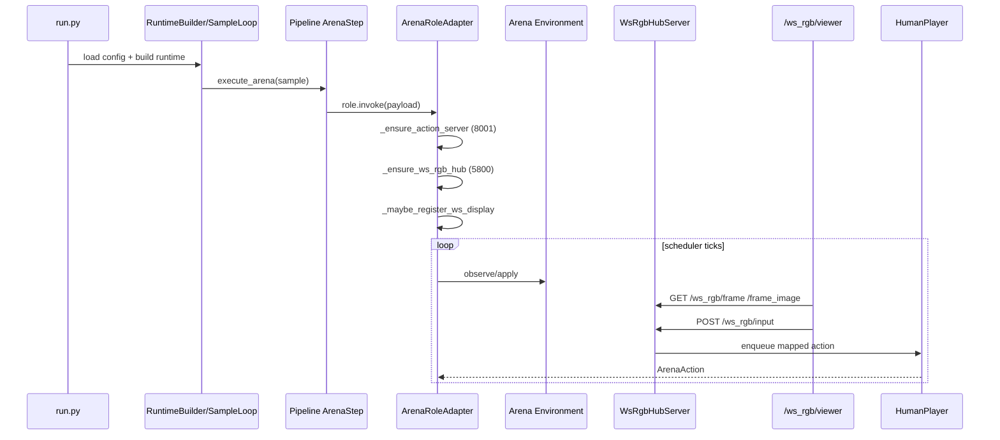

# websocketRGB Runtime and Replay Guide

English | [中文](websocketRGB_runtime_replay_guide_zh.md)

This guide targets **all Arena game integrators and operators**. It consolidates the shared `websocketRGB` infrastructure for live viewing, input routing, and post-run replay.

All command examples stay aligned with `docs/local/指令精简.md`.

Implementation identifiers are still `ws_rgb` for now. Paths, routes, script names, and module names in examples therefore remain unchanged.

---

## 1. Scope

This guide covers:

- Live `websocketRGB` runtime flow (watch frames while the match is running, submit actions)
- Replay `websocketRGB` flow (replay from run artifacts)
- Config-to-runtime behavior mapping for `websocketRGB`
- Minimal integration contract for new games
- Common troubleshooting paths

This guide does not cover:

- Game-specific rules
- LLM backend internals

Supported replay game families:

- `gomoku`
- `tictactoe`
- `doudizhu`
- `mahjong`
- `pettingzoo`

---

## 2. Terms and Key Facts

### 2.1 What `websocketRGB` is

`websocketRGB` is the unified Arena visualization and input gateway, built around:

- `WsRgbHubServer` (HTTP service)
- `DisplayRegistration` (display instance registration)
- `GameInputMapper` (browser event to action mapping)

### 2.2 Important implementation facts

- The name is `websocketRGB`, but the current viewer works via **HTTP polling**, not websocket push.
- In live mode, Arena only attempts display registration when `display_mode: websocket`.
- Current live registration requires an input mapper; therefore only mapper-enabled game families are live-enabled.
- Replay is more generic than live mode because it can read recorded frame artifacts without a live input mapper.

---

## 3. End-to-End Live Flow



Execution entry and orchestration:

- `run.py`
- `src/gage_eval/evaluation/runtime_builder.py`
- `src/gage_eval/evaluation/sample_loop.py`
- `src/gage_eval/evaluation/task_planner.py`
- `src/gage_eval/pipeline/steps/arena.py`

`websocketRGB` runtime core:

- `src/gage_eval/role/adapters/arena.py`
- `src/gage_eval/tools/ws_rgb_server.py`
- `src/gage_eval/tools/action_server.py`

---

## 4. Live Config Contract

### 4.1 Minimal config

Under your `role_type: arena` adapter:

```yaml
params:
  environment:
    display_mode: websocket
  human_input:
    enabled: true
    port: 8001
    ws_port: 5800
```

Common additions:

- `environment.action_schema`: mapper parameters (for example `key_map`)
- `human_input.ws_host/ws_allow_origin`: viewer bind and CORS options

### 4.2 Field-to-behavior mapping

| Config path | Behavior | Read path |
| --- | --- | --- |
| `environment.display_mode` | Whether `websocketRGB` display is registered | `ArenaRoleAdapter._maybe_register_ws_display` |
| `human_input.enabled` | Whether input servers are started | `ArenaRoleAdapter._ensure_action_server` |
| `human_input.port` | `/tournament/action` port | `ActionQueueServer` |
| `human_input.ws_port` | `/ws_rgb/*` port | `WsRgbHubServer` |
| `environment.action_schema` | Mapper params (`key_map`, etc.) | `ArenaRoleAdapter._bind_input_mapper` |

---

## 5. `websocketRGB` HTTP API

Viewer page:

- `GET /ws_rgb/viewer`

Display discovery:

- `GET /ws_rgb/displays`
- The response now includes the current session-state snapshot for each display

Frame endpoints:

- `GET /ws_rgb/frame?display_id=...`
- `GET /ws_rgb/frame_image?display_id=...`

Input endpoint:

- `POST /ws_rgb/input`
- `POST /ws_rgb/session`

Replay buffer endpoint (for replay-seekable displays):

- `GET /ws_rgb/replay_buffer?display_id=...`

### 5.1 Viewer States and Buttons

The viewer now exposes three runtime states:

- Entering `in_progress` means the match is still running. Input is allowed and replay stays locked.
- Entering `game_ended` means the current match has finished. Replay, step, and seek are available while the process waits for user confirmation.
- Entering `process_ended` means shutdown has been confirmed. The runtime is exiting and the viewer will disconnect soon.

Current button behavior:

- `Terminate Game`: Only enabled in `in_progress`. It ends the current match and moves the viewer into `game_ended` without closing the process immediately.
- `Start Replay` / `Step -` / `Step +` / `Replay Seek`: Only available in `game_ended`.
- `End Process`: Only enabled in `game_ended`. It requires confirmation before the runtime is actually closed.
- `Back To Live`: Currently hidden in the UI.

---

## 6. Input Routing and Mapper Model

### 6.1 Routing pipeline

1. Browser submits `payload` to `/ws_rgb/input`
2. Hub resolves `input_mapper` by `display_id`
3. Mapper emits `HumanActionEvent`
4. Hub serializes to JSON and enqueues to `action_queue`
5. `HumanPlayer` dequeues and filters by `player_id`

Canonical queue payload shape:

```json
{
  "player_id": "player_0",
  "move": "1",
  "raw": "1",
  "metadata": {"source": "..."}
}
```

### 6.2 Current live mapper support matrix

From `ArenaRoleAdapter._bind_input_mapper`:

| `env_impl` keyword | mapper |
| --- | --- |
| `retro` | `RetroInputMapper` |
| `mahjong` | `MahjongInputMapper` |
| `doudizhu` | `DoudizhuInputMapper` |
| `pettingzoo` | `PettingZooDiscreteInputMapper` |
| `gomoku`/`tictactoe` | `GridCoordInputMapper` |

Notes:

- If `env_impl` does not match a mapper branch, live `websocketRGB` display registration is skipped.
- For live viewer support in a new game, at least one mapper branch is required.

---

## 7. Environment Contract for Live `websocketRGB`

### 7.1 Required capability

Your environment should provide:

- `get_last_frame()` returning the current frame payload

Arena binds it as the display `frame_source`.

### 7.2 Recommended frame payload fields

Recommended dict fields:

- `board_text`
- `legal_moves` / `legal_actions`
- `move_count`
- `metadata`
- `_rgb` (optional image frame, encoded as JPEG by hub)

Without `_rgb`, the viewer still works but the image panel is empty.

---

## 8. Stop Conditions and Scheduler Interaction

Schedulers usually stop on one of three categories:

1. Scheduler limits (`max_ticks`, `max_turns`, and similar)
2. Natural environment terminal (`terminated` or `truncated`)
3. Illegal-action policy termination (`illegal_policy`)

For `record scheduler`, the common control pair is:

- `tick_ms` for cadence
- `max_ticks` for hard cap

Environment limits (for example `max_cycles`) race with scheduler limits; whichever is reached first stops the match.

---

## 9. Replay Infrastructure Flow

Replay entry:

```bash
python -m gage_eval.tools.ws_rgb_replay --sample-json <...>
```

Resolution strategy:

1. **Prefer replay_v1 generic path** (cross-game):

- Read `predict_result[*].replay_path/replay_v1_path`
- Parse replay events with `type=frame`
- Register seekable display (`frame_at` and `frame_count`)

2. Fallback to game-specific replay builder:

- Current built-in fallback builder is `pettingzoo`

This is why replay can be more generic, while live support depends on mapper and `get_last_frame` integration.

---

## 10. Replay Prerequisites

Run from repository root:

```bash
cd /path/to/GAGE
```

PettingZoo Atari needs ROM setup before the first run in a fresh environment. Use the same Python interpreter as `run.py`:

```bash
# 0) Pick the same interpreter used by run.py
# Replace it with your conda/venv python if needed
PYTHON_BIN="${PYTHON_BIN:-$(command -v python3)}"
echo "PYTHON_BIN=$PYTHON_BIN"
"$PYTHON_BIN" -m pip -V

# 1) Install Atari dependencies
"$PYTHON_BIN" -m pip install -U \
  "pettingzoo[atari]>=1.24.3" \
  "shimmy[atari]>=1.0.0" \
  "AutoROM[accept-rom-license]>=0.6.1"

# 2) Download and install ROMs
# NOTE: Use module invocation to avoid broken AutoROM shebangs after env migration
"$PYTHON_BIN" -m AutoROM.AutoROM --accept-license
```

Minimal verification:

```bash
"$PYTHON_BIN" - <<'PY'
from pettingzoo.atari import pong_v3

env = pong_v3.env(render_mode="rgb_array")
env.reset(seed=0)
print("PettingZoo Atari ROM check: OK")
env.close()
PY
```

If you hit `AutoROM: bad interpreter` or `AutoROM: command not found`:

```bash
"$PYTHON_BIN" -m pip install --force-reinstall "AutoROM[accept-rom-license]>=0.6.1"
"$PYTHON_BIN" -m AutoROM.AutoROM --accept-license
```

For AI mode:

```bash
export OPENAI_API_KEY="<YOUR_OPENAI_API_KEY>"
```

---

## 11. Replay Workflows

### 11.1 One-click replay (recommended)

This workflow is `run -> replay` in one command.

Generic form:

```bash
bash scripts/run/arenas/replay/run_and_open.sh --game <game> --mode <dummy|ai>
```

Dummy examples:

```bash
bash scripts/run/arenas/replay/run_and_open.sh --game gomoku --mode dummy
bash scripts/run/arenas/replay/run_and_open.sh --game tictactoe --mode dummy
bash scripts/run/arenas/replay/run_and_open.sh --game doudizhu --mode dummy
bash scripts/run/arenas/replay/run_and_open.sh --game mahjong --mode dummy
bash scripts/run/arenas/replay/run_and_open.sh --game pettingzoo --mode dummy
```

AI examples:

```bash
bash scripts/run/arenas/replay/run_and_open.sh --game gomoku --mode ai
bash scripts/run/arenas/replay/run_and_open.sh --game tictactoe --mode ai
bash scripts/run/arenas/replay/run_and_open.sh --game doudizhu --mode ai
bash scripts/run/arenas/replay/run_and_open.sh --game mahjong --mode ai
bash scripts/run/arenas/replay/run_and_open.sh --game pettingzoo --mode ai
```

Common options:

```bash
bash scripts/run/arenas/replay/run_and_open.sh \
  --game gomoku \
  --mode dummy \
  --port 5860 \
  --auto-open 0
```

```bash
bash scripts/run/arenas/replay/run_and_open.sh \
  --game mahjong \
  --mode ai \
  --python-bin "$(command -v python)" \
  --run-id mahjong_ai_replay_demo
```

### 11.2 Post-run manual replay (PettingZoo example)

If you already finished a run and want replay later, use this flow.

Dummy run:

```bash
python run.py --config config/custom/pettingzoo/pong_dummy.yaml --output-dir runs --run-id pettingzoo_dummy_run
```

Replay from artifacts:

```bash
RUN_ID=pettingzoo_dummy_run
SAMPLE_JSON=$(find "runs/${RUN_ID}/samples" -name '*.json' | head -n 1)

PYTHONPATH=src python -m gage_eval.tools.ws_rgb_replay \
  --sample-json "$SAMPLE_JSON" \
  --host 127.0.0.1 \
  --port 5800 \
  --fps 12 \
  --game pettingzoo \
  --auto-open 1
```

AI run:

```bash
python run.py --config config/custom/pettingzoo/pong_ai.yaml --output-dir runs --run-id pettingzoo_ai_run
```

Replay from artifacts:

```bash
RUN_ID=pettingzoo_ai_run
SAMPLE_JSON=$(find "runs/${RUN_ID}/samples" -name '*.json' | head -n 1)

PYTHONPATH=src python -m gage_eval.tools.ws_rgb_replay \
  --sample-json "$SAMPLE_JSON" \
  --host 127.0.0.1 \
  --port 5800 \
  --fps 12 \
  --game pettingzoo \
  --auto-open 1
```

---

## 12. Minimal Steps to Onboard a New Game to `websocketRGB`

1. Implement `get_last_frame()` in the environment
2. Add a mapper branch in `ArenaRoleAdapter._bind_input_mapper`
3. Implement the mapper by inheriting `GameInputMapper` and returning `HumanActionEvent`
4. Enable config fields:

- `environment.display_mode: websocket`
- `human_input.enabled: true`

5. Validate end to end:

- `/ws_rgb/displays` shows the display
- `/ws_rgb/frame` returns payload
- `/ws_rgb/input` enqueues and affects gameplay

---

## 13. Common Troubleshooting Commands

### 13.1 Check registered displays

```bash
curl -s http://127.0.0.1:5800/ws_rgb/displays | jq
```

### 13.2 Submit `websocketRGB` input manually

```bash
curl -s -X POST http://127.0.0.1:5800/ws_rgb/input \
  -H 'Content-Type: application/json' \
  -d '{
    "display_id":"<display_id>",
    "payload":{"type":"action","action":"1"},
    "context":{"human_player_id":"player_0"}
  }' | jq
```

### 13.3 Submit via action server

```bash
curl -s -X POST http://127.0.0.1:8001/tournament/action \
  -H 'Content-Type: application/json' \
  -d '{"action":"1","player_id":"player_1"}' | jq
```

### 13.4 Quick termination reason checks

```bash
jq -c 'select(.event=="report_finalize") | .payload.arena_summary.termination_reason' runs/<run_id>/events.jsonl
jq -c '.result.reason' runs/<run_id>/samples.jsonl
```

### 13.5 Replay-specific checks

- The viewer URL is printed by `ws_rgb_replay` at startup.
- Use `--auto-open 1` to open the browser automatically; open manually in headless environments.
- `BrokenPipeError` during `/ws_rgb/frame_image` usually means the browser canceled a request; the server tolerates this.
- If replay cannot start, check:
  - `runs/<run_id>/samples` exists
  - the selected sample has replay artifacts in `predict_result[*].replay_path/replay_v1_path`
  - the selected port is free

---

## 14. Relation to Legacy `pygame` Path

`websocketRGB` and `pygame` are parallel display paths:

- `pygame`: local render branch in the environment (commonly `render_mode=human`)
- `websocketRGB`: `display_mode=websocket + get_last_frame + input mapper`

Recommended usage:

- Remote access, multi-input debugging, integration debugging: prefer `websocketRGB`
- Local single-machine render debugging: `pygame` is still valid
