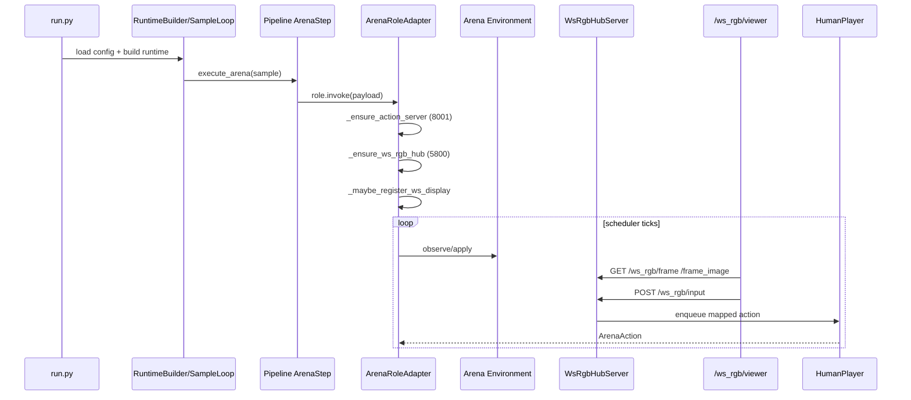

# websocketRGB 运行时与回放指南

[English](websocketRGB_runtime_replay_guide.md) | 中文

本文档面向 **所有 Arena 游戏接入开发者与使用者**，统一整理 `websocketRGB` 的在线显示、输入路由与跑后回放机制。

命令示例与 `docs/local/指令精简.md` 保持一致。

当前实现标识仍然使用 `ws_rgb`。因此示例中的路径、路由、脚本名和模块名暂时保持不变。

---

## 1. 文档范围

本文覆盖：

- `websocketRGB` live 运行时链路（运行中看画面并提交动作）
- `websocketRGB` replay 链路（基于运行产物回放）
- Arena 配置到 `websocketRGB` 行为的映射关系
- 新游戏接入所需的最小契约
- 常见故障定位路径

本文不覆盖：

- 各游戏自身规则
- LLM 推理后端细节

当前回放支持的游戏类型：

- `gomoku`
- `tictactoe`
- `doudizhu`
- `mahjong`
- `pettingzoo`

---

## 2. 术语与关键结论

### 2.1 `websocketRGB` 是什么

`websocketRGB` 是 Arena 的统一可视化与输入网关，主要由以下部分组成：

- `WsRgbHubServer`（HTTP 服务）
- `DisplayRegistration`（显示实例注册）
- `GameInputMapper`（浏览器事件到动作映射）

### 2.2 当前实现关键点

- 名字叫 `websocketRGB`，但当前 viewer 实际使用的是 **HTTP 轮询**，不是 WebSocket push。
- live 模式下，Arena 只有在 `display_mode: websocket` 时才会尝试注册 display。
- 当前 live display 注册依赖 input mapper，因此只有已实现 mapper 的游戏类型支持在线交互。
- replay 比 live 更通用，因为它可以直接读取记录好的帧产物，不依赖在线 input mapper。

---

## 3. 端到端运行链路（Live）



执行入口与主编排：

- `run.py`
- `src/gage_eval/evaluation/runtime_builder.py`
- `src/gage_eval/evaluation/sample_loop.py`
- `src/gage_eval/evaluation/task_planner.py`
- `src/gage_eval/pipeline/steps/arena.py`

`websocketRGB` 运行时核心：

- `src/gage_eval/role/adapters/arena.py`
- `src/gage_eval/tools/ws_rgb_server.py`
- `src/gage_eval/tools/action_server.py`

---

## 4. 配置契约（Live）

### 4.1 最小配置

在 `role_type: arena` 的 adapter 下：

```yaml
params:
  environment:
    display_mode: websocket
  human_input:
    enabled: true
    port: 8001
    ws_port: 5800
```

常见补充：

- `environment.action_schema`：传给 mapper 的参数（如 `key_map`）
- `human_input.ws_host/ws_allow_origin`：viewer 服务绑定与 CORS 参数

### 4.2 字段到行为映射

| 配置路径 | 作用 | 读取位置 |
| --- | --- | --- |
| `environment.display_mode` | 是否注册 `websocketRGB` display | `ArenaRoleAdapter._maybe_register_ws_display` |
| `human_input.enabled` | 是否启动输入服务 | `ArenaRoleAdapter._ensure_action_server` |
| `human_input.port` | `/tournament/action` 端口 | `ActionQueueServer` |
| `human_input.ws_port` | `/ws_rgb/*` 端口 | `WsRgbHubServer` |
| `environment.action_schema` | mapper 参数（如 `key_map`） | `ArenaRoleAdapter._bind_input_mapper` |

---

## 5. `websocketRGB` HTTP API

viewer 页面：

- `GET /ws_rgb/viewer`

显示查询：

- `GET /ws_rgb/displays`

拉取帧：

- `GET /ws_rgb/frame?display_id=...`
- `GET /ws_rgb/frame_image?display_id=...`

输入：

- `POST /ws_rgb/input`

回放缓冲接口（仅 replay-seekable display）：

- `GET /ws_rgb/replay_buffer?display_id=...`

---

## 6. 输入路由与 Mapper 机制

### 6.1 路由流程

1. 浏览器向 `/ws_rgb/input` 提交 `payload`
2. Hub 根据 `display_id` 找到对应 `input_mapper`
3. mapper 产出 `HumanActionEvent`
4. Hub 序列化为 JSON 并写入 `action_queue`
5. `HumanPlayer` 从队列中消费，并按 `player_id` 做目标过滤

队列 payload 的统一形态：

```json
{
  "player_id": "player_0",
  "move": "1",
  "raw": "1",
  "metadata": {"source": "..."}
}
```

### 6.2 当前 live mapper 支持矩阵

根据 `ArenaRoleAdapter._bind_input_mapper` 的实现：

| `env_impl` 关键词 | mapper |
| --- | --- |
| `retro` | `RetroInputMapper` |
| `mahjong` | `MahjongInputMapper` |
| `doudizhu` | `DoudizhuInputMapper` |
| `pettingzoo` | `PettingZooDiscreteInputMapper` |
| `gomoku`/`tictactoe` | `GridCoordInputMapper` |

说明：

- 若 `env_impl` 没有命中 mapper 分支，当前实现会跳过 live `websocketRGB` display 注册。
- 新游戏若要支持 live viewer，至少需要增加一个 mapper 分支。

---

## 7. 环境侧接入契约（Live）

### 7.1 必需能力

环境类至少需要提供：

- `get_last_frame()`，返回当前帧 payload

Arena 在注册 display 时会把它绑定为 `frame_source`。

### 7.2 推荐帧字段

建议 `get_last_frame()` 返回 dict，并包含：

- `board_text`
- `legal_moves` / `legal_actions`
- `move_count`
- `metadata`
- `_rgb`（可选图像帧，Hub 会编码为 JPEG）

没有 `_rgb` 也能工作，只是 viewer 的图像区域为空。

---

## 8. 停止条件与调度关系

调度器通常会因为以下三类条件之一而停止：

1. 调度器上限（如 `max_ticks`、`max_turns`）
2. 环境自然终局（`terminated` 或 `truncated`）
3. 非法动作策略触发终局（`illegal_policy`）

对 `record scheduler`，常见控制项是：

- `tick_ms` 决定节拍
- `max_ticks` 决定硬上限

环境上限（如 `max_cycles`）会和调度器上限竞速，谁先到谁生效。

---

## 9. Replay 基建链路

回放入口：

```bash
python -m gage_eval.tools.ws_rgb_replay --sample-json <...>
```

实现策略：

1. **优先 replay_v1 通用路径**（跨游戏）：

- 读取 `predict_result[*].replay_path/replay_v1_path`
- 解析 replay events 中 `type=frame`
- 注册可 seek display（`frame_at` 与 `frame_count`）

2. 无 replay_v1 时走游戏专属 replay builder：

- 当前内置 fallback builder 仅有 `pettingzoo`

这也是 replay 能比 live 更通用的原因，而 live 能力仍取决于 mapper 与 `get_last_frame` 接入。

---

## 10. Replay 前置条件

请在仓库根目录执行：

```bash
cd /path/to/GAGE
```

PettingZoo Atari 在全新环境中首次运行前，需要先安装 ROM。请使用与 `run.py` 相同的 Python 解释器：

```bash
# 0) 选择与 run.py 一致的解释器
# 如有需要，替换成你的 conda/venv python
PYTHON_BIN="${PYTHON_BIN:-$(command -v python3)}"
echo "PYTHON_BIN=$PYTHON_BIN"
"$PYTHON_BIN" -m pip -V

# 1) 安装 Atari 相关依赖
"$PYTHON_BIN" -m pip install -U \
  "pettingzoo[atari]>=1.24.3" \
  "shimmy[atari]>=1.0.0" \
  "AutoROM[accept-rom-license]>=0.6.1"

# 2) 下载并安装 ROM
# NOTE: 使用模块方式，避免 AutoROM 脚本的 shebang 指向旧环境
"$PYTHON_BIN" -m AutoROM.AutoROM --accept-license
```

最小校验：

```bash
"$PYTHON_BIN" - <<'PY'
from pettingzoo.atari import pong_v3

env = pong_v3.env(render_mode="rgb_array")
env.reset(seed=0)
print("PettingZoo Atari ROM check: OK")
env.close()
PY
```

若遇到 `AutoROM: bad interpreter` 或 `AutoROM: command not found`：

```bash
"$PYTHON_BIN" -m pip install --force-reinstall "AutoROM[accept-rom-license]>=0.6.1"
"$PYTHON_BIN" -m AutoROM.AutoROM --accept-license
```

AI 模式需要设置：

```bash
export OPENAI_API_KEY="<YOUR_OPENAI_API_KEY>"
```

---

## 11. Replay 使用方式

### 11.1 一键回放（推荐）

该方式是一条命令完成 `run -> replay`。

通用形式：

```bash
bash scripts/run/arenas/replay/run_and_open.sh --game <game> --mode <dummy|ai>
```

Dummy 示例：

```bash
bash scripts/run/arenas/replay/run_and_open.sh --game gomoku --mode dummy
bash scripts/run/arenas/replay/run_and_open.sh --game tictactoe --mode dummy
bash scripts/run/arenas/replay/run_and_open.sh --game doudizhu --mode dummy
bash scripts/run/arenas/replay/run_and_open.sh --game mahjong --mode dummy
bash scripts/run/arenas/replay/run_and_open.sh --game pettingzoo --mode dummy
```

AI 示例：

```bash
bash scripts/run/arenas/replay/run_and_open.sh --game gomoku --mode ai
bash scripts/run/arenas/replay/run_and_open.sh --game tictactoe --mode ai
bash scripts/run/arenas/replay/run_and_open.sh --game doudizhu --mode ai
bash scripts/run/arenas/replay/run_and_open.sh --game mahjong --mode ai
bash scripts/run/arenas/replay/run_and_open.sh --game pettingzoo --mode ai
```

常用参数示例：

```bash
bash scripts/run/arenas/replay/run_and_open.sh \
  --game gomoku \
  --mode dummy \
  --port 5860 \
  --auto-open 0
```

```bash
bash scripts/run/arenas/replay/run_and_open.sh \
  --game mahjong \
  --mode ai \
  --python-bin "$(command -v python)" \
  --run-id mahjong_ai_replay_demo
```

### 11.2 跑后手动回放（PettingZoo 示例）

如果对局已经跑完，后续再回放，可使用以下流程。

Dummy 运行：

```bash
python run.py --config config/custom/pettingzoo/pong_dummy.yaml --output-dir runs --run-id pettingzoo_dummy_run
```

从产物启动回放：

```bash
RUN_ID=pettingzoo_dummy_run
SAMPLE_JSON=$(find "runs/${RUN_ID}/samples" -name '*.json' | head -n 1)

PYTHONPATH=src python -m gage_eval.tools.ws_rgb_replay \
  --sample-json "$SAMPLE_JSON" \
  --host 127.0.0.1 \
  --port 5800 \
  --fps 12 \
  --game pettingzoo \
  --auto-open 1
```

AI 运行：

```bash
python run.py --config config/custom/pettingzoo/pong_ai.yaml --output-dir runs --run-id pettingzoo_ai_run
```

从产物启动回放：

```bash
RUN_ID=pettingzoo_ai_run
SAMPLE_JSON=$(find "runs/${RUN_ID}/samples" -name '*.json' | head -n 1)

PYTHONPATH=src python -m gage_eval.tools.ws_rgb_replay \
  --sample-json "$SAMPLE_JSON" \
  --host 127.0.0.1 \
  --port 5800 \
  --fps 12 \
  --game pettingzoo \
  --auto-open 1
```

---

## 12. 新游戏接入 `websocketRGB` 的最小步骤

1. 在环境中实现 `get_last_frame()`
2. 在 `ArenaRoleAdapter._bind_input_mapper` 中增加 mapper 分支
3. 让 mapper 继承 `GameInputMapper`，并返回 `HumanActionEvent`
4. 在配置中开启：

- `environment.display_mode: websocket`
- `human_input.enabled: true`

5. 做端到端验证：

- `/ws_rgb/displays` 能看到 display
- `/ws_rgb/frame` 能返回 payload
- `/ws_rgb/input` 能成功入队并影响对局

---

## 13. 常用排障命令

### 13.1 检查 display 是否注册

```bash
curl -s http://127.0.0.1:5800/ws_rgb/displays | jq
```

### 13.2 手工提交 `websocketRGB` 输入

```bash
curl -s -X POST http://127.0.0.1:5800/ws_rgb/input \
  -H 'Content-Type: application/json' \
  -d '{
    "display_id":"<display_id>",
    "payload":{"type":"action","action":"1"},
    "context":{"human_player_id":"player_0"}
  }' | jq
```

### 13.3 通过 action server 提交

```bash
curl -s -X POST http://127.0.0.1:8001/tournament/action \
  -H 'Content-Type: application/json' \
  -d '{"action":"1","player_id":"player_1"}' | jq
```

### 13.4 快速检查终止原因

```bash
jq -c 'select(.event=="report_finalize") | .payload.arena_summary.termination_reason' runs/<run_id>/events.jsonl
jq -c '.result.reason' runs/<run_id>/samples.jsonl
```

### 13.5 Replay 定位要点

- `ws_rgb_replay` 启动后会打印 viewer 地址。
- 使用 `--auto-open 1` 可自动打开浏览器；无图形环境请手动访问。
- `/ws_rgb/frame_image` 出现 `BrokenPipeError`，通常表示浏览器取消了旧请求，服务端已容错。
- 回放无法启动时，请检查：
  - `runs/<run_id>/samples` 是否存在
  - 选中的 sample 是否包含 `predict_result[*].replay_path/replay_v1_path`
  - 目标端口是否空闲

---

## 14. 与旧 `pygame` 路径的关系

`websocketRGB` 与 `pygame` 是两条并行显示路径：

- `pygame`：依赖环境内的本地渲染分支（通常 `render_mode=human`）
- `websocketRGB`：依赖 `display_mode=websocket + get_last_frame + input mapper`

建议按场景选择：

- 远程访问、多人输入联调、集成调试：优先 `websocketRGB`
- 本地单机渲染调试：`pygame` 仍然适用
