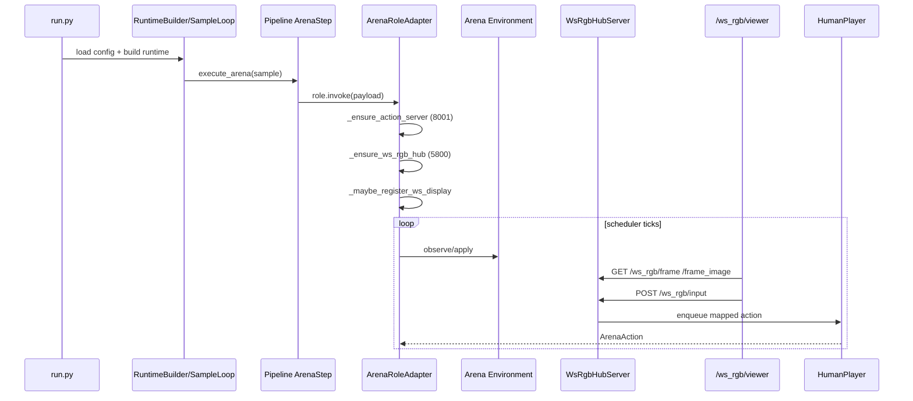

# ws_rgb Runtime Developer Guide (All Games)

English | [中文](ws_rgb_runtime_dev_guide_zh.md)

This guide targets **all Arena game integrators** and explains the shared `ws_rgb` infrastructure for live viewing, input routing, and replay.

---

## 1. Scope

This guide covers:

- Live `ws_rgb` runtime flow (watch frames while match is running, submit actions)
- Replay `ws_rgb` flow (replay from run artifacts)
- Config-to-runtime behavior mapping for ws
- Minimal integration contract for new games
- Common troubleshooting paths

This guide does not cover:

- Game rules
- LLM backend internals

---

## 2. Terms and Key Facts

### 2.1 What `ws_rgb` is

`ws_rgb` is the unified Arena visualization/input gateway, built around:

- `WsRgbHubServer` (HTTP service)
- `DisplayRegistration` (display instance registration)
- `GameInputMapper` (browser event to action mapping)

### 2.2 Important implementation facts

- The name is `ws_rgb`, but the current viewer works via **HTTP polling**, not websocket push.
- In live mode, Arena only attempts display registration when `display_mode: websocket`.
- Current live registration requires an input mapper; therefore only mapper-enabled game families are live-enabled.

---

## 3. End-to-End Live Flow



Execution entry and orchestration:

- `run.py`
- `src/gage_eval/evaluation/runtime_builder.py`
- `src/gage_eval/evaluation/sample_loop.py`
- `src/gage_eval/evaluation/task_planner.py`
- `src/gage_eval/pipeline/steps/arena.py`

ws runtime core:

- `src/gage_eval/role/adapters/arena.py`
- `src/gage_eval/tools/ws_rgb_server.py`
- `src/gage_eval/tools/action_server.py`

---

## 4. Live Config Contract

### 4.1 Minimal config

Under your `role_type: arena` adapter:

```yaml
params:
  environment:
    display_mode: websocket
  human_input:
    enabled: true
    port: 8001
    ws_port: 5800
```

Common additions:

- `environment.action_schema`: mapper parameters (for example `key_map`)
- `human_input.ws_host/ws_allow_origin`: viewer bind and CORS options

### 4.2 Field-to-behavior mapping

| Config path | Behavior | Read path |
| --- | --- | --- |
| `environment.display_mode` | Whether ws display is registered | `ArenaRoleAdapter._maybe_register_ws_display` |
| `human_input.enabled` | Whether input servers are started | `ArenaRoleAdapter._ensure_action_server` |
| `human_input.port` | `/tournament/action` port | `ActionQueueServer` |
| `human_input.ws_port` | `/ws_rgb/*` port | `WsRgbHubServer` |
| `environment.action_schema` | Mapper params (`key_map`, etc.) | `ArenaRoleAdapter._bind_input_mapper` |

---

## 5. ws_rgb HTTP API

Viewer page:

- `GET /ws_rgb/viewer`

Display discovery:

- `GET /ws_rgb/displays`

Frame endpoints:

- `GET /ws_rgb/frame?display_id=...`
- `GET /ws_rgb/frame_image?display_id=...`

Input endpoint:

- `POST /ws_rgb/input`

Replay buffer endpoint (for replay-seekable displays):

- `GET /ws_rgb/replay_buffer?display_id=...`

---

## 6. Input Routing and Mapper Model

### 6.1 Routing pipeline

1. Browser submits `payload` to `/ws_rgb/input`
2. Hub resolves `input_mapper` by `display_id`
3. Mapper emits `HumanActionEvent`
4. Hub serializes to JSON and enqueues to `action_queue`
5. `HumanPlayer` dequeues and filters by `player_id`

Canonical queue payload shape:

```json
{
  "player_id": "player_0",
  "move": "1",
  "raw": "1",
  "metadata": {"source": "..."}
}
```

### 6.2 Current live mapper support matrix

From `ArenaRoleAdapter._bind_input_mapper`:

| `env_impl` keyword | mapper |
| --- | --- |
| `retro` | `RetroInputMapper` |
| `mahjong` | `MahjongInputMapper` |
| `doudizhu` | `DoudizhuInputMapper` |
| `pettingzoo` | `PettingZooDiscreteInputMapper` |
| `gomoku`/`tictactoe` | `GridCoordInputMapper` |

Notes:

- If `env_impl` does not match a mapper branch, live ws display registration is skipped.
- For live viewer support in a new game, at least one mapper branch is required.

---

## 7. Environment Contract for Live ws

### 7.1 Required capability

Your environment should provide:

- `get_last_frame()` returning current frame payload

Arena binds it as the display `frame_source`.

### 7.2 Recommended frame payload fields

Recommended dict fields:

- `board_text`
- `legal_moves` / `legal_actions`
- `move_count`
- `metadata`
- `_rgb` (optional image frame, encoded as JPEG by hub)

Without `_rgb`, viewer still works but image panel is empty.

---

## 8. Stop Conditions and Scheduler Interaction

Schedulers usually stop on one of three categories:

1. Scheduler limits (`max_ticks`, `max_turns`, etc.)
2. Natural environment terminal (`terminated`/`truncated`)
3. Illegal-action policy termination (`illegal_policy`)

For `record scheduler`, the common control pair is:

- `tick_ms` for cadence
- `max_ticks` for hard cap

Environment limits (for example `max_cycles`) race with scheduler limits; whichever is reached first stops the match.

---

## 9. Replay Infrastructure Flow

Replay entry:

```bash
python -m gage_eval.tools.ws_rgb_replay --sample-json <...>
```

Resolution strategy:

1. **Prefer replay_v1 generic path** (cross-game):

- Read `predict_result[*].replay_path/replay_v1_path`
- Parse replay events with `type=frame`
- Register seekable display (`frame_at`/`frame_count`)

2. Fallback to game-specific replay builder:

- Current built-in fallback builder is `pettingzoo`

This is why replay can be more generic, while live support depends on mapper and `get_last_frame` integration.

---

## 10. Minimal Steps to Onboard a New Game to ws

1. Implement `get_last_frame()` in environment
2. Add mapper branch in `ArenaRoleAdapter._bind_input_mapper`
3. Implement mapper by inheriting `GameInputMapper` and returning `HumanActionEvent`
4. Enable config fields:

- `environment.display_mode: websocket`
- `human_input.enabled: true`

5. Validate end-to-end:

- `/ws_rgb/displays` shows the display
- `/ws_rgb/frame` returns payload
- `/ws_rgb/input` enqueues and affects gameplay

---

## 11. Common Troubleshooting Commands

### 11.1 Check registered displays

```bash
curl -s http://127.0.0.1:5800/ws_rgb/displays | jq
```

### 11.2 Submit ws input manually

```bash
curl -s -X POST http://127.0.0.1:5800/ws_rgb/input \
  -H 'Content-Type: application/json' \
  -d '{
    "display_id":"<display_id>",
    "payload":{"type":"action","action":"1"},
    "context":{"human_player_id":"player_0"}
  }' | jq
```

### 11.3 Submit via action server

```bash
curl -s -X POST http://127.0.0.1:8001/tournament/action \
  -H 'Content-Type: application/json' \
  -d '{"action":"1","player_id":"player_1"}' | jq
```

### 11.4 Quick termination reason checks

```bash
jq -c 'select(.event=="report_finalize") | .payload.arena_summary.termination_reason' runs/<run_id>/events.jsonl
jq -c '.result.reason' runs/<run_id>/samples.jsonl
```

---

## 12. Relation to Legacy pygame Path

`ws_rgb` and `pygame` are parallel display paths:

- `pygame`: local render branch in environment (commonly `render_mode=human`)
- `ws_rgb`: `display_mode=websocket + get_last_frame + mapper`

Recommended usage:

- Remote/human multi-input/integration debugging: prefer `ws_rgb`
- Local single-machine render debugging: `pygame` is still valid

