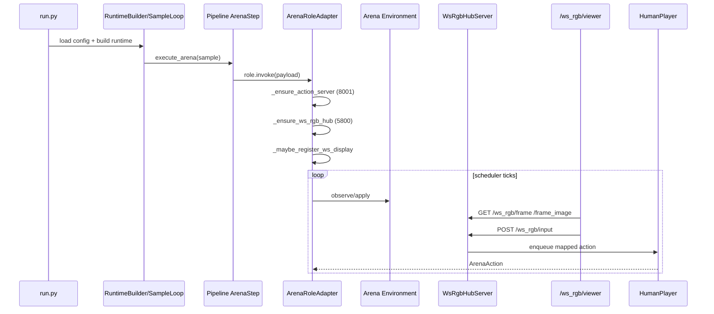

# ws_rgb 运行时开发者文档（全游戏接入）

[English](ws_rgb_runtime_dev_guide.md) | 中文

本文档面向 **所有 Arena 游戏接入开发者**，说明 `ws_rgb` 在线显示、输入路由与回放基建的统一机制。

---

## 1. 文档范围

本文覆盖：

- `ws_rgb` live 运行时链路（运行中看画面 + 发动作）
- `ws_rgb` replay 链路（基于运行产物回放）
- Arena 配置到 ws 行为的映射关系
- 新游戏要接入 ws 能力时的最小契约
- 常见故障定位路径

本文不覆盖：

- 具体游戏规则
- LLM 推理后端细节

---

## 2. 术语与结论

### 2.1 `ws_rgb` 是什么

`ws_rgb` 是 Arena 的统一可视化与输入网关，主要由：

- `WsRgbHubServer`（HTTP 服务）
- `DisplayRegistration`（显示实例注册）
- `GameInputMapper`（浏览器事件到动作映射）

组成。

### 2.2 当前实现关键点

- 名字叫 `ws_rgb`，但当前 viewer 是 **HTTP 轮询**，不是 WebSocket push。
- live 模式下，Arena 只有在 `display_mode: websocket` 时才尝试注册 display。
- 目前 live display 注册需要绑定 input mapper，因此仅支持已实现 mapper 的游戏类型。

---

## 3. 端到端运行链路（Live）



执行入口与主编排：

- `run.py`
- `src/gage_eval/evaluation/runtime_builder.py`
- `src/gage_eval/evaluation/sample_loop.py`
- `src/gage_eval/evaluation/task_planner.py`
- `src/gage_eval/pipeline/steps/arena.py`

ws 运行时核心：

- `src/gage_eval/role/adapters/arena.py`
- `src/gage_eval/tools/ws_rgb_server.py`
- `src/gage_eval/tools/action_server.py`

---

## 4. 配置契约（Live）

### 4.1 最小配置

在 `role_type: arena` 的 adapter 下：

```yaml
params:
  environment:
    display_mode: websocket
  human_input:
    enabled: true
    port: 8001
    ws_port: 5800
```

常见补充：

- `environment.action_schema`: 传给 mapper（如 `key_map`）
- `human_input.ws_host/ws_allow_origin`: viewer 服务绑定参数

### 4.2 字段到行为映射

| 配置路径 | 作用 | 读取位置 |
| --- | --- | --- |
| `environment.display_mode` | 是否注册 ws display | `ArenaRoleAdapter._maybe_register_ws_display` |
| `human_input.enabled` | 是否启动输入服务 | `ArenaRoleAdapter._ensure_action_server` |
| `human_input.port` | `/tournament/action` 端口 | `ActionQueueServer` |
| `human_input.ws_port` | `/ws_rgb/*` 端口 | `WsRgbHubServer` |
| `environment.action_schema` | mapper 参数（如 key_map） | `ArenaRoleAdapter._bind_input_mapper` |

---

## 5. ws_rgb HTTP API

viewer 页面：

- `GET /ws_rgb/viewer`

显示查询：

- `GET /ws_rgb/displays`

拉取帧：

- `GET /ws_rgb/frame?display_id=...`
- `GET /ws_rgb/frame_image?display_id=...`

输入：

- `POST /ws_rgb/input`

回放缓冲（仅 replay_seekable display）：

- `GET /ws_rgb/replay_buffer?display_id=...`

---

## 6. 输入路由与 Mapper 机制

### 6.1 路由流程

1. 浏览器上报 `payload` 到 `/ws_rgb/input`
2. Hub 取 `display_id` 对应的 `input_mapper`
3. mapper 生成 `HumanActionEvent`
4. Hub 序列化为 JSON 入 `action_queue`
5. `HumanPlayer` 从队列消费，并按 `player_id` 做目标过滤

队列 payload 统一形态：

```json
{
  "player_id": "player_0",
  "move": "1",
  "raw": "1",
  "metadata": {"source": "..."}
}
```

### 6.2 当前 mapper 支持矩阵（live）

来自 `ArenaRoleAdapter._bind_input_mapper` 的实现：

| env_impl 关键词 | mapper |
| --- | --- |
| `retro` | `RetroInputMapper` |
| `mahjong` | `MahjongInputMapper` |
| `doudizhu` | `DoudizhuInputMapper` |
| `pettingzoo` | `PettingZooDiscreteInputMapper` |
| `gomoku`/`tictactoe` | `GridCoordInputMapper` |

说明：

- 若 `env_impl` 未匹配到 mapper，当前实现会直接跳过 ws display 注册。
- 因此新游戏若要 live 进 viewer，至少要提供一个 mapper 分支。

---

## 7. 环境侧接入契约（Live）

### 7.1 必须能力

环境类至少需要：

- `get_last_frame()`：返回当前帧 payload

Arena 在注册 display 时会把它作为 `frame_source`。

### 7.2 推荐帧字段

建议 `get_last_frame()` 返回 dict，包含：

- `board_text`
- `legal_moves` / `legal_actions`
- `move_count`
- `metadata`
- `_rgb`（若有图像帧，可由 hub 编码为 JPEG）

无 `_rgb` 也可工作，只是 viewer 图片区无内容。

---

## 8. 停止条件与调度关系

不同 scheduler 都会停止于以下三类条件之一：

1. 调度器上限（如 `max_ticks`、`max_turns`）
2. 环境自然终局（terminated/truncated）
3. 非法动作策略触发终局（受 `illegal_policy` 影响）

对 `record scheduler`，常见是：

- `tick_ms` 决定节拍
- `max_ticks` 决定硬上限
- 与环境上限（如 `max_cycles`）谁先到谁生效

---

## 9. Replay 基建链路

回放入口：

```bash
python -m gage_eval.tools.ws_rgb_replay --sample-json <...>
```

实现策略：

1. **优先 replay_v1 通用路径**（跨游戏）：

- 读取 `predict_result[*].replay_path/replay_v1_path`
- 解析 replay events 中 `type=frame`
- 注册可 seek display（`frame_at/frame_count`）

2. 无 replay_v1 时走游戏专属 builder：

- 当前内置仅 `pettingzoo` fallback builder

这就是为什么 replay 能“更通用”，但 live 能力取决于游戏是否接了 mapper 与 `get_last_frame`。

---

## 10. 新游戏接入 ws 的最小步骤

1. 环境实现 `get_last_frame()`
2. 在 `ArenaRoleAdapter._bind_input_mapper` 增加该游戏 mapper 分支
3. mapper 继承 `GameInputMapper`，返回 `HumanActionEvent`
4. 配置中开启：

- `environment.display_mode: websocket`
- `human_input.enabled: true`

5. 验证：

- `/ws_rgb/displays` 可见 display
- `/ws_rgb/frame` 有内容
- `/ws_rgb/input` 能入队并生效

---

## 11. 常用排障命令

### 11.1 看 display 是否注册

```bash
curl -s http://127.0.0.1:5800/ws_rgb/displays | jq
```

### 11.2 手工发送 ws 输入

```bash
curl -s -X POST http://127.0.0.1:5800/ws_rgb/input \
  -H 'Content-Type: application/json' \
  -d '{
    "display_id":"<display_id>",
    "payload":{"type":"action","action":"1"},
    "context":{"human_player_id":"player_0"}
  }' | jq
```

### 11.3 手工走 action server

```bash
curl -s -X POST http://127.0.0.1:8001/tournament/action \
  -H 'Content-Type: application/json' \
  -d '{"action":"1","player_id":"player_1"}' | jq
```

### 11.4 快速看终止原因

```bash
jq -c 'select(.event=="report_finalize") | .payload.arena_summary.termination_reason' runs/<run_id>/events.jsonl
jq -c '.result.reason' runs/<run_id>/samples.jsonl
```

---

## 12. 与旧 pygame 路径的关系

`ws_rgb` 与 `pygame` 是两条并行显示路径：

- `pygame`：依赖具体环境的本地渲染分支（通常 `render_mode=human`）
- `ws_rgb`：依赖 `display_mode=websocket + get_last_frame + mapper`

建议按场景选择：

- 联调输入链路、多人同屏、远程访问：优先 `ws_rgb`
- 本地单机渲染调试：可用 `pygame`
