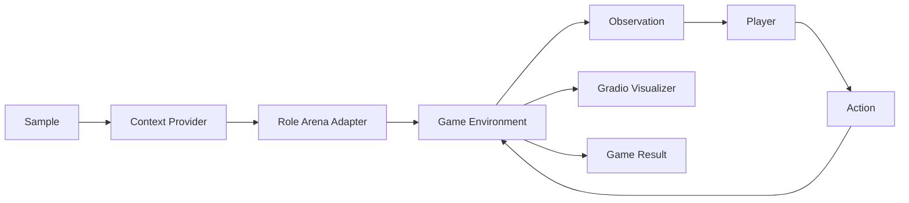
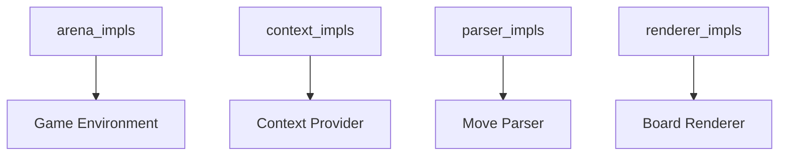

# Game Arena 对战模块

中文 | [English](game_arena.md)

Game Arena 是基于 `arena` 角色的一条**回合制对战评测通道**，用于组织游戏环境、玩家角色、解析器与可视化交互，支持 **LLM vs LLM** 与 **Human vs LLM** 的对战场景。

## 1. 适用范围与目标

- 面向带坐标落子的回合制棋类（如五子棋、井字棋）。
- 完全复用 Pipeline 编排（`support -> arena -> auto_eval`）。
- 通过 registry 扩展组件，无需修改核心编排代码。

## 2. 运行架构



关键数据契约：

- **Observation**：`board_text`, `legal_moves`, `active_player`, `last_move`, `metadata`。
- **Action**：落子坐标字符串（如 `H8` 或 `2,2`）。
- **GameResult**：胜负结果、终局棋盘、落子记录。

## 3. 核心设计思路

### 3.1 核心抽象与角色映射

ArenaRole 是一种 RoleAdapter，会由 RoleManager 实例化并负责完整对局闭环与状态整合。

| 抽象 | 责任 |
| --- | --- |
| ArenaRole | 对局主循环编排与状态整合 |
| Environment | 状态管理与观察生成 |
| RuleEngine | 合法性判定与胜负判断 |
| Scheduler | 轮到谁与回合上限控制 |
| Player Interface | 观察到行动 |
| MoveParser | 文本到动作解析 |
| Visualizer | 渲染与人机交互 |

Player Interface 与 RoleAdapter 映射：

- LLM Player 使用 `dut_model` 适配器（`LLMPlayer`）。
- Human Player 使用 `human` 适配器（`HumanPlayer`）。

### 3.2 通用实现与游戏实现分层

| 类型 | 说明 | 归属 |
| --- | --- | --- |
| Player Interface | 通用可复用 | Arena 通用实现 |
| MoveParser | 通用可复用 | Arena 通用实现 |
| Visualizer | 通用可复用 | Arena 通用实现 |
| Environment | 游戏专属 | 各游戏实现 |
| RuleEngine | 游戏专属 | 各游戏实现 |
| Scheduler | 通用可复用 | Arena 通用实现 |

### 3.3 Scheduler 形态与玩家接口

| 调度器 | 特征 | Player 接口 |
| --- | --- | --- |
| TurnScheduler | Stop and Wait | `think(observation) -> action` |
| TickScheduler | Tick Driven | 支持异步钩子 |

TickScheduler 使用的可选异步钩子：

```python
def start_thinking(self, observation, deadline_ms: int) -> None:
    ...

def has_action(self) -> bool:
    ...

def pop_action(self) -> ArenaAction:
    ...
```

## 4. 核心组件

| 组件 | Registry Key | 示例实现 | 职责 |
| --- | --- | --- | --- |
| Environment | `arena_impls` | `gomoku_local_v1`, `tictactoe_v1` | 维护棋盘状态、落子与终局判定 |
| Context | `context_impls` | `gomoku_context`, `tictactoe_context` | 生成规则说明与棋盘提示 |
| Parser | `parser_impls` | `grid_parser_v1` | 解析模型输出为坐标 |
| Renderer | `renderer_impls` | `gomoku_board_v1`, `tictactoe_board_v1` | 渲染棋盘 HTML 与交互 |

相关支撑模块：

- **Scheduler**：`turn` 或 `tick` 调度器（`src/gage_eval/role/arena/schedulers`）。
- **Players**：`LLMPlayer` 与 `HumanPlayer`（`src/gage_eval/role/arena/players`）。
- **Visualizer**：Gradio UI（`src/gage_eval/role/arena/visualizers/gradio_visualizer.py`）。

## 5. Registry 组织关系



最小注册示例：

```python
from gage_eval.registry import registry

@registry.asset("arena_impls", "tictactoe_v1")
class TicTacToeArenaEnvironment:
    ...
```

## 6. 配置示例

井字棋（Human vs LLM）：

```yaml
role_adapters:
  - adapter_id: tictactoe_arena
    role_type: arena
    params:
      environment:
        impl: tictactoe_v1
        board_size: 3
        coord_scheme: ROW_COL
      scheduler:
        type: turn
        max_turns: 9
      parser:
        impl: grid_parser_v1
        board_size: 3
        coord_scheme: ROW_COL
      visualizer:
        enabled: true
        title: GAGE Tic-Tac-Toe Arena
        wait_for_finish: true
        coord_scheme: ROW_COL
        renderer:
          impl: tictactoe_board_v1
      players:
        - name: X
          type: backend
          ref: tictactoe_player_x_litellm
        - name: O
          type: human
          ref: tictactoe_human
```

命名兜底：
- 若未显式提供 `player_names`，或值等于原始 `player_id`，或为通用 `Player N` 形式，Arena 会使用玩家的适配器 id（`ref`）作为显示名称，避免 UI 中出现 `player_0` / `Player 0` 之类的占位名。

Demo 测试集放在 `tests/data/`：

- `tests/data/Test_Gomoku_LiteLLM.jsonl`
- `tests/data/Test_TicTacToe.jsonl`

## 7. 交互与 UI

- 当存在 **human** 玩家时，Arena 自动切换为 `interactive` 模式。
- 棋盘点击通过 `build_board_interaction_js` 转成坐标并提交。
- 启用 `wait_for_finish` 时，UI 会显示 **Finish** 按钮；15 秒后自动确认完成。

### 7.1 UI 预览


## 8. Demo 与测试

Demo 配置：

- `config/custom/gomoku_litellm_local.yaml`
- `config/custom/gomoku_human_vs_llm.yaml`
- `config/custom/tictactoe_litellm_local.yaml`
- `config/custom/tictactoe_human_vs_llm.yaml`

相关测试：

- `tests/unit/core/arena/test_gomoku_environment.py`
- `tests/unit/core/arena/test_tictactoe_environment.py`
- `tests/unit/core/role/test_gomoku_context.py`
- `tests/unit/core/role/test_tictactoe_context.py`
- `tests/unit/core/role/test_gomoku_board_renderer.py`
- `tests/unit/core/role/test_tictactoe_board_renderer.py`

## 9. 扩展清单

1. 在 `src/gage_eval/role/arena/games/<game>/` 增加环境实现。
2. 注册环境、Context、Parser、Renderer 四类组件。
3. 增加 demo 配置与测试用例。
4. 使用 `run.py` 小样本验证联通。

## 10. 麻将快速上手（showdown）

前置条件：
- Python 依赖已安装（`pip install -r requirements.txt`）
- Node.js + npm 已就绪（前端回放）
- 模型密钥已配置（如 `OPENAI_API_KEY`）

一键脚本：
```bash
bash scripts/oneclick/run_mahjong_real_ai.sh
```

```bash
bash scripts/oneclick/run_mahjong_showdown_human.sh
```

```bash
bash scripts/oneclick/run_mahjong_showdown_human_dummy.sh
```

仅启动 replay server + 运行对局（无前端）：
```bash
bash scripts/oneclick/run_mahjong_replay_and_game.sh
```

访问地址：
- Replay Server：`http://127.0.0.1:<replay_port>`
- 前端回放（AI 模式）：`http://127.0.0.1:<frontend_port>/replay/mahjong?replay_path=mahjong_replay.json&mode=ai`
- 前端回放（Human 模式）：`http://127.0.0.1:<frontend_port>/replay/mahjong?replay_path=mahjong_replay.json&mode=human&play=1&action_url=http%3A%2F%2F127.0.0.1%3A8004`

URL 参数（Human / AI）：
- `replay_path`：回放文件名（默认 `mahjong_replay.json`）
- `mode`：`ai`/`human`
- `play`：`1` 启用人类交互模式
- `action_url`：Human 模式动作与聊天提交的后端地址（URL 编码）

常用环境变量：
- `REPLAY_PORT` / `FRONTEND_PORT`
- `GAGE_EVAL_SAVE_DIR`
- `OPENAI_API_KEY`
