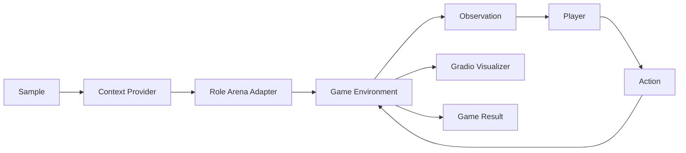
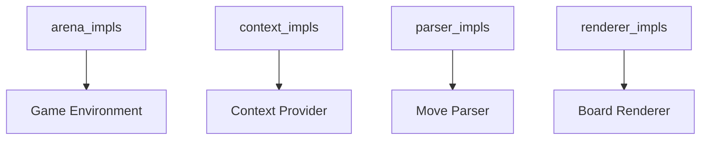

# Game Arena 对战模块

中文 | [English](game_arena.md)

Game Arena 是基于 `arena` 角色的一条**回合制对战评测通道**，用于组织游戏环境、玩家角色、解析器与可视化交互，支持 **LLM vs LLM** 与 **Human vs LLM** 的对战场景。

## 1. 适用范围与目标

- 面向带坐标落子的回合制棋类（如五子棋、井字棋）。
- 完全复用 Pipeline 编排（`support -> arena -> auto_eval`）。
- 通过 registry 扩展组件，无需修改核心编排代码。

## 2. 运行架构



关键数据契约：

- **Observation**：`board_text`, `legal_moves`, `active_player`, `last_move`, `metadata`。
- **Action**：落子坐标字符串（如 `H8` 或 `2,2`）。
- **GameResult**：胜负结果、终局棋盘、落子记录。

## 3. 核心设计思路

### 3.1 核心抽象与角色映射

ArenaRole 是一种 RoleAdapter，会由 RoleManager 实例化并负责完整对局闭环与状态整合。

| 抽象 | 责任 |
| --- | --- |
| ArenaRole | 对局主循环编排与状态整合 |
| Environment | 状态管理与观察生成 |
| RuleEngine | 合法性判定与胜负判断 |
| Scheduler | 轮到谁与回合上限控制 |
| Player Interface | 观察到行动 |
| MoveParser | 文本到动作解析 |
| Visualizer | 渲染与人机交互 |

Player Interface 与 RoleAdapter 映射：

- LLM Player 使用 `dut_model` 适配器（`LLMPlayer`）。
- Human Player 使用 `human` 适配器（`HumanPlayer`）。

### 3.2 通用实现与游戏实现分层

| 类型 | 说明 | 归属 |
| --- | --- | --- |
| Player Interface | 通用可复用 | Arena 通用实现 |
| MoveParser | 通用可复用 | Arena 通用实现 |
| Visualizer | 通用可复用 | Arena 通用实现 |
| Environment | 游戏专属 | 各游戏实现 |
| RuleEngine | 游戏专属 | 各游戏实现 |
| Scheduler | 通用可复用 | Arena 通用实现 |

### 3.3 Scheduler 形态与玩家接口

| 调度器 | 特征 | Player 接口 |
| --- | --- | --- |
| TurnScheduler | Stop and Wait | `think(observation) -> action` |
| TickScheduler | Tick Driven | 支持异步钩子 |

TickScheduler 使用的可选异步钩子：

```python
def start_thinking(self, observation, deadline_ms: int) -> None:
    ...

def has_action(self) -> bool:
    ...

def pop_action(self) -> ArenaAction:
    ...
```

## 4. 核心组件

| 组件 | Registry Key | 示例实现 | 职责 |
| --- | --- | --- | --- |
| Environment | `arena_impls` | `gomoku_local_v1`, `tictactoe_v1` | 维护棋盘状态、落子与终局判定 |
| Context | `context_impls` | `gomoku_context`, `tictactoe_context` | 生成规则说明与棋盘提示 |
| Parser | `parser_impls` | `grid_parser_v1` | 解析模型输出为坐标 |
| Renderer | `renderer_impls` | `gomoku_board_v1`, `tictactoe_board_v1` | 渲染棋盘 HTML 与交互 |

相关支撑模块：

- **Scheduler**：`turn` 或 `tick` 调度器（`src/gage_eval/role/arena/schedulers`）。
- **Players**：`LLMPlayer` 与 `HumanPlayer`（`src/gage_eval/role/arena/players`）。
- **Visualizer**：Gradio UI（`src/gage_eval/role/arena/visualizers/gradio_visualizer.py`）。

## 5. Registry 组织关系



最小注册示例：

```python
from gage_eval.registry import registry

@registry.asset("arena_impls", "tictactoe_v1")
class TicTacToeArenaEnvironment:
    ...
```

## 6. 配置示例

井字棋（Human vs LLM）：

```yaml
role_adapters:
  - adapter_id: tictactoe_arena
    role_type: arena
    params:
      environment:
        impl: tictactoe_v1
        board_size: 3
        coord_scheme: ROW_COL
      scheduler:
        type: turn
        max_turns: 9
      parser:
        impl: grid_parser_v1
        board_size: 3
        coord_scheme: ROW_COL
      visualizer:
        enabled: true
        title: GAGE Tic-Tac-Toe Arena
        wait_for_finish: true
        coord_scheme: ROW_COL
        renderer:
          impl: tictactoe_board_v1
      players:
        - name: X
          type: backend
          ref: tictactoe_player_x_litellm
        - name: O
          type: human
          ref: tictactoe_human
```

命名兜底：
- 若未显式提供 `player_names`，或值等于原始 `player_id`，或为通用 `Player N` 形式，Arena 会使用玩家的适配器 id（`ref`）作为显示名称，避免 UI 中出现 `player_0` / `Player 0` 之类的占位名。

Demo 测试集放在 `tests/data/`：

- `tests/data/Test_Gomoku_LiteLLM.jsonl`
- `tests/data/Test_TicTacToe.jsonl`

## 7. 交互与 UI

- 当存在 **human** 玩家时，Arena 自动切换为 `interactive` 模式。
- 棋盘点击通过 `build_board_interaction_js` 转成坐标并提交。
- 启用 `wait_for_finish` 时，UI 会显示 **Finish** 按钮；15 秒后自动确认完成。

### 7.1 UI 预览


## 8. Demo 与测试

Demo 配置：

- `config/custom/gomoku_litellm_local.yaml`
- `config/custom/gomoku_human_vs_llm.yaml`
- `config/custom/tictactoe_litellm_local.yaml`
- `config/custom/tictactoe_human_vs_llm.yaml`

运行指令：
python run.py -c config/custom/gomoku_human_vs_llm.yaml

相关测试：

- `tests/unit/core/arena/test_gomoku_environment.py`
- `tests/unit/core/arena/test_tictactoe_environment.py`
- `tests/unit/core/role/test_gomoku_context.py`
- `tests/unit/core/role/test_tictactoe_context.py`
- `tests/unit/core/role/test_gomoku_board_renderer.py`
- `tests/unit/core/role/test_tictactoe_board_renderer.py`

## 9. 进阶示例：斗地主 Showdown

### 9.1 快速启动

前置条件：
- Node.js + npm
- 首次需要安装前端依赖：`cd frontend/rlcard-showdown && npm install --legacy-peer-deps`
- 设置密钥：`OPENAI_API_KEY`（或 `LITELLM_API_KEY`）
- `run_doudizhu_showdown` 中 `PYTHON_BIN` 指向对应环境

一键启动：
```bash
scripts/oneclick/run_doudizhu_showdown.sh       # 3ai对战
scripts/oneclick/run_doudizhu_showdown_human.sh # human模式
```

启动后脚本会输出：
```
[oneclick] replay url: http://127.0.0.1:<port>/replay/doudizhu?...
```
如果没有自动打开浏览器，请手动打开这条 URL。

常用环境变量：
- `RUN_ID`：运行标识（默认带时间戳）
- `OUTPUT_DIR`：输出目录（默认 `./runs`）
- `FRONTEND_PORT` / `REPLAY_PORT`：前端与回放服务端口（端口被占用会自动顺延）
- `AUTO_OPEN=0`：禁用自动打开浏览器
- `FRONTEND_DIR`：前端目录（默认 `frontend/rlcard-showdown`）

### 9.2 脚本流程说明
(对应 `scripts/oneclick/run_doudizhu_showdown.sh`)

脚本主要流程如下：
1. 解析项目根目录与 Python 路径，读取默认配置 `config/custom/doudizhu_litellm_local.yaml`。
2. 检查 `OPENAI_API_KEY` / `LITELLM_API_KEY`、Node.js/npm、前端依赖是否就绪。
3. 自动选择空闲端口并启动 replay server。
4. 启动前端 `npm run start` 并尝试自动打开回放页面。
5. 运行 `run.py` 执行对局，输出回放链接。

脚本内置默认值（必要时可直接修改脚本）：
- `PYTHON_BIN`：Python 解释器路径（默认指向项目内 venv）。
- `CFG`：运行配置文件路径（默认 `config/custom/doudizhu_litellm_local.yaml`）。
- `SAMPLE_ID`：回放样本 ID（默认 `doudizhu_litellm_0001`）。

### 9.3 回放与输出说明

回放文件路径（默认）：
```
runs/<run_id>/replays/doudizhu_replay_<sample_id>.json
```

回放由 replay server 提供，前端通过 `replay_url` 参数读取。
如果需要定位回放文件，可从上面的路径直接读取 JSON。

### 9.4 GameResult 与结果流转

GAGE 的 arena 步骤会在一局结束后产出 `GameResult`，并写入样本的 `predict_result`，供下游（judge/auto_eval）读取：
- 写入位置：`src/gage_eval/evaluation/task_planner.py` → `append_predict_result()`
- 结果格式来源：`src/gage_eval/role/adapters/arena.py::_format_result()`

标准字段（与五子棋一致）：
- `winner`: 赢家 player_id（或 `null`）
- `result`: `"win" | "draw" | "loss"`
- `reason`: 终局原因（如 `terminal`/`illegal_move`/`max_turns`）
- `move_count` / `illegal_move_count`
- `final_board`: 最终棋盘快照（文本）
- `game_log`: 每步动作明细
- `rule_profile` / `win_direction` / `line_length`

五子棋 `game_log` 结构（示例）：
```json
{"index": 1, "player": "player_0", "coord": "H8", "row": 7, "col": 7}
```

斗地主 `game_log` 结构（`doudizhu_arena_v1`）：
```json
{
  "index": 1,
  "player": "player_0",
  "action_id": 123,
  "action_text": "333444",
  "action_cards": ["S3","H3","D3","C4","S4","H4"],
  "chat": "先压一手",
  "timestamp_ms": 1730000000000
}
```

说明：
- 斗地主的 `final_board` 是 `_snapshot_board()` 的文本快照，包含 Public/Private State、Legal Moves 预览、Chat Log 等。
- 下游如果只关心赢家/结果，直接读 `winner`/`result` 即可；若需回放细节，用 `game_log`。

### 9.5 运行逻辑（关键流程）

#### 1) 数据集输入 (system prompt)

位置：`tests/data/Test_Doudizhu_LiteLLM.jsonl`

核心字段：
- `messages`: 系统提示词，决定 AI 性格/语气/输出格式。
- `metadata.player_ids`: 玩家 ID（如 `player_0/1/2`）。
- `metadata.start_player_id`: 起始出牌玩家。

#### 2) 运行时观测（每回合上下文）

后端在每回合构造观测并交给 LLM：
- 文件：`src/gage_eval/role/arena/games/doudizhu/env.py`
- 入口：`observe()` 与 `_format_board_text()`

观测包含：
- `Public State` / `Private State`（公共/私有状态 JSON）
- `Legal Moves (preview)`（合法招法预览，默认截断）
- `Chat Log`（若开启聊天）
- `UI_STATE_JSON`（前端渲染需要的结构化状态）

同时 `metadata` 会携带：
- `player_ids` / `player_names`
- `public_state` / `private_state`
- `chat_log` / `chat_mode`

#### 3) LLM 提示组装

位置：`src/gage_eval/role/arena/players/llm_player.py`

拼接顺序：
1. 数据集 `messages`（system prompt）
2. 运行时观测（含 board_text + legal moves + instructions）

当 `chat_mode` 为 `ai-only`/`all` 时，会要求输出：
```json
{"action": "<action>", "chat": "<short line>"}
```

示例（模型实际看到的上下文）：
```text
[system]
Start Doudizhu. Output exactly one legal action string such as 'pass' or card ranks like '33'. You may also output JSON: {"action": "pass", "chat": "..."}.

[user]
Active player: Player 0 (player_0)
Opponent last move: pass

Current State:
Public State:
{"round":2,"landlord_id":"player_0","last_move":"pass",...}
 
Private State:
{"hand":["S3","H3","D3","C4","S4","BJ","RJ",...],...}

Legal Moves (preview): pass, 33, 44, 34567, ...

Chat Log:
[{"player_id":"player_1","text":"先让一手。"}]...

UI_STATE_JSON:
{"player_ids":["player_0","player_1","player_2"],"hands":[...],"latest_actions":[...],...}

Status:
- Legal moves (preview): pass, 33, 44, 34567, ...

Instructions:
- Choose exactly one legal action string from the legal moves.
- Include a short table-talk line every turn.
- Output JSON: {"action": "<action>", "chat": "<short line>"}
```

#### 4) 回放写入与前端读取

回放由 `doudizhu_arena_v1` 写入：
- 文件：`src/gage_eval/role/arena/games/doudizhu/env.py`
- 生成路径：`runs/<run_id>/replays/doudizhu_replay_<sample_id>.json`

回放服务：
- 文件：`src/gage_eval/tools/replay_server.py`
- URL：`/tournament/replay?run_id=...&sample_id=...`

前端读取：
- 文件：`frontend/rlcard-showdown/src/view/ReplayView/DoudizhuReplayView.js`
- URL：`/replay/doudizhu?run_id=...&sample_id=...&live=1`

### 9.6 AI 性格/对话配置

#### 1) 系统提示词（性格/风格的主要入口）

当前版本的 `doudizhu_arena_v1` 不会读取 `ai_persona` 字段，
AI 的“性格/风格”主要通过数据集里的 system prompt 控制。

编辑文件：
`tests/data/Test_Doudizhu_LiteLLM.jsonl`

示例（只展示关键结构）：
```json
{
  "messages": [
    {
      "role": "system",
      "content": [
        {
          "type": "text",
          "text": "You are a calm, analytical Doudizhu player. Keep chat short and witty."
        }
      ]
    }
  ]
}
```

注意：
- 所有玩家共享同一份 `messages`。
- 如果要区分玩家性格，需要扩展数据集或改造玩家提示注入逻辑。

#### 2) 对话开关与频率

配置位置：
`config/custom/doudizhu_litellm_local.yaml`

示例：
```yaml
role_adapters:
  - adapter_id: doudizhu_arena
    role_type: arena
    params:
      environment:
        impl: doudizhu_arena_v1
        chat_mode: ai-only   # off | ai-only | all
        chat_every_n: 2      # 每 N 步记录一次对话
```

#### 3) 采样参数（语气/随机性）

可以为每个玩家设置采样参数（如 `temperature`）：
```yaml
players:
  - player_id: player_0
    type: backend
    ref: doudizhu_player_0
    sampling_params:
      temperature: 0.7
```

### 9.7 斗地主启动指令（手动模式）

如需手动启动，可拆成三步：

1) 启动回放服务：
```bash
PYTHONPATH=src /Users/shuo/code/GAGE/.venv/bin/python -m gage_eval.tools.replay_server --port 8000 --replay-dir ./runs
```

2) 启动前端：
```bash
cd frontend/rlcard-showdown
REACT_APP_GAGE_API_URL="http://127.0.0.1:8000" NODE_OPTIONS="--openssl-legacy-provider" npm run start
```

3) 运行后端推理：
```bash
/Users/shuo/code/GAGE/.venv/bin/python run.py --config config/custom/doudizhu_litellm_local.yaml --output-dir runs --run-id doudizhu_showdown_local
```

### 9.8 常见问题

- 浏览器打不开页面 (ERR_CONNECTION_REFUSED)
  通常是前端没启动成功或端口被占用。请确认脚本输出的端口号并打开对应 URL。

- Node 报 `ERR_OSSL_EVP_UNSUPPORTED`
  使用 `NODE_OPTIONS=--openssl-legacy-provider`（脚本已自动加上）。

## 10. 麻将快速上手（showdown）

前置条件：
- Python 依赖已安装（`pip install -r requirements.txt`）
- Node.js + npm 已就绪（前端回放）
- 模型密钥已配置（如 `OPENAI_API_KEY`）

一键脚本：
```bash
bash scripts/oneclick/run_mahjong_real_ai.sh
```

```bash
bash scripts/oneclick/run_mahjong_showdown_human.sh
```

```bash
bash scripts/oneclick/run_mahjong_showdown_human_dummy.sh
```

仅启动 replay server + 运行对局（无前端）：
```bash
bash scripts/oneclick/run_mahjong_replay_and_game.sh
```

访问地址：
- Replay Server：`http://127.0.0.1:<replay_port>`
- 前端回放（AI 模式）：`http://127.0.0.1:<frontend_port>/replay/mahjong?replay_path=mahjong_replay.json&mode=ai`
- 前端回放（Human 模式）：`http://127.0.0.1:<frontend_port>/replay/mahjong?replay_path=mahjong_replay.json&mode=human&play=1&action_url=http%3A%2F%2F127.0.0.1%3A8004`

URL 参数（Human / AI）：
- `replay_path`：回放文件名（默认 `mahjong_replay.json`）
- `mode`：`ai`/`human`
- `play`：`1` 启用人类交互模式
- `action_url`：Human 模式动作与聊天提交的后端地址（URL 编码）

常用环境变量：
- `OPENAI_API_KEY`

## 11. PettingZoo Atari 支持 (22 款游戏)

GAGE 现已集成 PettingZoo Atari 环境，支持 22 款经典双人游戏（如 Space Invaders, Pong, Boxing 等）。

### 核心特性
1.  **多游戏支持**：统一通过 `pettingzoo_aec_v1` 适配器接入 22 款游戏。
2.  **AI控制**：LLM 基于文本观测（Text Observation）进行盲玩决策。
3.  **自动化回放**：提供“运行即回放”工具，解决 LLM 推理延迟导致的观感卡顿问题。

### 快速上手
推荐阅读完整的用户手册以获取详细指令：

### 环境要求
- **依赖项**: `cmake` (编译 Atari 环境所需)

> 📖 **[PettingZoo Atari User Guide](./pettingzoo_user_guide_zh.md)**
>
> 包含：
> *   快速开始 (Quick Start)
> *   完整游戏列表 (22 Games)
> *   Dummy/AI 模式切换
> *   常见问题 (FAQ)
