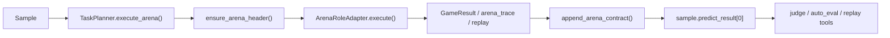
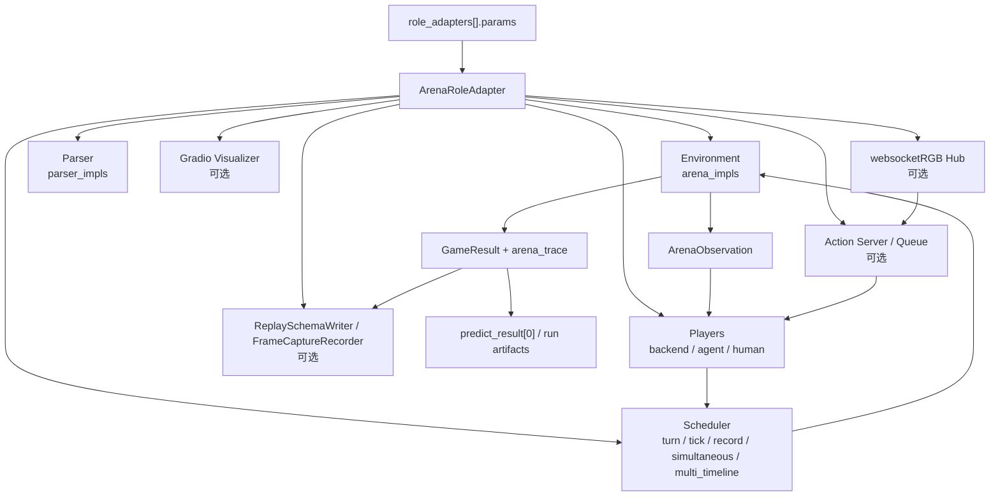
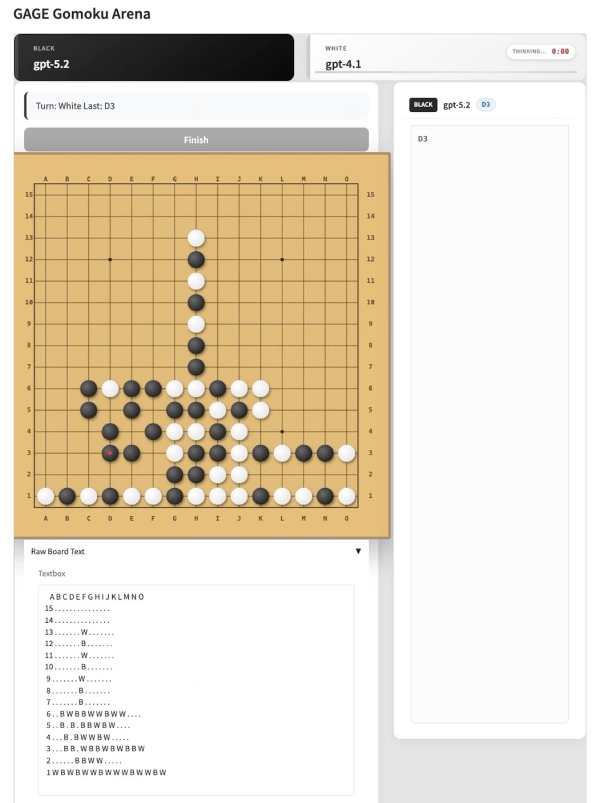
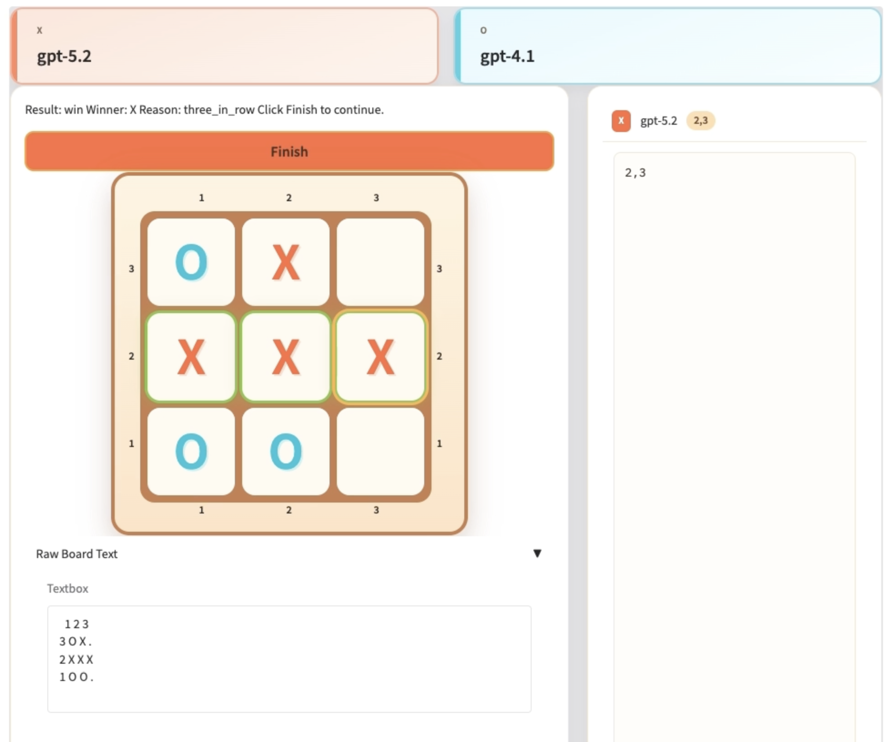
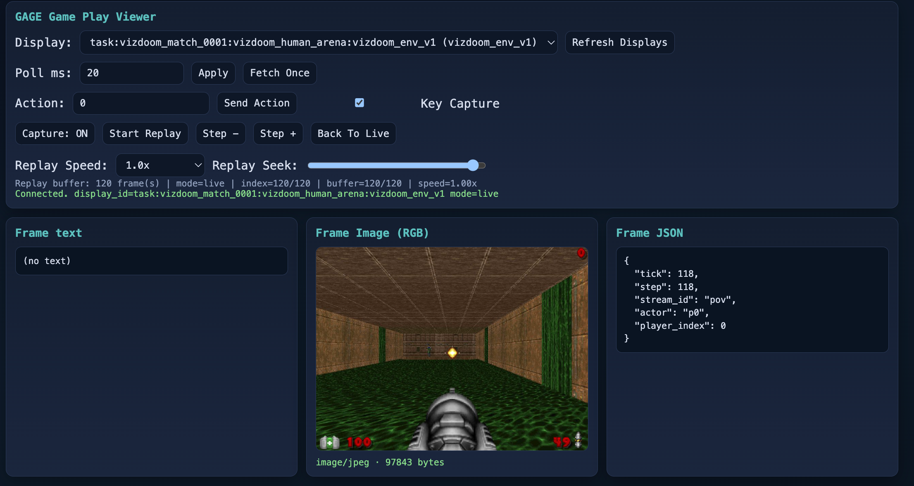
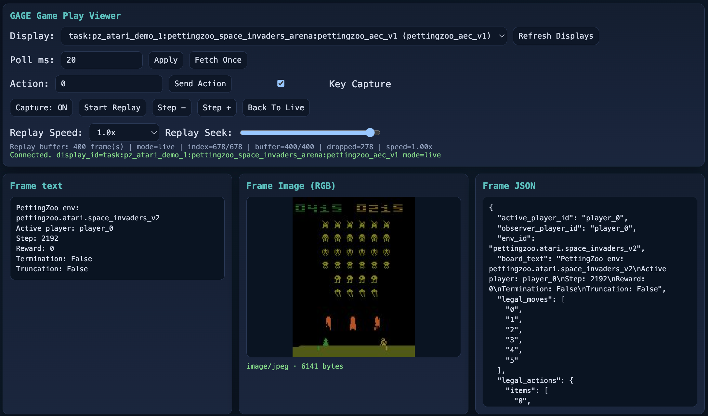
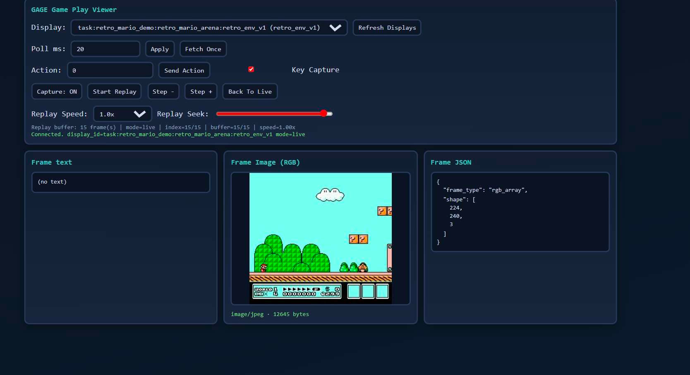

# Game Arena 总览

中文 | [English](game_arena.md)

Game Arena 是 GAGE 中基于 `arena` 角色构建的统一游戏对战运行框架，覆盖五子棋、井字棋、ViZDoom、PettingZoo、Retro Mario、斗地主、麻将等多类对战场景，支持环境驱动、动作解析、回放记录和人机交互。

当前主实现位于：

- `src/gage_eval/role/adapters/arena.py`
- `src/gage_eval/evaluation/task_planner.py`
- `src/gage_eval/evaluation/sample_envelope.py`

## 1. 当前定位

当前 Arena 更适合被理解为一层统一的“游戏运行时”：

- 对上，它仍然是标准 Pipeline 中的一个步骤，由 `TaskPlanner.execute_arena()` 调用。
- 对内，它负责拼装环境、调度器、玩家、解析器、人类输入、可视化与回放写出。
- 对下，它会把对局结果规范化写回样本，供 `judge`、`auto_eval`、回放工具和后处理继续消费。

当前实现覆盖的游戏类型包括以下几类：

| 类型 | `environment.impl` 示例 | 特点 |
| --- | --- | --- |
| 棋盘类 | `gomoku_local_v1`、`tictactoe_v1` | 坐标落子、Gradio 棋盘渲染 |
| FPS / 帧驱动类 | `vizdoom_env_v1` | tick/record 调度、图像帧、websocketRGB |
| AEC 离散动作类 | `pettingzoo_aec_v1` | 离散动作解析、轮转 agent、回放 |
| Retro 游戏类 | `retro_env_v1` | 持久运行时、动作映射、录像与回放 |
| 牌类 / 麻将类 | `doudizhu_rlcard_v1`、`doudizhu_arena_v1`、`mahjong_rlcard_v1` | formatter/parser/renderer 组合、结构化结果输出 |

### 1.1 按游戏看当前接入形态

- 五子棋：当前仍然是最典型的棋盘式 Arena，用 `gomoku_local_v1 + gomoku_v1 + gomoku_board_v1` 组成完整的人机或模型对战闭环，适合说明坐标解析、Gradio 棋盘交互和基础 `turn` 调度。
- 井字棋：结构和五子棋一致，但配置更轻，常作为最小可运行示例，用于验证 `arena` 角色、`visualizer` 和 `human` 玩家链路是否工作正常。
- ViZDoom：当前属于帧驱动 / 动作离散化环境，核心围绕 `vizdoom_env_v1 + vizdoom_parser_v1`、tick 或 record 调度、图像帧采集、websocketRGB 显示与回放展开。
- PettingZoo：当前使用 `pettingzoo_aec_v1 + discrete_action_parser_v1` 这一类组合接入 AEC 环境，重点在离散动作、轮转 agent、图像流展示和回放。当前文档与截图示例使用的是 PettingZoo Atari 的 `space_invaders`。
- Retro Mario：当前通过 `retro_env_v1` 接入 stable-retro 运行时，重点在持续运行环境、动作映射、录像与 websocketRGB/回放链路。
- 斗地主 / 麻将：这两类更适合围绕 RLCard 环境、formatter/parser/renderer、结构化结果和前端回放来理解。

## 2. Pipeline 中的位置

Arena 不是独立于 Pipeline 的旁路模块，而是 `TaskPlanner` 中一个标准执行阶段：

```mermaid
flowchart LR
  A["Sample"] --> B["TaskPlanner.execute_arena()"]
  B --> C["ensure_arena_header()"]
  C --> D["ArenaRoleAdapter.execute()"]
  D --> E["GameResult / arena_trace / replay"]
  E --> F["append_arena_contract()"]
  F --> G["sample.predict_result[0]"]
  G --> H["judge / auto_eval / replay tools"]
```

这里最关键的不是“输出一段自由文本”，而是产出一份可继续流转的结构化对局结果。

## 3. 运行时结构

当前 `ArenaRoleAdapter` 在一次对局里会动态组装下面这些部件：

```mermaid
flowchart TD
  CFG["role_adapters[].params"] --> ADP["ArenaRoleAdapter"]
  ADP --> ENV["Environment<br/>arena_impls"]
  ADP --> SCH["Scheduler<br/>turn / tick / record / simultaneous / multi_timeline"]
  ADP --> PAR["Parser<br/>parser_impls"]
  ADP --> PLY["Players<br/>backend / agent / human"]
  ADP --> VIZ["Gradio Visualizer<br/>可选"]
  ADP --> HUM["Action Server / Queue<br/>可选"]
  ADP --> WSRGB["websocketRGB Hub<br/>可选"]
  ADP --> REC["ReplaySchemaWriter / FrameCaptureRecorder<br/>可选"]

  ENV --> OBS["ArenaObservation"]
  OBS --> PLY
  PLY --> SCH
  SCH --> ENV
  ENV --> RES["GameResult + arena_trace"]
  RES --> REC
  RES --> OUT["predict_result[0] / run artifacts"]
  HUM --> PLY
  WSRGB --> HUM
```

理解当前结构时，有两个点最关键：

- `Context Provider` 仍然存在，但它已经不是 Arena 主文档里最核心的运行时部件；当前主轴是 `environment + scheduler + players + parser + replay`。
- `RuleEngine` 在很多游戏里已经内嵌到具体环境实现内部，未必总是以独立层的形式出现。

## 4. 当前更关键的配置面

如果从实际配置文件看，Arena 现在更应该按下面这几个块来理解：

| 配置块 | 作用 | 常见字段 |
| --- | --- | --- |
| `environment` | 选择游戏环境与运行模式 | `impl`、`env_id`、`display_mode`、`replay` |
| `scheduler` | 决定对局推进方式 | `type`、`tick_ms`、`max_turns`、`max_ticks` |
| `parser` | 把模型输出解析成动作 | `impl`、`action_labels`、`coord_scheme` |
| `players` | 定义参与者类型 | `type=backend/agent/human`、`ref`、`timeout_ms` |
| `visualizer` | 启用 Gradio 观察或交互界面 | `enabled`、`renderer.impl`、`wait_for_finish` |
| `human_input` | 打开输入队列、Action Server 和 ws_rgb hub | `enabled`、`port`、`ws_port` |

当前支持的调度器也已经不止旧文档中的 `turn` / `tick` 两种：

- `turn`：典型轮到谁谁行动，适合五子棋、井字棋。
- `tick`：按固定节拍轮询，适合实时或准实时场景。
- `record`：按录制节拍推进并写出可回放轨迹。
- `simultaneous`：多玩家同帧动作。
- `multi_timeline`：多时间线 / 多 lane 推进。

## 5. 结构化输出契约

Arena 结束后，结果会被写回样本，而不是只停留在控制台日志里。

### 5.1 样本头信息

`ensure_arena_header()` 会在 `sample.metadata.game_arena` 下写入一份头信息，核心字段包括：

- `engine_id`
- `seed`
- `mode`
- `players`
- `start_time_ms`

### 5.2 样本结果

`append_arena_contract()` 会把 Arena 结果规范化到：

- `sample.predict_result[0].arena_trace`
- `sample.predict_result[0].game_arena`

其中：

- `arena_trace` 记录逐步动作轨迹、时间戳、合法性、超时信息等。
- `game_arena` 记录终局摘要，例如 `winner_player_id`、`termination_reason`、`total_steps`、`final_scores`、`episode_returns`。

### 5.3 运行产物

除了样本内字段，Arena 还可能写出：

- `replay_path` / `replay_v1_path`
- `game_log` 或 `game_log_path`
- `replay.json`、`events.jsonl`
- 帧截图目录（开启 frame capture 时）

因此现在的 Arena 文档，必须同时覆盖“调度逻辑”和“产物契约”，只讲棋盘 UI 已经不够了。

## 6. 交互方式与可视化

当前 Arena 至少有两类主要交互路径：

### 6.1 Gradio 棋盘式交互

适合五子棋、井字棋这类有明确棋盘 renderer 的游戏：

- 通过 `visualizer.enabled: true` 启用。
- 通过 `renderer_impls` 渲染 HTML/CSS 棋盘。
- 当存在 `human` 玩家时，会进入交互模式。

### 6.2 websocketRGB 图像流交互

适合 ViZDoom、PettingZoo、Retro Mario 这类更偏帧驱动或图像观察的环境。

代码层面仍然主要使用 `ws_rgb` 命名，但文档中也常把它称为 `websocketRGB`。这两者在当前仓库里指向的是同一套运行时能力：

- 环境提供图像帧，例如 `get_last_frame()`。
- `ArenaRoleAdapter` 在 `display_mode=websocket/ws` 时注册显示端。
- 人类输入通过 Action Queue / ws_rgb viewer 回流到 `HumanPlayer`。
- 回放工具可以基于样本产物重建 ws_rgb 显示。

## 7. 视觉示例

### 7.1 五子棋

五子棋体现了典型的棋盘式交互形态，适合作为理解 `renderer_impls`、落子坐标解析和 Human vs LLM 流程的基础示例。

### 7.2 井字棋

井字棋是更轻量的棋盘示例，通常用于快速验证 Arena 主链路和交互式 UI 是否正常。

### 7.3 ViZDoom

ViZDoom 在这里体现的是一个带图像观察、动作映射、调度和回放的完整环境接入。

相关专题文档：

- [ViZDoom 指南](game_arena_topics/game_arena_vizdoom_zh.md)
- [websocketRGB 运行时与回放指南](game_arena_topics/websocketRGB_runtime_replay_guide_zh.md)

### 7.4 PettingZoo：Space Invaders

这里展示的是 PettingZoo Atari 系列中的 `space_invaders`。当前这类接入主打离散动作环境、图像流展示和回放链路，特别适合 Atari 一类多 agent 或轮转 agent 场景。

相关专题文档：

- [PettingZoo 指南](game_arena_topics/game_arena_pettingzoo_zh.md)
- [PettingZoo Atari 启动命令](game_arena_topics/pettingzoo_atari_run_commands_zh.md)
- [websocketRGB 运行时与回放指南](game_arena_topics/websocketRGB_runtime_replay_guide_zh.md)

### 7.5 Retro Mario

这里展示的是当前 stable-retro Mario 接入形态。它和 ViZDoom、PettingZoo 一样，更偏向运行时驱动、动作映射、图像观察和回放，而不是传统棋盘式渲染。

相关专题文档：

- [Retro Mario 指南](game_arena_topics/game_arena_retro_mario_zh.md)
- [websocketRGB 运行时与回放指南](game_arena_topics/websocketRGB_runtime_replay_guide_zh.md)

## 8. 专题入口

现有专题文档更适合由主文档统一跳转：

- [ViZDoom](game_arena_topics/game_arena_vizdoom_zh.md)
- [Retro Mario](game_arena_topics/game_arena_retro_mario_zh.md)
- [PettingZoo](game_arena_topics/pettingzoo_atari_run_commands_zh.md)
- [斗地主 Showdown](game_arena_topics/doudizhu_showdown_zh.md)
- [websocketRGB 运行时与回放指南](game_arena_topics/websocketRGB_runtime_replay_guide_zh.md)
