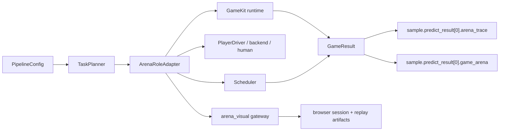

# Game Arena 总览

中文 | [English](game_arena.md)

Game Arena 是 GAGE 的统一游戏评测运行时。当前主线实现围绕 GameKit 配置、`ArenaRoleAdapter`、结构化 arena 输出和统一 `arena_visual` 浏览器控制面展开。

本文档用于说明整体运行时。浏览器操作细节见 [Arena Visual 浏览器控制面](game_arena_topics/game_arena_visual_control_zh.md)。

## 1. 当前运行时形态

Game Arena 配置和其他 GAGE 任务一样走标准 Pipeline：



```mermaid
flowchart LR
  A["PipelineConfig"] --> B["TaskPlanner"]
  B --> C["ArenaRoleAdapter"]
  C --> D["GameKit runtime"]
  C --> E["PlayerDriver / backend / human"]
  C --> F["Scheduler"]
  C --> G["arena_visual gateway"]
  D --> H["GameResult"]
  F --> H
  G --> I["browser session + replay artifacts"]
  H --> J["sample.predict_result[0].arena_trace"]
  H --> K["sample.predict_result[0].game_arena"]
```

棋盘、牌桌、帧画面游戏都写出同一份视觉 session 契约：

```text
runs/<run_id>/replays/<sample_id>/arena_visual_session/v1/
```

浏览器路由是 `/sessions/<sample_id>?run_id=<run_id>`。运行时数据由 Python gateway 通过 `/arena_visual/sessions/...` 提供，并由仓库内预构建的 `frontend/arena-visual/dist` 渲染；普通用户不需要准备 Node/npm 环境。

## 2. 当前 GameKit 家族

| 家族 | 当前配置 | 视觉形态 |
| --- | --- | --- |
| 五子棋 | `config/custom/gomoku/*_gamekit.yaml` | Board scene |
| 井字棋 | `config/custom/tictactoe/*_gamekit.yaml` | Board scene |
| 斗地主 | `config/custom/doudizhu/*_gamekit.yaml` | Table scene |
| 麻将 | `config/custom/mahjong/*_gamekit.yaml` | Table scene |
| PettingZoo Space Invaders | `config/custom/pettingzoo/space_invaders_*_gamekit.yaml` | Frame scene |
| Retro Mario | `config/custom/retro_mario/*_gamekit.yaml` | Frame scene |
| ViZDoom | `config/custom/vizdoom/*_gamekit.yaml` | Frame scene |

LLM 配置现在分两类。已有本地配置保留给内部/本地测试使用；新的 `*_openai_gamekit.yaml` 配置是面向用户的 API 路径，并从环境变量读取凭据：

```bash
export OPENAI_API_KEY="<YOUR_OPENAI_API_KEY>"
# 可选：默认模型为 gpt-5.4。
export GAGE_GAME_ARENA_LLM_MODEL="gpt-5.4"
# 可选：本地或托管的 OpenAI-compatible endpoint。
export OPENAI_API_BASE="https://api.openai.com/v1"
```

开源本地模型可以通过 OpenAI-compatible API 暴露，然后设置 `OPENAI_API_BASE` 和 `GAGE_GAME_ARENA_LLM_MODEL`。不需要改 YAML 里的 backend。

闭源 OpenAI API 用例：

```bash
export OPENAI_API_KEY="<YOUR_OPENAI_API_KEY>"
export GAGE_GAME_ARENA_LLM_MODEL="gpt-5.4"
unset OPENAI_API_BASE
```

开源 OpenAI-compatible 服务用例：

```bash
export OPENAI_API_BASE="http://127.0.0.1:<PORT>/v1"
export OPENAI_API_KEY="<LOCAL_SERVICE_API_KEY_OR_DUMMY_VALUE>"
export GAGE_GAME_ARENA_LLM_MODEL="<LOCAL_MODEL_NAME>"
```

## 3. 配置面

GameKit 配置主要围绕 `role_adapters[].params` 组织：

| 配置块 | 作用 |
| --- | --- |
| `game_kit` / `env` | 选择游戏家族和具体环境预设。 |
| `runtime_overrides` | 调整棋盘大小、实时节拍、合法动作、帧采集、回放或 backend mode。 |
| `players` | 把每个 seat 绑定到 `dummy`、`llm` 或 `human`。 |
| `human_input` | 启用浏览器动作提交和 live 输入队列。 |
| `visualizer` | 启用 `arena_visual`，设置浏览器端口、自动打开行为和媒体传输方式。 |

常见 visualizer 片段：

```yaml
visualizer:
  enabled: true
  mode: arena_visual
  launch_browser: true
  live_scene_scheme: http_pull
  linger_after_finish_s: 15.0
```

帧驱动游戏在配置明确启用时，也可以使用 `binary_stream` 或 `low_latency_channel`。

## 4. 启动入口

标准脚本位于 `scripts/run/arenas/`。

```bash
# PettingZoo Space Invaders OpenAI LLM 可视化运行
bash scripts/run/arenas/pettingzoo/run.sh --mode llm_visual_openai

# Retro Mario 纯人工实时浏览器控制
bash scripts/run/arenas/retro_mario/run.sh --mode human_visual

# ViZDoom OpenAI LLM 可视化运行
bash scripts/run/arenas/vizdoom/run.sh --mode llm_visual_openai

# 斗地主 OpenAI LLM 可视化运行
bash scripts/run/arenas/doudizhu/run.sh --mode llm_visual_openai

# 麻将 OpenAI LLM 可视化运行
bash scripts/run/arenas/mahjong/run.sh --mode llm_visual_openai
```

可视化运行会在运行目录下写出可回放的 `arena_visual_session/v1` 产物。浏览器播放控制通过 Arena Visual session 页面读取这些产物。

## 5. 选择 Topic

Topic 文档按任务场景组织：

| 需求 | 入口 |
| --- | --- |
| 最小棋盘冒烟和人类坐标输入 | [井字棋指南](game_arena_topics/game_arena_tictactoe_zh.md) |
| 更大棋盘坐标、胜利线输出和 15x15 浏览器运行 | [五子棋指南](game_arena_topics/game_arena_gomoku_zh.md) |
| 三人牌桌、合法动作文本和 chat 元数据 | [斗地主指南](game_arena_topics/game_arena_doudizhu_zh.md) |
| 四人牌桌和更长的人工验收运行 | [麻将指南](game_arena_topics/game_arena_mahjong_zh.md) |
| Atari AEC 帧、ROM 检查和 low-latency 媒体传输 | [PettingZoo Atari 指南](game_arena_topics/game_arena_pettingzoo_atari_zh.md) |
| stable-retro ROM import 和 macro 键盘动作 | [Retro Mario 指南](game_arena_topics/game_arena_retro_mario_zh.md) |
| ViZDoom 渲染、POV telemetry 和离散动作 id | [ViZDoom 指南](game_arena_topics/game_arena_vizdoom_zh.md) |
| 共享浏览器控制、session API、输入路由和回放产物 | [Arena Visual 浏览器控制面](game_arena_topics/game_arena_visual_control_zh.md) |

## 6. 输出契约

Arena 会把结构化结果写回样本：

- `sample.predict_result[0].arena_trace`：逐步动作、合法性、时间戳、重试、调度事实和运行时元数据。
- `sample.predict_result[0].game_arena`：终局摘要，例如 winner、reason、total steps、scores、episode returns。
- `artifacts.visual_session_ref`：启用可视化时指向 `arena_visual_session/v1/manifest.json`。

典型运行产物：

```text
runs/<run_id>/
  summary.json
  samples.jsonl
  replays/<sample_id>/arena_visual_session/v1/
    manifest.json
    timeline.jsonl
    scenes/
    media/
```


## 7. 视觉示例

### 五子棋


### 井字棋


### 斗地主


### 麻将


### PettingZoo Space Invaders


### Retro Mario


### ViZDoom


## 8. 相关文档

- [Arena Visual 浏览器控制面](game_arena_topics/game_arena_visual_control_zh.md)
- [五子棋指南](game_arena_topics/game_arena_gomoku_zh.md)
- [井字棋指南](game_arena_topics/game_arena_tictactoe_zh.md)
- [斗地主指南](game_arena_topics/game_arena_doudizhu_zh.md)
- [麻将指南](game_arena_topics/game_arena_mahjong_zh.md)
- [PettingZoo Atari 指南](game_arena_topics/game_arena_pettingzoo_atari_zh.md)
- [Retro Mario 指南](game_arena_topics/game_arena_retro_mario_zh.md)
- [ViZDoom 指南](game_arena_topics/game_arena_vizdoom_zh.md)
