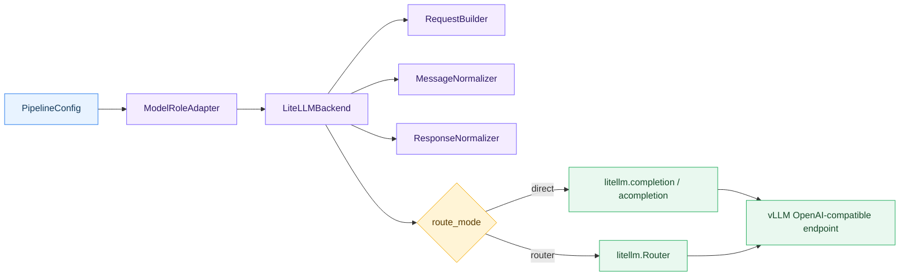

# LiteLLM Backend 增强指南

中文 | English: 暂无

本文说明 GAGE `litellm` backend 的增强能力、推荐配置方式、常见 vLLM 部署形态，以及排错和实机验证要点。文档中的命令默认在 `gage-eval-main/` 仓库根目录执行。

> 适用对象：需要用 GAGE 通过 LiteLLM 调用 OpenAI-compatible 服务、vLLM server、LiteLLM Gateway，或需要验证 thinking、多模态、工具调用、streaming/async 等能力的评测配置作者。

## 0. 相关入口

- 配置 schema：`src/gage_eval/role/model/config/litellm.py`
- backend 主入口：`src/gage_eval/role/model/backends/litellm_backend.py`
- LiteLLM 子模块：
  - `src/gage_eval/role/model/backends/litellm/request_builder.py`
  - `src/gage_eval/role/model/backends/litellm/message_normalizer.py`
  - `src/gage_eval/role/model/backends/litellm/response_normalizer.py`
  - `src/gage_eval/role/model/backends/litellm/policies.py`
  - `src/gage_eval/role/model/backends/litellm/router_factory.py`
  - `src/gage_eval/role/model/backends/litellm/model_server_lifecycle.py`
- 配置校验：

```bash
PYTHONPATH=src python -m gage_eval.tools.config_checker \
  --config config/custom/examples/qwen3_vllm_piqa_messages_no_thinking.yaml
```

## 1. 能力概览

`litellm` backend 现在既可以作为普通远程模型后端，也可以作为 vLLM OpenAI-compatible server 的统一适配层。主要增强点如下：

| 能力 | 支持情况 | 关键配置 |
| --- | --- | --- |
| 单 endpoint 直连 | 支持 | `route_mode: direct`, `provider: hosted_vllm`, `api_base` |
| 多 endpoint 聚合 | 支持 | `route_mode: router`, `model_list`, `router_settings` |
| 外部 LiteLLM Gateway | 支持 | 指向 Gateway 的 `api_base`，`vllm.topology.kind: external_litellm_gateway` |
| thinking/no-thinking | 支持 | `generation_parameters.thinking_mode`, `thinking_policy`, `vllm.reasoning_parser` |
| `reasoning_content` 归一化 | 支持 | response normalizer 自动提取 |
| 多模态 content blocks | 支持 text/image/audio 保真 | `multimodal.*`, `vllm.topology.language_model_only` |
| 工具调用 | 支持 | `tool_calling.*`, 样本级 `tools`, `tool_choice` |
| 结构化输出 | 支持 | `litellm_request.response_format` |
| sync streaming | 支持 | `streaming: true`, `litellm_request.stream_options` |
| async 调用 | 支持 backend `ainvoke` | 由 RoleAdapter 或直接探针调用 |
| 请求级透传 | 支持 | `litellm_request.*` |
| retry ownership | 支持 | Router/Gateway 场景自动收敛外层 retry |
| 实验性 server 生命周期 | 支持命令模式 | `model_server.enabled`, `startup_command`, `health.urls` |

整体调用链：



## 2. 推荐部署 Profile

### 2.1 P1 direct：单 vLLM endpoint

适用于单机单卡、单机多卡单副本、或多机多卡但只暴露一个 head API endpoint 的 vLLM 服务。

vLLM server 示例：

```bash
vllm serve /mnt/model/Qwen3.6-35B-A3B \
  --served-model-name qwen3-p1 \
  --host 0.0.0.0 \
  --port 8000 \
  --trust-remote-code \
  --tensor-parallel-size 1 \
  --reasoning-parser qwen3 \
  --enable-auto-tool-choice \
  --tool-call-parser qwen3_xml \
  --default-chat-template-kwargs '{"enable_thinking": true}'
```

GAGE backend 示例：

```yaml
backends:
  - backend_id: qwen3_litellm_direct
    type: litellm
    config:
      provider: hosted_vllm
      custom_llm_provider: hosted_vllm
      model: hosted_vllm/qwen3-p1
      api_base: http://127.0.0.1:8000/v1
      api_key: EMPTY
      streaming: false
      drop_params: true
      max_retries: 2
      generation_parameters:
        max_new_tokens: 256
        temperature: 0.0
      vllm:
        reasoning_parser: qwen3
        topology:
          kind: external_endpoint
          language_model_only: false
```

注意：

- `api_base` 应停在 `/v1`，不要写成 `/v1/chat/completions`。
- `model` 建议使用 `hosted_vllm/<served-model-name>`，与 vLLM `--served-model-name` 对齐。
- `drop_params: true` 可以保留；GAGE 会把 vLLM thinking 开关放入 `extra_body.chat_template_kwargs`，避免顶层未知参数被 LiteLLM 丢弃。

### 2.2 P2 internal Router：多个 vLLM endpoint 聚合

适用于单机多卡多副本、或多组 vLLM endpoint 的负载分发和副本隔离。GAGE 在 backend 内部创建 LiteLLM Router，不需要额外启动 LiteLLM Gateway。

```yaml
backends:
  - backend_id: qwen3_litellm_router
    type: litellm
    config:
      provider: hosted_vllm
      custom_llm_provider: hosted_vllm
      route_mode: router
      model: hosted_vllm/qwen3-router
      api_key: EMPTY
      streaming: false
      drop_params: true
      generation_parameters:
        max_new_tokens: 128
        temperature: 0.0
      model_list:
        - model_name: qwen3-router
          litellm_params:
            model: hosted_vllm/qwen3-r1
            api_base: http://127.0.0.1:8001/v1
            api_key: EMPTY
          vllm:
            reasoning_parser: qwen3
            topology:
              language_model_only: false
        - model_name: qwen3-router
          litellm_params:
            model: hosted_vllm/qwen3-r2
            api_base: http://127.0.0.1:8002/v1
            api_key: EMPTY
          vllm:
            reasoning_parser: qwen3
            topology:
              language_model_only: false
      router_settings:
        routing_strategy: simple-shuffle
        allowed_fails: 1
        cooldown_time: 10
        num_retries: 2
      vllm:
        reasoning_parser: qwen3
        topology:
          kind: internal_router
          language_model_only: false
```

Router 场景的约束：

- 同一个 `model_name` 组内的 `reasoning_parser`、chat template 默认值、`language_model_only` 应保持一致。
- 如果配置里提供了 per-deployment `vllm` 元数据，GAGE 会检查不一致并 fail fast。
- 如果只提供顶层 `vllm` 元数据，GAGE 会假定所有 deployment 遵守同一部署纪律。

### 2.3 外部 LiteLLM Gateway

如果已经有独立 LiteLLM Gateway，可让 GAGE 直连 Gateway：

```yaml
backends:
  - backend_id: qwen3_litellm_gateway
    type: litellm
    config:
      provider: litellm_gateway
      custom_llm_provider: hosted_vllm
      model: hosted_vllm/qwen3-gateway
      api_base: http://127.0.0.1:4000/v1
      api_key: EMPTY
      max_retries: 6
      generation_parameters:
        max_new_tokens: 128
        temperature: 0.0
      vllm:
        topology:
          kind: external_litellm_gateway
```

GAGE 会把 Gateway 识别为外部路由层，并把本 backend 的外层 retry budget 收敛到 1，避免 Gateway retry 与 GAGE retry 叠加放大尾延迟。

## 3. Thinking / No-thinking

### 3.1 推荐配置

Qwen3 + vLLM 的 thinking 开关应走 `extra_body.chat_template_kwargs.enable_thinking`。配置作者只需要声明 `thinking_mode`：

```yaml
config:
  provider: hosted_vllm
  custom_llm_provider: hosted_vllm
  model: hosted_vllm/qwen3-p1
  api_base: http://127.0.0.1:8000/v1
  drop_params: true
  generation_parameters:
    max_new_tokens: 256
    temperature: 0.6
    thinking_mode: enabled   # enabled / disabled / auto
  thinking_policy:
    capability: supported
    on_unsupported: fail_fast
    on_mismatch: warn_and_continue
    record_effective_state: true
  vllm:
    reasoning_parser: qwen3
```

no-thinking：

```yaml
generation_parameters:
  max_new_tokens: 128
  temperature: 0.0
  thinking_mode: disabled
```

GAGE 会在请求构造时把它转换为：

```yaml
extra_body:
  chat_template_kwargs:
    enable_thinking: false
```

### 3.2 鲁棒性策略

模型和 server 侧可能出现四类情况：

| 情况 | GAGE 行为 |
| --- | --- |
| 模型支持 thinking，server 开了 `--reasoning-parser qwen3` | 正常提取 `reasoning_content` 和 `reasoning_details` |
| 配置要求 no-thinking | 注入 `enable_thinking=false`，且不会触发 reasoning 模型 `max_tokens * 10` 放大 |
| 配置要求 thinking，但 profile 声明不支持 | 按 `thinking_policy.on_unsupported` 决定 warn、ignore 或 fail fast |
| 响应与期望不一致 | 写入 `metadata.thinking_mismatch`，按 `on_mismatch` 决定 warn 或 fail fast |

响应归一化会尝试从以下位置提取 reasoning：

- `message.reasoning_content`
- `message.reasoning_details`
- `<think>...</think>` 标签
- usage/raw response 中的 `reasoning_tokens` 作为观测信号

输出字段：

```json
{
  "answer": "...",
  "reasoning_content": "...",
  "reasoning_details": [],
  "metadata": {
    "thinking_mode": "disabled",
    "thinking_effective": "enabled",
    "thinking_mismatch": {
      "expected": "disabled",
      "observed": "enabled",
      "error_type": "response_mismatch"
    }
  }
}
```

## 4. 多模态

`litellm` backend 注册的 modalities 包含 `text`, `vision`, `audio`。消息归一化会保留 OpenAI content blocks，并处理 vLLM/OpenAI-compatible 常见输入形态。

图片样本：

```json
{
  "messages": [
    {
      "role": "user",
      "content": [
        {"type": "text", "text": "Describe this image."},
        {"type": "image_url", "image_url": {"url": "data:image/png;base64,..."}}
      ]
    }
  ]
}
```

音频样本：

```json
{
  "messages": [
    {
      "role": "user",
      "content": [
        {"type": "text", "text": "Transcribe this audio."},
        {"type": "input_audio", "input_audio": {"data": "...", "format": "wav"}}
      ]
    }
  ]
}
```

backend 配置：

```yaml
multimodal:
  fallback: fail
  audio_url_mapping: input_audio
  default_audio_format: wav
  max_media_bytes: 5242880
vllm:
  topology:
    language_model_only: false
```

关键边界：

- `fallback: fail` 是推荐值，遇到不支持的媒体块时直接失败，避免静默退化为文本。
- `max_media_bytes` 只做轻量大小保护，避免大体积 base64 进入请求链路。
- 如果 vLLM server 使用 `--language-model-only`，应在配置中声明 `vllm.topology.language_model_only: true`。GAGE 会在发送多模态请求前拒绝，错误类型为 `unsupported_capability`。

## 5. 工具调用

工具定义可放在样本级 `tools`，`tool_choice` 和 `parallel_tool_calls` 可放在样本级或 backend 配置中。

样本示例：

```json
{
  "id": "tool_call_001",
  "messages": [
    {"role": "user", "content": "Call get_weather for Shanghai."}
  ],
  "tools": [
    {
      "type": "function",
      "function": {
        "name": "get_weather",
        "description": "Get weather for a city.",
        "parameters": {
          "type": "object",
          "properties": {"city": {"type": "string"}},
          "required": ["city"]
        }
      }
    }
  ],
  "tool_choice": "auto"
}
```

backend 配置：

```yaml
tool_calling:
  enabled: true
  auto_tool_choice: true
  parallel_tool_calls: true
  require_server_parser: true
  expected_tool_parser: qwen3_xml
  expected_server_flags:
    enable_auto_tool_choice: true
    tool_call_parser: qwen3_xml
litellm_request:
  parallel_tool_calls: true
```

vLLM server 需要匹配：

```bash
--enable-auto-tool-choice --tool-call-parser qwen3_xml
```

响应中 `tool_calls` 会被归一化，`function.arguments` 会尽量解析为 JSON dict；如果 arguments 是坏 JSON，会保留原始字符串到 `raw_arguments`，避免信息丢失。

## 6. 结构化输出、Streaming 与 Async

### 6.1 JSON mode

```yaml
litellm_request:
  response_format:
    type: json_object
generation_parameters:
  max_new_tokens: 128
  temperature: 0.0
```

GAGE 不再硬编码 `response_format: {"type": "text"}`。是否严格返回合法 JSON 仍取决于模型和 vLLM server 的结构化输出支持。

### 6.2 Sync streaming

```yaml
streaming: true
litellm_request:
  stream_options:
    include_usage: true
```

stream chunks 会被聚合成单个 GAGE result：

```json
{
  "answer": "...",
  "raw_response": ["...chunks..."],
  "usage": {},
  "finish_reason": "stop"
}
```

### 6.3 Async

`LiteLLMBackend.ainvoke()` 使用 LiteLLM `acompletion`。在常规 PipelineConfig 中，是否走 async 取决于上层 RoleAdapter/Runtime 调用路径；需要直接验证 backend async 时，可以在测试或探针中直接调用：

```python
import asyncio
from gage_eval.role.model.backends.litellm_backend import LiteLLMBackend

async def main():
    backend = LiteLLMBackend({
        "provider": "hosted_vllm",
        "custom_llm_provider": "hosted_vllm",
        "model": "hosted_vllm/qwen3-p1",
        "api_base": "http://127.0.0.1:8000/v1",
        "api_key": "EMPTY",
        "streaming": True,
        "generation_parameters": {"max_new_tokens": 64, "temperature": 0.0},
    })
    result = await backend.ainvoke({
        "sample": {
            "messages": [{"role": "user", "content": "Reply with OK."}]
        }
    })
    print(result["answer"])

asyncio.run(main())
```

## 7. 请求透传配置

`litellm_request` 是面向 LiteLLM completion 参数的显式透传区。支持字段：

| 字段 | 用途 |
| --- | --- |
| `response_format` | JSON mode 或其他结构化输出控制 |
| `max_completion_tokens` | 兼容部分 provider 的 token 字段 |
| `stream_options` | streaming 附加参数，例如 `include_usage` |
| `parallel_tool_calls` | 多工具并行控制 |
| `logit_bias` | token bias |
| `user` | end-user 标识 |
| `metadata` | 请求 metadata |
| `fallbacks` | LiteLLM fallback 配置 |
| `context_window_fallback_dict` | 上下文窗口 fallback |
| `extra_body` | provider/server 专用 body，例如 `chat_template_kwargs` |
| `drop_params` | 请求级覆盖 LiteLLM drop params 行为 |

这些字段也可以通过样本或 payload 的 `sampling_params` 临时覆盖，适合对少量样本做局部实验。

## 8. Retry、错误分类与可观测性

### 8.1 Retry ownership

GAGE 避免多层 retry 叠加：

| 场景 | retry owner | GAGE backend 行为 |
| --- | --- | --- |
| direct endpoint | GAGE LiteLLM backend | 使用 `max_retries` |
| internal Router | LiteLLM Router | 外层 retry budget 收敛到 1 |
| external LiteLLM Gateway | Gateway | 外层 retry budget 收敛到 1 |

Router retry 配在：

```yaml
router_settings:
  routing_strategy: simple-shuffle
  allowed_fails: 1
  cooldown_time: 10
  num_retries: 2
```

### 8.2 错误分类

backend 会把常见失败归一化为结构化错误：

| error_type | 常见来源 |
| --- | --- |
| `dependency_unavailable` | endpoint 不可达、server health timeout、依赖不可用 |
| `invalid_request` | `api_base` 写到具体 endpoint、请求参数非法 |
| `unsupported_capability` | 多模态请求发往 `language_model_only` server、工具能力不满足 |
| `response_mismatch` | thinking 期望与响应观测不一致 |
| `invalid_media_payload` / `media_payload_too_large` | 媒体块格式或大小不合规 |
| `invalid_tool_arguments` | tool call arguments 不是合法 JSON |

### 8.3 观测摘要

响应归一化会生成脱敏观测摘要，用于调试：

- `provider`, `model`, `api_base_hash`
- `route_mode`, `topology`
- thinking mode 与 effective state
- modality counts
- tool count / tool call count
- retry owner
- finish reason, usage, latency

摘要中不会输出完整 API key 或完整 base64 媒体。

## 9. 实验性 ModelServerLifecycle

`model_server` 是实验性功能，目标是在评测运行时先执行一段用户提供的 bash 命令启动本地模型服务，等 health URL 可用后再调用 LiteLLM。

```yaml
model_server:
  enabled: true
  startup_command: |
    mkdir -p ${GAGE_VLLM_LOG_DIR:-/tmp/gage-vllm}
    nohup vllm serve ${GAGE_MODEL_PATH:-/mnt/model/Qwen3.6-35B-A3B} \
      --served-model-name ${GAGE_VLLM_P1_MODEL:-qwen3-p1} \
      --host 0.0.0.0 \
      --port ${GAGE_VLLM_P1_PORT:-8000} \
      --trust-remote-code \
      --reasoning-parser qwen3 \
      --enable-auto-tool-choice \
      --tool-call-parser qwen3_xml \
      > ${GAGE_VLLM_LOG_DIR:-/tmp/gage-vllm}/vllm.log 2>&1 &
  health:
    urls:
      - http://127.0.0.1:8000/v1/models
    timeout_seconds: 900
    interval_seconds: 5
```

限制：

- 命令通过 `bash -lc` 执行。
- 框架只负责启动和 health-gate，不负责日志轮转、资源回收、端口治理或进程编排。
- `startup_command` 会做基础危险命令拦截，例如 `curl | bash`、`wget | sh`、`rm -rf /`、`mkfs`。
- health 超时会归类为 `dependency_unavailable`。

生产或长时间压测仍建议由外部进程管理器、容器平台或作业系统管理 vLLM server。

## 10. 完整配置骨架

下面是一个包含主要增强点的骨架。实际评测时按需删减。

```yaml
backends:
  - backend_id: qwen3_litellm
    type: litellm
    config:
      provider: hosted_vllm
      custom_llm_provider: hosted_vllm
      route_mode: direct
      model: hosted_vllm/qwen3-p1
      api_base: http://127.0.0.1:8000/v1
      api_key: EMPTY
      extra_headers: {}
      streaming: false
      drop_params: true
      timeout: 120
      max_retries: 2
      retry_sleep: 1.0
      retry_multiplier: 2.0
      max_model_length: 8192
      generation_parameters:
        max_new_tokens: 256
        temperature: 0.0
        top_p: 0.95
        thinking_mode: disabled
      litellm_request:
        response_format: null
        stream_options: null
        parallel_tool_calls: null
        extra_body: {}
        drop_params: null
      vllm:
        reasoning_parser: qwen3
        topology:
          kind: external_endpoint
          language_model_only: false
      thinking_policy:
        capability: auto
        on_unsupported: warn_and_continue
        on_mismatch: warn_and_continue
        record_effective_state: true
      multimodal:
        fallback: fail
        audio_url_mapping: input_audio
        default_audio_format: wav
        max_media_bytes: 5242880
      tool_calling:
        enabled: false
        auto_tool_choice: false
        parallel_tool_calls: null
        require_server_parser: false
        expected_tool_parser: null
      model_server:
        enabled: false
        startup_command: null
        health:
          urls: []
```

## 11. 实机验证建议

建议至少覆盖以下 smoke：

| 场景 | 目的 |
| --- | --- |
| 基础 chat | 验证 endpoint、served model、usage、latency |
| Router 分发 | 验证多 deployment 命中和副本隔离 |
| thinking on/off | 验证 `extra_body.chat_template_kwargs` 没被 `drop_params` 丢弃 |
| 多模态 | 验证 image/audio blocks 保真 |
| 工具调用 | 验证 vLLM tool parser 输出能归一化 |
| JSON mode | 验证 `response_format` 透传 |
| sync streaming / async | 验证分片聚合和 `acompletion` |
| 错误分类 | 验证 dead endpoint、4xx、unsupported capability |
| 并发 | 验证全局锁已移除后的并行收益 |
| ModelServerLifecycle | 验证 startup command 与 health-gate |

执行前检查：

```bash
python - <<'PY'
import importlib.metadata as md
for pkg in ("litellm", "vllm"):
    print(pkg, md.version(pkg))
PY
```

最低依赖基线：

```text
litellm >= 1.63.8
vllm >= 0.20.1
```

Mac 本地环境可以用 `vllm 0.21.0+cpu` 做 import 和配置校验；真实 server 行为仍应以 Linux+GPU 环境为准。
