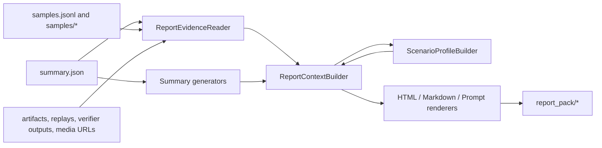
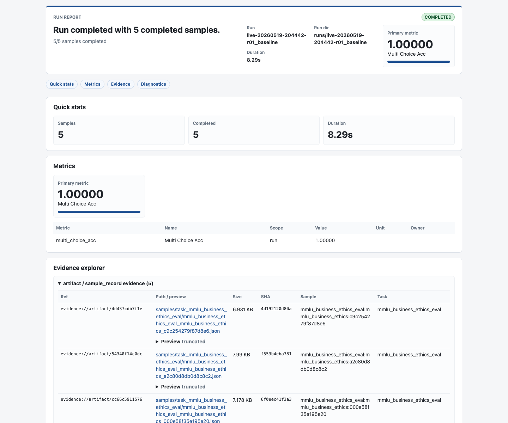
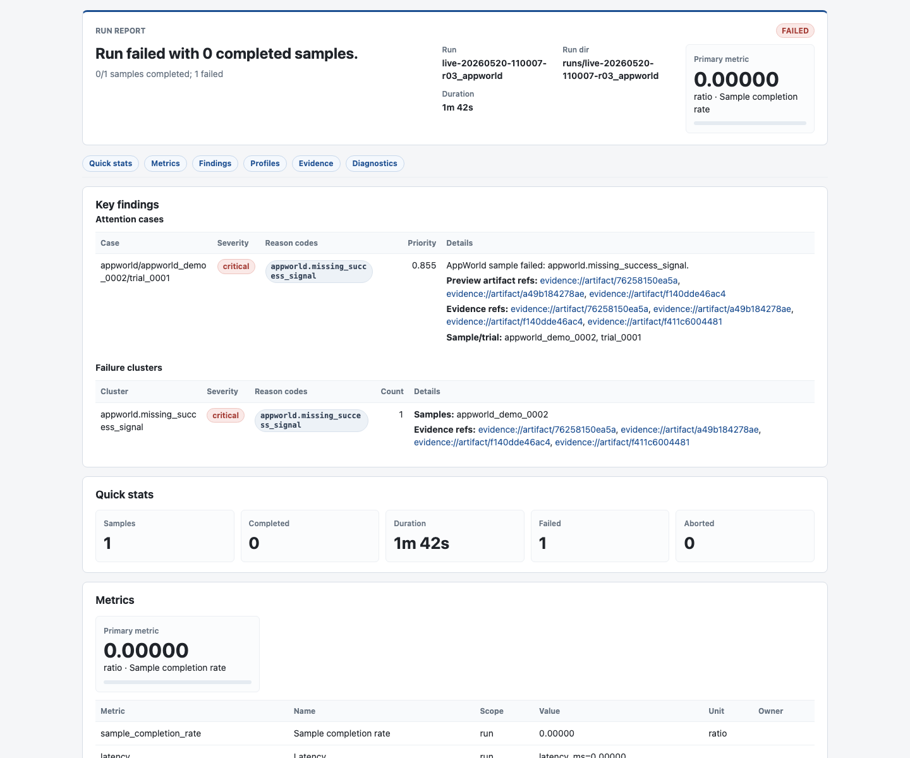
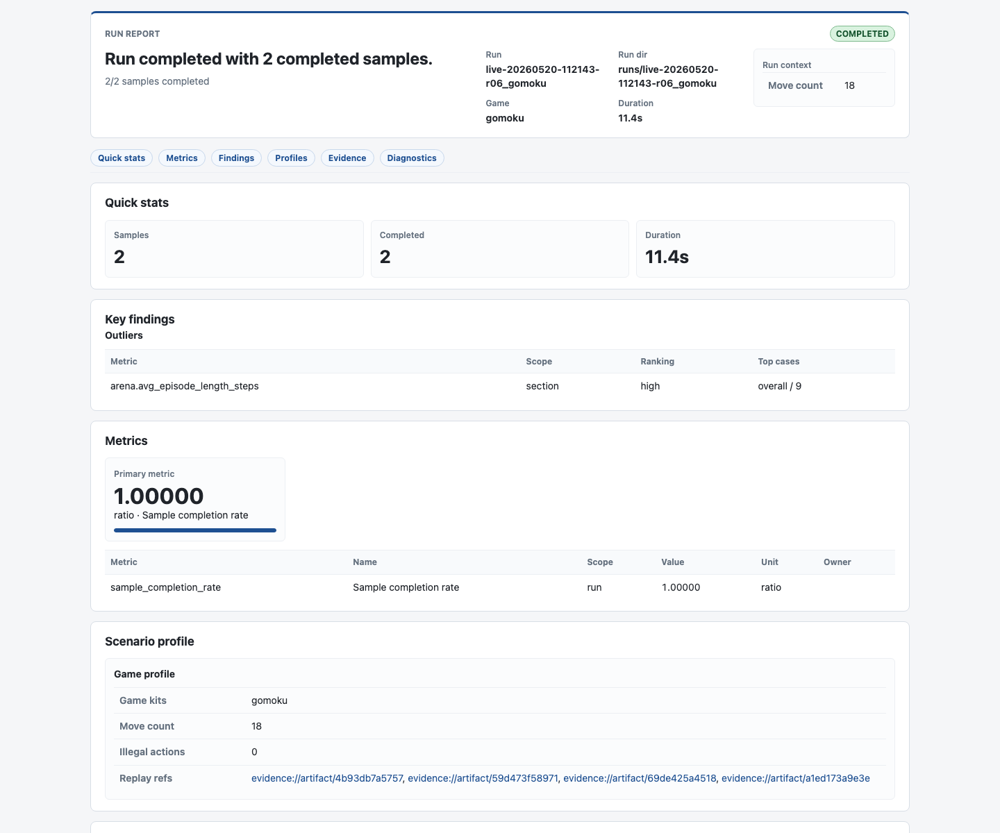
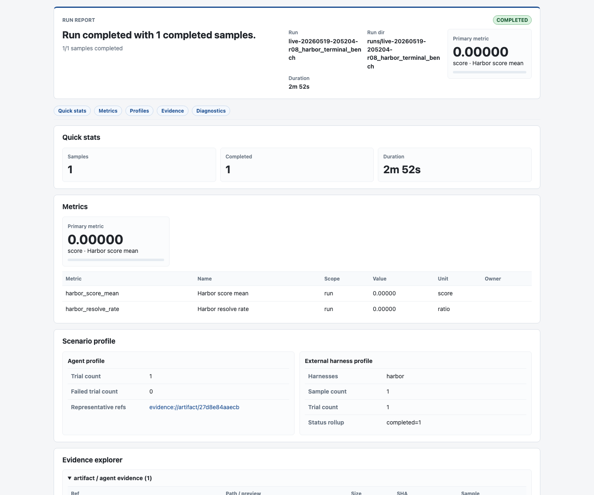
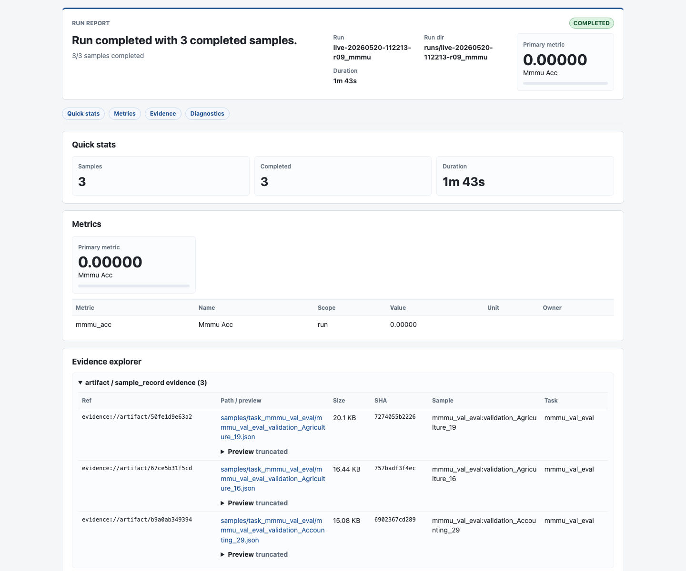

# Run Report Perception Chain

English | [中文](run_report_perception_zh.md)

The run report perception chain turns a completed GAGE run into an inspectable, self-contained report pack. It keeps the legacy `summary.json` contract, then adds a structured `report_context.json`, a static `report.html`, evidence references, diagnostics, and a prompt-ready summary for human or agent review.

Use this guide when you need to answer:

- Did the run complete, fail, degrade, or abort?
- Which metric should I look at first?
- Which samples, trials, artifacts, media, or verifier outputs explain the result?
- Which failure reasons or attention cases should be investigated first?
- Is the report safe to share without leaking secrets?

## 1. Enablement

Report packs are enabled by default. You can control them from config or CLI.

```yaml
reporting:
  report_pack:
    enabled: true
```

```bash
python run.py \
  --config config/custom/examples/multi_choice_qwen3.yaml \
  --output-dir runs \
  --run-id demo_report_pack \
  --report-pack

python run.py \
  --config config/custom/examples/multi_choice_qwen3.yaml \
  --output-dir runs \
  --run-id no_pack \
  --no-report-pack
```

`GAGE_EVAL_REPORT_PACK` is still accepted as a temporary override, but it is deprecated in favor of `reporting.report_pack.enabled` or the CLI flags.

## 2. Output Layout

When enabled, every run writes the normal run files plus `report_pack/`.

```text
runs/<run_id>/
  events.jsonl
  samples.jsonl
  summary.json
  samples/
    <namespace>/
      <sample_id>.json
  report_pack/
    report.html
    report_context.json
    report_context.md
    prompt.txt
    diagnostics.json
    assets_manifest.json
```

The files have distinct roles:

| File | Purpose |
| --- | --- |
| `report.html` | Self-contained HTML report for review. Artifact paths are clickable when the referenced file exists under the run directory. |
| `report_context.json` | Canonical structured contract consumed by renderers and downstream tooling. |
| `report_context.md` | Human-readable Markdown summary. |
| `prompt.txt` | Prompt-oriented report summary for asking another model to analyze the run. |
| `diagnostics.json` | Report-pack generation status, warnings, privacy redaction counts, and errors. |
| `assets_manifest.json` | Manifest of report-pack assets and evidence files referenced by the pack. |

## 3. Data Flow

The report pack is assembled at the end of `ReportStep`.



Key implementation points:

- `ReportEvidenceReader` indexes artifacts, remote media URLs, game replays, external-harness trial files, and a bounded fallback set of sample records.
- Summary generators add domain-aware sections for AgentKit, AppWorld, SWE-bench, Harbor, Tau2, Gomoku, Arena, and external harness runs.
- `ReportContextBuilder` creates headline, runtime health, metrics, attention cases, failure clusters, case details, evidence refs, methodology, diagnostics, and scoring config.
- `ScenarioProfileBuilder` adds agent, game, and external harness profiles. Profile evidence refs are resolved back to canonical `evidence://artifact/<digest>` ids.
- `ReportPackBuilder` writes the final files and applies `SecretFilter` before anything report-visible is persisted.

## 4. HTML Report Sections

The static HTML renderer is designed for failure triage first, not for dumping JSON.

| Section | What it shows |
| --- | --- |
| Hero | Run status badge, run id, run directory, duration, and the selected primary metric or concise context. |
| Quick stats | Runtime counters such as samples, completed, failed, aborted, and duration. |
| Key findings | Attention cases, task failures, failure clusters, and outliers when present. |
| Metrics | Primary metric card plus a bounded table of run metrics. Synthetic completion metrics are shown when no quality metric exists. |
| Scenario profile | Agent, external harness, and game-specific operational signals. |
| Evidence explorer | Grouped evidence refs with clickable paths, previews, media thumbnails, sample/task ids, and sha digests. |
| Diagnostics | Report-pack status, errors, non-routine warnings, and grouped privacy redaction counts. |
| Reason codes glossary | Human-readable descriptions for reason codes used by attention cases and failure clusters. |

The Metrics table renders at most 100 rows in HTML. If a run has more metrics, the omitted rows remain available in `report_context.json`.

### Screenshots

The examples below were captured from existing live smoke runs.











## 5. Evidence Model

Evidence refs are the bridge between a high-level finding and the files that explain it.

| Evidence kind | Example | Notes |
| --- | --- | --- |
| `artifact` | `artifacts/<task>/<sample>/trials/trial_0001/infra/trial_result.json` | Stored under the run directory. The HTML path links to the file. |
| `media` | `external://sha256/<url_digest>` | Remote image or media reference. The digest is based on the source URL; the report does not store base64 image payloads. |
| `sample_record` | `samples/<namespace>/<sample_id>.json` | Bounded fallback evidence for static evaluations that do not emit explicit artifact refs. |

The `<namespace>` segment is the sanitized `EvalCache` namespace, not always the plain `task_id`. It is usually derived from `task/<task_id>` or `judge/<task_id>` and rendered on disk as values such as `task_mmlu_business_ethics_eval`, `judge_<task_id>`, `task_global`, or `default`.

Every `EvidenceRef` includes a canonical `ref_id`, kind, run-relative path, mime type, sha digest, preview, and optional task/sample/trial metadata. Attention cases and scenario profiles should refer to evidence by `ref_id`; the renderer converts those ids into links to the Evidence explorer.

The HTML intentionally limits how much evidence is rendered:

- Only the first 5 rows of each evidence group are open by default.
- Up to 50 refs per evidence group are rendered into HTML.
- Extra rows are omitted with a link to `report_context.json`.
- Artifact previews are truncated and redacted.
- Full context remains available in `report_context.json` for tooling.

## 6. Attention Cases and Failure Reasons

Attention cases are ranked with the design formula:

```text
priority_score = 0.30 * frequency + 0.50 * impact_weight + 0.20 * actionability_weight
```

Severity thresholds are:

| Score | Severity |
| --- | --- |
| `>= 0.85` | `critical` |
| `>= 0.70` | `high` |
| `>= 0.45` | `medium` |
| `>= 0.20` | `low` |
| otherwise | `info` |

Reason codes such as `scheduler.failed`, `verifier.skipped`, `runtime.error`, and `timeout` are forced to at least `high` severity. The glossary is loaded from `src/gage_eval/reporting/contracts/reason_codes.yaml`, including registered aliases for older producer outputs.

Case details explain an attention case. Evidence refs point to the backing files. In the HTML report, the Details column may show both:

- `Case details`: message history previews, tool-call summaries, scoring breakdown, and full-trace refs.
- `Evidence refs`: canonical links to raw or redacted artifacts in the Evidence explorer.

## 7. Privacy and Shareability

Report-visible outputs pass through `SecretFilter` before being persisted. This includes context JSON, Markdown, HTML, prompt text, sample details, evidence previews, and runtime artifacts that flow into the report. Routine redactions in rendered assets are grouped as Privacy Redactions in Diagnostics instead of repeated as noisy warnings.

Important boundaries:

- The report uses redacted previews for raw artifacts.
- The report does not embed remote media as base64.
- Run-local artifact paths are relative to the run directory.
- Diagnostics may still reveal that a redaction happened, but not the redacted secret value.

## 8. Reading Workflow

1. Open `report_pack/report.html`.
2. Check the hero badge and primary metric.
3. If the run failed or degraded, inspect Key findings first.
4. Follow Evidence refs from attention cases or profiles to the Evidence explorer.
5. Use the Reason codes glossary to interpret failure codes.
6. Check Diagnostics for report generation errors, missing files, or privacy redactions.
7. Open `report_context.json` when you need the full structured payload or rows omitted from HTML.

## 9. Troubleshooting

| Symptom | Likely cause | Next step |
| --- | --- | --- |
| `report_pack/` is missing | Disabled by CLI/config or report step failed before finalize | Check `--no-report-pack`, `reporting.report_pack.enabled`, and `summary.json`. |
| HTML says no metrics | The benchmark did not emit a quality metric; derived completion metrics may be used instead | Inspect `summary.json.metrics` and `report_context.json.metrics`. |
| Evidence link is absent | The artifact path was missing, absolute, escaping the run directory, or not registered | Check `diagnostics.json` for `report_pack.artifact_*` warnings. |
| Media path starts with `external://sha256/` | It is a URL digest, not a local file path or base64 payload | See the media preview or source field in `report_context.json`. |
| Reason code is unregistered | Producer emitted a reason code not in the registry | Add it or an alias to `reason_codes.yaml`. |

## 10. Related Docs

- [Framework overview](framework_overview.md)
- [Agent evaluation](agent_evaluation.md)
- [External Harness](external_harness.md)
- [Game Arena](game_arena.md)
- [Benchmark guide](benchmark.md)
