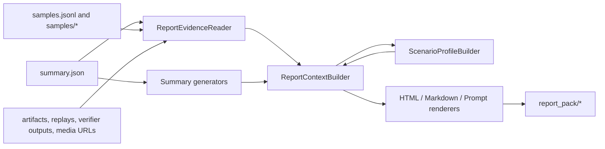

# 执行感知链路报告

中文 | [English](run_report_perception.md)

执行感知链路会把一次已经完成的 GAGE run 转换成可审查、可跳转、可脱敏分享的 `report_pack/`。它不替代既有 `summary.json`，而是在其基础上生成结构化 `report_context.json`、静态 `report.html`、Evidence 引用、诊断信息和适合二次模型分析的 `prompt.txt`。

这份指南用于回答：

- 本次运行是完成、失败、降级还是中止？
- 首先应该看哪个指标？
- 哪些 sample、trial、artifact、media 或 verifier 输出能解释结果？
- 哪些失败原因或 attention case 应该优先排查？
- 报告是否经过脱敏，能否安全分享？

## 1. 开关方式

Report pack 默认开启。可以在配置或 CLI 中控制。

```yaml
reporting:
  report_pack:
    enabled: true
```

```bash
python run.py \
  --config config/custom/examples/multi_choice_qwen3.yaml \
  --output-dir runs \
  --run-id demo_report_pack \
  --report-pack

python run.py \
  --config config/custom/examples/multi_choice_qwen3.yaml \
  --output-dir runs \
  --run-id no_pack \
  --no-report-pack
```

`GAGE_EVAL_REPORT_PACK` 仍可作为临时覆盖开关，但已废弃；推荐使用 `reporting.report_pack.enabled` 或 CLI flags。

## 2. 产物结构

开启后，运行目录会保留原有产物，并新增 `report_pack/`。

```text
runs/<run_id>/
  events.jsonl
  samples.jsonl
  summary.json
  samples/
    <namespace>/
      <sample_id>.json
  report_pack/
    report.html
    report_context.json
    report_context.md
    prompt.txt
    diagnostics.json
    assets_manifest.json
```

各文件职责如下：

| 文件 | 作用 |
| --- | --- |
| `report.html` | 面向人工审查的自包含静态报告。存在于 run 目录下的 artifact 路径会渲染为可点击链接。 |
| `report_context.json` | 渲染器与下游工具消费的结构化契约，是 report pack 的 canonical payload。 |
| `report_context.md` | 便于人工快速浏览的 Markdown 摘要。 |
| `prompt.txt` | 适合交给另一个模型继续分析 run 的提示词摘要。 |
| `diagnostics.json` | Report pack 生成状态、warning、隐私脱敏计数与 error。 |
| `assets_manifest.json` | Report pack 自身文件与 evidence 文件清单。 |

## 3. 链路结构

Report pack 在 `ReportStep` 收尾阶段组装。



核心实现点：

- `ReportEvidenceReader` 索引 artifact、远程 media URL、Game replay、External Harness trial 文件，以及静态评测缺少 artifact 时的有界 sample record。
- Summary generators 为 AgentKit、AppWorld、SWE-bench、Harbor、Tau2、Gomoku、Arena、External Harness 等场景补充领域摘要。
- `ReportContextBuilder` 组装 headline、runtime health、metrics、attention cases、failure clusters、case details、evidence refs、methodology、diagnostics 和 scoring config。
- `ScenarioProfileBuilder` 生成 agent、game、external harness profile，并把 profile 中的 evidence 路径解析为 canonical `evidence://artifact/<digest>`。
- `ReportPackBuilder` 写出最终文件，并在所有 report-visible 内容落盘前调用 `SecretFilter` 脱敏。

## 4. HTML 报告结构

静态 HTML renderer 的目标是辅助失败定位，而不是把 JSON 原样倒出来。

| 区块 | 内容 |
| --- | --- |
| Hero | 运行状态 badge、run id、run 目录、耗时、primary metric 或简要上下文。 |
| Quick stats | sample 数、completed、failed、aborted、duration 等运行计数。 |
| Key findings | Attention cases、task failures、failure clusters、outliers。仅在有内容时展示。 |
| Metrics | Primary metric 卡片与有界 metrics 表；缺少真实质量指标时会展示派生完成率。 |
| Scenario profile | Agent、External Harness、Game 的场景化运行信号。 |
| Evidence explorer | 按 kind/role 分组的 evidence refs，支持路径跳转、preview、media 缩略图、sample/task id 与 sha 摘要。 |
| Diagnostics | Report pack 状态、错误、非例行 warning 和隐私脱敏聚合信息。 |
| Reason codes glossary | 当前报告中 reason codes 的人类可读解释。 |

Metrics 表在 HTML 中最多渲染 100 行。超过上限的 metric 不会塞进 HTML，完整数据仍保留在 `report_context.json`。

### 截图示例

以下截图来自已经执行过的 live smoke run。


## 5. Evidence 模型

Evidence ref 是高层发现与底层文件之间的桥。

| Evidence kind | 示例 | 说明 |
| --- | --- | --- |
| `artifact` | `artifacts/<task>/<sample>/trials/trial_0001/infra/trial_result.json` | 位于 run 目录内，HTML 中的 path 可以点击打开。 |
| `media` | `external://sha256/<url_digest>` | 远程图片或 media 引用。digest 基于源 URL；报告不会存储 base64 图片正文。 |
| `sample_record` | `samples/<namespace>/<sample_id>.json` | 静态评测没有显式 artifact refs 时的有界兜底 evidence。 |

`<namespace>` 是经过文件名安全化处理的 `EvalCache` namespace，不一定等于纯 `task_id`。它通常来自 `task/<task_id>` 或 `judge/<task_id>`，落盘后会变成 `task_mmlu_business_ethics_eval`、`judge_<task_id>`、`task_global` 或 `default` 这样的目录名。

每个 `EvidenceRef` 包含 canonical `ref_id`、kind、run-relative path、mime type、sha digest、preview，以及可选 task/sample/trial 元数据。Attention case 与 scenario profile 应引用 `ref_id`；HTML renderer 会把这些 id 转成跳转到 Evidence explorer 的链接。

HTML 中的 evidence 渲染有明确上限：

- 每个 evidence group 默认展开前 5 行。
- 每个 group 最多渲染 50 个 refs。
- 超出部分只提示数量，并引导查看 `report_context.json`。
- Artifact preview 会截断并脱敏。
- 完整结构仍保留在 `report_context.json`，供工具消费。

## 6. Attention Case 与失败原因

Attention case 使用以下优先级公式排序：

```text
priority_score = 0.30 * frequency + 0.50 * impact_weight + 0.20 * actionability_weight
```

Severity 阈值如下：

| 分数 | Severity |
| --- | --- |
| `>= 0.85` | `critical` |
| `>= 0.70` | `high` |
| `>= 0.45` | `medium` |
| `>= 0.20` | `low` |
| 其他 | `info` |

`scheduler.failed`、`verifier.skipped`、`runtime.error`、`timeout` 等 reason code 会至少映射为 `high`。Glossary 来自 `src/gage_eval/reporting/contracts/reason_codes.yaml`，也支持给历史 producer 输出注册 alias。

Case details 与 Evidence refs 的职责不同：

- `Case details`：解释这个 attention case，包括消息历史预览、tool call 摘要、评分拆解、full trace ref 等。
- `Evidence refs`：指向支撑该 case 的原始或脱敏 artifact，点击后跳转到 Evidence explorer。

## 7. 隐私与可分享边界

所有 report-visible 内容写盘前都会经过 `SecretFilter`，包括 context JSON、Markdown、HTML、prompt、sample details、evidence preview，以及会流入报告的 runtime artifacts。渲染 `report_context.md`、`report.html`、`prompt.txt` 产生的例行脱敏会在 Diagnostics 中聚合成 Privacy Redactions，而不是重复刷屏。

重要边界：

- 原始 artifact 只在报告中显示脱敏 preview。
- 远程 media 不会作为 base64 嵌入报告。
- Run 内 artifact path 使用相对路径。
- Diagnostics 会说明发生过脱敏，但不会展示被脱敏的 secret 值。

## 8. 推荐阅读流程

1. 打开 `report_pack/report.html`。
2. 先看 Hero 状态 badge 与 primary metric。
3. 如果 run failed/degraded，优先看 Key findings。
4. 从 attention case 或 profile 中点击 Evidence refs，跳到 Evidence explorer。
5. 在 Reason codes glossary 中解释失败码。
6. 在 Diagnostics 中确认报告生成是否有 error、缺文件或隐私脱敏。
7. 需要完整结构或 HTML 中被省略的行时，打开 `report_context.json`。

## 9. 常见问题

| 现象 | 常见原因 | 排查方式 |
| --- | --- | --- |
| 没有 `report_pack/` | CLI/config 关闭，或 report step finalize 前失败 | 检查 `--no-report-pack`、`reporting.report_pack.enabled`、`summary.json`。 |
| HTML 里没有真实质量指标 | Benchmark 没有产出质量 metric；报告可能用派生完成率兜底 | 查看 `summary.json.metrics` 与 `report_context.json.metrics`。 |
| Evidence link 缺失 | artifact 路径缺失、为绝对路径、逃逸 run 目录，或未注册 | 查看 `diagnostics.json` 中的 `report_pack.artifact_*` warning。 |
| Media path 是 `external://sha256/` | 这是 URL digest，不是本地路径，也不是 base64 payload | 查看 media preview 或 `report_context.json` 中的 source 字段。 |
| Reason code 未注册 | Producer 输出了 registry 中不存在的 reason code | 在 `reason_codes.yaml` 中添加正式条目或 alias。 |

## 10. 相关文档

- [框架总览](framework_overview_zh.md)
- [Agent 评测](agent_evaluation_zh.md)
- [External Harness](external_harness_zh.md)
- [Game Arena](game_arena_zh.md)
- [Benchmark 指南](benchmark_zh.md)
