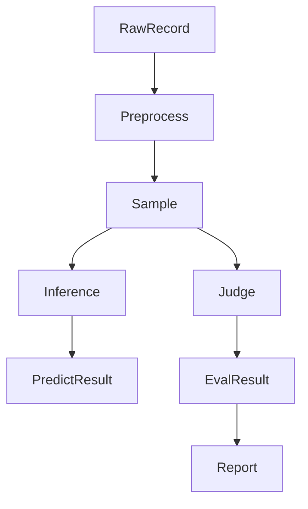
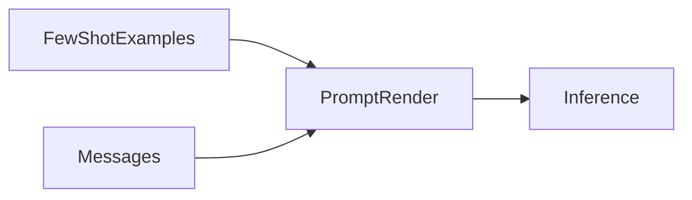
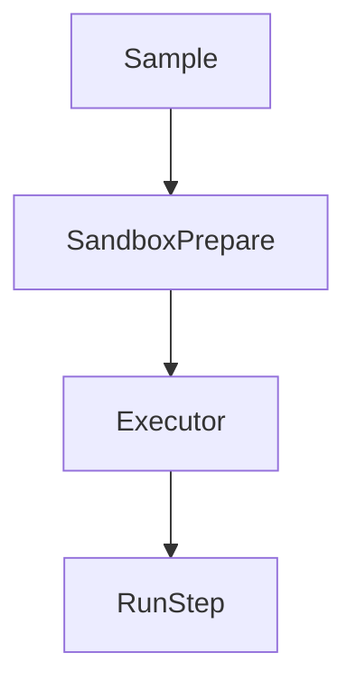

# Standardized Sample Spec (Schema & Alignment)

English | [中文](sample_zh.md)

This document describes the **standardized `Sample`** structure used by gage-eval, so that dataset onboarding, preprocessing, inference, judging, metrics, and reporting can share a single contract.

## 1. Standardized Sample

### 1.1 Goals & principles

- **OpenAI-style first**: `messages` is the primary input for text, multimodal, and multi-turn tasks.
- **Explicit task type**: use `task_type` so templates/metrics can be selected automatically.
- **Options vs. answers**: keep candidates in `options`, keep ground-truth in `references`.
- **Built-in few-shot**: store reproducible few-shot in `few_shot_examples`.
- **Trajectory alignment**: store process references in `golden_trajectories` (for agent-style evaluation).
- **Sandbox as top-level**: describe execution environments via `sandbox` instead of burying it in metadata.
- **Debias support**: use `unconditioned_input` for PMI-like debiasing.
- **Mappable to current code**: preprocessors can map legacy fields (`choices/metadata/label/...`) into this schema.
- **Extension-friendly**: keep task tags and slicing labels in `metadata` / `data_tag`.
- **Inputs are read-only**: put large/raw objects in `raw_assets`; never directly render prompts from raw blobs.
- **Per-sample eval controls**: use `eval_config` for sample-level judge/metric overrides.
- **Deprecate legacy prompt fields**: do not keep `model_prompt_tmpl/model_prompt_placeholder`.

### 1.2 Structure overview

**Lifecycle**



Top-level fields below do not include nested fields inside `metadata`.

| Field | Type | Required | Notes |
| --- | --- | --- | --- |
| schema_version | string | yes | Schema version |
| id | string | yes | Unique sample id |
| task_type | string | no | Task/question type |
| messages | list | yes | OpenAI-style messages |
| options | list | no | Multiple-choice candidates |
| references | list | yes | Ground-truth answers |
| label | string | no | String alias of `references[0]` |
| few_shot_examples | list | no | In-sample few-shot items |
| golden_trajectories | list | no | Process reference trajectories |
| sandbox | object | no | Execution environment config |
| metadata | object | no | Task/runtime metadata |
| data_tag | object | no | Slicing labels for statistics |
| raw_assets | object | no | Raw/large assets store |
| tools | list | no | OpenAI tool definitions |
| tool_choice | string/object | no | Tool choice strategy |
| sampling_params | object | no | Sampling parameters |
| generation_params | object | no | Generation parameters |
| eval_config | object | no | Per-sample evaluation control |
| unconditioned_input | string/list | no | Debiasing input |
| predict_result | list | no | Runtime inference results |
| eval_result | object | no | Runtime evaluation results |

### 1.3 Field details

#### 1.3.1 `messages` and `content`

`messages` follows the OpenAI multimodal message format; `content` is a list of segments.

| type | Field | Notes |
| --- | --- | --- |
| text | text | Text |
| image_url | image_url.url | Image URL or local path |
| audio_url | audio_url.url | Audio URL or local path |
| video_url | video_url.url | Video URL or local path |
| file_url | file_url.url | Document URL or local path |

Rules:

- `messages` is the primary entry. If the raw record only contains `prompt/text/question`, the preprocessor should generate `messages`.
- Multimodal resources may use relative paths; preprocessing is responsible for path resolution and encoding as needed.

#### 1.3.2 `task_type`

`task_type` makes the task/question type explicit so prompt renderers and metrics can make better defaults.

Suggested values:

| task_type | Use case |
| --- | --- |
| multiple-choice | Multiple-choice |
| short-answer | Short QA |
| dialogue | Multi-turn conversation |
| audio-translation | Audio translation |
| image-qa | Image QA |
| video-qa | Video understanding |
| doc-qa | Document understanding |
| text-to-image | Text-to-image |
| image-to-image | Image-to-image |
| text-to-audio | Text-to-audio |
| text-to-video | Text-to-video |
| code-generation | Code generation |
| agent | Agent tool-calling |

Notes:

- If omitted, renderers may infer it from task config or use defaults.
- If legacy data uses `question_type`, preprocessors should map it to `task_type`.

#### 1.3.3 `options` and `references`

`options` rules:

- `options` is a list; each item contains `id` and `content`.
- List order is the display order (helps reduce position bias).

`references` rules:

- `references` is a list and only contains final answers.
- Text tasks can use string arrays; multimodal tasks can use structured objects.
- `label` is a single-string alias, equivalent to `references[0]` (or a normalized string form of it).

Option item:

| Field | Type | Required | Notes |
| --- | --- | --- | --- |
| id | string | yes | Option identifier |
| content | string | yes | Option text |

Reference item:

| Field | Type | Required | Notes |
| --- | --- | --- | --- |
| answer | string/list | yes | Answer content |
| meta | object | no | Answer metadata |

Recommended `answer` formats:

- For text, prefer `[{"type":"text","text":"..."}]`.
- A plain string shorthand is allowed and can be normalized during preprocessing.
- For multimodal generation, use `image_url/audio_url/video_url/file_url` segments.
- Keep `label` as string; for multimodal generation it can be a path/id.

#### 1.3.4 `few_shot_examples`

- `few_shot_examples` stores per-sample few-shot to guarantee reproducibility.
- Each item is a “compact Sample”, typically only keeping `messages/options/references/label/tools/tool_choice`.
- Preprocessing can render `references[0]` (or `label`) into an assistant message and prepend them to the main `messages`.
- Nested `few_shot_examples` is not allowed.
- Do not include runtime/big fields like `predict_result/eval_result/raw_assets/sandbox`.

Few-shot item:

| Field | Type | Required | Notes |
| --- | --- | --- | --- |
| messages | list | yes | Few-shot messages |
| options | list | no | Few-shot options |
| references | list | yes | Few-shot ground-truth |
| label | string | no | Alias of `references[0]` |
| tools | list | no | Tools definitions |
| tool_choice | string/object | no | Tool choice |

Rendering sketch:



#### 1.3.5 `golden_trajectories`

- `golden_trajectories` is a list of reference trajectories (each is a full trace).
- Trajectory messages use the same structure as `messages`, and may include `tool_calls` and `tool` messages.
- Default evaluations often compare only `references`; process-level evaluation must enable dedicated metrics.

#### 1.3.6 `sandbox`

`sandbox` describes sample-level execution environment preparation, suitable for code execution and agent tasks.

| Field | Type | Notes |
| --- | --- | --- |
| image | string | Container image |
| files | object | Files to mount/copy |
| setup | string | Init script |
| env | object | Env vars |

Rules:

- Executors should read `sandbox` for environment setup.
- In `files`, keys are relative target paths; values are URIs or local paths.
- If an executor does not support it, preprocessors may map it into `metadata.execution`.

Preparation sketch:



#### 1.3.7 `metadata` and `data_tag`

- `metadata` is for task/runtime metadata (source ids, split, difficulty, etc.).
- `data_tag` is for **slicing labels** used by statistics and reporting (domain/language/category, etc.).

#### 1.3.8 `tools` and `tool_choice`

- `tools` follows the OpenAI tool schema.
- `tool_choice` controls the tool selection strategy.
- For agent tasks, preprocessors should keep tool definitions with the sample so that evaluations are reproducible.

#### 1.3.9 `raw_assets` and “read-only additions”

- `raw_assets` stores raw/large objects (documents, images, audio, video, etc.).
- `raw_assets` is **not** used directly for prompt rendering; preprocessing must convert it into `messages`/media segments.

#### 1.3.10 `eval_config`

`eval_config` enables sample-level overrides for judging and metrics (e.g., different judge settings, extra constraints).

#### 1.3.11 `unconditioned_input`

- `unconditioned_input` is used by debiasing methods such as PMI.
- It can be a string or a list, depending on the task and metric implementation.

### 1.4 Runtime result fields

At runtime, the framework writes results back to the Sample object:

- `predict_result`: inference outputs (often messages/text/tool calls depending on backend)
- `eval_result`: judge outputs and/or metric outputs

### 1.5 Mapping to the current implementation

The standardized Sample is designed to be compatible with the current gage-eval implementation through preprocessing mappings.

Typical mappings:

- legacy `question/prompt/text` -> `messages`
- legacy `choices` -> `options` + `metadata.option_map`
- legacy `answer/label` -> `references` + `label`
- multimodal legacy fields -> `messages[*].content[*]` segments (plus optional `raw_assets`)

### 1.6 Example cases

Below are example Sample JSON snippets for common task types.

#### 1.6.1 Text QA

```json
{
  "schema_version": "v1",
  "id": "qa_0001",
  "task_type": "short-answer",
  "messages": [
    {
      "role": "user",
      "content": [{"type": "text", "text": "What is the capital of France?"}]
    }
  ],
  "references": [{"answer": [{"type": "text", "text": "Paris"}]}],
  "label": "Paris",
  "metadata": {"dataset": "demo"}
}
```

#### 1.6.2 Multiple-choice

```json
{
  "schema_version": "v1",
  "id": "mc_0001",
  "task_type": "multiple-choice",
  "messages": [
    {
      "role": "user",
      "content": [{"type": "text", "text": "Which one is a mammal?"}]
    }
  ],
  "options": [
    {"id": "A", "content": "Shark"},
    {"id": "B", "content": "Dolphin"}
  ],
  "references": [{"answer": [{"type": "text", "text": "B"}]}],
  "label": "B",
  "metadata": {"option_map": {"A": "Shark", "B": "Dolphin"}}
}
```

#### 1.6.3 Multi-turn dialogue

```json
{
  "schema_version": "v1",
  "id": "dlg_0001",
  "task_type": "dialogue",
  "messages": [
    {"role": "user", "content": [{"type": "text", "text": "Explain recursion."}]},
    {"role": "assistant", "content": [{"type": "text", "text": "Recursion is ..."}]},
    {"role": "user", "content": [{"type": "text", "text": "Give an example."}]}
  ],
  "references": [{"answer": [{"type": "text", "text": "..." }]}]
}
```

#### 1.6.4 Image QA

```json
{
  "schema_version": "v1",
  "id": "imgqa_0001",
  "task_type": "image-qa",
  "messages": [
    {
      "role": "user",
      "content": [
        {"type": "image_url", "image_url": {"url": "inputs/apple_0001.png"}},
        {"type": "text", "text": "What fruit is shown in the image?"}
      ]
    }
  ],
  "references": [{"answer": [{"type": "text", "text": "apple"}]}],
  "label": "apple"
}
```

#### 1.6.5 Audio translation

```json
{
  "schema_version": "v1",
  "id": "aud_0001",
  "task_type": "audio-translation",
  "messages": [
    {
      "role": "user",
      "content": [
        {"type": "audio_url", "audio_url": {"url": "inputs/hello.wav"}},
        {"type": "text", "text": "Translate the audio into English."}
      ]
    }
  ],
  "references": [{"answer": [{"type": "text", "text": "Hello"}]}],
  "label": "Hello"
}
```

#### 1.6.6 Video understanding

```json
{
  "schema_version": "v1",
  "id": "vid_0001",
  "task_type": "video-qa",
  "messages": [
    {
      "role": "user",
      "content": [
        {"type": "video_url", "video_url": {"url": "inputs/demo.mp4"}},
        {"type": "text", "text": "Describe what happens in the video."}
      ]
    }
  ],
  "references": [{"answer": [{"type": "text", "text": "..."}]}]
}
```

#### 1.6.7 Document understanding

```json
{
  "schema_version": "v1",
  "id": "doc_0001",
  "task_type": "doc-qa",
  "messages": [
    {
      "role": "user",
      "content": [
        {"type": "file_url", "file_url": {"url": "inputs/paper.pdf"}},
        {"type": "text", "text": "Summarize section 2."}
      ]
    }
  ],
  "references": [{"answer": [{"type": "text", "text": "..."}]}]
}
```

#### 1.6.8 Code generation & execution

```json
{
  "schema_version": "v1",
  "id": "code_0001",
  "task_type": "code-generation",
  "messages": [
    {
      "role": "user",
      "content": [{"type": "text", "text": "Write Python code to compute Fibonacci numbers."}]
    }
  ],
  "sandbox": {
    "image": "python:3.10",
    "setup": "python -V"
  },
  "references": [{"answer": [{"type": "text", "text": "..."}]}]
}
```

#### 1.6.9 Text-to-image

```json
{
  "schema_version": "v1",
  "id": "t2i_0001",
  "task_type": "text-to-image",
  "messages": [
    {
      "role": "user",
      "content": [{"type": "text", "text": "Generate an image of an apple on a table."}]
    }
  ],
  "references": [
    {"answer": [{"type": "image_url", "image_url": {"url": "refs/apple_0001.png"}}]}
  ],
  "label": "refs/apple_0001.png"
}
```

#### 1.6.10 Image-to-image

```json
{
  "schema_version": "v1",
  "id": "i2i_0001",
  "task_type": "image-to-image",
  "messages": [
    {
      "role": "user",
      "content": [
        {"type": "image_url", "image_url": {"url": "inputs/sketch_0001.png"}},
        {"type": "text", "text": "Colorize the sketch."}
      ]
    }
  ],
  "references": [
    {"answer": [{"type": "image_url", "image_url": {"url": "refs/color_0001.png"}}]}
  ],
  "label": "refs/color_0001.png"
}
```

#### 1.6.11 Text-to-audio

```json
{
  "schema_version": "v1",
  "id": "t2a_0001",
  "task_type": "text-to-audio",
  "messages": [
    {
      "role": "user",
      "content": [{"type": "text", "text": "Generate an audio clip of ocean waves."}]
    }
  ],
  "references": [{"answer": [{"type": "audio_url", "audio_url": {"url": "refs/ocean_0001.wav"}}]}],
  "label": "refs/ocean_0001.wav"
}
```

#### 1.6.12 Text-to-video

```json
{
  "schema_version": "v1",
  "id": "t2v_0001",
  "task_type": "text-to-video",
  "messages": [
    {
      "role": "user",
      "content": [{"type": "text", "text": "Generate a short video of a running dog."}]
    }
  ],
  "references": [{"answer": [{"type": "video_url", "video_url": {"url": "refs/dog_0001.mp4"}}]}],
  "label": "refs/dog_0001.mp4"
}
```

#### 1.6.13 Agent tool calling & golden trajectories

```json
{
  "schema_version": "v1",
  "id": "agent_0001",
  "task_type": "agent",
  "messages": [
    {"role": "user", "content": [{"type": "text", "text": "Search the weather and summarize."}]}
  ],
  "tools": [
    {
      "type": "function",
      "function": {
        "name": "get_weather",
        "description": "Get current weather",
        "parameters": {
          "type": "object",
          "properties": {"city": {"type": "string"}},
          "required": ["city"]
        }
      }
    }
  ],
  "tool_choice": "auto",
  "golden_trajectories": [
    [
      {
        "role": "assistant",
        "tool_calls": [
          {"id": "call_1", "type": "function", "function": {"name": "get_weather", "arguments": "{\"city\":\"Paris\"}"}}
        ]
      },
      {"role": "tool", "tool_call_id": "call_1", "content": "Sunny, 22C"},
      {"role": "assistant", "content": [{"type": "text", "text": "Paris is sunny at 22C."}]}
    ]
  ],
  "references": [{"answer": [{"type": "text", "text": "Paris is sunny at 22C."}]}]
}
```

