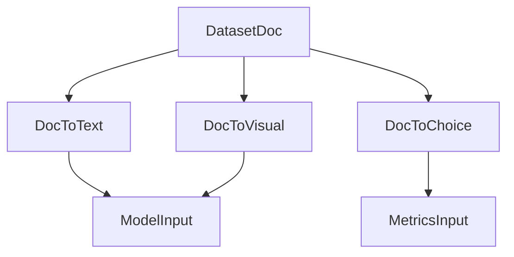
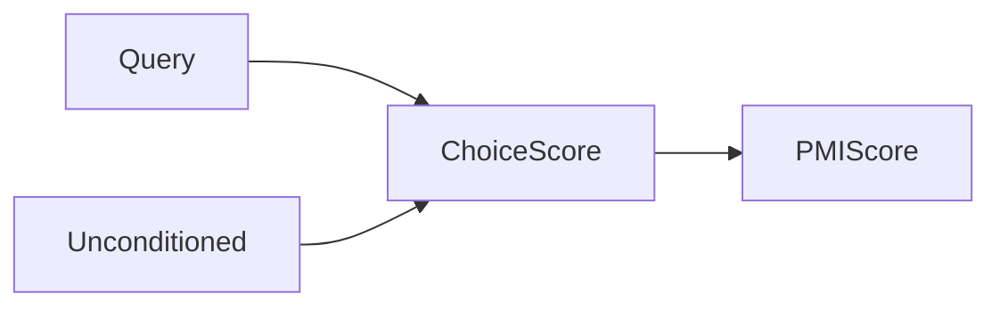
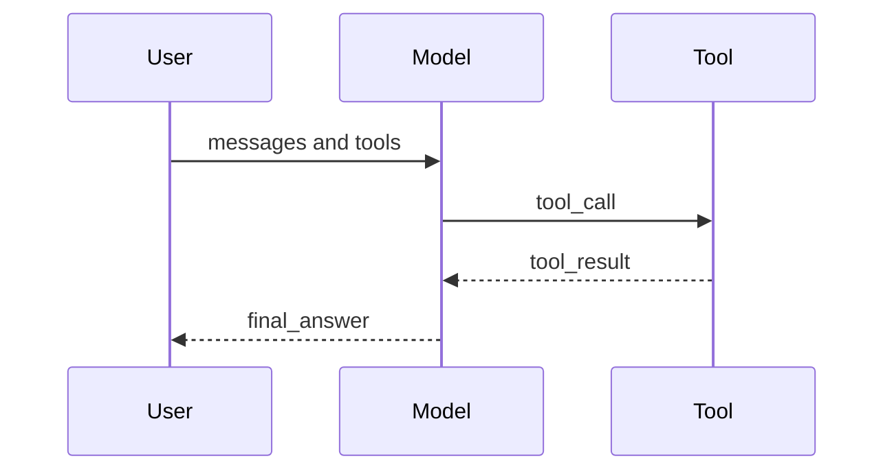

# 标准化 Sample 设计与对齐说明

本文用于对齐现有框架的样本结构与新标准化 Sample 设计，服务于数据接入、推理、裁判、统计与报告的统一。

## 1 现状参考

### 1.1 新框架 gage-eval-main 现状

#### 1.1.1 标准化 Sample 实现要点

新框架在 `gage-eval-main/src/gage_eval/assets/datasets/` 内部以标准化 Sample 作为运行时统一结构，特征如下：

- 核心字段由 `sample.py` 提供 dataclass 定义，运行时以字典为主，允许扩展字段。
- `validation.py` 内的默认校验模型提供最小字段校验，且 `extra=allow`，便于兼容扩展字段。
- `utils/normalization.py` 负责把 `prompt/text/question` 兜底转换为 `messages`，并把 `visual/audio` 注入消息内容。
- OpenAI 风格消息已被后端作为主输入路径（`openai_http_backend._resolve_messages`）。

**核心字段现状表**（节选，来自 `gage-eval-main/src/gage_eval/assets/datasets/sample.py`）

| 字段 | 类型 | 说明 |
| --- | --- | --- |
| id | string | 样本唯一 ID | 
| _dataset_id | string | 运行时注入的数据集 ID | 
| messages | list | OpenAI 风格消息 | 
| choices | list | 选项列表，兼容多选题 | 
| metadata | object | 数据集或任务元信息 | 
| data_tag | object | 分桶统计标签 | 
| label | any | 参考答案或标签 | 
| inputs | object | 原始 prompt 或多模态补充 | 
| predict_result | list | 推理结果列表 | 
| eval_result | object | 裁判与指标结果 | 

**源码节选：Sample 关键字段（带中文注释）**

```python
@dataclass
class Sample:
    id: str  # 样本唯一ID
    _dataset_id: str  # 运行时注入的数据集ID
    messages: List[Message]  # OpenAI风格消息
    choices: List[Choice] = field(default_factory=list)  # 选项列表
    metadata: Dict[str, Any] = field(default_factory=dict)  # 任务元信息
    data_tag: Dict[str, Any] = field(default_factory=dict)  # 分桶统计标签
    label: Optional[Any] = None  # 参考答案
    inputs: Inputs = field(default_factory=Inputs)  # 原始输入或补充信息
    predict_result: List[PredictResult] = field(default_factory=list)  # 推理结果
    eval_result: Dict[str, Any] = field(default_factory=dict)  # 评估结果
```

**源码节选：消息归一化逻辑（带中文注释）**

```python
def normalize_messages(sample: Dict[str, Any]) -> List[Dict[str, Any]]:
    # 优先使用已有 messages
    messages = sample.get("messages")
    normalized: List[Dict[str, Any]] = []
    if isinstance(messages, list):
        normalized = [_normalize_message(msg) for msg in messages]
    else:
        # 无 messages 时从 prompt/text/question 生成
        prompt = sample.get("prompt") or sample.get("text") or sample.get("question")
        if prompt:
            normalized = [
                {"role": "user", "content": [{"type": "text", "text": str(prompt)}]}
            ]
    return _inject_modal_fragments(sample, normalized)
```

#### 1.1.2 新框架现有样本示例

**示例 A：文本问答**（来自测试样本风格）

```json
{
  "id": "log-0001",
  "messages": [
    {"role": "system", "content": [{"type": "text", "text": "你是一个验证日志采样的助手。"}]},
    {"role": "user", "content": [{"type": "text", "text": "回答 A"}]}
  ],
  "label": "A"
}
```

**示例 B：多模态图像问答**（OpenAI 风格 image_url）

```json
{
  "id": "mmmu-0001",
  "messages": [
    {
      "role": "user",
      "content": [
        {"type": "text", "text": "Question: ..."},
        {"type": "image_url", "image_url": {"url": "images/1.jpg"}}
      ]
    }
  ],
  "choices": [
    {"index": 0, "message": {"role": "assistant", "content": [{"type": "text", "text": "D"}]}}
  ]
}
```

**示例 C：音频多轮**（ASR/翻译类）

```json
{
  "id": "asr-0001",
  "messages": [
    {"role": "user", "content": [{"type": "audio_url", "audio_url": {"url": "/path/to/audio.wav"}}]},
    {"role": "assistant", "content": [{"type": "text", "text": "请翻译成中文"}]}
  ]
}
```

### 1.2 llm-eval 老框架现状

老框架采用 `messages + choices` 作为主要样本结构，并允许任务附加字段（如 `swe_bench_json`、`data_tag`、`label` 等）。样本往往直接对齐 OpenAI 多模态消息格式。

#### 1.2.1 通用格式示例

```json
{
  "id": "example_0",
  "messages": [
    {
      "role": "user",
      "content": [
        {"type": "text", "text": "..."}
      ]
    }
  ],
  "choices": [
    {
      "index": 0,
      "message": {"role": "assistant", "content": [{"type": "text", "text": "答案"}]}
    }
  ]
}
```

#### 1.2.2 多模态 VQA 示例

```json
{
  "id": "textvqa-0001",
  "messages": [
    {
      "role": "user",
      "content": [
        {"type": "image_url", "image_url": {"url": "images/34602.jpg"}},
        {"type": "text", "text": "what is the brand of this camera?"}
      ]
    }
  ],
  "choices": [
    {"index": 0, "message": {"role": "assistant", "content": [{"type": "text", "text": "dakota"}]}}
  ]
}
```

#### 1.2.3 代码与执行类示例

**代码生成**（LiveCodeBench 风格）

```json
{
  "messages": [
    {"role": "user", "content": [{"type": "text", "text": "given question_title <...>"}]}
  ],
  "choices": [
    {"index": 0, "message": {"role": "assistant", "content": [{"type": "text", "text": ""}]}}
  ],
  "label": "[{\"input\": \"...\", \"output\": \"...\"}]"
}
```

**补丁修复**（SWE-bench 风格）

```json
{
  "messages": [
    {"role": "user", "content": [{"type": "text", "text": "Please output only the patch..."}]}
  ],
  "choices": [
    {"index": 0, "message": {"role": "assistant", "content": [{"type": "text", "text": ""}]}}
  ],
  "swe_bench_json": [
    {"instance_id": "astropy__astropy-12907", "model_patch": ""}
  ]
}
```

#### 1.2.4 多轮对话与音频示例

```json
{
  "messages": [
    {"role": "user", "content": [{"type": "audio_url", "audio_url": {"url": "/mnt/data/xxx.wav"}}]},
    {"role": "assistant", "content": [{"type": "text", "text": "帮我翻译成中文"}]}
  ]
}
```

### 1.3 多个开源框架现状

#### 1.3.1 OpenAI Evals

OpenAI Evals 的样本通常为 `input + ideal`，`input` 既可以是字符串，也可以是消息列表。

**示例 A：文本问答**

```json
{
  "input": [
    {"role": "system", "content": "You are a helpful assistant."},
    {"role": "user", "content": "What is 2 + 2?"}
  ],
  "ideal": "4"
}
```

**示例 B：多选题**（选项直接写进 prompt）

```json
{
  "input": [
    {"role": "system", "content": "Answer with only the letter."},
    {"role": "user", "content": "Q: ...\nA. ...\nB. ...\nAnswer:"}
  ],
  "ideal": "B"
}
```

**示例 C：多轮对话**

```json
{
  "input": [
    {"role": "system", "content": "You are a travel planner."},
    {"role": "user", "content": "Plan a 2-day trip to Hangzhou."},
    {"role": "assistant", "content": "Any budget range?"},
    {"role": "user", "content": "Mid-range."}
  ],
  "ideal": "Day 1: ... Day 2: ..."
}
```

**示例 D：结构化输出**

```json
{
  "input": "Extract entities and return JSON with keys person and org.",
  "ideal": "{\"person\": \"张三\", \"org\": \"某公司\"}"
}
```

**示例 E：多参考答案**

```json
{
  "input": "Name the capital of the United States.",
  "ideal": ["Washington, D.C.", "Washington DC"]
}
```

#### 1.3.2 Lighteval 与 LMMS Eval

此类框架以数据集记录为主，样本字段通过 `doc_to_text/doc_to_visual/doc_to_choice/doc_to_target` 转换为模型输入与参考答案。

**字段映射示意**

| 数据集字段 | 映射函数 | 作用 | 
| --- | --- | --- |
| image | doc_to_visual | 提供视觉输入 | 
| question | doc_to_text | 构造文本问题 | 
| choices | doc_to_choice | 多选题选项列表 | 
| answer | doc_to_target | 正确答案 | 

注：音频、视频等多模态字段在不同任务中可能对应 `doc_to_audio/doc_to_visual` 等函数。

字段名因数据集略有差异，以下为常见场景示例。

**示例 A：文本多选**

```json
{
  "question": "Which planet is the largest?",
  "choices": ["Mars", "Jupiter", "Venus", "Mercury"],
  "answer": "B"
}
```

**示例 B：图像问答**

```json
{
  "question": "What is the main object in image?",
  "choices": ["teddy bear", "cat", "car", "tree"],
  "answer": "A",
  "image": "path/to/image.jpg"
}
```

**示例 C：视频理解**

```json
{
  "question": "What is the person doing?",
  "answer": "running",
  "video": "path/to/video.mp4"
}
```

**示例 D：音频转写**

```json
{
  "question": "Transcribe the audio.",
  "answer": "...",
  "audio": "path/to/audio.wav"
}
```

**数据流示意图**



#### 1.3.3 EvalScope

EvalScope 以 `TaskConfig` 连接任务与数据集，样本结构随任务变化，但常见模式仍是 `question + choices + answer`。

**示例 A：多选题**

```json
{
  "question": "Which option is correct?",
  "choices": ["A", "B", "C", "D"],
  "answer": "C",
  "category": "mmlu_business_ethics"
}
```

**示例 B：代码执行**

```json
{
  "prompt": "Implement a function to reverse a string.",
  "answer": "<python_code>",
  "files": {"tests.py": "s3://datasets/code/tests.py"},
  "setup": "pip install pytest"
}
```

#### 1.3.4 Agent 任务样本

OpenAI Evals 的多步网页任务样本以意图与评测目标为主，样本中通常不包含轨迹。

```json
{
  "task_id": 2,
  "intent": "What is the name of the user who has the most popular post?",
  "start_url": "http://homepage.com",
  "eval": {
    "eval_types": ["string_match"],
    "reference_answers": {"exact_match": "jsonathan"}
  }
}
```

**示例 B：结构化目标**

```json
{
  "task_id": 7,
  "intent": "Find the cheapest flight from SFO to SEA on 2023-12-22.",
  "start_url": "http://flight-search.com",
  "eval": {
    "eval_types": ["json_match"],
    "reference_answers": {
      "json_match": {"airline": "Delta", "price": 129}
    }
  }
}
```

## 2 新标准化 Sample 设计

### 2.1 设计目标与原则

- **OpenAI 风格优先**：`messages` 作为主输入，覆盖文本、多模态与多轮对话。
- **任务类型显式**：用 `task_type` 标注题型，便于模板与指标自动选择。
- **选项与答案分离**：用 `options` 表示候选，用 `references` 表示最终答案。
- **Few-Shot 内嵌**：用 `few_shot_examples` 固化示例，保证可复现性。
- **Agent 轨迹可对齐**：用独立的 `golden_trajectories` 存放过程参考。
- **执行环境一级字段**：用 `sandbox` 描述环境准备，避免埋进复杂元数据。
- **去偏置支持**：用 `unconditioned_input` 进行 PMI 等偏置校正。
- **与现有实现可映射**：通过预处理映射到现有 `choices/metadata/label` 等字段。
- **扩展友好**：`metadata/data_tag` 承载任务元信息与统计标签。
- **输入只读**：`raw_assets` 仅保存原始素材或大对象，禁止直接生成 prompt。
- **评估配置下沉**：新增 `eval_config` 支持样本级裁判与指标控制。
- **弃用旧字段**：不再保留 `model_prompt_tmpl/model_prompt_placeholder`。

### 2.2 标准结构总览

**标准化 Sample 生命周期**


主字段指标准化 Sample 顶层字段，不包含 `metadata` 内嵌字段。

**顶层字段总览表**

| 字段 | 类型 | 必填 | 说明 | 
| --- | --- | --- | --- |
| schema_version | string | 是 | 标准版本号 | 
| id | string | 是 | 样本唯一 ID | 
| task_type | string | 否 | 任务类型或题型 | 
| messages | list | 是 | OpenAI 风格消息 | 
| options | list | 否 | 多选题选项列表 | 
| references | list | 是 | 标准答案列表 | 
| label | string | 否 | `references[0]` 的字符串别名 | 
| few_shot_examples | list | 否 | 样本自带 Few-Shot 示例 | 
| golden_trajectories | list | 否 | 过程参考轨迹 | 
| sandbox | object | 否 | 执行环境配置 | 
| metadata | object | 否 | 任务与执行元数据 | 
| data_tag | object | 否 | 分桶统计标签 | 
| raw_assets | object | 否 | 原始素材或大对象库 | 
| tools | list | 否 | OpenAI 工具定义 | 
| tool_choice | string 或 object | 否 | 工具选择策略 | 
| sampling_params | object | 否 | 采样参数 | 
| generation_params | object | 否 | 生成参数 | 
| eval_config | object | 否 | 样本级评估配置 | 
| unconditioned_input | string 或 list | 否 | 去偏置输入 | 
| predict_result | list | 否 | 运行期推理结果 | 
| eval_result | object | 否 | 运行期评估结果 | 

### 2.3 字段设计细节

#### 2.3.1 messages 与 content 规范

`messages` 结构遵循 OpenAI 多模态规范，`content` 为片段列表。

| type | 字段 | 说明 | 
| --- | --- | --- |
| text | text | 文本内容 | 
| image_url | image_url.url | 图片 URL 或本地路径 | 
| audio_url | audio_url.url | 音频 URL 或本地路径 | 
| video_url | video_url.url | 视频 URL 或本地路径 | 
| file_url | file_url.url | 文档 URL 或本地路径 | 

**规则**
- `messages` 为主入口；若仅提供 `prompt/text/question`，预处理器需生成 `messages`。
- 多模态资源可使用相对路径，预处理阶段负责拼接与编码。

#### 2.3.2 task_type

`task_type` 用于显式标注题型与任务类型，便于 prompt 渲染器与指标自动选择策略。

**推荐值示例**

| task_type | 适用场景 | 
| --- | --- |
| multiple-choice | 多选题 | 
| short-answer | 短问答 | 
| dialogue | 多轮对话 | 
| audio-translation | 音频翻译 | 
| image-qa | 图像问答 | 
| video-qa | 视频理解 | 
| doc-qa | 文档理解 | 
| text-to-image | 文生图 | 
| image-to-image | 图生图 | 
| text-to-audio | 文生音频 | 
| text-to-video | 文生视频 | 
| code-generation | 代码生成 | 
| agent | Agent 工具调用 | 

**规则**
- 未提供时，渲染器可按任务配置或默认模板处理。

兼容字段：若历史数据使用 `question_type`，预处理阶段应映射为 `task_type`。

#### 2.3.3 options 与 references

**options 规则**
- `options` 为列表，元素包含 `id` 与 `content`。
- 列表顺序即为展示顺序，用于降低位置偏差。

**references 规则**
- `references` 为列表，仅包含最终答案。
- 文本类可直接使用字符串数组；多模态可使用结构化答案。
- `label` 为单值字符串别名，等价于 `references[0]` 或其 `answer` 的规范化字符串表示。

**OptionItem 结构**

| 字段 | 类型 | 必填 | 说明 | 
| --- | --- | --- | --- |
| id | string | 是 | 选项标识 | 
| content | string | 是 | 选项文本 | 

**ReferenceItem 结构**

| 字段 | 类型 | 必填 | 说明 | 
| --- | --- | --- | --- |
| answer | string 或 list | 是 | 标准答案内容 | 
| meta | object | 否 | 参考答案元信息 | 

**answer 推荐格式**
- 文本类建议使用 `[{"type":"text","text":"..."}]`。
- 也允许使用字符串简写，预处理时转换为消息片段。
- 多模态生成可使用 `image_url/audio_url/video_url/file_url` 片段。
- `label` 保持字符串类型，多模态生成建议填资源路径或 ID。

#### 2.3.4 few_shot_examples

- `few_shot_examples` 为样本自带 Few-Shot，保证可复现。
- 每个元素为精简 Sample，建议仅保留 `messages/options/references/label/tools/tool_choice`。
- 预处理时将 `references[0]` 或 `label` 渲染为 assistant 消息，再拼接到主 `messages`。
- 不允许嵌套 `few_shot_examples`，避免递归展开。
- 禁止包含 `predict_result/eval_result/raw_assets/sandbox` 等运行期或大对象字段。

**FewShotItem 结构**

| 字段 | 类型 | 必填 | 说明 | 
| --- | --- | --- | --- |
| messages | list | 是 | Few-Shot 消息 | 
| options | list | 否 | Few-Shot 选项 | 
| references | list | 是 | Few-Shot 标准答案 | 
| label | string | 否 | `references[0]` 别名 | 
| tools | list | 否 | Few-Shot 工具定义 | 
| tool_choice | string 或 object | 否 | Few-Shot 工具选择 | 

**渲染示意**


#### 2.3.5 golden_trajectories

- `golden_trajectories` 为过程参考，列表元素为一条完整轨迹。
- 轨迹内部消息结构与 `messages` 一致，并允许包含 `tool_calls` 与 `tool` 消息。
- 默认评估只对比 `references`，过程评估需显式启用对应指标。

#### 2.3.6 sandbox

`sandbox` 描述样本级执行环境，适合代码执行与 Agent 任务的运行准备。

| 字段 | 类型 | 说明 | 
| --- | --- | --- |
| image | string | 容器镜像 | 
| files | object | 需要挂载或拷贝的依赖文件 | 
| setup | string | 初始化脚本 | 
| env | object | 环境变量 | 

**规则**
- 执行器优先读取 `sandbox` 进行环境准备。
- `files` 的 key 为目标相对路径，value 为 URI 或本地路径。
- 若当前执行器不支持，可在预处理阶段映射至 `metadata.execution`。

**准备流程示意**


#### 2.3.7 metadata 与 data_tag

- `metadata` 用于携带任务级配置与执行信息，例如 `metadata.execution`。
- `data_tag` 用于统计分桶，如领域、难度、图片类别等。

#### 2.3.8 tools 与 tool_choice

- `tools` 为 OpenAI function schema 列表。
- `tool_choice` 与 OpenAI 接口一致，可为字符串或对象。
- 工具调用轨迹建议写入 `golden_trajectories`。

#### 2.3.9 raw_assets 与只读补充

`raw_assets` 仅用于存放原始素材或超大二进制对象，禁止直接生成 prompt：

```json
{
  "raw_assets": {
    "image": ["path/to/image.jpg"]
  }
}
```

**只读规则**
- 所有模型输入必须在预处理阶段转为 `messages`。
- 仅允许 VLM/Audio 等后端从 `raw_assets` 读取无法嵌入 JSON 的大对象。
- 兼容路径：`raw_assets` 可映射到现有运行时字段 `inputs`。

#### 2.3.10 eval_config

`eval_config` 用于样本级评估控制，典型字段如下：

| 字段 | 类型 | 说明 | 
| --- | --- | --- |
| metrics | list | 评估指标列表 | 
| judge_prompt | string | 样本级裁判提示 | 

当前默认流水线不会自动消费 `eval_config`，需由评测步骤显式读取后生效。

#### 2.3.11 unconditioned_input

`unconditioned_input` 用于去偏置评估，例如 PMI 校正，多用于多选题场景。

- 类型可为字符串或 `messages` 列表，预处理阶段需统一为消息格式。
- 仅在指标或裁判显式读取时生效，默认流程可忽略。
- 推荐保留输出格式指令，但移除具体问题内容。

**示例**

```json
{
  "unconditioned_input": [
    {"role": "user", "content": [{"type": "text", "text": "请只输出选项字母"}]}
  ]
}
```

**去偏置示意**



### 2.4 运行期结果字段

- `predict_result`：模型输出列表，结构与 `messages` 对齐。
- `eval_result`：裁判或指标输出。

**predict_result 示例**

```json
{
  "predict_result": [
    {
      "index": 0,
      "message": {
        "role": "assistant",
        "content": [{"type": "text", "text": "B"}]
      },
      "raw_response": {},
      "usage": {"total_tokens": 123},
      "latency_ms": 1200
    }
  ]
}
```

**eval_result 示例**

```json
{
  "eval_result": {
    "overall": {"score": 1.0, "passed": true},
    "metrics": {
      "exact_match": {"score": 1.0},
      "bleu": {"score": 0.72}
    },
    "judge": {
      "model": "gpt-4o-mini",
      "verdict": "correct",
      "reason": "答案与参考一致"
    }
  }
}
```

### 2.5 与现有实现的映射

| 新标准字段 | 现有运行时字段 | 说明 | 
| --- | --- | --- |
| schema_version | 额外字段 | 默认校验模型允许扩展 | 
| task_type | metadata.task_type | 默认不消费，可供渲染器与统计使用 | 
| messages | messages | OpenAI 后端直接读取 | 
| options | metadata.option_map + choices | 预处理时构建选项与顺序 | 
| references | references | 作为扩展字段保留 | 
| label | label | 与旧指标兼容 | 
| few_shot_examples | messages | 预处理拼接 Few-Shot 后再渲染 `messages` | 
| golden_trajectories | golden_trajectories | 过程参考，不参与默认评分 | 
| sandbox | metadata.execution | 若执行器不识别，预处理可下沉 | 
| tools | tools | OpenAI 后端直接读取 | 
| tool_choice | tool_choice | OpenAI 后端直接读取 | 
| raw_assets | inputs | 兼容映射为运行时 `inputs` | 
| eval_config | eval_config | 默认不消费，仅保留 | 
| unconditioned_input | metadata.unconditioned_input | 默认不消费，指标需显式读取 | 
| predict_result | predict_result | `append_predict_result` 追加 | 
| eval_result | eval_result | `update_eval_result` 合并 | 

**源码节选：预测结果写入（带中文注释）**

```python
def append_predict_result(sample: Dict[str, Any], model_output: Optional[Dict[str, Any]]) -> None:
    # 空输出直接跳过
    if not isinstance(model_output, dict) or not model_output:
        return
    predict_result = sample.setdefault("predict_result", [])
    if not isinstance(predict_result, list):
        predict_result = sample["predict_result"] = []
    entry = copy.deepcopy(model_output)
    entry.setdefault("index", len(predict_result))
    if "message" not in entry:
        entry["message"] = _build_message(entry)
    predict_result.append(entry)
```

### 2.6 场景示例 case

#### 2.6.1 文本问答

```json
{
  "schema_version": "v1",
  "id": "qa-0001",
  "task_type": "short-answer",
  "messages": [
    {"role": "user", "content": [{"type": "text", "text": "2 + 2 等于多少"}]}
  ],
  "few_shot_examples": [
    {
      "messages": [
        {"role": "user", "content": [{"type": "text", "text": "1 + 1 等于多少"}]}
      ],
      "references": ["2"],
      "label": "2"
    }
  ],
  "references": ["4"],
  "eval_config": {"metrics": ["exact_match"]},
  "label": "4"
}
```

#### 2.6.2 多选题

```json
{
  "schema_version": "v1",
  "id": "mc-0001",
  "task_type": "multiple-choice",
  "messages": [
    {"role": "user", "content": [{"type": "text", "text": "以下哪一项是哺乳动物"}]}
  ],
  "options": [
    {"id": "A", "content": "鲨鱼"},
    {"id": "B", "content": "海豚"},
    {"id": "C", "content": "章鱼"},
    {"id": "D", "content": "海星"}
  ],
  "unconditioned_input": [
    {"role": "user", "content": [{"type": "text", "text": "请只输出选项字母"}]}
  ],
  "references": ["B"],
  "label": "B"
}
```

#### 2.6.3 多轮对话

```json
{
  "schema_version": "v1",
  "id": "dialog-0001",
  "task_type": "dialogue",
  "messages": [
    {"role": "user", "content": [{"type": "text", "text": "推荐一部科幻电影"}]},
    {"role": "assistant", "content": [{"type": "text", "text": "你偏好经典还是近期作品"}]},
    {"role": "user", "content": [{"type": "text", "text": "近期作品"}]}
  ],
  "references": ["沙丘"],
  "label": "沙丘"
}
```

#### 2.6.4 图像问答

```json
{
  "schema_version": "v1",
  "id": "vqa-0001",
  "task_type": "image-qa",
  "messages": [
    {
      "role": "user",
      "content": [
        {"type": "image_url", "image_url": {"url": "images/0001.jpg"}},
        {"type": "text", "text": "图中品牌是什么"}
      ]
    }
  ],
  "references": [
    "dakota"
  ],
  "label": "dakota"
}
```

#### 2.6.5 音频翻译

```json
{
  "schema_version": "v1",
  "id": "asr-0002",
  "task_type": "audio-translation",
  "messages": [
    {"role": "user", "content": [{"type": "audio_url", "audio_url": {"url": "audios/xx.wav"}}]},
    {"role": "assistant", "content": [{"type": "text", "text": "请翻译成中文"}]}
  ],
  "references": [
    "..."
  ],
  "label": "..."
}
```

#### 2.6.6 视频理解

```json
{
  "schema_version": "v1",
  "id": "video-0001",
  "task_type": "video-qa",
  "messages": [
    {
      "role": "user",
      "content": [
        {"type": "video_url", "video_url": {"url": "videos/001.mp4"}},
        {"type": "text", "text": "视频里的人在做什么"}
      ]
    }
  ],
  "references": [
    "跑步"
  ],
  "label": "跑步"
}
```

#### 2.6.7 文档理解

```json
{
  "schema_version": "v1",
  "id": "doc-0001",
  "task_type": "doc-qa",
  "messages": [
    {
      "role": "user",
      "content": [
        {"type": "file_url", "file_url": {"url": "docs/report.pdf"}},
        {"type": "text", "text": "报告中 2022 年营收是多少"}
      ]
    }
  ],
  "references": ["31.1"],
  "data_tag": {"doc_type": "report"},
  "label": "31.1"
}
```

#### 2.6.8 代码生成与执行

```json
{
  "schema_version": "v1",
  "id": "code-0001",
  "task_type": "code-generation",
  "messages": [
    {"role": "user", "content": [{"type": "text", "text": "请实现函数 distinctDifferenceArray"}]}
  ],
  "sandbox": {
    "image": "python:3.10",
    "files": {"tests.py": "s3://datasets/code/tests.py"},
    "setup": "pip install numpy"
  },
  "references": ["<python_code>"],
  "metadata": {
    "execution": {
      "type": "code_exec",
      "test_cases": [
        {"input": "[1,2,3,4,5]", "output": "[-3,-1,1,3,5]"}
      ],
      "timeout_ms": 5000
    }
  },
  "label": "<python_code>"
}
```

#### 2.6.9 文生图

```json
{
  "schema_version": "v1",
  "id": "t2i-0001",
  "task_type": "text-to-image",
  "messages": [
    {"role": "user", "content": [{"type": "text", "text": "一只红色苹果放在木桌上"}]}
  ],
  "references": [
    {"answer": [{"type": "image_url", "image_url": {"url": "refs/apple_0001.png"}}]}
  ],
  "label": "refs/apple_0001.png",
  "eval_config": {"metrics": ["clipscore"]}
}
```

#### 2.6.10 图生图

```json
{
  "schema_version": "v1",
  "id": "i2i-0001",
  "task_type": "image-to-image",
  "messages": [
    {
      "role": "user",
      "content": [
        {"type": "image_url", "image_url": {"url": "inputs/sketch_0001.png"}},
        {"type": "text", "text": "请为草图上色"}
      ]
    }
  ],
  "references": [
    {"answer": [{"type": "image_url", "image_url": {"url": "refs/color_0001.png"}}]}
  ],
  "label": "refs/color_0001.png",
  "eval_config": {"metrics": ["lpips"]}
}
```

#### 2.6.11 文生音频

```json
{
  "schema_version": "v1",
  "id": "t2a-0001",
  "task_type": "text-to-audio",
  "messages": [
    {"role": "user", "content": [{"type": "text", "text": "生成一段温和的钢琴旋律"}]}
  ],
  "references": [
    {"answer": [{"type": "audio_url", "audio_url": {"url": "refs/piano_0001.wav"}}]}
  ],
  "label": "refs/piano_0001.wav",
  "eval_config": {"metrics": ["clapscore"]}
}
```

#### 2.6.12 文生视频

```json
{
  "schema_version": "v1",
  "id": "t2v-0001",
  "task_type": "text-to-video",
  "messages": [
    {"role": "user", "content": [{"type": "text", "text": "日落时分海边慢镜头"}]}
  ],
  "references": [
    {"answer": [{"type": "video_url", "video_url": {"url": "refs/sunset_0001.mp4"}}]}
  ],
  "label": "refs/sunset_0001.mp4",
  "eval_config": {"metrics": ["fvd"]}
}
```

#### 2.6.13 Agent 工具调用与黄金轨迹

```json
{
  "schema_version": "v1",
  "id": "agent-0001",
  "task_type": "agent",
  "messages": [
    {"role": "system", "content": [{"type": "text", "text": "你是一个数据分析助手"}]},
    {"role": "user", "content": [{"type": "text", "text": "计算 2022 年 Q1 研发费用"}]}
  ],
  "sandbox": {
    "image": "python:3.10",
    "files": {"finance.csv": "s3://datasets/finance/finance.csv"},
    "setup": "pip install pandas"
  },
  "tools": [
    {
      "type": "function",
      "function": {
        "name": "query_finance",
        "description": "查询财务指标",
        "parameters": {"type": "object", "properties": {"metric": {"type": "string"}}}
      }
    }
  ],
  "tool_choice": "auto",
  "references": ["31.1"],
  "golden_trajectories": [
    [
      {
        "role": "assistant",
        "content": [{"type": "text", "text": "调用工具查询"}],
        "tool_calls": [
          {"id": "call-1", "type": "function", "function": {"name": "query_finance", "arguments": "{\"metric\": \"研发费用[20220331]\"}"}}
        ]
      },
      {
        "role": "tool",
        "content": [{"type": "text", "text": "31.1"}],
        "tool_call_id": "call-1"
      },
      {
        "role": "assistant",
        "content": [{"type": "text", "text": "31.1"}]
      }
    ]
  ],
  "eval_config": {"metrics": ["exact_match", "trajectory_match"]},
  "label": "31.1"
}
```

### 2.7 迁移与落地建议

- 数据接入阶段将 `options` 映射为 `metadata.option_map` 与 `choices`，保证现有指标可运行。
- 默认以 `references` 作为指标输入字段，`label` 仅作为兼容别名。
- 多模态资源统一走 `messages`，`raw_assets` 仅在需要原始对象时启用。
- `task_type` 与历史 `question_type` 在预处理阶段统一，保证模板选择一致。
- `few_shot_examples` 在预处理阶段拼接为 `messages`，运行期可不保留。
- 执行环境优先写 `sandbox`，执行器不支持时再下沉到 `metadata.execution`。
- 样本级评估策略统一收敛到 `eval_config`，去偏置输入使用 `unconditioned_input`。

**Agent 执行流示意**


