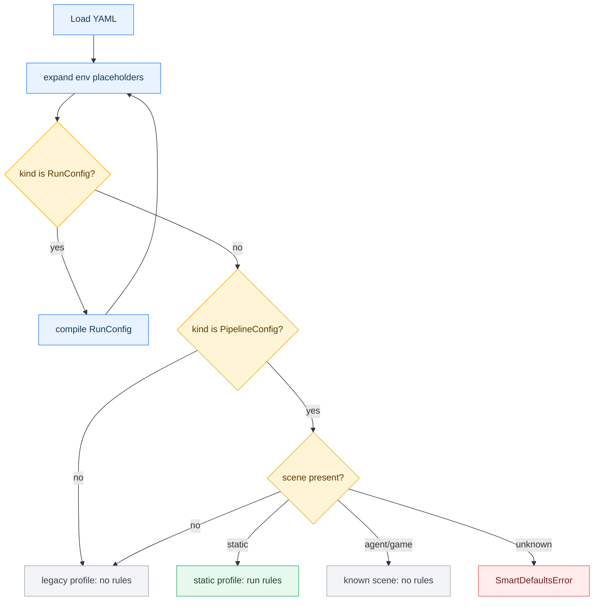
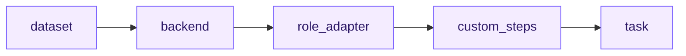
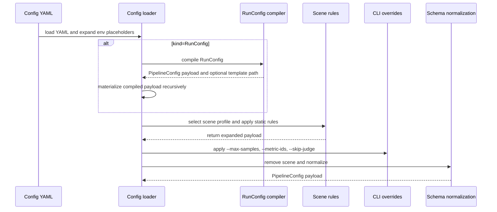
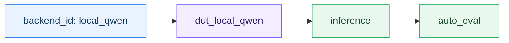
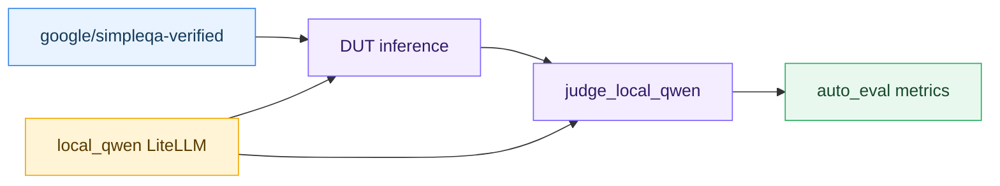

# Smart Defaults Guide

English | [中文](smart_defaults_zh.md)

This guide explains the smart-default configuration workflow across evaluation scenes. The current release implements active rules for `scene: static`; `agent` and `game` are recognized scenes reserved for later phases.

> Path note: commands assume you are in the `gage-eval-main/` repository root.

## 0. Document Map

- Project overview: [`framework_overview.md`](framework_overview.md)
- Benchmark guide: [`benchmark.md`](benchmark.md)
- AIME 2024 simplified config: [`config/custom/aime24/aime2024_simple_static.yaml`](../../config/custom/aime24/aime2024_simple_static.yaml)
- SimpleQA Verified simplified config: [`config/custom/simpleqa_verified/simpleqa_verified_simple_static.yaml`](../../config/custom/simpleqa_verified/simpleqa_verified_simple_static.yaml)

## 1. What This Feature Is For

In the current release, static benchmark configs are the first target because they often repeat the same boilerplate:

- dataset loader and Hugging Face hub wiring,
- backend defaults for LiteLLM or vLLM,
- DUT role adapters,
- inference and auto-eval steps,
- single-task declarations,
- standard console/file reporting.

GAGE still supports complex configurations: multiple backends, multiple datasets, role-specific adapters, sandbox resources, judges, support steps, custom reporting, and other advanced resource combinations. Those capabilities remain available for teams that need them.

**Most day-to-day evaluation runs are simpler. A user often wants to run one benchmark dataset against one model backend, produce one task, and inspect one set of metrics. Smart defaults target this common path. They lower the YAML entry cost for simple evaluations while keeping the explicit configuration model intact for advanced workflows.**

Smart defaults let a config author declare the benchmark-specific parts and let the loader fill predictable framework wiring.

```mermaid
flowchart LR
  Short["Simplified YAML"] --> Loader["Config loader"]
  Loader --> Profile["scene profile"]
  Profile --> Rules["scene smart-default rules"]
  Rules --> Normalized["Normalized PipelineConfig"]
  Normalized --> Runtime["Evaluation runtime"]
  classDef input fill:#E8F3FF,stroke:#2F80ED,color:#143A5A;
  classDef process fill:#F4ECFF,stroke:#7B61FF,color:#2E1A67;
  classDef output fill:#E9F8EF,stroke:#27AE60,color:#174A2A;
  class Short input;
  class Loader,Profile,Rules,Normalized process;
  class Runtime output;
```



Current planning scope:

| Area | Status | Notes |
| --- | --- | --- |
| `scene: static` | Supported | The only scene with active smart-default rules. |
| Missing `scene` | Legacy behavior | No smart defaults are applied. |
| `scene: agent` | Recognized no-op | The scene name is accepted, but no simplification rules run. |
| `scene: game` | Recognized no-op | The scene name is accepted, but no simplification rules run. |
| Unknown scene | Error | The loader fails fast instead of guessing. |

The feature is intentionally conservative: it fills only missing framework wiring and should not replace explicit user choices.

## 2. Trigger Conditions

Smart defaults are selected from the materialized payload before schema normalization. If the source file is a `RunConfig`, the loader first compiles it into a `PipelineConfig` payload, then applies the same scene selection rules to the compiled payload.



For the currently supported static scene, a simplified config must include:

```yaml
api_version: gage/v1alpha1
kind: PipelineConfig
scene: static
```

Useful commands:

```bash
python run.py \
  --config config/custom/aime24/aime2024_simple_static.yaml \
  --show-expanded-config
```

`--show-expanded-config` prints the materialized config and exits. Empty optional top-level sections such as `models`, `agent_backends`, `sandbox_profiles`, `mcp_clients`, `prompts`, and `summary_generators` are hidden only in this display output.

```bash
python run.py \
  --config config/custom/aime24/aime2024_simple_static.yaml \
  --show-expanded-config \
  --no-smart-defaults
```

`--no-smart-defaults` disables smart-default rule expansion for normal loading or display. When combined with `--show-expanded-config`, it prints the pre-smart-defaults materialized payload after env expansion and optional `RunConfig` compilation, but before smart-default rules, CLI final overrides, `scene` removal, and schema normalization. This mode preserves `scene` and still fails fast for unknown scenes.

## 3. How The Rule Library Works

Smart-default rules are small functions registered by scene, phase, priority, and name. The current static profile runs phases in a fixed order:



The loader applies rules to a deep copy of the payload, then applies CLI final overrides, removes the `scene` marker, and finally normalizes the payload into the regular `PipelineConfig` schema.



Rule behavior is deliberately explicit. The action column keeps the code-level action identifiers so it can be matched with traces and source code.

| Action | Meaning |
| --- | --- |
| `fill` | Add a field only when it is missing. |
| `migrate` | Move a sugar field into the canonical nested field. |
| `replace_subtree` | Generate a larger section such as `role_adapters` or `tasks`. |
| `fail` | Stop loading when a shortcut is ambiguous or contradictory. |

CLI intent can influence expansion:

| CLI option | Effect |
| --- | --- |
| `--backend-id` | Static scene only. Skips `task_backend_from_single_dut`, then `task_backend_expand` binds inference to the unique DUT adapter for the selected backend. `agent` and `game` scenes ignore this flag because their profiles currently run no rules. |
| `--max-samples` | Overrides task `max_samples` and dataset/hub limits after smart defaults. |
| `--metric-ids` | Filters metrics after smart defaults. |
| `--skip-judge` | Removes judge steps from `custom.steps` and task steps after smart defaults. |

## 4. Built-In Rules In This Release

The current built-in rule implementation lives in the static scene. Use these files when reading or extending the rule library:

| Area | Code location |
| --- | --- |
| Profile selection and scene dispatch | [`src/gage_eval/config/smart_defaults/profiles.py`](../../src/gage_eval/config/smart_defaults/profiles.py) |
| Rule registration and phase execution | [`src/gage_eval/config/smart_defaults/registry.py`](../../src/gage_eval/config/smart_defaults/registry.py) |
| Current static rule implementations | [`src/gage_eval/config/smart_defaults/static_rules.py`](../../src/gage_eval/config/smart_defaults/static_rules.py) |
| CLI intent and final overrides | [`src/gage_eval/config/loader_cli.py`](../../src/gage_eval/config/loader_cli.py) |
| Config loader integration | [`src/gage_eval/config/loader.py`](../../src/gage_eval/config/loader.py) |
| `--show-expanded-config` display filtering | [`run.py`](../../run.py) |

The static profile executes phases in this order: `dataset`, `backend`, `role_adapter`, `custom_steps`, `task`. Within a phase, lower priority numbers run first; rules with the same priority are ordered by rule name.

| Phase | Priority | Rule |
| --- | ---: | --- |
| `dataset` | 10 | `dataset_hub_from_hub_id` |
| `dataset` | 10 | `dataset_loader_from_hub_id` |
| `dataset` | 20 | `dataset_loader_from_path` |
| `dataset` | 30 | `dataset_hub_params_gather` |
| `dataset` | 40 | `dataset_preprocess_kwargs_default` |
| `backend` | 10 | `litellm_api_base_from_provider` |
| `backend` | 10 | `litellm_provider_from_api_base` |
| `backend` | 10 | `vllm_tokenizer_path_from_model_path` |
| `backend` | 20 | `vllm_force_tokenize_prompt_default` |
| `backend` | 20 | `vllm_tokenizer_trust_remote_code_default` |
| `backend` | 30 | `litellm_max_retries_default` |
| `backend` | 30 | `litellm_streaming_default` |
| `role_adapter` | 20 | `auto_dut_role_adapters` |
| `custom_steps` | 20 | `auto_custom_steps` |
| `task` | 5 | `single_task_fallback` |
| `task` | 6 | `task_singular_alias` |
| `task` | 10 | `task_implicit_ids` |
| `task` | 15 | `task_backend_from_single_dut` |
| `task` | 20 | `task_backend_expand` |
| `task` | 30 | `task_reporting_default` |

The priority gap in the task phase is intentional: `task_backend_from_single_dut` fills `task.backend` only when that is safe, then `task_backend_expand` consumes either that field or CLI `--backend-id` and writes the concrete inference `adapter_id`.

### 4.1 Dataset Rules

| Rule | What it fills or rewrites | Example input |
| --- | --- | --- |
| `dataset_hub_from_hub_id` | Adds `hub: huggingface` when `hub_id` is used. | `hub_id: Maxwell-Jia/AIME_2024` |
| `dataset_loader_from_hub_id` | Adds `loader: hf_hub` when `hub_id` is used. | `hub_id: google/simpleqa-verified` |
| `dataset_loader_from_path` | Infers `loader: jsonl` or `loader: json` from a local file path. | `params.path: data/smoke.jsonl` |
| `dataset_hub_params_gather` | Moves `hub_id`, `split`, `subset`, `revision`, and `data_files` into `hub_params`. | `split: train` |
| `dataset_preprocess_kwargs_default` | Adds empty `params.preprocess_kwargs` when `params.preprocess` is declared. | `preprocess: aime2024_preprocessor` |

Before:

```yaml
datasets:
  - dataset_id: aime2024_ds
    hub_id: Maxwell-Jia/AIME_2024
    split: train
    params:
      preprocess: aime2024_preprocessor
```

After expansion:

```yaml
datasets:
  - dataset_id: aime2024_ds
    hub: huggingface
    loader: hf_hub
    hub_params:
      hub_id: Maxwell-Jia/AIME_2024
      split: train
    params:
      preprocess: aime2024_preprocessor
      preprocess_kwargs: {}
```

### 4.2 Backend Rules

| Rule | Applies to | What it fills |
| --- | --- | --- |
| `vllm_tokenizer_path_from_model_path` | `type: vllm` | `config.tokenizer_path` from `config.model_path`. |
| `vllm_force_tokenize_prompt_default` | `type: vllm` | `config.force_tokenize_prompt: true`. |
| `vllm_tokenizer_trust_remote_code_default` | `type: vllm` | `config.tokenizer_trust_remote_code: true`. |
| `litellm_provider_from_api_base` | `type: litellm` | `provider` from known API bases such as OpenAI or DeepSeek. |
| `litellm_api_base_from_provider` | `type: litellm` | Known `api_base` from `provider`. |
| `litellm_streaming_default` | `type: litellm` | `config.streaming: false`. |
| `litellm_max_retries_default` | `type: litellm` | `config.max_retries: 6`. |

The two retained example configs use LiteLLM with a local OpenAI-compatible endpoint:

```yaml
backends:
  - backend_id: local_qwen
    type: litellm
    config:
      provider: openai
      api_base: http://127.0.0.1:1234/v1
      model: qwen/qwen3.5-9b
      api_key: local
```

Backend smart defaults stay conservative. They do not infer capacity, token budget, sampling, or model-specific generation settings. Keep these fields explicit when the run depends on them:

| Field family | Examples that are not inferred |
| --- | --- |
| vLLM capacity and context | `max_tokens`, `max_model_len`, `gpu_memory_utilization`, `async_max_concurrency` |
| Sampling controls | `sampling_params`, `temperature`, `top_p` |
| LiteLLM generation parameters | `generation_parameters.max_new_tokens`, `generation_parameters.temperature` |
| Backend-specific performance flags | Any backend-specific knob outside the static rule table above |

### 4.3 Role Adapter And Step Rules

| Rule | What it does | When it applies |
| --- | --- | --- |
| `auto_dut_role_adapters` | Generates `dut_<backend_id>` adapters with `chat_completion`. | Only when `role_adapters` is omitted. |
| `auto_custom_steps` | Generates `inference` then `auto_eval`. | Only when every adapter is a DUT adapter and `custom.steps` is missing. |

Pure DUT configs can omit both `role_adapters` and `custom.steps`:



Judge configs should still declare their judge adapter and judge step explicitly. The SimpleQA Verified example does this because one local backend is reused as both DUT and judge.

### 4.4 Task Rules

| Rule | What it does |
| --- | --- |
| `single_task_fallback` | Creates one task when there is exactly one dataset and one DUT adapter, and no `task` or `tasks` section exists. |
| `task_singular_alias` | Converts top-level `task:` into a one-item `tasks:` list. |
| `task_implicit_ids` | Fills `task_id` from `metadata.name` and fills `dataset_id` when there is exactly one dataset. |
| `task_backend_from_single_dut` | Fills `task.backend` when there is exactly one DUT adapter and no CLI backend override. |
| `task_backend_expand` | Converts `task.backend` or `--backend-id` into an inference `adapter_id` binding. |
| `task_reporting_default` | Adds standard console and file reporting sinks. |

Ambiguous shortcuts fail fast. For example, omitting `dataset_id` is only valid when the config declares exactly one dataset.

## 5. Examples

### 5.1 AIME 2024: Pure DUT Static Config

The AIME 2024 simplified config keeps only dataset, backend, and metric declarations. The linked YAML file in the document map is the source of truth; the snippet below mirrors its smart-default-relevant fields and omits only ordinary metadata or generation tuning that does not change the simplification behavior.

```yaml
scene: static
metadata:
  name: aime2024_simple_static

datasets:
  - dataset_id: aime2024_ds
    hub_id: Maxwell-Jia/AIME_2024
    split: train
    params:
      preprocess: aime2024_preprocessor

backends:
  - backend_id: local_qwen
    type: litellm
    config:
      provider: openai
      api_base: http://127.0.0.1:1234/v1
      model: qwen/qwen3.5-9b
      api_key: local

metrics:
  - metric_id: aime2024_acc
    implementation: aime2024_accuracy
```

The static rules infer:

- Hugging Face dataset loader wiring,
- LiteLLM retry and streaming defaults,
- `dut_local_qwen`,
- `inference -> auto_eval`,
- one task named `aime2024_simple_static`,
- standard report sinks.

Run:

```bash
python run.py \
  --config config/custom/aime24/aime2024_simple_static.yaml \
  --max-samples 10 \
  --run-id aime2024_static_smoke
```

Inspect the expansion:

```bash
python run.py \
  --config config/custom/aime24/aime2024_simple_static.yaml \
  --show-expanded-config
```

### 5.2 SimpleQA Verified: DUT And Judge Static Config

SimpleQA Verified needs a judge step. The simplified config still declares:

- `custom.steps` because the pipeline is `inference -> judge -> auto_eval`,
- `prompts` because the judge needs a grading prompt,
- `role_adapters` because `local_qwen` is used as both DUT and judge.



Run:

```bash
python run.py \
  --config config/custom/simpleqa_verified/simpleqa_verified_simple_static.yaml \
  --max-samples 10 \
  --run-id simpleqa_verified_static_smoke
```

Useful variants:

```bash
# Inspect the fully expanded config
python run.py \
  --config config/custom/simpleqa_verified/simpleqa_verified_simple_static.yaml \
  --show-expanded-config

# Keep only one metric
python run.py \
  --config config/custom/simpleqa_verified/simpleqa_verified_simple_static.yaml \
  --metric-ids simpleqa_verified_acc \
  --max-samples 10 \
  --run-id simpleqa_verified_acc_only

# Remove judge steps at runtime
python run.py \
  --config config/custom/simpleqa_verified/simpleqa_verified_simple_static.yaml \
  --skip-judge \
  --max-samples 10 \
  --run-id simpleqa_verified_no_judge
```

## 6. Common Errors And Fixes

Smart-default errors are raised as `SmartDefaultsError` and include the field path when the rule can identify one.

| Error text | Common cause | Fix |
| --- | --- | --- |
| `Unknown PipelineConfig scene 'research'` | `scene` is not one of the recognized scene names. | Use `scene: static`, `scene: agent`, `scene: game`, or remove `scene` for legacy behavior. |
| `task and tasks cannot both be declared` | Both the singular shortcut and canonical task list are present. | Keep only `task:` for one task or only `tasks:` for a list. |
| `task omitted dataset_id but config does not have exactly one dataset at tasks[0]` | A task omits `dataset_id` while multiple datasets are present. | Add `dataset_id` to each task that needs an explicit dataset. |
| `task omitted backend but config does not have exactly one DUT adapter at tasks[0]` | A task omits `backend` while inference cannot be inferred from one DUT adapter. | Add `task.backend`, pass `--backend-id`, or make `role_adapters` unambiguous. |
| `cannot find unique DUT adapter for backend 'local_qwen' at cli.backend_id` | `--backend-id` or `task.backend` points to zero or multiple DUT adapters. | Check the backend id and ensure exactly one `role_type: dut_model` adapter uses that backend. |
| `task must have exactly one inference step to bind backend at tasks[0].steps` | Backend binding needs to patch an inference step, but the task has zero or multiple `step: inference` entries. | Keep one inference step in `custom.steps` or in the task's own `steps`. |

## 7. When To Stay Explicit

Use the simplified form when the config is a normal static benchmark and the inference wiring is predictable.

Stay explicit when the rule library would otherwise have to guess:

- more than one dataset is present and tasks need different datasets,
- more than one DUT adapter can match the same backend intent; this is a hard failure unless the task or adapters are made unambiguous,
- the pipeline includes judge, support, custom post-processing, or unusual report sinks,
- a backend type is not covered by the current scene rules,
- you are authoring `agent` or `game` scene configs.

The safest workflow is to write the short config, run `--show-expanded-config`, and keep the expanded output under review until the inferred wiring is obvious.
