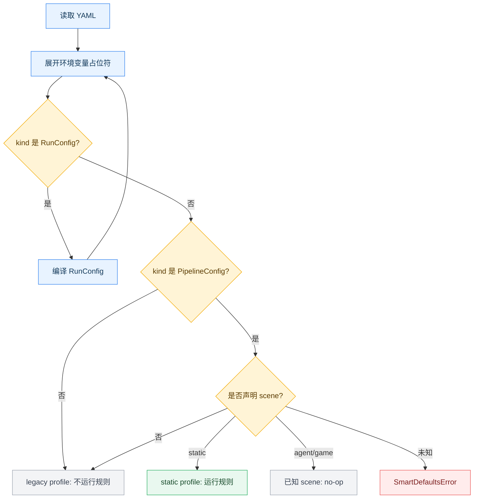
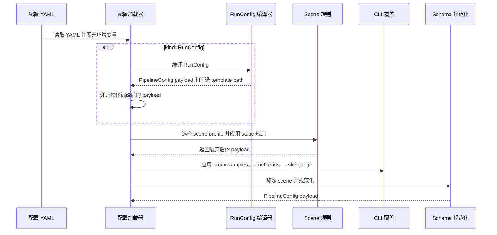
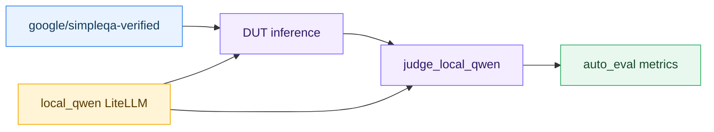

# 智能配置简化指南

中文 | [English](smart_defaults.md)

本文说明跨评测场景的智能配置简化功能，包括功能规划、触发条件、智能推断规则库的工作方式、当前内置规则，以及两个保留示例配置的使用方式。本期仅为 `scene: static` 提供实际推断规则；`agent` 和 `game` 是已识别但暂未启用规则的后续场景。

> 路径说明：本文中的命令默认在 `gage-eval-main/` 仓库根目录执行。

## 0. 文档索引

- 项目总览：[`framework_overview_zh.md`](framework_overview_zh.md)
- Benchmark 指南：[`benchmark_zh.md`](benchmark_zh.md)
- AIME 2024 简化配置：[`config/custom/aime24/aime2024_simple_static.yaml`](../../config/custom/aime24/aime2024_simple_static.yaml)
- SimpleQA Verified 简化配置：[`config/custom/simpleqa_verified/simpleqa_verified_simple_static.yaml`](../../config/custom/simpleqa_verified/simpleqa_verified_simple_static.yaml)

## 1. 配置简化功能规划

本期首先覆盖 static benchmark，因为这类配置中经常存在重复样板：

- 数据集 loader 与 Hugging Face hub 接线，
- LiteLLM 或 vLLM 后端默认值，
- DUT role adapter，
- inference 与 auto_eval 步骤，
- 单任务声明，
- console/file reporting。

GAGE 仍然支持复杂配置：多 backend、多 dataset、按角色区分的 adapter、sandbox 资源、judge、support step、自定义 reporting，以及其他高级资源组合。需要复杂编排的团队仍然可以继续显式声明这些配置。

**但大部分日常评测其实更简单：用户通常只是想用一个模型 backend 跑一个 benchmark dataset，生成一个 task，然后查看一组指标。智能配置简化面向这条高频路径，目标是在不削弱高级配置能力的前提下，降低常用评测的 YAML 编写门槛。**

智能配置简化的目标是让配置作者只声明 benchmark 自身差异，把可预测的框架接线交给 loader 自动补齐。


当前规划范围：

| 范围 | 状态 | 说明 |
| --- | --- | --- |
| `scene: static` | 已支持 | 目前唯一启用智能推断规则的场景。 |
| 缺少 `scene` | 旧行为 | 不启用智能推断，按 legacy 配置处理。 |
| `scene: agent` | 已识别但 no-op | scene 名称合法，但当前不运行简化规则。 |
| `scene: game` | 已识别但 no-op | scene 名称合法，但当前不运行简化规则。 |
| 未知 scene | 报错 | loader fail fast，避免错误配置被静默接受。 |

该功能刻意保持保守：它只补齐缺失的框架接线，不应该覆盖用户已经显式声明的配置。

## 2. 配置简化功能触发条件

智能推断在 schema normalization 之前，根据物化后的 payload 选择 profile。如果源文件是 `RunConfig`，loader 会先把它编译成 `PipelineConfig` payload，再对编译结果应用同一套 scene 选择规则。



对于当前已支持的 static scene，简化配置必须包含：

```yaml
api_version: gage/v1alpha1
kind: PipelineConfig
scene: static
```

常用检查命令：

```bash
python run.py \
  --config config/custom/aime24/aime2024_simple_static.yaml \
  --show-expanded-config
```

`--show-expanded-config` 会打印智能推断后的配置并退出。仅在展示输出中，空的可选顶层字段会被隐藏，例如 `models`、`agent_backends`、`sandbox_profiles`、`mcp_clients`、`prompts`、`summary_generators`。

```bash
python run.py \
  --config config/custom/aime24/aime2024_simple_static.yaml \
  --show-expanded-config \
  --no-smart-defaults
```

`--no-smart-defaults` 会禁用智能推断规则展开，适合排查“原始配置”和“推断后配置”的差异。它与 `--show-expanded-config` 组合时，会打印 pre-smart-defaults 的物化 payload：此时已经完成环境变量展开和可选的 `RunConfig` 编译，但尚未执行智能推断、CLI final overrides、`scene` 移除和 schema normalization。这个模式会保留 `scene`，并且仍会对未知 scene fail fast。

## 3. 智能推断规则库功能介绍

智能推断规则是按 scene、phase、priority、name 注册的小型函数。当前 static profile 固定按以下阶段执行：


loader 会先对 payload 执行环境变量展开，再对副本应用 smart defaults，然后应用 CLI final overrides，移除 `scene` 标记，最后进入常规 `PipelineConfig` schema normalization。



规则动作的含义如下。动作列保留代码中的 action 标识，便于和 trace 或源码对应。

| 动作 | 含义 |
| --- | --- |
| `fill` | 填写：仅当字段缺失时填入默认值。 |
| `migrate` | 迁移：把简写字段迁移到规范字段。 |
| `replace_subtree` | 子树替换：生成较大的配置区块，例如 `role_adapters` 或 `tasks`。 |
| `fail` | 中止：当简写存在歧义或冲突时停止加载。 |

CLI intent 可以影响最终配置：

| CLI 参数 | 作用 |
| --- | --- |
| `--backend-id` | 仅对 static scene 生效。它会抑制 `task_backend_from_single_dut`，再由 `task_backend_expand` 将 inference 绑定到指定 backend 对应的唯一 DUT adapter。`agent` 和 `game` 当前是 no-op profile，会忽略该参数。 |
| `--max-samples` | 在 smart defaults 之后覆盖 task `max_samples` 以及 dataset/hub limit。 |
| `--metric-ids` | 在 smart defaults 之后过滤 metrics。 |
| `--skip-judge` | 在 smart defaults 之后移除 `custom.steps` 和 task steps 中的 judge 步骤。 |

## 4. 当前内置规则

本期内置规则实现位于 static scene。阅读或扩展规则库时，建议从以下代码位置开始：

| 范围 | 代码位置 |
| --- | --- |
| Profile 选择与 scene 分发 | [`src/gage_eval/config/smart_defaults/profiles.py`](../../src/gage_eval/config/smart_defaults/profiles.py) |
| 规则注册与分阶段执行 | [`src/gage_eval/config/smart_defaults/registry.py`](../../src/gage_eval/config/smart_defaults/registry.py) |
| 当前 static 规则实现 | [`src/gage_eval/config/smart_defaults/static_rules.py`](../../src/gage_eval/config/smart_defaults/static_rules.py) |
| CLI intent 与 final overrides | [`src/gage_eval/config/loader_cli.py`](../../src/gage_eval/config/loader_cli.py) |
| 配置加载器接入 | [`src/gage_eval/config/loader.py`](../../src/gage_eval/config/loader.py) |
| `--show-expanded-config` 展示过滤 | [`run.py`](../../run.py) |

static profile 会按以下顺序执行 phase：`dataset`、`backend`、`role_adapter`、`custom_steps`、`task`。同一 phase 内 priority 越小越先执行；priority 相同时按规则名称排序。

| Phase | Priority | 规则 |
| --- | ---: | --- |
| `dataset` | 10 | `dataset_hub_from_hub_id` |
| `dataset` | 10 | `dataset_loader_from_hub_id` |
| `dataset` | 20 | `dataset_loader_from_path` |
| `dataset` | 30 | `dataset_hub_params_gather` |
| `dataset` | 40 | `dataset_preprocess_kwargs_default` |
| `backend` | 10 | `litellm_api_base_from_provider` |
| `backend` | 10 | `litellm_provider_from_api_base` |
| `backend` | 10 | `vllm_tokenizer_path_from_model_path` |
| `backend` | 20 | `vllm_force_tokenize_prompt_default` |
| `backend` | 20 | `vllm_tokenizer_trust_remote_code_default` |
| `backend` | 30 | `litellm_max_retries_default` |
| `backend` | 30 | `litellm_streaming_default` |
| `role_adapter` | 20 | `auto_dut_role_adapters` |
| `custom_steps` | 20 | `auto_custom_steps` |
| `task` | 5 | `single_task_fallback` |
| `task` | 6 | `task_singular_alias` |
| `task` | 10 | `task_implicit_ids` |
| `task` | 15 | `task_backend_from_single_dut` |
| `task` | 20 | `task_backend_expand` |
| `task` | 30 | `task_reporting_default` |

task phase 中的 priority 间隔是有意设计的：`task_backend_from_single_dut` 只在安全时填写 `task.backend`，随后 `task_backend_expand` 消费这个字段或 CLI `--backend-id`，写入实际的 inference `adapter_id`。

### 4.1 Dataset 规则

| 规则 | 推断或改写内容 | 示例输入 |
| --- | --- | --- |
| `dataset_hub_from_hub_id` | 使用 `hub_id` 简写时补齐 `hub: huggingface`。 | `hub_id: Maxwell-Jia/AIME_2024` |
| `dataset_loader_from_hub_id` | 使用 `hub_id` 简写时补齐 `loader: hf_hub`。 | `hub_id: google/simpleqa-verified` |
| `dataset_loader_from_path` | 从本地路径后缀推断 `loader: jsonl` 或 `loader: json`。 | `params.path: data/smoke.jsonl` |
| `dataset_hub_params_gather` | 将 `hub_id`、`split`、`subset`、`revision`、`data_files` 迁移到 `hub_params`。 | `split: train` |
| `dataset_preprocess_kwargs_default` | 声明 `params.preprocess` 时补齐空的 `params.preprocess_kwargs`。 | `preprocess: aime2024_preprocessor` |

简化前：

```yaml
datasets:
  - dataset_id: aime2024_ds
    hub_id: Maxwell-Jia/AIME_2024
    split: train
    params:
      preprocess: aime2024_preprocessor
```

展开后：

```yaml
datasets:
  - dataset_id: aime2024_ds
    hub: huggingface
    loader: hf_hub
    hub_params:
      hub_id: Maxwell-Jia/AIME_2024
      split: train
    params:
      preprocess: aime2024_preprocessor
      preprocess_kwargs: {}
```

### 4.2 Backend 规则

| 规则 | 适用对象 | 补齐内容 |
| --- | --- | --- |
| `vllm_tokenizer_path_from_model_path` | `type: vllm` | 根据 `config.model_path` 补齐 `config.tokenizer_path`。 |
| `vllm_force_tokenize_prompt_default` | `type: vllm` | 补齐 `config.force_tokenize_prompt: true`。 |
| `vllm_tokenizer_trust_remote_code_default` | `type: vllm` | 补齐 `config.tokenizer_trust_remote_code: true`。 |
| `litellm_provider_from_api_base` | `type: litellm` | 根据已知 API base 推断 `provider`，例如 OpenAI 或 DeepSeek。 |
| `litellm_api_base_from_provider` | `type: litellm` | 根据已知 `provider` 补齐 `api_base`。 |
| `litellm_streaming_default` | `type: litellm` | 补齐 `config.streaming: false`。 |
| `litellm_max_retries_default` | `type: litellm` | 补齐 `config.max_retries: 6`。 |

当前保留的两个示例配置都使用本地 OpenAI-compatible LiteLLM endpoint：

```yaml
backends:
  - backend_id: local_qwen
    type: litellm
    config:
      provider: openai
      api_base: http://127.0.0.1:1234/v1
      model: qwen/qwen3.5-9b
      api_key: local
```

Backend 智能推断保持保守，不会自动推断容量、token 预算、采样参数或模型特定生成参数。运行依赖这些字段时，需要显式声明：

| 字段类型 | 不会被推断的示例 |
| --- | --- |
| vLLM 容量与上下文 | `max_tokens`、`max_model_len`、`gpu_memory_utilization`、`async_max_concurrency` |
| 采样控制 | `sampling_params`、`temperature`、`top_p` |
| LiteLLM 生成参数 | `generation_parameters.max_new_tokens`、`generation_parameters.temperature` |
| 后端特定性能开关 | 上方 static 规则表以外的 backend-specific knob |

### 4.3 Role Adapter 与 Step 规则

| 规则 | 作用 | 生效条件 |
| --- | --- | --- |
| `auto_dut_role_adapters` | 为每个 backend 生成 `dut_<backend_id>`，capability 为 `chat_completion`。 | 仅当 `role_adapters` 缺失时。 |
| `auto_custom_steps` | 生成 `inference -> auto_eval`。 | 仅当全部 adapter 都是 DUT，且 `custom.steps` 缺失时。 |

纯 DUT 配置可以省略 `role_adapters` 和 `custom.steps`：


包含 judge 的配置仍应显式声明 judge adapter 和 judge step。SimpleQA Verified 示例就是这种情况：一个本地 backend 同时承担 DUT 和 judge 两个角色。

### 4.4 Task 规则

| 规则 | 作用 |
| --- | --- |
| `single_task_fallback` | 当且仅当存在一个 dataset 和一个 DUT adapter，且没有 `task`/`tasks` 时，生成单任务。 |
| `task_singular_alias` | 将顶层 `task:` 转换为单元素 `tasks:` 列表。 |
| `task_implicit_ids` | 使用 `metadata.name` 补齐 `task_id`，并在唯一 dataset 场景下补齐 `dataset_id`。 |
| `task_backend_from_single_dut` | 当且仅当存在唯一 DUT adapter 且没有 CLI backend override 时，补齐 `task.backend`。 |
| `task_backend_expand` | 将 `task.backend` 或 `--backend-id` 转换为 inference step 的 `adapter_id` 绑定。 |
| `task_reporting_default` | 补齐标准 console/file reporting sinks。 |

存在歧义时会 fail fast。例如：如果配置有多个 dataset，则 task 不能省略 `dataset_id`。

## 5. 示例介绍

### 5.1 AIME 2024：纯 DUT static 配置

AIME 2024 简化配置只保留 dataset、backend 和 metric。文档索引中链接的 YAML 文件是配置源，下面片段只保留与智能推断相关的字段，省略不改变简化行为的普通 metadata 或生成参数。

```yaml
scene: static
metadata:
  name: aime2024_simple_static

datasets:
  - dataset_id: aime2024_ds
    hub_id: Maxwell-Jia/AIME_2024
    split: train
    params:
      preprocess: aime2024_preprocessor

backends:
  - backend_id: local_qwen
    type: litellm
    config:
      provider: openai
      api_base: http://127.0.0.1:1234/v1
      model: qwen/qwen3.5-9b
      api_key: local

metrics:
  - metric_id: aime2024_acc
    implementation: aime2024_accuracy
```

static 规则会推断：

- Hugging Face dataset loader 接线；
- LiteLLM retry 与 streaming 默认值；
- `dut_local_qwen`；
- `inference -> auto_eval`；
- 名为 `aime2024_simple_static` 的单任务；
- 标准 report sinks。

执行：

```bash
python run.py \
  --config config/custom/aime24/aime2024_simple_static.yaml \
  --max-samples 10 \
  --run-id aime2024_static_smoke
```

查看展开结果：

```bash
python run.py \
  --config config/custom/aime24/aime2024_simple_static.yaml \
  --show-expanded-config
```

### 5.2 SimpleQA Verified：DUT + Judge static 配置

SimpleQA Verified 需要 judge step，因此简化配置仍然显式声明：

- `custom.steps`：因为流水线是 `inference -> judge -> auto_eval`；
- `prompts`：因为 judge 需要评分提示词；
- `role_adapters`：因为同一个 `local_qwen` backend 同时作为 DUT 和 judge。



执行：

```bash
python run.py \
  --config config/custom/simpleqa_verified/simpleqa_verified_simple_static.yaml \
  --max-samples 10 \
  --run-id simpleqa_verified_static_smoke
```

常用变体：

```bash
# 查看完整展开配置
python run.py \
  --config config/custom/simpleqa_verified/simpleqa_verified_simple_static.yaml \
  --show-expanded-config

# 只保留一个 metric
python run.py \
  --config config/custom/simpleqa_verified/simpleqa_verified_simple_static.yaml \
  --metric-ids simpleqa_verified_acc \
  --max-samples 10 \
  --run-id simpleqa_verified_acc_only

# 运行时跳过 judge step
python run.py \
  --config config/custom/simpleqa_verified/simpleqa_verified_simple_static.yaml \
  --skip-judge \
  --max-samples 10 \
  --run-id simpleqa_verified_no_judge
```

## 6. 常见错误与修复指引

智能推断错误会以 `SmartDefaultsError` 抛出；当规则能够定位字段时，错误信息会带上路径。

| 错误文本 | 常见原因 | 修复方式 |
| --- | --- | --- |
| `Unknown PipelineConfig scene 'research'` | `scene` 不是已识别的场景名称。 | 使用 `scene: static`、`scene: agent`、`scene: game`，或删除 `scene` 回到 legacy 行为。 |
| `task and tasks cannot both be declared` | 同时声明了单数快捷写法和规范任务列表。 | 单任务保留 `task:`，任务列表保留 `tasks:`，二者只能选一个。 |
| `task omitted dataset_id but config does not have exactly one dataset at tasks[0]` | task 省略 `dataset_id`，但配置里有多个 dataset。 | 为每个需要绑定数据集的 task 显式补齐 `dataset_id`。 |
| `task omitted backend but config does not have exactly one DUT adapter at tasks[0]` | task 省略 `backend`，但无法从唯一 DUT adapter 推断 inference 目标。 | 补齐 `task.backend`，传入 `--backend-id`，或让 `role_adapters` 变得唯一。 |
| `cannot find unique DUT adapter for backend 'local_qwen' at cli.backend_id` | `--backend-id` 或 `task.backend` 指向了 0 个或多个 DUT adapter。 | 检查 backend id，并确保只有一个 `role_type: dut_model` adapter 使用该 backend。 |
| `task must have exactly one inference step to bind backend at tasks[0].steps` | backend 绑定需要修改 inference step，但 task 中没有或存在多个 `step: inference`。 | 在 `custom.steps` 或 task 自身 `steps` 中保留一个 inference step。 |

## 7. 何时保持显式配置

当配置是常规 static benchmark，且 inference 接线明确时，适合使用简化形式。

当规则库必须猜测时，应保持显式：

- 存在多个 dataset，且不同 task 需要绑定不同 dataset；
- 存在多个 DUT adapter，无法唯一推断 inference 目标；除非 task 或 adapter 配置消除歧义，否则这是硬失败；
- 流水线包含 judge、support、自定义后处理或非标准 report sinks；
- backend type 没有被当前 scene 规则覆盖；
- 正在编写 `agent` 或 `game` scene 配置。

推荐工作流是：先写简化配置，再运行 `--show-expanded-config`，确认推断结果清楚、可审阅后再执行真实评测。
