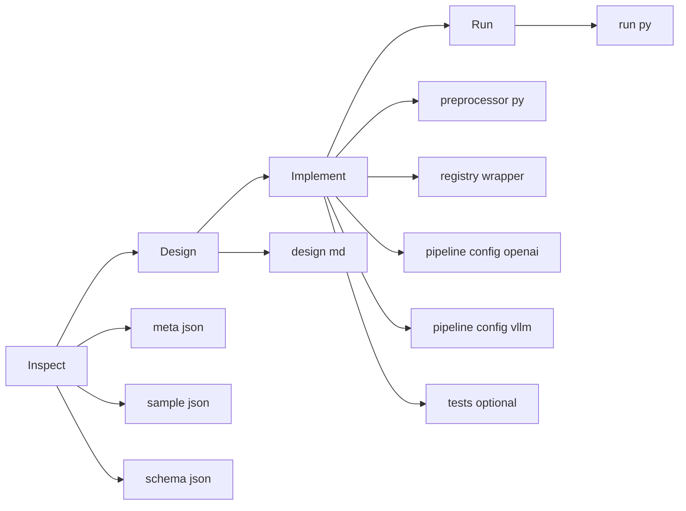
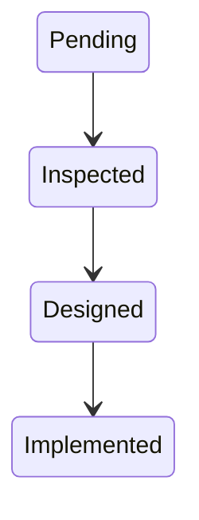
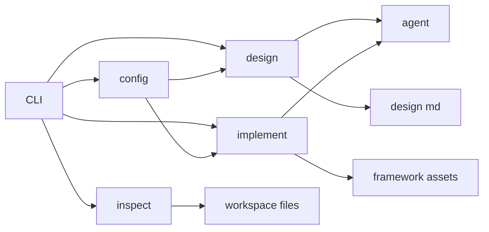

# Support Module: Benchmark Onboarding Helper

English | [中文](support_cli_zh.md)

`src/gage_eval/support/` is a developer helper module for benchmark authors. It turns “onboard a new benchmark” into a reusable pipeline: `inspect -> design -> implement`.

> Notes:
> - The support module is experimental and will be replaced by **gage-client**.
> - The evaluation entrypoint is still `gage-eval-main/run.py`.
> - The support module focuses on generating assets and validating wiring; it does not replace evaluation runs.

## 1. Core idea

- **inspect**: understand dataset structure first; write meta/schema/sample snapshots to disk.
- **design**: treat `design.md` as the single source of truth for field mapping, modalities, metrics, and tests.
- **implement**: generate preprocessors/configs/metric stubs from `design.md`, with dry-run preview and safety guardrails.



## 2. Quickstart

### 2.1 Entry

Support is a Typer CLI (see `src/gage_eval/support/main.py`).

From the mono-repo root:

```bash
PYTHONPATH=gage-eval-main/src python -m gage_eval.support --help
```

If you run inside `gage-eval-main/`:

```bash
PYTHONPATH=src python -m gage_eval.support --help
```

### 2.2 Recommended workflow

1) Check environment & agent:

```bash
PYTHONPATH=gage-eval-main/src python -m gage_eval.support check
```

2) Inspect a dataset on HuggingFace Hub:

```bash
PYTHONPATH=gage-eval-main/src python -m gage_eval.support inspect lighteval/mmlu \
  --subset business_ethics \
  --split test \
  --max-samples 5
```

3) Inspect a local JSONL (a directory is also accepted; the first jsonl will be used):

```bash
PYTHONPATH=gage-eval-main/src python -m gage_eval.support inspect local-datasets/HLE/hle_test_prompted.jsonl \
  --max-samples 5
```

4) Generate a `design.md`:

```bash
PYTHONPATH=gage-eval-main/src python -m gage_eval.support design mmlu_business_ethics
```

5) Generate assets (default is dry-run, no writes):

```bash
PYTHONPATH=gage-eval-main/src python -m gage_eval.support implement mmlu_business_ethics
```

6) Review the plan, then write to disk:

```bash
PYTHONPATH=gage-eval-main/src python -m gage_eval.support implement mmlu_business_ethics --force
```

7) Run `run.py` for wiring validation or a small run:

```bash
python gage-eval-main/run.py --config gage-eval-main/config/custom/mmlu_business_ethics_openai.yaml --max-samples 5
```

## 3. Workspace & artifacts

The default workspace is `dev_docs/` (override via `.gage/support.yaml`).

### 3.1 Inspect artifacts

| Artifact | Default path | Notes |
| --- | --- | --- |
| meta | `dev_docs/<slug>/meta.json` | dataset metadata & stats |
| sample | `dev_docs/<slug>/sample.json` | sampled records snapshot |
| schema | `dev_docs/<slug>/schema.json` | inferred field structure |

### 3.2 Implement write targets

Important: generated assets are written into the **main framework directory**, not under `support/`.

| Artifact | Default path | Notes |
| --- | --- | --- |
| Preprocessor implementation | `gage-eval-main/src/gage_eval/assets/datasets/preprocessors/<slug>_preprocessor.py` | generated; extends `BasePreprocessor` |
| Preprocessor registry wrapper | `gage-eval-main/src/gage_eval/assets/datasets/preprocessors/custom.py` | appended by support; registers into `dataset_preprocessors` |
| Config (OpenAI) | `gage-eval-main/config/custom/<slug>_openai.yaml` | rendered; defaults to `openai_http` |
| Config (vLLM) | `gage-eval-main/config/custom/<slug>_vllm.yaml` | rendered; points to local vLLM |
| Metric stub | `gage-eval-main/src/gage_eval/metrics/builtin/<impl>.py` | generated if `metrics[*].implementation` is new |
| Metric import wrapper | `gage-eval-main/src/gage_eval/metrics/builtin/custom.py` | appended import to trigger registry side effects |

## 4. `support.yaml`

Config loading order (see `src/gage_eval/support/config.py`):

1) `--config <path>` (explicit)
2) `.gage/support.yaml` in current working directory
3) module default `src/gage_eval/support/support.yaml`
4) built-in defaults

Recommended project-level config path: `<repo_root>/.gage/support.yaml`

Quick reference:

| Section | Field | Notes |
| --- | --- | --- |
| `agent` | `type/command/yolo_args/timeout` | external agent CLI |
| `paths` | `workspace_root` | default `dev_docs` |
| `paths` | `local_datasets_root` | local datasets root |
| `paths` | `project_root` | auto-detect to `gage-eval-main/` |
| `execution` | `dry_run_default` | defaults to dry-run |
| `execution` | `command_allowlist` | allowed test-command prefixes |

> Auto-detection: when running from mono-repo root, support detects `gage-eval-main/` as `project_root` and writes assets into `gage-eval-main/src` and `gage-eval-main/config`.

## 5. `design.md` contract

Key constraint: `design.md` must contain **exactly one** fenced `yaml support_config` block. Implement parses only this block (see `src/gage_eval/support/utils.py:parse_support_config`).

Minimal fields:

| Field | Required | Purpose |
| --- | --- | --- |
| `dataset_id` | yes | dataset identifier for naming/config generation |
| `preprocess_name` | yes | preprocessor registry id (normalized) |
| `fields` | yes | field mapping (e.g. `question_field/answers_field`) |
| `modalities` | no | modalities, default `text` |
| `doc_to_text/doc_to_visual/doc_to_audio` | no | doc_to hooks (string reference to callable) |
| `metrics` | no | metric list; support can generate stubs for new ids |
| `tests.run_commands` | no | test commands to run after implement |

## 6. State machine & guardrails

Status transitions (see `src/gage_eval/support/utils.py`):



### 6.1 Write & execution safety

Excerpt from `src/gage_eval/support/pipeline.py`:

```python
effective_dry_run = bool(dry_run or (cfg.execution.dry_run_default and not force))
if effective_dry_run:
    return

resolved = path.resolve()
if not resolved.is_relative_to(project_root):
    raise RuntimeError("Refuse to write outside project_root")
```

> Extra note: support automatically appends `--max-samples 0` to `run.py` commands in `tests.run_commands`, so the default is “wiring validation” rather than full inference.

### 6.2 File block protocol

The agent response must follow this file-block format so support can parse multi-file writes (see `src/gage_eval/support/agent_bridge.py:parse_file_blocks`):

```text
### FILE: src/gage_eval/assets/datasets/preprocessors/demo_preprocessor.py
<file content>
### END
```

### 6.3 Module structure

Key files and responsibilities:

| File | Responsibility |
| --- | --- |
| `src/gage_eval/support/main.py` | Typer CLI: `check/inspect/design/implement/status` |
| `src/gage_eval/support/config.py` | `SupportConfig`, merge strategy, `project_root` auto-detect |
| `src/gage_eval/support/inspector.py` | sampling read, schema inference, modality detection |
| `src/gage_eval/support/pipeline.py` | design generation, implement generation/write, template render, guardrails |
| `src/gage_eval/support/agent_bridge.py` | agent invocation + protocol parsing |
| `src/gage_eval/support/templates/` | doc/prompt/config/preprocessor templates |



### 6.4 Control checklist

| Guardrail | Location | Behavior |
| --- | --- | --- |
| HF loads without remote code by default | `src/gage_eval/support/inspector.py` | `trust_remote_code` defaults to false |
| dry-run by default | `src/gage_eval/support/config.py` | `execution.dry_run_default: true` |
| Git workspace check | `src/gage_eval/support/utils.py` | checks `git status` before writing unless `--force` |
| Test-command allowlist | `src/gage_eval/support/utils.py` | non-allowlisted commands require confirmation; rejects dangerous injection tokens |
| Write-path restriction | `src/gage_eval/support/pipeline.py` | refuses writes outside `project_root` |
