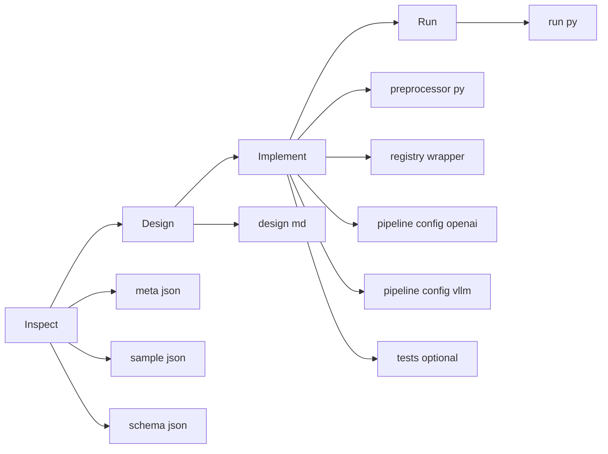
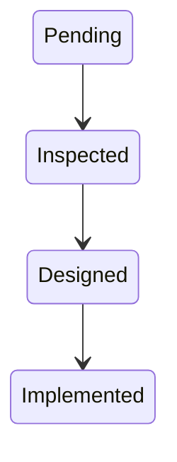
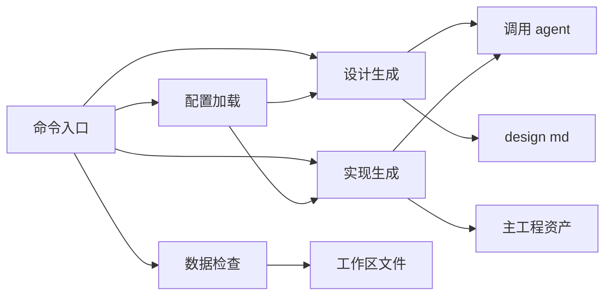

# support 模块：Benchmark 接入辅助

[English](support_cli.md) | 中文

`src/gage_eval/support/` 是面向 Benchmark 作者的“开发辅助模块”，用于把“接入一个新 Benchmark”拆成可复用的流水线：`inspect -> design -> implement`。

> 重要说明：
> - 评测运行入口仍以 `gage-eval-main/run.py` 为准
> - support 模块主要用于“生成资产与校验接线”，不替代评测运行本身

## 1. 核心理念

- **inspect**：先看清数据结构与样本形态，落盘 meta 与 schema，避免一上来就写预处理器
- **design**：把设计文档 `design.md` 作为单一真相源，集中描述字段映射、模态、指标与测试策略
- **implement**：基于 `design.md` 生成预处理器、配置与指标 stub，并在写盘前提供 dry-run 预览与安全护栏



## 2. 快速开始

### 2.1 入口

support 模块是一个 Typer CLI（对应 `src/gage_eval/support/main.py`）。

在本仓库推荐从 **mono-repo 根目录**运行：

```bash
PYTHONPATH=gage-eval-main/src python -m gage_eval.support --help
```

如果你在 `gage-eval-main/` 目录内运行：

```bash
PYTHONPATH=src python -m gage_eval.support --help
```

### 2.2 推荐工作流

1) 检查环境与 agent：

```bash
PYTHONPATH=gage-eval-main/src python -m gage_eval.support check
```

2) Inspect 数据集（HuggingFace Hub）：

```bash
PYTHONPATH=gage-eval-main/src python -m gage_eval.support inspect lighteval/mmlu \
  --subset business_ethics \
  --split test \
  --max-samples 5
```

3) Inspect 本地 JSONL（也可传目录，默认取第一个 jsonl）：

```bash
PYTHONPATH=gage-eval-main/src python -m gage_eval.support inspect local-datasets/HLE/hle_test_prompted.jsonl \
  --max-samples 5
```

4) Design 生成设计文档：

```bash
PYTHONPATH=gage-eval-main/src python -m gage_eval.support design mmlu_business_ethics
```

5) Implement 生成资产（默认 dry-run，不会写盘）：

```bash
PYTHONPATH=gage-eval-main/src python -m gage_eval.support implement mmlu_business_ethics
```

6) 确认写盘清单无误后再执行写盘：

```bash
PYTHONPATH=gage-eval-main/src python -m gage_eval.support implement mmlu_business_ethics --force
```

7) 用 `run.py` 跑通“接线校验”或小样本：

```bash
python gage-eval-main/run.py --config gage-eval-main/config/custom/mmlu_business_ethics_openai.yaml --max-samples 5
```

## 3. 工作区与产物

support 的默认工作区为 `dev_docs/`（可在 `.gage/support.yaml` 修改）。

### 3.1 Inspect 产物

| 产物 | 默认路径 | 说明 |
| --- | --- | --- |
| meta | `dev_docs/<slug>/meta.json` | 数据集元信息与统计 |
| sample | `dev_docs/<slug>/sample.json` | 抽样样本快照 |
| schema | `dev_docs/<slug>/schema.json` | 字段结构推断结果 |

### 3.2 Implement 写盘产物

implement 的写盘目标（重要）：生成物写入 **主框架目录** 而不是 `support/` 目录。

| 产物 | 默认路径 | 说明 |
| --- | --- | --- |
| 预处理器逻辑 | `gage-eval-main/src/gage_eval/assets/datasets/preprocessors/<slug>_preprocessor.py` | agent 生成，继承 `BasePreprocessor` |
| 预处理器注册包装 | `gage-eval-main/src/gage_eval/assets/datasets/preprocessors/custom.py` | support 追加 wrapper 并注册到 `dataset_preprocessors` |
| 配置文件 OpenAI | `gage-eval-main/config/custom/<slug>_openai.yaml` | 模板渲染生成，默认 `openai_http` |
| 配置文件 vLLM | `gage-eval-main/config/custom/<slug>_vllm.yaml` | 模板渲染生成，默认指向本地 vLLM 服务 |
| 指标实现 stub | `gage-eval-main/src/gage_eval/metrics/builtin/<impl>.py` | 当 `metrics[*].implementation` 为非内置 registry 名时生成 |
| 指标导入包装 | `gage-eval-main/src/gage_eval/metrics/builtin/custom.py` | 追加 import，触发 registry 注册副作用 |

## 4. 配置文件 support.yaml

配置加载顺序（对应 `src/gage_eval/support/config.py`）：

1) `--config <path>` 显式指定  
2) 当前工作目录下的 `.gage/support.yaml`  
3) 模块自带默认配置 `src/gage_eval/support/support.yaml`  
4) 兜底默认值  

最常用的项目级配置文件路径建议：`<repo_root>/.gage/support.yaml`

配置字段速查：

| 区块 | 字段 | 说明 |
| --- | --- | --- |
| `agent` | `type/command/yolo_args/timeout` | 调用外部 agent CLI 生成设计文档与代码文件 |
| `paths` | `workspace_root` | support 工作区根目录，默认 `dev_docs` |
| `paths` | `local_datasets_root` | 本地数据集根目录，用于推断默认 jsonl 路径 |
| `paths` | `project_root` | 生成资产写入位置，默认自动探测 `gage-eval-main/` |
| `execution` | `dry_run_default` | implement 默认 dry-run，避免误写 |
| `execution` | `command_allowlist` | 允许执行的测试命令前缀白名单 |

> 自动定位：当你在 mono-repo 根目录运行 support 时，会自动探测 `gage-eval-main/` 作为 project_root，并把生成资产写入 `gage-eval-main/src` 与 `gage-eval-main/config`。

## 5. design.md 规范

design 阶段的关键约束：`design.md` 必须包含且仅包含一个 `yaml support_config` 代码块（Single Source of Truth），implement 阶段只解析这一块（见 `src/gage_eval/support/utils.py:parse_support_config`）。

support_config 的最小字段（字段名与语义以代码为准）：

| 字段 | 必填 | 作用 |
| --- | --- | --- |
| `dataset_id` | 是 | 数据集标识，用于命名与配置生成 |
| `preprocess_name` | 是 | 预处理器 registry id，会被归一化为小写下划线 |
| `fields` | 是 | 字段映射，例如 `question_field/answers_field` |
| `modalities` | 否 | 模态声明，默认 `text` |
| `doc_to_text/doc_to_visual/doc_to_audio` | 否 | doc_to 钩子（字符串引用 callable） |
| `metrics` | 否 | 指标列表；若 implementation 为新 registry 名，support 可生成 stub |
| `tests.run_commands` | 否 | implement 结束后可执行的测试命令列表 |

## 6. 状态机与安全护栏

Support 的状态判断逻辑（对应 `src/gage_eval/support/utils.py`）：



### 6.1 写盘与执行安全

实现阶段的安全护栏（节选自 `src/gage_eval/support/pipeline.py`，已补充中文注释）：

```python
# implement 默认 dry-run，除非用户显式 --force（或全局关闭 dry_run_default）
effective_dry_run = bool(dry_run or (cfg.execution.dry_run_default and not force))
if effective_dry_run:
    # 仅打印计划写盘文件与测试命令，不做任何写入
    return

# 写盘前的路径护栏：拒绝写到 project_root 之外
resolved = path.resolve()
if not resolved.is_relative_to(project_root):
    raise RuntimeError("Refuse to write outside project_root")
```

> 额外说明：support 会把 `tests.run_commands` 中的 `run.py` 命令自动补上 `--max-samples 0`，默认只做“接线校验”而不跑真实推理；需要真实评测时再移除该参数或单独运行 `run.py`。

### 6.2 文件块协议

实现阶段的文件协议（`src/gage_eval/support/agent_bridge.py:parse_file_blocks`）要求 agent 按以下格式返回内容，Support 才能解析出多文件写盘：

```text
### FILE: src/gage_eval/assets/datasets/preprocessors/demo_preprocessor.py
<file content>
### END
```

### 6.3 模块结构与内部调用关系

support 模块的关键文件与职责：

| 文件 | 职责 |
| --- | --- |
| `src/gage_eval/support/main.py` | Typer CLI，定义 `check/inspect/design/implement/status` |
| `src/gage_eval/support/config.py` | `SupportConfig` 与配置加载合并策略、project_root 自动探测 |
| `src/gage_eval/support/inspector.py` | 数据抽样读取、schema 推断、模态识别 |
| `src/gage_eval/support/pipeline.py` | design 生成、implement 生成与写盘、模板渲染、安全护栏 |
| `src/gage_eval/support/agent_bridge.py` | agent 调用与协议解析，输出文件块协议 |
| `src/gage_eval/support/templates/` | 设计文档模板、prompt 模板、config 模板、preprocessor 模板 |



### 6.4 可控性清单

| 护栏 | 位置 | 行为 |
| --- | --- | --- |
| HF 载入禁用远程代码 | `src/gage_eval/support/inspector.py` | `trust_remote_code` 默认 false |
| 默认 dry-run | `src/gage_eval/support/config.py` | `execution.dry_run_default: true` |
| Git 工作区检查 | `src/gage_eval/support/utils.py` | 写盘前检查 `git status`，除非 `--force` |
| 测试命令白名单 | `src/gage_eval/support/utils.py` | 非白名单命令需确认；拒绝含危险注入符号 |
| 写盘路径限制 | `src/gage_eval/support/pipeline.py` | 拒绝写到 `project_root` 外 |
