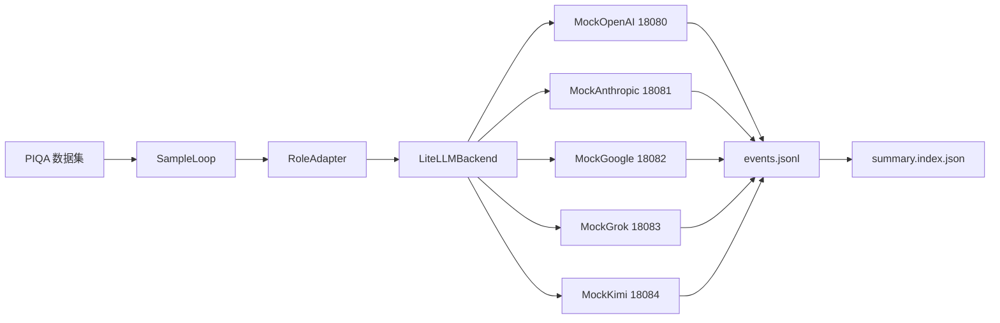
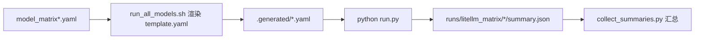

# LiteLLM 本地集成测试手册（scripts/oneclick/backends/litellm）

> 聚焦 `/Users/shuo/code/GAGE/scripts/oneclick/backends/litellm` 下的 Flask Mock，全链路验证 LiteLLM 多协议（OpenAI/Anthropic/Google/Grok/Kimi）在本地无公网环境的端到端数据流，并支持一键汇总 summary。

## 1. 目录与文件作用

| 文件/路径 | 作用 | 关键端点/端口 |
| --- | --- | --- |
| `scripts/oneclick/backends/litellm/mock_openai.py` | OpenAI 兼容 Mock，回显最后一条消息 | `/v1/chat/completions`，`PORT=18080` |
| `scripts/oneclick/backends/litellm/mock_anthropic.py` | Anthropic Mock，可回显或代理到下游 OpenAI 兼容服务 | `/v1/messages`，`PORT=18081` |
| `scripts/oneclick/backends/litellm/mock_google.py` | Gemini Mock + OpenAI 兼容端点，可转发下游 | `/v1/models/*:generateContent`、`/v1/chat/completions`，`PORT=18082` |
| `scripts/oneclick/backends/litellm/mock_grok.py` | Grok Mock（OpenAI 兼容协议） | `/v1/chat/completions`，`PORT=18083` |
| `scripts/oneclick/backends/litellm/mock_kimi.py` | Kimi/Moonshot Mock（OpenAI 兼容协议） | `/v1/chat/completions`，`PORT=18084` |
| `config/custom/piqa_litellm.yaml` | PIQA 流水线（5 个 LiteLLM 后端），`max_samples` 支持环境变量覆盖 | PIQA validation |
| `scripts/oneclick/backends/litellm/model_matrix.mock.yaml` | 5 协议 Mock 矩阵配置，配合 `run_all_models_mock.sh` 一键生成并运行 | 本地 Mock 场景 |
| `scripts/oneclick/backends/litellm/model_matrix.yaml` | 实测矩阵配置（自填真实 `api_base`/密钥） | 外部真实服务 |
| `scripts/oneclick/backends/litellm/run_all_models.sh` | 渲染 `template.yaml` → 逐个模型跑 demo，并自动汇总 summary | `MODEL_MATRIX` 控制模型列表 |
| `scripts/oneclick/backends/litellm/run_all_models_mock.sh` | 自动启动 5 个 Flask Mock，设置 `MODEL_MATRIX=model_matrix.mock.yaml` 后调用 `run_all_models.sh` | 本地 Mock 一键 |
| `scripts/oneclick/backends/litellm/run_piqa_litellm_local.sh` | 启动 5 个 Mock，使用 `config/custom/piqa_litellm.yaml` 跑 PIQA，全量生成 summary 索引 | PIQA 本地全测 |
| `scripts/oneclick/backends/litellm/collect_summaries.py` | 汇总指定根目录下的 `summary.json`，产出 `summary.index.json` | 运行后预览路径/样本数 |

## 2. 一键运行入口

### 2.1 PIQA（5 Mock 全覆盖）
```bash
cd /Users/shuo/code/GAGE
chmod +x scripts/oneclick/backends/litellm/run_piqa_litellm_local.sh
PIQA_LITELLM_MAX_SAMPLES=1 ./scripts/oneclick/backends/litellm/run_piqa_litellm_local.sh
```
- 自动启动 OpenAI/Anthropic/Google/Grok/Kimi 五个 Mock。
- `PIQA_LITELLM_MAX_SAMPLES` 统一覆盖五个任务的样本数（默认 1）。
- 结束后自动生成 `runs/piqa_litellm_local/summary.index.json`。

### 2.2 本地 Mock 矩阵（demo_echo 模板）
```bash
cd /Users/shuo/code/GAGE
chmod +x scripts/oneclick/backends/litellm/run_all_models_mock.sh
./scripts/oneclick/backends/litellm/run_all_models_mock.sh
```
- 使用 `model_matrix.mock.yaml` 渲染模板，跑 5 个协议 demo。
- 输出位于 `runs/litellm_mock_matrix/<model>/<run_id>/summary.json`，并生成 `runs/litellm_mock_matrix/summary.index.json`。

### 2.3 实测矩阵（自填真实基座）
```bash
export MODEL_MATRIX=scripts/oneclick/backends/litellm/model_matrix.yaml
export MAX_SAMPLES=1  # 可选，覆盖模板 max_samples
./scripts/oneclick/backends/litellm/run_all_models.sh
```
- `model_matrix.yaml` 需填写真实 `api_base`/密钥 ENV。
- 输出目录 `runs/litellm_matrix/`，自动生成 `summary.index.json`。

## 3. 数据流示意

### 3.1 PIQA 五协议本地流


### 3.2 模板渲染与执行


## 4. 关键配置与可调参数

### 4.1 数据集与样本数
| 位置 | 作用 | 调整方式 |
| --- | --- | --- |
| `config/custom/piqa_litellm.yaml` `datasets[].hub_params` | PIQA 数据来源/切分 | 如需更换数据集，修改 `hub_id/split` |
| `config/custom/piqa_litellm.yaml` `tasks[].max_samples` | 统一受 `PIQA_LITELLM_MAX_SAMPLES` 控制 | 例：`export PIQA_LITELLM_MAX_SAMPLES=5` |
| `scripts/oneclick/backends/litellm/template.yaml` | demo 模板样本数 | `MAX_SAMPLES` 环境变量覆盖 |
| `scripts/oneclick/backends/litellm/model_matrix*.yaml` | 每模型自定义 `max_samples`/`concurrency` | 在矩阵文件内直接修改 |

示例（PIQA 配置节选，含中文注释）：
```yaml
tasks:
  - task_id: piqa_validation_openai
    max_samples: ${PIQA_LITELLM_MAX_SAMPLES:-1}  # 中文注释：统一用环境变量控制样本数
    concurrency: 4
```

### 4.2 API 基址统一策略
- OpenAI/Grok/Kimi 使用 `/v1`（mock 与真实基座均一致），避免路径拼接差异。
- Google 使用 `/v1`（mock 同步提供 `/v1` 与 `/v1beta`）。
- Anthropic 保持无 `/v1` 前缀（官方基座即裸域名，litellm 自动补 `/v1/messages`）。
- 需要自定义端口或转发时，修改对应 YAML 的 `api_base`。

### 4.3 Grok/Kimi 易用性
- Grok：`provider: grok`，`custom_llm_provider: xai`，默认基座缺省填 `https://api.x.ai/v1`。
- Kimi：`provider: kimi`，`custom_llm_provider: moonshot`，默认基座缺省填 `https://api.moonshot.cn/v1`。
- Azure：自动读取 `AZURE_OPENAI_ENDPOINT/API_KEY/API_VERSION`，`api_type=azure` 自动注入。

## 5. Mock 行为总览

| Mock | 路径 | 说明 |
| --- | --- | --- |
| OpenAI | `/v1/chat/completions`、`/chat/completions` | 回显最后一条消息内容 |
| Anthropic | `/v1/messages` | 可通过 `MOCK_TARGET` 转发到下游 OpenAI 兼容服务 |
| Google | `/v1/models/*:generateContent`、`/v1/chat/completions` | 支持 inline 回显或转发 |
| Grok | `/v1/chat/completions`、`/chat/completions` | OpenAI 兼容协议，回显 `mock-grok(...)` |
| Kimi | `/v1/chat/completions`、`/chat/completions` | OpenAI 兼容协议，回显 `mock-kimi(...)` |

核心逻辑示例（Kimi Mock）：
```python
@app.route("/v1/chat/completions", methods=["POST"])
def chat_completions():
    payload = request.get_json(force=True, silent=True) or {}
    messages = payload.get("messages") or []
    content = messages[-1].get("content") if messages else ""
    # 中文注释：回显最后一条 user 消息
    text = f"mock-kimi({MODEL}): {content}" if content else f"mock-kimi({MODEL})"
    return jsonify({"choices": [{"message": {"role": "assistant", "content": text}}]})
```

## 6. 产物与汇总

- 单次运行：`runs/<root>/<model>/<run_id>/summary.json`（或 `runs/piqa_litellm_local/<run_id>/summary.json`）。
- 汇总索引：`collect_summaries.py --root <runs_root>` 生成 `<root>/summary.index.json` 并打印表格预览。
- 事件日志：`events.jsonl` 存在对应 run 目录。

快速预览：
```bash
python scripts/oneclick/backends/litellm/collect_summaries.py --root runs/litellm_mock_matrix
head -n 1 runs/litellm_mock_matrix/openai_mock/*/events.jsonl
```

## 7. 配置入口速查

| 文件/路径 | 作用 | 适用场景 |
| --- | --- | --- |
| `scripts/oneclick/backends/litellm/template.yaml` | 一键渲染模板（现为 PIQA 数据集） | `run_all_models.sh`、`run_all_models_mock.sh` |
| `scripts/oneclick/backends/litellm/model_matrix.yaml` | 实测矩阵，需自填真实 `api_base`/密钥 | 外部真实服务 |
| `scripts/oneclick/backends/litellm/model_matrix.mock.yaml` | 本地 Mock 矩阵，五协议端口统一为 18080-18084 | 离线 Mock |
| `config/custom/piqa_litellm.yaml` | PIQA 全量流水线（五后端），`max_samples` 支持 ENV 覆盖 | 本地或真实调用 |
| `.generated/backends/litellm/*.yaml` | 模板渲染产物，可直接查看实际运行配置 | debug/二次调整 |

## 8. 常见问题
- **端口占用**：调整 `MOCK_*_PORT` 环境变量，并同步修改对应 YAML 的 `api_base`。
- **缺少 summary 汇总**：运行后执行 `collect_summaries.py --root <runs_root>`。
- **协议切换**：Grok/Kimi/Google 如需实测，替换 YAML 中 `api_base` 与密钥 ENV（保留 `custom_llm_provider` 映射）。*** End Patch" json###​
