# Runtime Registry Freeze 与 Metric Lazy Loading 方案

## 背景

2026-03-24 本地确认显示，`Q5/Q7/Q8` 类失败不是各自配置损坏，而是同一个 runtime/registry 主链路问题。

代表性入口包括：

- `scripts/run/backends/demos/configs/demo_echo.pipeline.yaml`
- `config/custom/pettingzoo/pong_dummy.yaml`
- `config/custom/vizdoom/vizdoom_dummy_vs_dummy.yaml`

三者都可以在“仅 build runtime、不执行样本”的阶段复现同一异常：

- `RegistryRuntimeMutationError`
- `Global registry mutation 'asset' is not allowed while runtime views are active`

这说明问题发生在 runtime 装配阶段，而不是业务配置、数据集内容、PettingZoo/VizDoom 环境本身。

## 项目上下文

### 1. 项目用途

GAGE 是一个 YAML 驱动的评测与运行框架，用于统一编排：

- dataset materialization
- backend / role adapter 组装
- sample loop / task orchestration
- auto eval metrics
- report / summary 生成
- arena 类型环境运行

### 2. 技术栈

- Python 3.11
- YAML PipelineConfig
- `loguru`
- `pytest`
- 自研 registry/runtime freeze 机制
- 集成 PettingZoo、VizDoom、arena adapters

### 3. 启动方式

典型入口：

```bash
python run.py --config <yaml>
```

本次确认用的是“只 build runtime”的方式，不进入样本执行。

### 4. 目录结构

- `src/gage_eval/config/`: config 解析与 runtime registry 准备
- `src/gage_eval/registry/`: 全局 registry、frozen view、runtime guard
- `src/gage_eval/evaluation/`: runtime builder、task planner、sample loop
- `src/gage_eval/metrics/`: metric registry、builtin metrics、aggregators
- `src/gage_eval/pipeline/steps/`: `auto_eval`、`report`
- `config/`: 运行配置
- `docs/local/`: 本地问题确认与临时设计文档

### 5. 主流程

从入口到异常的主流程：

1. `run.py` 读取 YAML，构造 `PipelineConfig`
2. `build_runtime()` 准备 runtime-scoped registry context
3. global registry 被 freeze，并挂上 runtime mutation guard
4. task runtime 继续构造 `MetricRegistry()`
5. `MetricRegistry.__init__()` 导入 optional builtin aggregators
6. Python 先执行 `gage_eval.metrics.builtin.__init__`
7. `metrics/builtin/gomoku.py` 等模块执行 `@registry.asset(...)`
8. 全局 registry 在 runtime guard 期间再次 mutation，抛错

### 6. 核心模块

- `ConfigRegistry`: `src/gage_eval/config/registry.py`
- `RegistryManager`: `src/gage_eval/registry/manager.py`
- `RegistryBootstrapCoordinator`: `src/gage_eval/registry/runtime.py`
- `build_runtime`: `src/gage_eval/evaluation/runtime_builder.py`
- `MetricRegistry`: `src/gage_eval/metrics/registry.py`
- `ReportStep`: `src/gage_eval/pipeline/steps/report.py`

### 7. 风险点

- 包级 `__init__.py` eager import 带来的注册副作用
- optional aggregator 在对象构造阶段提前导入
- global registry 与 frozen runtime view 混用
- `metrics: []` 场景仍然初始化 metrics 基础设施

### 8. Mermaid 图

```mermaid
flowchart LR
    A["run.py"] --> B["build_runtime()"]
    B --> C["prepare_runtime_registry_context()"]
    C --> D["freeze global registry"]
    D --> E["MetricRegistry()"]
    E --> F["import optional aggregators"]
    F --> G["metrics.builtin.__init__"]
    G --> H["builtin metric modules"]
    H --> I["@registry.asset(metrics, ...)"]
    I --> J["runtime mutation guard"]
```



### 9. 阅读路线

建议按下面顺序阅读：

1. `src/gage_eval/evaluation/runtime_builder.py`
2. `src/gage_eval/config/registry.py`
3. `src/gage_eval/registry/runtime.py`
4. `src/gage_eval/registry/manager.py`
5. `src/gage_eval/metrics/registry.py`
6. `src/gage_eval/metrics/builtin/__init__.py`
7. `src/gage_eval/metrics/builtin/gomoku.py`

### 10. 中文总结

一句话总结：

当前公共故障点不是配置层，而是 metrics 初始化路径在 runtime freeze 之后仍然触发了全局 builtin 资产注册。

## 结论摘要

本次问题的根因不是 `demo_echo`、PettingZoo dummy、VizDoom dummy 三条配置各自出错，而是：

1. runtime 在 freeze 之后仍会构造 `MetricRegistry()`
2. `MetricRegistry()` 初始化时会导入 optional builtin aggregators
3. 这些 import 会先执行 `gage_eval.metrics.builtin.__init__`
4. `__init__` 中 eager import 了 `gomoku` 等 builtin metric 模块
5. builtin metric 模块通过 `@registry.asset(...)` 对全局 registry 做 mutation
6. 命中 runtime mutation guard

本质上，这是一个“lazy loading 不够彻底，导致构造期发生跨层副作用”的问题。

## 影响范围

### 已确认受影响

- `demo_echo`
- PettingZoo dummy
- VizDoom dummy
- 任何 task runtime 路径中会在 freeze 之后构造 `MetricRegistry()` 的配置

### 高概率受影响

- `metrics: []` 但仍走 task orchestrator runtime 的配置
- 不直接依赖 Gomoku metric，但会触发 `gage_eval.metrics.builtin.__init__` 的任意配置

### 当前尚未确认

- 是否所有 single-runtime / builtin pipeline 路径都受同等影响
- 是否某些分支已经通过 import cache 偶然规避

## 现象与证据

### 1. 只 build runtime 就可复现

即使不执行样本、不进入 arena 主循环，仅构造 runtime 就会抛出相同异常。

这意味着问题位于：

- runtime bootstrap
- registry freeze
- metrics/report infrastructure assembly

而不在：

- dataset iteration
- backend inference
- game environment stepping

### 2. 真实调用栈落在 metric builtin，而不是配置本身

本地 traceback 关键路径：

1. `build_runtime()` 进入 task runtime 构造
2. `_prepare_task_entries()` 构造 `MetricRegistry()`
3. `MetricRegistry.__init__()` 调用 `_register_optional_builtin_aggregators()`
4. `_resolve_optional_builtin_aggregator()` import `gage_eval.metrics.builtin.mme_aggregator`
5. Python 先执行 `gage_eval.metrics.builtin.__init__`
6. `__init__` import `gage_eval.metrics.builtin.gomoku`
7. `gomoku.py` 执行 `@registry.asset(...)`
8. `RegistryManager._assert_mutation_allowed()` 抛错

### 3. 命中的 guard 就是 runtime freeze guard

guard 实现在：

- `src/gage_eval/registry/manager.py`

关键语义是：

- runtime view active 时，global registry 不允许再 mutation

这也说明当前 freeze 设计本身是按预期工作的，真正的问题是 mutation 发生得太晚。

## 根因分析

## 根因 1: `MetricRegistry()` 对“无 metrics”场景没有 fast path

在 task runtime 组装阶段，即使：

- 配置中 `metrics: []`

仍然会无条件创建 `MetricRegistry()`。

这使得：

- 本来不需要 metrics 的场景
- 也会被 metrics 初始化副作用拖下水

这解释了为什么 `demo_echo`、PettingZoo dummy、VizDoom dummy 都会一起失败。

## 根因 2: optional aggregator 不是按需加载，而是构造期加载

`MetricRegistry.__init__()` 当前会主动注册 optional builtin aggregators。

这意味着：

- 只要创建 registry 对象
- 就会尝试 import optional aggregator 模块

而不是等到真正使用：

- `aggregation_id == mme_acc_plus`
- `aggregation_id == tau2_pass_hat`

时再加载。

## 根因 3: `gage_eval.metrics.builtin.__init__` 存在包级 eager import 副作用

optional aggregator 本身文件不一定注册 metric，但它们位于：

- `gage_eval.metrics.builtin`

包下。

Python import 子模块时会先执行包级：

- `gage_eval.metrics.builtin.__init__`

而这个 `__init__` 当前会 eager import 多个 builtin metric 模块，包括：

- `gomoku`
- `arena`
- `tau2`
- 其他 builtin metrics

于是 optional aggregator import 被放大成了“整包 builtin metrics 注册”。

## 根因 4: runtime-scoped registry 准备与后续 runtime 组装之间仍有全局 import 路径

`prepare_runtime_registry_context()` 的意图是：

- 在 freeze 前把 runtime 所需资产 prime 好
- 后续 runtime assembly 尽量只读 frozen view

但 metrics 这条链仍保留了：

- freeze 后构造对象
- 构造时触发全局 import
- import 时再次全局注册

这与 runtime-scoped registry 的设计目标不一致。

## 为什么这是同一个主链路问题

三条代表配置共享的并不是 arena/game 细节，而是：

- task runtime 组装路径
- `MetricRegistry()` 构造路径
- optional builtin aggregator import 路径
- global registry mutation guard

因此：

- `demo_echo` 不是被它自己的 backend config 卡住
- PettingZoo dummy 不是被 `pettingzoo_aec_v1` 卡住
- VizDoom dummy 不是被 `vizdoom_env_v1` 卡住

它们都只是恰好经过了同一条 metrics 初始化主链路。

## Lazy Loading 完整方案

## 目标

### 主要目标

1. runtime freeze 之后不再发生全局 registry mutation
2. `metrics: []` 场景不再初始化不必要的 metrics 基础设施
3. optional aggregators 只在真正需要时加载
4. builtin metrics 的注册时机可控，不依赖包级副作用

### 次要目标

1. 保持现有配置兼容
2. 尽量减少启动时不必要 import
3. 让错误边界更清晰，可诊断

### 非目标

1. 本轮不重写整个 registry 体系
2. 本轮不重构所有 builtin metric 模块的实现细节
3. 本轮不改变用户 YAML 书写方式

## 设计原则

1. 先切断“构造即导入”的副作用链
2. 再把 optional aggregator 改成真正的 on-demand loading
3. 最后收敛 builtin metrics 的显式 priming 边界

## 备选方案对比

### 方案 A: 仅在 `metrics: []` 时跳过 `MetricRegistry()`

优点：

- 改动最小
- 能快速解锁当前 demo/dummy 场景

缺点：

- 只能止血
- 一旦配置里有 metric，仍可能在 freeze 后触发同类问题

结论：

- 必须做，但只能作为短期修复

### 方案 B: 保留现结构，只把 optional aggregator import 延迟到使用时

优点：

- 可以直接命中本次根因
- 不需要大幅改 registry 设计

缺点：

- 如果其他地方仍会 import `gage_eval.metrics.builtin`
- 仍可能留下别的构造期副作用

结论：

- 推荐作为主修复路径

### 方案 C: 彻底移除 `metrics.builtin.__init__` 的 eager import，改为显式模块映射

优点：

- 副作用边界最清晰
- 启动成本更可控
- 最契合 runtime-scoped registry 设计

缺点：

- 改动面较大
- 需要检查 tests / imports 对 `metrics.builtin` 的依赖方式

结论：

- 适合作为中期治理方向

## 推荐方案

推荐采用“两阶段方案”：

### 阶段 1: 止血

1. `metric_specs` 为空时，不创建 `MetricRegistry()`
2. `AutoEvalStep` 为空时，不构造 metric instances
3. 确保空 metrics 路径完全不 import optional aggregators

### 阶段 2: 根治

1. optional builtin aggregators 改为按需加载
2. 避免在 `MetricRegistry.__init__()` 中 import `gage_eval.metrics.builtin.*`
3. 将 builtin aggregators 与 builtin metrics 的包级副作用拆开
4. 让 runtime prepare 阶段负责显式 priming 需要的 metric assets

## 推荐落地设计

### 设计点 1: 空 metrics fast path

建议在 task runtime 装配处增加明确分支：

- 当 `metric_specs` 为空时：
  - 不实例化 `MetricRegistry()`
  - `TaskPlanner.configure_metrics()` 可以接受空 specs 且不创建 `AutoEvalStep`
  - `report` 仍可工作，但只处理非 metrics 内容

收益：

- 直接解除 `demo_echo` / PettingZoo dummy / VizDoom dummy 当前阻塞
- 降低无 metrics 配置的启动复杂度

### 设计点 2: optional aggregators 改为真正的 lazy resolution

当前 optional aggregators 在 registry 构造阶段加载；建议改为：

1. `MetricRegistry.__init__()` 只注册内建基础 aggregators：
   - `mean`
   - `weighted_mean`
   - `identity`
   - `categorical_count`
2. optional aggregator 仅记录一份 lazy spec mapping：
   - `aggregation_id -> (module_name, class_name)`
3. 在 `build_metric()` 中，当发现 `aggregation_id` 尚未注册时：
   - 如果该 id 在 optional mapping 中
   - 再尝试 import 对应模块
   - 成功则注册到当前 registry instance
   - 失败则报出明确错误

这样可以保证：

- 不使用 `mme_acc_plus` / `tau2_pass_hat` 的配置
- 完全不会触发这些 import

### 设计点 3: 避免 aggregator import 触发 `metrics.builtin.__init__`

lazy import 之后还要处理包级副作用问题。

建议至少满足以下任一条件：

1. optional aggregator 模块迁出 `gage_eval.metrics.builtin` 包
   - 例如迁到 `gage_eval.metrics.optional_aggregators`
2. 或清理 `gage_eval.metrics.builtin.__init__`
   - 使其不再 eager import 全量 builtin metrics

推荐优先级：

1. 中短期可先迁移 optional aggregators 到独立包
2. 中期再精简 `metrics.builtin.__init__`

原因：

- 迁移 optional aggregators 成本更可控
- 能快速切断“导入 aggregator -> 先执行 builtin 包初始化”的路径

### 设计点 4: metric asset priming 应前移到 runtime prepare 阶段

当前已有 `_prime_runtime_metric_assets(config)`，方向是对的，但还不够闭环。

目标应是：

1. 所有真正需要的 builtin metric registrations
2. 都在 `prepare_runtime_registry_context()` 之前完成或在其 working registry 内完成
3. freeze 后不再通过全局 import 触发新增资产

建议约束：

- runtime 期间允许“读取 registry_view”
- 不允许“通过 import 间接注册全局资产”

### 设计点 5: `MetricRegistry` 不应假设 global registry 可随时 mutation

`MetricRegistry` 更合理的职责应该是：

- 读取已准备好的 metric asset registrations
- 在本实例内部维护 aggregator factories
- 对 optional aggregator 做实例级 lazy registration

而不是：

- 在构造时顺手触发一串全局 import / 注册副作用

## 分阶段实施计划

### Phase 1: 问题止血

目标：

- 恢复 `metrics: []` 路径

建议改动点：

- task runtime 构造时按 `metric_specs` 判空
- `TaskPlanner.configure_metrics()` 对空 specs 做 no-op
- 确保 `AutoEvalStep` 可为空

验收标准：

- `demo_echo`
- PettingZoo dummy
- VizDoom dummy

均可正常 `build_runtime()` 与执行

### Phase 2: optional aggregator lazy loading

目标：

- 切断 `MetricRegistry.__init__()` 对 optional aggregators 的 import

建议改动点：

- `src/gage_eval/metrics/registry.py`

验收标准：

- 空 metrics 配置不 import optional aggregators
- 普通 mean/categorical_count metrics 不 import optional aggregators
- 仅当使用 `mme_acc_plus` / `tau2_pass_hat` 时才 import 对应模块

### Phase 3: 包级副作用收敛

目标：

- 避免子模块 import 被 `metrics.builtin.__init__` 放大成全量 builtin metric 注册

建议改动点：

- `src/gage_eval/metrics/builtin/__init__.py`
- optional aggregator 模块位置

验收标准：

- import 单个 optional aggregator 不再触发 Gomoku/Arena/Tau2 等无关 metric 注册

### Phase 4: 回归测试与文档

目标：

- 固化 contract，防止同类回归

建议补充：

- unit tests
- integration build tests
- runtime freeze compatibility tests
- docs/guide 中补充 lazy loading contract

## 测试矩阵

### 单元测试

1. `metrics: []` 配置下 `build_runtime()` 不创建有副作用的 `MetricRegistry`
2. `MetricRegistry()` 构造时不 import optional aggregators
3. 使用 `aggregation=mean` 时不 import optional aggregators
4. 使用 `aggregation=mme_acc_plus` 时仅按需 import 对应模块
5. 使用 `aggregation=tau2_pass_hat` 时仅按需 import 对应模块
6. runtime guard 激活时，正常 `build_metric()` 不触发 global mutation

### 集成测试

1. `demo_echo.pipeline.yaml` 可成功 `build_runtime()`
2. `config/custom/pettingzoo/pong_dummy.yaml` 可成功 `build_runtime()`
3. `config/custom/vizdoom/vizdoom_dummy_vs_dummy.yaml` 可成功 `build_runtime()`
4. 带普通 builtin metrics 的配置仍能通过 runtime build
5. 带 `mme_acc_plus` / `tau2_pass_hat` 的配置仍能通过 runtime build

### 回归测试

建议新增与本次问题直接对应的回归断言：

- runtime freeze 后，构造 task runtime 不应再触发
  - `Global registry mutation 'asset'`
  - `Global registry mutation 'auto_discover'`

## 风险评估

### 风险 1: tests 或外部代码依赖 `metrics.builtin.__init__` 的副作用

如果外部代码隐式依赖：

- `import gage_eval.metrics.builtin`

后全量 metric 已注册，那么收敛包级副作用时可能打破这些隐式假设。

缓解方式：

- 先加测试
- 先迁 optional aggregators，再逐步瘦身 `__init__`

### 风险 2: optional aggregator 错误从“启动时暴露”变成“运行时暴露”

lazy loading 会把错误时机后移。

缓解方式：

- 在报错信息中明确 aggregation id、module name、class name
- 在 config checker 中对已声明 aggregation 做一次显式验证

### 风险 3: runtime prepare 与 runtime assembly 职责边界不清

如果后续又有其他模块在 freeze 后做全局 import 注册，问题会以别的形式复发。

缓解方式：

- 明确文档契约：
  - prepare 阶段允许注册
  - runtime 阶段只允许读 frozen view

## 建议的验收标准

满足以下条件可认为方案完成：

1. `demo_echo`、PettingZoo dummy、VizDoom dummy 全部恢复
2. `metrics: []` 场景不再构造有副作用的 metrics 初始化链
3. optional aggregator 真正做到按需加载
4. import optional aggregator 不再触发无关 builtin metric 注册
5. runtime freeze 后无新增 global mutation
6. 新增测试覆盖上述 contract

## 推荐实施顺序

推荐按下面顺序做，而不是一次性大改：

1. 先修空 metrics fast path
2. 再做 optional aggregator lazy resolution
3. 再收敛 `metrics.builtin.__init__` 副作用
4. 最后补 config checker / tests / 文档

这样做的好处是：

- 可以先恢复当前阻塞场景
- 再逐步治理体系性问题
- 每一步都可单独回归验证

## 最终中文总结

这次公共故障的核心不是配置错，而是 runtime freeze 之后，metrics 初始化路径仍然通过 optional aggregator import 触发了全局 builtin 资产注册。

完整治理方案应分两层：

1. 短期先给 `metrics: []` 场景做 fast path，避免无意义地构造 `MetricRegistry()`
2. 中期把 optional aggregators 改成真正的 lazy loading，并切断 `metrics.builtin.__init__` 的包级副作用链

只有做到这两点，runtime-scoped registry 的 freeze 语义才真正闭环，后续也不会再出现“无关配置一起被同一个 registry 初始化副作用卡死”的问题。
